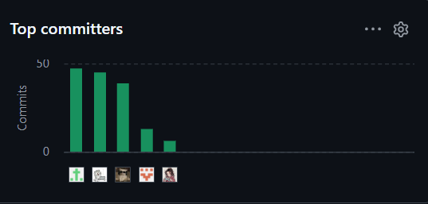
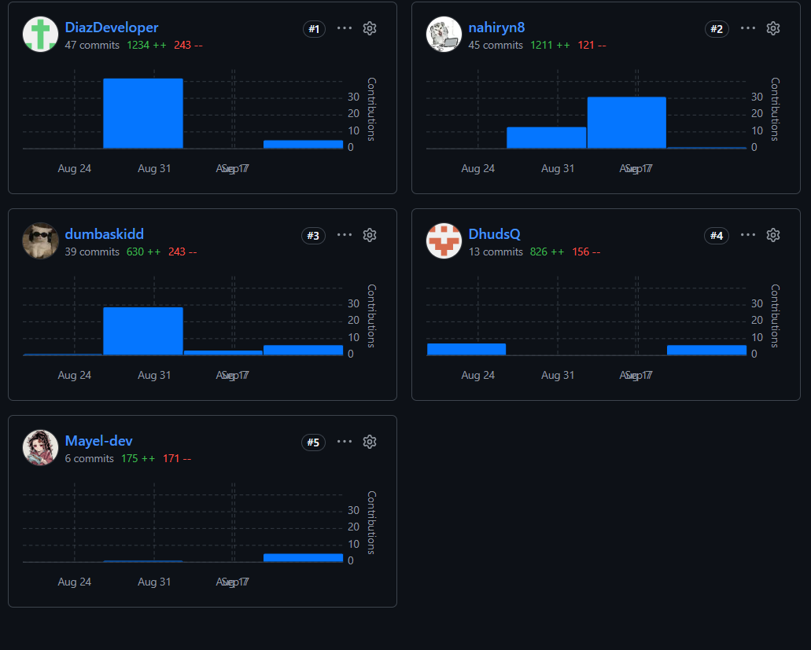
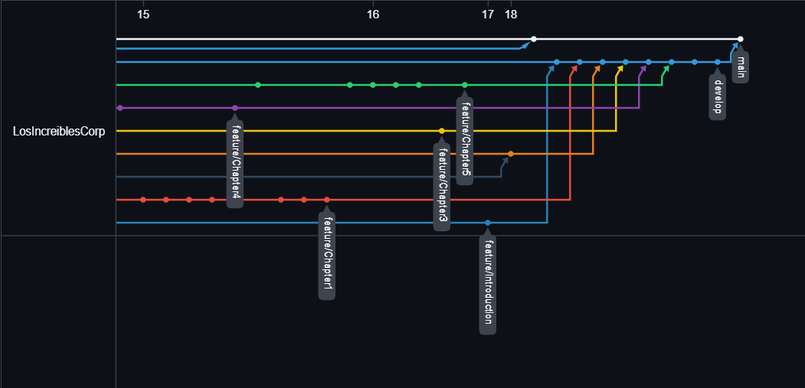

  
    

  

    Universidad Peruana de Ciencias Aplicadas 
    Carrera de Ingeniería de Software
  

   

  

    <strong>1ASI0730</strong> 
    <strong>Aplicaciones Web</strong>
  

  

    NRC 
    <strong>8084</strong>
  

  <h3><strong>Informe del Trabajo Final</strong></h3>

  

    Docente 
    <strong>Angel Augusto Velasquez Nuñez</strong>
  

  

    Startup 
    <strong>LosIncreibles</strong>
  

  

    Producto 
    <strong>NOMBRE DEL PRODUCTO</strong>
  

  
<strong>Integrantes</strong>

  <table style="border: none; border-collapse: collapse; margin: 0 auto;">
    <tr style="border: none;">
      <td style="border: none; padding: 3px 15px;"><strong>Código</strong></td>
      <td style="border: none; padding: 3px 15px;"><strong>Apellidos y Nombres</strong></td>
    </tr>
    <tr style="border: none;">
      <td style="border: none; padding: 3px 15px;">U20241C630</td>
      <td style="border: none; padding: 3px 15px;">Asto Jacome, Jose Gustavo</td>
    </tr>
    <tr style="border: none;">
      <td style="border: none; padding: 3px 15px;">U202415638</td>
      <td style="border: none; padding: 3px 15px;">Díaz Mendoza, Sebastián Víctor André</td>
    </tr>
    <tr style="border: none;">
      <td style="border: none; padding: 3px 15px;">U202310342</td>
      <td style="border: none; padding: 3px 15px;">Noriega Collado, Jean Fabio</td>
    </tr>
    <tr style="border: none;">
      <td style="border: none; padding: 3px 15px;">U20241G022</td>
      <td style="border: none; padding: 3px 15px;">Ruiz Villegas, Yngrid Nahir</td>
    </tr>
    <tr style="border: none;">
      <td style="border: none; padding: 3px 15px;">U201823468</td>
      <td style="border: none; padding: 3px 15px;">Simon Calderon, Ismael Sebastian</td>
    </tr>
  </table>

    

  

    <strong>2026-02</strong>  
    <strong>Septiembre, 2026</strong>
  

# Registro de versiones del informe

<table border="1" cellspacing="0" cellpadding="5">
<thead>
<tr>
<th>Versión</th>
<th>Fecha</th>
<th>Autor/es</th>
<th>Descripción</th>
</tr>
</thead>
<tbody>
<tr>
<td align="center">0.0.1</td>
<td align="center">28/08/2026</td>
<td>
Jose Asto
</td>
<td>
Inicialización del repositorio del Project Report y creación del primer commit.
</td>
</tr>
<tr>
<td align="center">0.0.2</td>
<td align="center">28/08/2026</td>
<td>Jose Asto</td>
<td>
Creación de la estructura base para la gestión de archivos y de los esqueletos de la Introducción y de los Capítulos II, III, IV y V.
</td>
</tr>
<tr>
<td align="center">0.0.3</td>
<td align="center">28/08–31/08/2026</td>
<td>Jose Asto Jean Noriega</td>
<td>
Incorporación de la información inicial del equipo, el perfil de la startup, los antecedentes y la estructura inicial del Capítulo I.
</td>
</tr>
<tr>
<td align="center">0.0.4</td>
<td align="center">31/08–01/09/2026</td>
<td>Jean Noriega Yngrid Ruiz</td>
<td>
Avance del Capítulo I con Lean UX, segmentos objetivo, gráficos y bibliografía inicial; inicio del análisis de competidores y diseño de entrevistas del Capítulo II.
</td>
</tr>
<tr>
<td align="center">0.0.5</td>
<td align="center">02/09–05/09/2026</td>
<td>Víctor Díaz Yngrid Ruiz Jean Noriega Ismael Simon</td>
<td>
Desarrollo del Capítulo II: registros y análisis de entrevistas, User Personas, User Journey Mapping, Empathy Mapping, análisis competitivo y artefactos de Needfinding.
</td>
</tr>
<tr>
<td align="center">0.0.6</td>
<td align="center">04/09–06/09/2026</td>
<td>Jean Noriega</td>
<td>
Desarrollo del Capítulo III con User Stories, Impact Mapping y Product Backlog, incluyendo priorización, numeración y ajustes de coherencia entre historias.
</td>
</tr>
<tr>
<td align="center">0.0.7</td>
<td align="center">02/09–10/09/2026</td>
<td>Víctor Díaz Yngrid Ruiz</td>
<td>
Avance de la configuración del entorno de desarrollo y del Capítulo IV con Style Guidelines, Information Architecture, navegación, SEO y primeros artefactos UX/UI.
</td>
</tr>
<tr>
<td align="center">0.0.8</td>
<td align="center">10/09–15/09/2026</td>
<td>Yngrid Ruiz Jean Noriega Jose Asto Ismael Simon Víctor Díaz</td>
<td>
Consolidación del diseño del producto: wireframes, wireflows, mock-ups, prototipos, C4, EventStorming, diagramas de clases y diagrama de base de datos. También se actualizaron la gestión de repositorios y el despliegue.
</td>
</tr>
<tr>
<td align="center">0.0.9</td>
<td align="center">16/09/2026</td>
<td>Víctor Díaz Jose Asto</td>
<td>
Revisión del Sprint 1, corrección de las User Stories del Capítulo III, actualización de evidencias e imágenes y ajuste de la documentación de implementación.
</td>
</tr>
<tr>
<td align="center">0.0.10</td>
<td align="center">17/09/2026</td>
<td>Ismael Simon</td>
<td>
Completado el Student Outcome de AV1 y realizada la revisión final de la Introducción para la consolidación de la entrega.
</td>
</tr>
<tr>
<td align="center">0.0.11</td>
<td align="center">18/09/2026</td>
<td>Jose Asto Todos los integrantes</td>
<td>
Integración en <code>develop</code> de las ramas <code>feature/Introduction</code> y <code>feature/Chapter1</code> a <code>feature/Chapter5</code>, consolidando los Capítulos I–V y los avances de AV1.
</td>
</tr>
<tr>
<td align="center">1.0.0</td>
<td align="center">18/09/2026</td>
<td>Todos los integrantes</td>
<td>
Versión propuesta para la entrega AV1: Project Report consolidado, Landing Page del Sprint 1, artefactos de Requirements Elicitation, Requirements Specification, Product Design, arquitectura y evidencias de colaboración. Esta versión se considerará publicada cuando el contenido consolidado sea enviado a <code>main</code>.
</td>
</tr>
</tbody>
</table>

# Project Report Collaboration Insights

Link de los repositorios de la organización: https://github.com/LosIncreiblesCorp

Link del repositorio-Informe: https://github.com/LosIncreiblesCorp/losIncreibles-project-report

## Reporte de colaboración de la entrega del AV1

Durante la primera fase de elaboración del informe, el equipo LosIncreibles centró sus esfuerzos en la construcción de los fundamentos conceptuales, de investigación, especificación y diseño inicial de InstAlert. Cada integrante asumió un rol activo en la redacción, modelado y documentación de los capítulos del reporte, manteniendo una organización basada en ramas de trabajo y revisiones antes de integrar los cambios.

A partir del historial de commits del repositorio, se observa la participación de los cinco integrantes en las distintas etapas del informe. Las responsabilidades principales de la entrega AV1 fueron las siguientes:

* **Jose Asto:** creó la estructura inicial del Project Report, organizó la gestión de archivos y ramas, participó en la configuración del flujo GitFlow, integró las ramas de los capítulos en `develop` y desarrolló los diagramas de clases y de base de datos.

* **Víctor Díaz:** desarrolló gran parte de la configuración del entorno de desarrollo y del Source Code Management, documentó herramientas y servicios, organizó la planificación y las evidencias del Sprint 1, y realizó revisiones y actualizaciones del Capítulo V.

* **Yngrid Ruiz:** trabajó en Requirements Elicitation y Product Design, incluyendo competidores, entrevistas, Needfinding, User Personas, User Journey Mapping, Empathy Mapping, Style Guidelines, UX/UI, wireframes, prototipos, EventStorming y arquitectura C4.

* **Jean Noriega:** desarrolló el Startup Profile y partes principales del Capítulo I, incluyendo antecedentes, problemática, Lean UX y segmentos objetivo. También elaboró y reorganizó las User Stories, el Impact Mapping y el Product Backlog del Capítulo III.

* **Ismael Simon:** colaboró en el registro y análisis de entrevistas, actualizó la configuración de despliegue y los repositorios del proyecto, participó en la revisión de la documentación y completó el Student Outcome correspondiente a la entrega AV1.

Estas responsabilidades representan la distribución principal observada en el historial de commits; no excluyen las revisiones, apoyos y aportes colaborativos realizados por los demás integrantes durante la consolidación del informe.

Finalmente, estas capturas representan la cantidad de commits realizados por cada miembro en el repositorio del Project Report. En la vista de GitHub se identifican Víctor Díaz (`DiazDeveloper`) con 47 commits, Yngrid Ruiz (`nahiryn8`) con 45, Jean Noriega (`dumbaskidd`) con 39, Jose Asto (`DhudsQ`) con 13 e Ismael Simon (`Mayel-dev`) con 6. Cada barra representa a un integrante del equipo y su altura indica el número de commits registrados durante la elaboración del informe.

### Gráficos de colaboración de AV1

*Figura: Principales colaboradores y cantidad de commits registrados por GitHub durante AV1.*

*Figura: Detalle de commits, adiciones y eliminaciones por integrante durante AV1.*

## Ramificación del proyecto usando GitFlow

Durante la elaboración del informe se trabajó con una rama principal de integración y ramas `feature` asociadas a cada capítulo. Se utilizaron `feature/Introduction`, `feature/Chapter1`, `feature/Chapter2`, `feature/Chapter3`, `feature/Chapter4` y `feature/Chapter5` para desarrollar los contenidos de forma independiente. Posteriormente, estas ramas fueron integradas en `develop`, donde se consolidó la versión correspondiente al avance AV1.

El registro de versiones del informe representa esta evolución desde `0.0.1`, correspondiente a la inicialización del repositorio, hasta `1.0.0`, propuesta como versión consolidada de AV1. La versión `1.0.0` quedará formalmente publicada cuando el contenido final sea enviado a `main`.

Este gráfico muestra la evolución de las ramas, los puntos de integración y la relación entre los avances documentales y las versiones del Project Report. Durante AV1 se trabajó en ramas independientes por capítulo y posteriormente se integraron los cambios en `develop`, antes de consolidar el contenido en `main`.

### Ramificación GitFlow de AV1

*Figura: Ramificación del proyecto usando GitFlow durante la elaboración del Project Report de AV1.*

# Contenido

- [CAPÍTULO I: INTRODUCCIÓN](docs/capitulo1.md#capítulo-i-introducción)
  - [1.1. Startup Profile](docs/capitulo1.md#11-startup-profile)
    - [1.1.1. Descripción de la Startup](docs/capitulo1.md#111-descripción-de-la-startup)
    - [1.1.2. Perfiles de integrantes del equipo](docs/capitulo1.md#112-perfiles-de-integrantes-del-equipo)
  - [1.2. Solution Profile](docs/capitulo1.md#12-solution-profile)
    - [1.2.1. Antecedentes y problemática](docs/capitulo1.md#121-antecedentes-y-problemática)
    - [1.2.2. Lean UX Process](docs/capitulo1.md#122-lean-ux-process)
      - [1.2.2.1. Lean UX Problem Statements](docs/capitulo1.md#1221-lean-ux-problem-statements)
      - [1.2.2.2. Lean UX Assumptions](docs/capitulo1.md#1222-lean-ux-assumptions)
      - [1.2.2.3. Lean UX Hypothesis Statements](docs/capitulo1.md#1223-lean-ux-hypothesis-statements)
      - [1.2.2.4. Lean UX Canvas](docs/capitulo1.md#1224-lean-ux-canvas)
  - [1.3. Segmentos objetivo](docs/capitulo1.md#13-segmentos-objetivo)

- [CAPÍTULO II: REQUIREMENTS ELICITATION & ANALYSIS](docs/capitulo2.md#capítulo-ii-requirements-elicitation--analysis)
  - [2.1. Competidores](docs/capitulo2.md#21-competidores)
    - [2.1.1. Análisis competitivo](docs/capitulo2.md#211-análisis-competitivo)
    - [2.1.2. Estrategias y tácticas frente a competidores](docs/capitulo2.md#212-estrategias-y-tácticas-frente-a-competidores)
  - [2.2. Entrevistas](docs/capitulo2.md#22-entrevistas)
    - [2.2.1. Diseño de entrevistas](docs/capitulo2.md#221-diseño-de-entrevistas)
    - [2.2.2. Registro de entrevistas](docs/capitulo2.md#222-registro-de-entrevistas)
    - [2.2.3. Análisis de entrevistas](docs/capitulo2.md#223-análisis-de-entrevistas)
  - [2.3. Needfinding](docs/capitulo2.md#23-needfinding)
    - [2.3.1. User Personas](docs/capitulo2.md#231-user-personas)
    - [2.3.2. User Task Matrix](docs/capitulo2.md#232-user-task-matrix)
    - [2.3.3. User Journey Mapping](docs/capitulo2.md#233-user-journey-mapping)
    - [2.3.4. Empathy Mapping](docs/capitulo2.md#234-empathy-mapping)
  - [2.4. Big Picture EventStorming](docs/capitulo2.md#24-big-picture-eventstorming)
  - [2.5. Ubiquitous Language](docs/capitulo2.md#25-ubiquitous-language)

- [CAPÍTULO III: REQUIREMENTS SPECIFICATION](docs/capitulo3.md#capítulo-iii-requirements-specification)
  - [3.1. User Stories](docs/capitulo3.md#31-user-stories)
  - [3.2. Impact Mapping](docs/capitulo3.md#32-impact-mapping)
  - [3.3. Product Backlog](docs/capitulo3.md#33-product-backlog)

- [CAPÍTULO IV: PRODUCT DESIGN](docs/capitulo4.md#capítulo-iv-product-design)
  - [4.1. Style Guidelines](docs/capitulo4.md#41-style-guidelines)
    - [4.1.1. General Style Guidelines](docs/capitulo4.md#411-general-style-guidelines)
    - [4.1.2. Web Style Guidelines](docs/capitulo4.md#412-web-style-guidelines)
  - [4.2. Information Architecture](docs/capitulo4.md#42-information-architecture)
    - [4.2.1. Organization Systems](docs/capitulo4.md#421-organization-systems)
    - [4.2.2. Labeling Systems](docs/capitulo4.md#422-labeling-systems)
    - [4.2.3. SEO Tags and Meta Tags](docs/capitulo4.md#423-seo-tags-and-meta-tags)
    - [4.2.4. Searching Systems](docs/capitulo4.md#424-searching-systems)
    - [4.2.5. Navigation Systems](docs/capitulo4.md#425-navigation-systems)
  - [4.3. Landing Page UI Design](docs/capitulo4.md#43-landing-page-ui-design)
    - [4.3.1. Landing Page Wireframe](docs/capitulo4.md#431-landing-page-wireframe)
    - [4.3.2. Landing Page Mock-up](docs/capitulo4.md#432-landing-page-mock-up)
  - [4.4. Web Applications UX/UI Design](docs/capitulo4.md#44-web-applications-uxui-design)
    - [4.4.1. Web Applications Wireframes](docs/capitulo4.md#441-web-applications-wireframes)
    - [4.4.2. Web Applications Wireflow Diagrams](docs/capitulo4.md#442-web-applications-wireflow-diagrams)
    - [4.4.3. Web Applications Mock-ups](docs/capitulo4.md#443-web-applications-mock-ups)
    - [4.4.4. Web Applications User Flow Diagrams](docs/capitulo4.md#444-web-applications-user-flow-diagrams)
  - [4.5. Web Applications Prototyping](docs/capitulo4.md#45-web-applications-prototyping)
  - [4.6. Domain-Driven Software Architecture](docs/capitulo4.md#46-domain-driven-software-architecture)
    - [4.6.1. Design-Level EventStorming](docs/capitulo4.md#461-design-level-eventstorming)
    - [4.6.2. Software Architecture Context Diagram](docs/capitulo4.md#462-software-architecture-context-diagram)
    - [4.6.3. Software Architecture Container Diagrams](docs/capitulo4.md#463-software-architecture-container-diagrams)
    - [4.6.4. Software Architecture Components Diagrams](docs/capitulo4.md#464-software-architecture-components-diagrams)
  - [4.7. Software Object-Oriented Design](docs/capitulo4.md#47-software-object-oriented-design)
    - [4.7.1. Class Diagrams](docs/capitulo4.md#471-class-diagrams)
  - [4.8. Database Design](docs/capitulo4.md#48-database-design)
    - [4.8.1. Database Diagrams](docs/capitulo4.md#481-database-diagrams)

- [CAPÍTULO V: PRODUCT IMPLEMENTATION, VALIDATION & DEPLOYMENT](docs/capitulo5.md#capítulo-v-product-implementation-validation--deployment)
  - [5.1. Software Configuration Management](docs/capitulo5.md#51-software-configuration-management)
    - [5.1.1. Software Development Environment Configuration](docs/capitulo5.md#511-software-development-environment-configuration)
    - [5.1.2. Source Code Management](docs/capitulo5.md#512-source-code-management)
    - [5.1.3. Source Code Style Guide & Conventions](docs/capitulo5.md#513-source-code-style-guide--conventions)
    - [5.1.4. Software Deployment Configuration](docs/capitulo5.md#514-software-deployment-configuration)
  - [5.2. Landing Page, Services & Applications Implementation](docs/capitulo5.md#52-landing-page-services--applications-implementation)
    - [5.2.1. Sprint 1](docs/capitulo5.md#521-sprint-1)
      - [5.2.1.1. Sprint Planning 1](docs/capitulo5.md#5211-sprint-planning-1)
      - [5.2.1.2. Aspect Leaders and Collaborators](docs/capitulo5.md#5212-aspect-leaders-and-collaborators)
      - [5.2.1.3. Sprint Backlog 1](docs/capitulo5.md#5213-sprint-backlog-1)
      - [5.2.1.4. Development Evidence for Sprint Review](docs/capitulo5.md#5214-development-evidence-for-sprint-review)
      - [5.2.1.5. Execution Evidence for Sprint Review](docs/capitulo5.md#5215-execution-evidence-for-sprint-review)
      - [5.2.1.6. Services Documentation Evidence for Sprint Review](docs/capitulo5.md#5216-services-documentation-evidence-for-sprint-review)
      - [5.2.1.7. Software Deployment Evidence for Sprint Review](docs/capitulo5.md#5217-software-deployment-evidence-for-sprint-review)
      - [5.2.1.8. Team Collaboration Insights during Sprint](docs/capitulo5.md#5218-team-collaboration-insights-during-sprint)

# STUDENT OUTCOME

El curso contribuye al cumplimiento del Student Outcome ABET:

**ABET – EAC - Student Outcome 5**

**Criterio:** La capacidad de funcionar efectivamente en un equipo cuyos miembros juntos proporcionan liderazgo, crean un entorno de colaboración e inclusivo, establecen objetivos, planifican tareas y cumplen objetivos.

En el siguiente cuadro se describe las acciones realizadas y enunciados de conclusiones por parte del grupo, que permiten sustentar el haber alcanzado el logro del ABET – EAC - Student Outcome 5.

<table border="1" cellspacing="0" cellpadding="5">
<thead>
<tr>
<th>Criterio específico</th>
<th>Acciones realizadas</th>
<th>Conclusiones</th>
</tr>
</thead>
<tbody>
<tr>
<td valign="top"><strong>Trabaja en equipo para proporcionar liderazgo en forma conjunta</strong></td>
<td valign="top">
<strong>Asto Jacome, Jose Gustavo</strong> 
<strong>AV1:</strong> Asumió responsabilidades de organización e integración técnica del proyecto, participando en la estructuración inicial del Project Report y en la implementación de la sección de inicio de la Landing Page. Desarrolló elementos compartidos como el header, configuración de idioma y estilos base, además de participar en la integración de funcionalidades mediante las ramas develop, release y main.  
<strong>Díaz Mendoza, Sebastián Víctor André</strong> 
<strong>AV1:</strong> Asumió la responsabilidad de la sección Producto de la Landing Page, implementando su estructura, estilos y comportamiento mediante HTML, CSS y JavaScript. Asimismo, tuvo una participación importante en la documentación del Sprint 1 dentro del Chapter 5, registrando evidencias de desarrollo, colaboración y avance del equipo.  
<strong>Noriega Collado, Jean Fabio</strong> 
<strong>AV1:</strong> Asumió la implementación de la sección Planes de la Landing Page, desarrollando la estructura de los planes, estilos responsive, información de precios y funcionalidad de cambio de moneda. También contribuyó al Requirements Specification mediante la actualización del Impact Mapping, Product Backlog y User Stories.  
<strong>Ruiz Villegas, Yngrid Nahir</strong> 
<strong>AV1:</strong> Asumió responsabilidades importantes en Requirements Elicitation & Analysis, desarrollando y actualizando entrevistas, análisis, User Personas, Journey Maps, Empathy Maps y elementos de EventStorming. Asimismo, contribuyó al diseño arquitectónico y desarrolló elementos de cierre y adaptación responsive de la Landing Page.  
<strong>Simon Calderon, Ismael Sebastian</strong> 
<strong>AV1:</strong> Asumió la implementación de la sección Equipo de la Landing Page, incorporando la presentación de los integrantes, recursos gráficos y estilos correspondientes. También colaboró en el Project Report mediante aportes al registro de entrevistas y revisiones de los capítulos de Product Design y Product Implementation, incluyendo ajustes de Source Code Management y Software Deployment Configuration.
</td>
<td valign="top">
<strong>AV1:</strong> La distribución de responsabilidades permitió que cada integrante asumiera liderazgo sobre componentes específicos del proyecto sin perder la visión conjunta de InstAlert. La división del trabajo entre investigación, especificación de requisitos, diseño, documentación e implementación de la Landing Page permitió desarrollar actividades en paralelo y posteriormente consolidarlas en un único producto. El uso de ramas independientes y su posterior integración evidenció una dinámica de liderazgo compartido orientada al cumplimiento de los objetivos de la primera entrega.
</td>
</tr>
<tr>
<td valign="top"><strong>Crea un entorno colaborativo e inclusivo, establece metas, planifica tareas y cumple objetivos.</strong></td>
<td valign="top">
<strong>Asto Jacome, Jose Gustavo</strong> 
<strong>AV1:</strong> Contribuyó a establecer una estructura común para el desarrollo de la Landing Page y participó en la integración progresiva de las funcionalidades desarrolladas por el equipo. Además de completar sus propias tareas, realizó acciones de integración y preparación de la versión publicada, facilitando que los aportes individuales convergieran en el entregable de AV1.  
<strong>Díaz Mendoza, Sebastián Víctor André</strong> 
<strong>AV1:</strong> Desarrolló la funcionalidad asignada correspondiente a la presentación del producto y colaboró en mantener actualizada la evidencia del Sprint 1. Su trabajo en Chapter 5 permitió registrar avances, commits y contribuciones del equipo, favoreciendo la trazabilidad y coordinación entre la implementación y la documentación del proyecto.  
<strong>Noriega Collado, Jean Fabio</strong> 
<strong>AV1:</strong> Completó el desarrollo de la sección Planes siguiendo la estructura y lineamientos compartidos de la Landing Page, incorporando comportamiento responsive y funcionalidades de visualización de precios. También colaboró en la actualización de artefactos del Product Backlog e Impact Mapping para mantener alineada la implementación con los requerimientos definidos.  
<strong>Ruiz Villegas, Yngrid Nahir</strong> 
<strong>AV1:</strong> Contribuyó de forma sostenida a la investigación y documentación de los usuarios, manteniendo actualizados los artefactos de Needfinding y EventStorming utilizados por el resto del equipo como base del diseño del producto. Asimismo, completó las tareas asignadas para la sección de cierre del Landing y sus adaptaciones responsive.  
<strong>Simon Calderon, Ismael Sebastian</strong> 
<strong>AV1:</strong> Desarrolló su sección de la Landing Page en una rama feature independiente, siguiendo el flujo de trabajo acordado y manteniendo separados sus cambios hasta su integración con el trabajo del equipo. Además, colaboró en la revisión y corrección de distintos capítulos del reporte para mantener la documentación alineada con el estado real de los repositorios, despliegue y producto.
</td>
<td valign="top">
<strong>AV1:</strong> Durante la primera entrega, el equipo organizó el trabajo mediante responsabilidades diferenciadas, ramas de desarrollo y contribuciones distribuidas tanto en el Project Report como en la Landing Page. La utilización de GitHub, GitFlow y commits trazables permitió desarrollar tareas en paralelo, revisar los aportes realizados y consolidarlos posteriormente en versiones integradas. Esta dinámica permitió cumplir el objetivo de AV1 al contar con la documentación correspondiente al Sprint 1 y una primera versión funcional y desplegada de la Landing Page de InstAlert.
</td>
</tr>
</tbody>
</table>

