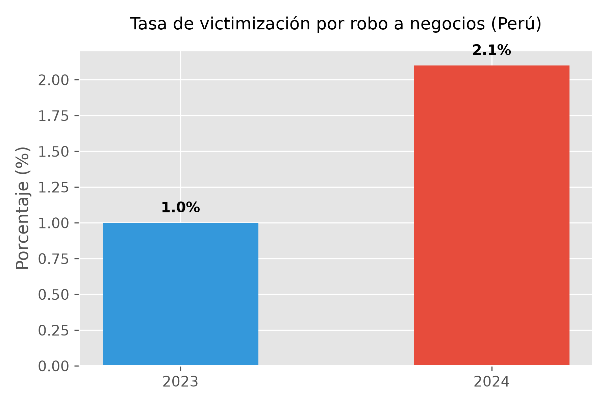
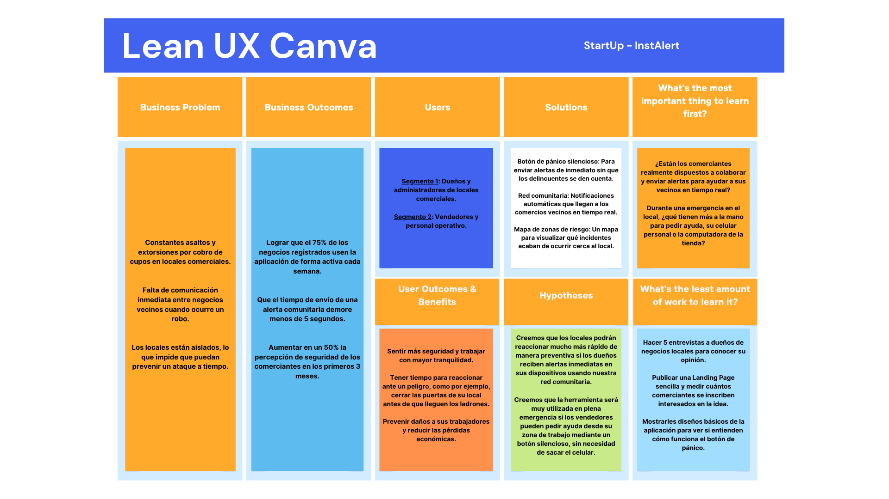
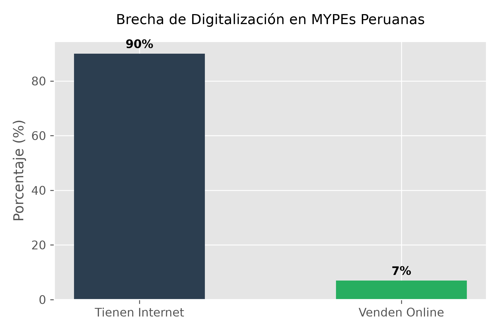
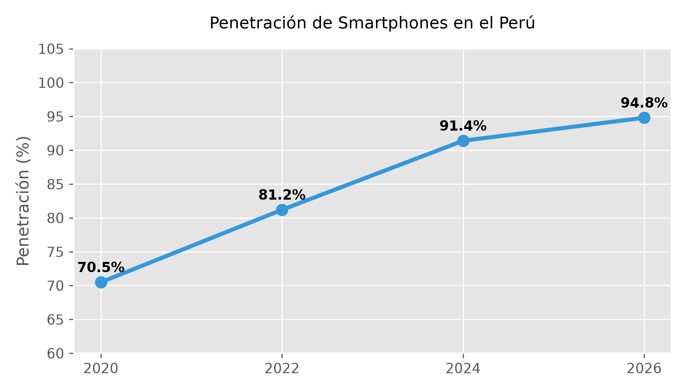
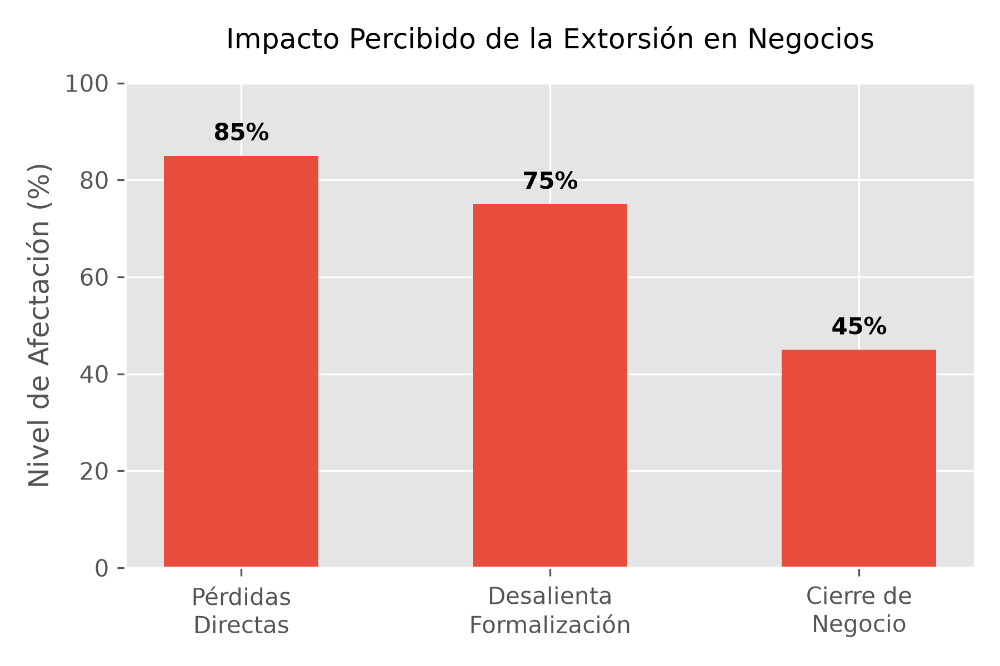

# Capítulo I: Introducción

## 1.1. Startup Profile

### 1.1.1. Descripción de la Startup

InstAlert nace como un proyecto tecnológico orientado a fortalecer la seguridad en establecimientos comerciales ubicados en zonas de riesgo medio-alto. El propósito principal es dar a los negocios una plataforma digital que ayude a prevenir amenazas y permita una respuesta rápida.

Esta herramienta funciona mediante una aplicación web que agrupa opciones prácticas para la protección comercial. Entre sus características destacan un sistema de alertas rápidas, un registro de incidentes reportados por los comercios vecinos, y mapas interactivos para identificar las áreas más vulnerables.

La ventaja principal del proyecto es que une la prevención y la reacción en un mismo lugar. Gracias a esto, los administradores de los locales y su personal operativo se mantienen informados de lo que ocurre a su alrededor y tienen la capacidad de pedir ayuda frente a emergencias, protegiendo así su integridad y sus bienes.

De igual manera, la plataforma tiene como meta promover el apoyo mutuo entre los negocios cercanos y las autoridades, construyendo una red de comunicación que mejore la seguridad de todo el sector.

### 1.1.2. Perfiles de integrantes del equipo

<table border="1" cellspacing="0" cellpadding="2">
<thead>
<tr>
<th>Foto</th>
<th>Apellido y nombre</th>
<th>Carrera</th>
<th>Acerca de</th>
</tr>
</thead>

<tbody>

<tr>
<td align="center"></td>
<td>Asto Jacome, Jose Gustavo <b>Código:</b> U20241C630</td>
<td>Ingeniería de Software</td>
<td>(Pendiente)</td>
</tr>

<tr>
<td align="center"></td>
<td>Díaz Mendoza, Sebastián Víctor André <b>Código:</b> U202415638</td>
<td>Ingeniería de Software</td>
<td>(Pendiente)</td>
</tr>

<tr>
<td align="center"></td>
<td>Noriega Collado, Jean Fabio <b>Código:</b> U202310342</td>
<td>Ingeniería de Software</td>
<td>(Pendiente)</td>
</tr>

<tr>
<td align="center"></td>
<td>Ruiz Villegas, Yngrid Nahir <b>Código:</b> U20241G022</td>
<td>Ingeniería de Software</td>
<td>(Pendiente)</td>
</tr>

<tr>
<td align="center"></td>
<td>Simon Calderon, Ismael Sebastian <b>Código:</b> U201823468</td>
<td>Ingeniería de Software</td>
<td>(Pendiente)</td>
</tr>

</tbody>
</table>

**Nota:** Información de los integrantes del equipo de desarrollo

## 1.2. Solution Profile

### 1.2.1. Antecedentes y problemática

El constante aumento de la delincuencia se ha convertido en un obstáculo crítico para el crecimiento de los negocios a nivel local. Hoy en día, los dueños y sus equipos de trabajo enfrentan amenazas diarias que ponen en riesgo tanto sus ingresos económicos como su seguridad física. Para entender este escenario a fondo y desglosar todas sus aristas, aplicaremos la técnica de las 5W y 2H, lo que nos dará una perspectiva mucho más clara de las dimensiones de este reto:

| Elemento | Pregunta | Análisis enfocado en el sector comercial |
| :--- | :--- | :--- |
| **What** | ¿Qué está ocurriendo? | Existe un incremento sostenido en la incidencia de delitos dirigidos a establecimientos comerciales, tales como robos a mano armada, hurtos y extorsiones (cobro de cupos). Esto genera un clima de constante vulnerabilidad para los negocios. |
| **Why** | ¿Por qué ocurre? | Principalmente por una deficiente comunicación preventiva entre los locales de un mismo sector, escasez de herramientas tecnológicas integradas para emitir alertas tempranas, y una baja tasa de denuncias formales por desconfianza. |
| **Who** | ¿A quién afecta? | Afecta directamente a dueños y administradores de establecimientos comerciales, así como al personal operativo y de ventas que trabaja en primera línea de atención al público. |
| **Where** | ¿Dónde ocurre? | En zonas urbanas y corredores comerciales de riesgo medio-alto, con especial énfasis en áreas con poca vigilancia policial, rutas de escape fáciles o iluminación deficiente. |
| **When** | ¿Cuándo ocurre? | Durante el horario de atención al público (aprovechando momentos de baja afluencia de clientes) y durante los horarios críticos de apertura y cierre de los locales comerciales. |
| **How** | ¿Cómo ocurre? | Los asaltantes se aprovechan del aislamiento de cada local y la falta de canales directos entre negocios vecinos. Al no existir alertas rápidas, los actos delictivos se consuman antes de que las autoridades o la comunidad puedan intervenir. |
| **How much** | ¿Cuánto impacto tiene? | Según el Instituto Nacional de Estadística e Informática (INEI, 2024), la tasa de victimización por robo a negocios pasó del 1.0% en 2023 al 2.1% en 2024. Además, el Banco Interamericano de Desarrollo (BID, 2024) indica que esto representa un sobrecosto significativo en seguridad privada, mermando la competitividad. |

**Figura 1:**

*Tasa de Victimización Comercial (2023-2024)*

   
  <i>Nota: Elaboración propia a partir de datos del INEI (2024). Gráfico generado con la librería Matplotlib en Python.</i>

**Conclusión del análisis 5W2H:**
Tras evaluar todos estos puntos, queda en evidencia que el peligro para los establecimientos no solo recae en la cantidad de asaltos, sino en el profundo nivel de aislamiento en el que operan. La falta de comunicación inmediata entre negocios cercanos impide que se puedan apoyar mutuamente ante una amenaza. Por ello, el desarrollo de una herramienta como InstAlert resulta esencial para cerrar esa brecha, conectando a los comerciantes a través de una red de alertas tempranas que priorice la prevención y la acción conjunta.

**Enunciado del problema**
En la actualidad, los dueños y trabajadores de locales comerciales ubicados en zonas de riesgo carecen de un sistema tecnológico unificado que les facilite la comunicación en tiempo real para reportar amenazas, emitir alertas preventivas a negocios vecinos y coordinar una respuesta rápida, dejándolos en un estado de vulnerabilidad y aislamiento ante actos delictivos.

**Objetivos del proyecto**

* **Objetivo general:** Desarrollar una aplicación web diseñada para fortalecer la seguridad de los establecimientos comerciales a través de alertas tempranas en tiempo real y la colaboración activa entre negocios de un mismo sector.

* **Objetivos específicos:**
  - Agilizar el proceso de reporte de incidentes para que los comercios puedan avisar a su entorno en cuestión de segundos.
  - Mostrar áreas de mayor vulnerabilidad a través de mapas interactivos y actualizados.
  - Promover un canal de comunicación directo entre los comerciantes ante posibles emergencias.
  - Distribuir notificaciones preventivas y alertas inmediatas a los locales suscritos a la red.

**Restricciones del proyecto**
- La efectividad de la red dependerá del compromiso y la participación de los administradores de los locales.
- Puede haber limitaciones técnicas en la exactitud de la ubicación según el celular o dispositivo utilizado.
- No tendremos conexión directa con las bases de datos oficiales de la policía.
- El plazo para el desarrollo y despliegue del software está restringido a la duración del ciclo académico.
- El proyecto se construirá con recursos de hardware y un equipo humano limitados.

### 1.2.2. Lean UX Process

#### 1.2.2.1. Lean UX Problem Statements

Para definir claramente la propuesta de valor de InstAlert frente al desafío de la inseguridad comercial, hemos aplicado el modelo de *Brand New Initiative*, estructurando el dominio, los problemas actuales y nuestra estrategia para abordarlos:

**The current state of** la seguridad y vigilancia preventiva en zonas comerciales **has focused mainly on** los dueños de locales y su personal de ventas, quienes sufren de robos y extorsiones constantes, y que actualmente dependen de tiempos de respuesta policiales lentos o de herramientas de comunicación ineficientes.

**What existing products fail to address is** la ausencia de un canal unificado que conecte a los negocios vecinos en tiempo real, permitiéndoles emitir alertas geolocalizadas y tomar medidas preventivas antes de que el delito se consume en sus propios establecimientos.

**Our product will address this gap by** ofrecer una plataforma web colaborativa e intuitiva donde los comerciantes puedan reportar amenazas al instante, alertar a su comunidad sectorial y visualizar zonas de riesgo en un mapa interactivo.

**Our initial focus will be** los dueños y trabajadores de pequeños y medianos comercios ubicados en zonas urbanas de riesgo medio-alto.

**We’ll know we are successful when we see** una alta tasa de adopción de la plataforma por parte de grupos de negocios en una misma cuadra o galería, reportes activos de incidencias sospechosas y una reducción tangible en los asaltos gracias a la prevención comunitaria.

#### 1.2.2.2. Lean UX Assumptions

A continuación, se detallan las creencias e hipótesis fundamentales sobre las cuales se sostiene el desarrollo de InstAlert, divididas en cinco categorías clave:

**1. Business Assumptions (Suposiciones del Negocio)**
- Creemos que existe una necesidad urgente en el sector comercial por adquirir herramientas tecnológicas centradas en la prevención delictiva.
- Creemos que los comerciantes están dispuestos a incorporar una plataforma web a su rutina laboral si esto les garantiza mayor tranquilidad.

**2. Business Outcome Assumptions (Suposiciones de Resultados del Negocio)**
- Creemos que lograremos reducir el impacto económico y emocional de la delincuencia en los establecimientos afiliados.
- Creemos que tendremos éxito si logramos un alto nivel de retención de usuarios y una red de comercios activos que verifiquen constantemente las alertas.

**3. User Assumptions (Suposiciones de los Usuarios)**
- Creemos que nuestros usuarios principales son administradores de negocios y su personal de primera línea.
- Creemos que estos usuarios tienen acceso constante a una computadora de mostrador o dispositivo móvil durante su jornada laboral.
- Creemos que los comerciantes poseen un fuerte sentido de solidaridad y están dispuestos a advertir a los locales vecinos si notan actividades sospechosas.

**4. User Outcome and Benefit Assumptions (Suposiciones de Beneficios para el Usuario)**
- Creemos que los comerciantes valoran enormemente operar sus negocios en un entorno seguro y libre de estrés.
- Creemos que los usuarios obtendrán el beneficio crucial de estar advertidos con anticipación sobre amenazas cercanas, dándoles tiempo para resguardarse o cerrar sus puertas.

**5. Feature Assumptions (Suposiciones de Funcionalidades)**
- Creemos que la plataforma debe contar con un botón de alerta temprana o de pánico silencioso.
- Creemos que los usuarios necesitan un mapa interactivo que muestre incidentes recientes para identificar el nivel de riesgo en sus alrededores en tiempo real.
- Creemos que un sistema de notificaciones push comunitarias es indispensable para enviar y recibir avisos urgentes al instante.

#### 1.2.2.3. Lean UX Hypothesis Statements

A partir de las funcionalidades propuestas (Feature Assumptions), planteamos las siguientes hipótesis para validar su efectividad, utilizando el formato estándar de Lean UX:

**Hipótesis 1: Botón de Alerta Temprana**
- **We believe we will achieve** una mejora sustancial en el tiempo de reacción ante amenazas
- **If** los trabajadores de los establecimientos comerciales
- **Attain** la capacidad de notificar silenciosa e instantáneamente a sus vecinos
- **With** un botón de alerta temprana de fácil acceso en la plataforma web.

**Hipótesis 2: Mapa Interactivo de Zonas de Riesgo**
- **We believe we will achieve** una mejor toma de decisiones preventivas en el entorno local
- **If** los administradores de los negocios
- **Attain** el conocimiento actualizado sobre qué áreas cercanas registran actividad sospechosa
- **With** un mapa interactivo que visualiza el nivel de riesgo y los reportes en tiempo real.

**Hipótesis 3: Notificaciones Push Inmediatas**
- **We believe we will achieve** una alta tasa de prevención y protección comunitaria
- **If** los dueños y el personal operativo
- **Attain** información oportuna sobre sospechosos merodeando su cuadra o galería
- **With** un sistema de notificaciones push enviadas en el momento exacto del reporte.

#### 1.2.2.4. Lean UX Canvas

El siguiente Lean UX Canvas sintetiza los problemas, los segmentos de usuarios, las hipótesis y los resultados esperados para InstAlert. Este diagrama es esencial para visualizar de manera estructurada la relación entre las necesidades del negocio y las soluciones propuestas.

**Figura 2:**

*Lean UX Canvas*

   
  <i>Nota: Lean UX Canvas del proyecto InstAlert, elaborado en Canva. Resume el problema, los segmentos de usuarios, las hipótesis y los resultados esperados.</i>

A continuación, se presenta el enlace público de Canva del Lean UX Canvas del proyecto: <https://canva.link/n58mftoui937o2g>

## 1.3. Segmentos objetivo

Para el desarrollo de InstAlert, se han definido dos segmentos clave que representan a los usuarios principales de la plataforma. Ambos enfrentan directamente la problemática de la inseguridad y requieren herramientas tecnológicas para la prevención colaborativa.

**1. Segmento 1: Administradores y dueños de Locales Comerciales**
Personas responsables de la gestión y operación de establecimientos comerciales ubicados en zonas de riesgo medio-alto. Buscan proteger su negocio, sus bienes y a su personal mediante herramientas que les permitan prevenir incidentes, monitorear situaciones de riesgo y recibir alertas oportunas para tomar decisiones rápidas ante posibles amenazas.

* **Perfil Demográfico:**
  - **Género:** Hombres y mujeres.
  - **Edad:** 25 a 60 años.
  - **Ocupación:** Propietarios, emprendedores y administradores de micro y pequeñas empresas.
  - **Nivel socioeconómico:** B, C y D.
* **Perfil Geográfico:**
  - **Ubicación:** Zonas urbanas, galerías y corredores comerciales en Lima Metropolitana y las principales ciudades del Perú, especialmente en áreas de riesgo medio-alto.
* **Perfil Psicográfico:**
  - **Preocupaciones:** Alta preocupación por la seguridad física de su patrimonio, motivada por la amenaza constante de la extorsión ("cobro de cupos").
  - **Motivaciones:** Proteger su inversión y operar en un ambiente de tranquilidad para garantizar la sostenibilidad de su emprendimiento.
  - **Comportamiento ante el problema:** Desconfían de la rapidez de respuesta de las autoridades y dependen de su personal operativo para el reporte inmediato y monitoreo de incidentes en el local.
* **Perfil Comportamental:**
  - **Uso de tecnología:** Alta dependencia del smartphone como principal herramienta de acceso a la información y gestión básica del negocio.

**2. Segmento 2: Personal Operativo y Vendedores de Establecimientos**
Trabajadores que realizan sus actividades directamente dentro o alrededor de los establecimientos comerciales, manteniendo contacto constante con clientes, productos y espacios expuestos a posibles situaciones de inseguridad. Necesitan herramientas que les permitan reportar incidentes de manera rápida, recibir alertas y solicitar ayuda cuando se encuentren frente a una situación de riesgo.

* **Perfil Demográfico:**
  - **Género:** Hombres y mujeres.
  - **Edad:** 18 a 45 años.
  - **Ocupación:** Vendedores, cajeros, atención al cliente y personal de seguridad interna.
  - **Nivel socioeconómico:** C y D.
* **Perfil Geográfico:**
  - **Ubicación:** Mismas zonas comerciales donde laboran, expuestos al tránsito peatonal constante y al contacto directo con el público.
* **Perfil Psicográfico:**
  - **Preocupaciones:** Miedo a sufrir agresiones físicas o verse involucrados en actos violentos durante su jornada laboral.
  - **Motivaciones:** Trabajar en un entorno seguro y contar con protocolos claros de emergencia.
  - **Comportamiento ante el problema:** Se sienten vulnerables al ser la primera línea de contacto frente a un asalto.
* **Perfil Comportamental:**
  - **Uso de tecnología:** Usuarios digitales nativos o muy familiarizados con dispositivos móviles inteligentes. 
  - **Reacción ante emergencias:** Requieren herramientas que no exijan concentración, priorizando la inmediatez (como un botón de alerta).

Para sustentar el dimensionamiento del mercado, la viabilidad tecnológica y la urgencia del problema que atiende InstAlert, nos respaldamos en las siguientes investigaciones académicas e institucionales:

**1. Representatividad y Conectividad de las MYPEs**
El segmento objetivo de InstAlert abarca a la gran mayoría del ecosistema empresarial peruano. Según el Ministerio de la Producción (PRODUCE, s.f.), el 99.2% de las empresas formales en el Perú son micro y pequeñas empresas. Además, la viabilidad de una plataforma web es altísima, ya que el 90% de estas MYPEs cuenta con acceso a internet, aunque solo una minoría lo explota para optimizar sus ventas.

**Figura 3:**

*Distribución y Brecha Digital en MYPEs*

   
  <i>Nota: Elaboración propia a partir de estimaciones de PRODUCE. Gráfico generado con la librería Matplotlib en Python.</i>

**2. Masificación del Smartphone como Herramienta Clave**
El perfil comportamental del comerciante evidencia que el smartphone es el canal ideal para InstAlert. El Centro Nacional de Planeamiento Estratégico (CEPLAN, s.f.) confirma, basándose en datos de OSIPTEL, el crecimiento sostenido y la masificación de los teléfonos inteligentes, consolidándolos como la principal herramienta de acceso a las Tecnologías de la Información y Comunicación (TIC) tanto en áreas urbanas como rurales del país.

**Figura 4:**

*Penetración de Smartphones en el Perú*

   
  <i>Nota: Elaboración propia a partir de datos de CEPLAN y OSIPTEL. Gráfico generado con la librería Matplotlib en Python.</i>

**3. Impacto de la Extorsión en la Sostenibilidad**
El temor del segmento 1 (dueños de locales) está fundamentado en el grave impacto económico de la delincuencia. Un estudio fenomenológico de la Universidad César Vallejo (Ríos, 2024) concluye que el delito de extorsión mediante el "cobro de cupos" no solo genera cuantiosas pérdidas directas, sino que vulnera la sostenibilidad de las empresas emergentes y desalienta la formalización, haciendo imperativa la adopción de herramientas de prevención.

**Figura 5:**

*Impacto Percibido de la Extorsión en MYPEs*

   
  <i>Nota: Elaboración propia a partir del estudio fenomenológico de Ríos (2024). Gráfico generado con la librería Matplotlib en Python.</i>

