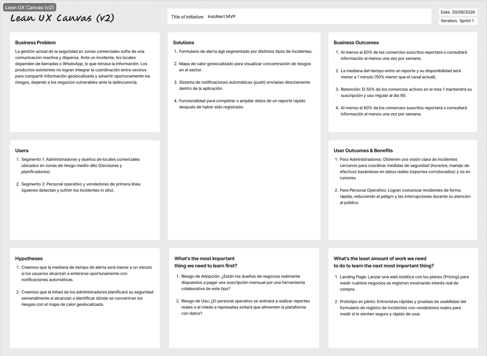
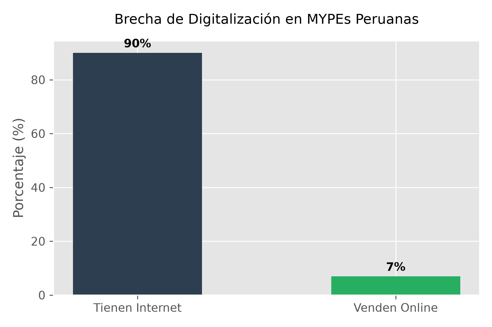
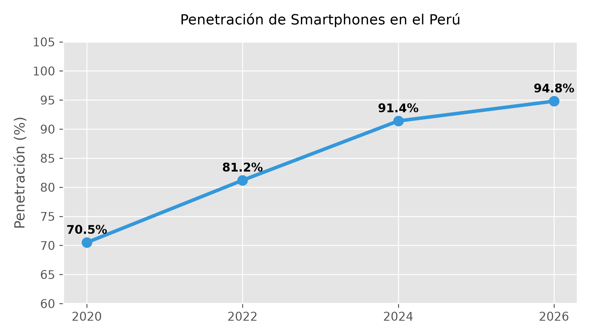
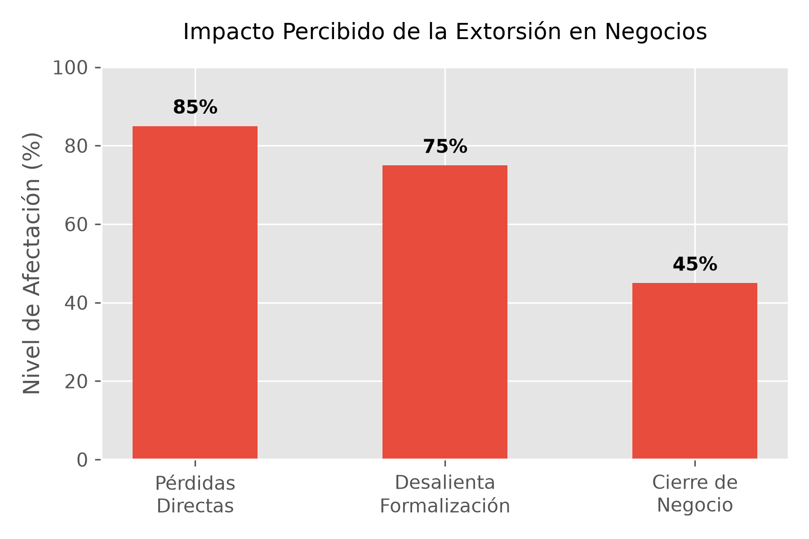

# Capítulo I: Introducción

## 1.1. Startup Profile

### 1.1.1. Descripción de la Startup

InstAlert nace como un proyecto tecnológico orientado a fortalecer la seguridad en establecimientos comerciales ubicados en zonas de riesgo medio-alto. El propósito principal es dar a los negocios una plataforma digital que ayude a prevenir amenazas y permita una respuesta rápida.

Esta herramienta funciona mediante una aplicación web que agrupa opciones prácticas para la protección comercial. Entre sus características destacan un sistema de alertas rápidas, un registro de incidentes reportados por los comercios vecinos, y mapas interactivos para identificar las áreas más vulnerables.

La ventaja principal del proyecto es que une la prevención y la reacción en un mismo lugar. Gracias a esto, los administradores de los locales y su personal operativo se mantienen informados de lo que ocurre a su alrededor y tienen la capacidad de pedir ayuda frente a emergencias, protegiendo así su integridad y sus bienes.

De igual manera, la plataforma tiene como meta promover el apoyo mutuo entre los negocios cercanos y las autoridades, construyendo una red de comunicación que mejore la seguridad de todo el sector.

### 1.1.2. Perfiles de integrantes del equipo

<table border="1" cellspacing="0" cellpadding="2">
<thead>
<tr>
<th>Foto</th>
<th>Apellido y nombre</th>
<th>Carrera</th>
<th>Acerca de</th>
</tr>
</thead>

<tbody>

<tr>
<td align="center"></td>
<td>Asto Jacome, Jose Gustavo <b>Código:</b> U20241C630</td>
<td>Ingeniería de Software</td>
<td>Mi nombre es José Asto y actualmente estudio Ingeniería de Software en la UPC. Me interesa especializarme en desarrollo de software, especialmente en Backend, desarrollo Full Stack e Inteligencia Artificial aplicada. Tengo experiencia trabajando con tecnologías como Angular, Vue, Spring Boot, .NET, MySQL y Git, además de conocimientos en arquitectura de software y desarrollo de aplicaciones web. También me interesa aprender constantemente sobre nuevas tecnologías, herramientas y buenas prácticas que me permitan mejorar mis habilidades y aportar soluciones de valor en los proyectos en los que participo.</td>
</tr>

<tr>
<td align="center"></td>
<td>Díaz Mendoza, Sebastián Víctor André <b>Código:</b> U202415638</td>
<td>Ingeniería de Software</td>
<td>Código: U202415638. Soy Sebastian Diaz, actualmente estudio la carrera de Ingeniería de Software y para el presente proyecto me he enfocado en diseño de experiencia de usuario (UX/UI), además soy responsable de la interacción y usabilidad. Cuento con dominio en estructura de datos, algoritmos y base de datos. Con una capacidad de razonamiento lógico y ordenado, con conocimiento en paradigmas como la programación orientada a objetos y técnicas de aplicación en la complejidad algorítmica. Aporte al equipo: Aporte en la presentación de idea y fundamento del proyecto además del desarrollo de los capítulos II y IV. Con alta proactividad en el desarrollo del proyecto.</td>
</tr>

<tr>
<td align="center"></td>
<td>Noriega Collado, Jean Fabio <b>Código:</b> U202310342</td>
<td>Ingeniería de Software</td>
<td>Estudio ingenieria de software. Me gusta liderar equipos de trabajo y mantener ambientes ordenados en la medida de lo posible. Entre mis habilidades, podria decir que soy suficiente y eficiente, de manera que cubro los aspectos necesarios para la realizacion de proyectos largos y complejos. Siguiendo los principios por los cuales estudio la carrera.</td>
</tr>

<tr>
<td align="center"></td>
<td>Ruiz Villegas, Yngrid Nahir <b>Código:</b> U20241G022</td>
<td>Ingeniería de Software</td>
<td>Me considero una persona responsable, dedicada y con interés en seguir desarrollando mis habilidades en el área de la tecnología. En mis momentos libres disfruto de actividades creativas y recreativas, como el dibujo, la lectura de mangas y el descubrir nuevas historias. 
Mi objetivo académico es fortalecer mis conocimientos y aplicarlos en proyectos que me permitan adquirir experiencia práctica. Asimismo, espero que este proyecto contribuya a mi formación profesional y me brinde la oportunidad de crecer personal y académicamente.</td>
</tr>

<tr>
<td align="center"></td>
<td>Simon Calderon, Ismael Sebastian <b>Código:</b> U201823468</td>
<td>Ingeniería de Software</td>
<td>Estudiante de Ingeniería de Software con gran interés en la Inteligencia Artificial generativa combinada con robótica/domótica. Soy una persona analítica y sistemática que se compromete en colaborar en equipo. Mis hobbies son aprender nuevas cosas relacionadas a tecnología, idiomas y habilidades como tocar guitarra, ensamblar computadoras y reparar distintas cosas.</td>
</tr>

</tbody>
</table>

**Nota:** Información de los integrantes del equipo de desarrollo

## 1.2. Solution Profile

### 1.2.1. Antecedentes y problemática

El constante aumento de la delincuencia se ha convertido en un obstáculo crítico para el crecimiento de los negocios a nivel local. Hoy en día, los dueños y sus equipos de trabajo enfrentan amenazas diarias que ponen en riesgo tanto sus ingresos económicos como su seguridad física. Para entender este escenario a fondo y desglosar todas sus aristas, aplicaremos la técnica de las 5W y 2H, lo que nos dará una perspectiva mucho más clara de las dimensiones de este reto:

| Elemento | Pregunta | Análisis enfocado en el sector comercial |
| :--- | :--- | :--- |
| **What** | ¿Qué está ocurriendo? | Existe un incremento sostenido en la incidencia de delitos dirigidos a establecimientos comerciales, tales como robos a mano armada, hurtos y extorsiones (cobro de cupos). Esto genera un clima de constante vulnerabilidad para los negocios. |
| **Why** | ¿Por qué ocurre? | Principalmente por una deficiente comunicación preventiva entre los locales de un mismo sector, escasez de herramientas tecnológicas integradas para emitir alertas tempranas, y una baja tasa de denuncias formales por desconfianza. |
| **Who** | ¿A quién afecta? | Afecta directamente a dueños y administradores de establecimientos comerciales, así como al personal operativo y de ventas que trabaja en primera línea de atención al público. |
| **Where** | ¿Dónde ocurre? | En zonas urbanas y corredores comerciales de riesgo medio-alto, con especial énfasis en áreas con poca vigilancia policial, rutas de escape fáciles o iluminación deficiente. |
| **When** | ¿Cuándo ocurre? | Durante el horario de atención al público (aprovechando momentos de baja afluencia de clientes) y durante los horarios críticos de apertura y cierre de los locales comerciales. |
| **How** | ¿Cómo ocurre? | Los asaltantes se aprovechan del aislamiento de cada local y la falta de canales directos entre negocios vecinos. Al no existir alertas rápidas, los actos delictivos se consuman antes de que las autoridades o la comunidad puedan intervenir. |
| **How much** | ¿Cuánto impacto tiene? | El Instituto Nacional de Estadística e Informática (INEI, 2026, p. 54) señala que el 68,9 % de las empresas victimizadas manifestó haber sido afectada por el hecho. Como contexto regional, Perez-Vincent et al. (2024, pp. 75–77) estimaron que los costos directos del crimen para el sector privado promediaron alrededor del 1,6 % del PIB en 2022 en los países de América Latina y el Caribe analizados. |

**Tabla 1. Empresas victimizadas durante 2023**

| Ámbito | Empresas victimizadas | Proporción |
| :--- | :---: | :---: |
| Total de empresas comprendidas en la medición | 56 679 de 234 559 | 24,2 % |
| Sector comercio | 24 660 de 105 173 | 23,4 % |

*Nota. Datos estimados por el Instituto Nacional de Estadística e Informática (INEI, 2026, pp. 18, 21–22).*

**Conclusión del análisis 5W2H:**
Tras evaluar todos estos puntos, queda en evidencia que el peligro para los establecimientos no solo recae en la cantidad de asaltos, sino en el profundo nivel de aislamiento en el que operan. La falta de comunicación inmediata entre negocios cercanos impide que se puedan apoyar mutuamente ante una amenaza. Por ello, el desarrollo de una herramienta como InstAlert resulta esencial para cerrar esa brecha, conectando a los comerciantes a través de una red de alertas tempranas que priorice la prevención y la acción conjunta.

**Enunciado del problema**
En la actualidad, los dueños y trabajadores de locales comerciales ubicados en zonas de riesgo carecen de un sistema tecnológico unificado que les facilite la comunicación en tiempo real para reportar amenazas, emitir alertas preventivas a negocios vecinos y coordinar una respuesta rápida, dejándolos en un estado de vulnerabilidad y aislamiento ante actos delictivos.

**Objetivos del proyecto**

* **Objetivo general:** Desarrollar una aplicación web diseñada para fortalecer la seguridad de los establecimientos comerciales a través de alertas tempranas en tiempo real y la colaboración activa entre negocios de un mismo sector.

* **Objetivos específicos:**
  - Agilizar el proceso de reporte de incidentes para que los comercios puedan avisar a su entorno en cuestión de segundos.
  - Mostrar áreas de mayor vulnerabilidad a través de mapas interactivos y actualizados.
  - Promover un canal de comunicación directo entre los comerciantes ante posibles emergencias.
  - Distribuir notificaciones preventivas y alertas inmediatas a los locales suscritos a la red.

**Restricciones del proyecto**
- La efectividad de la red dependerá del compromiso y la participación de los administradores de los locales.
- Puede haber limitaciones técnicas en la exactitud de la ubicación según el celular o dispositivo utilizado.
- No tendremos conexión directa con las bases de datos oficiales de la policía.
- El plazo para el desarrollo y despliegue del software está restringido a la duración del ciclo académico.
- El proyecto se construirá con recursos de hardware y un equipo humano limitados.

### 1.2.2. Lean UX Process.

#### 1.2.2.1. Lean UX Problem Statements.

Para definir claramente la propuesta de valor de InstAlert frente al desafío de la inseguridad comercial, hemos aplicado el modelo de *Brand New Initiative*, estructurando el dominio, los problemas actuales y nuestra estrategia para abordarlos:

**El estado actual de la gestión de la seguridad en los comercios se caracteriza principalmente por** una comunicación reactiva y dispersa. Ante incidentes cercanos, los administradores y el personal operativo recurren a llamadas, WhatsApp o contactos directos para informarse y comunicarse con otros negocios, lo que puede dificultar el acceso oportuno a información confiable.

**Lo que los productos y servicios existentes no logran resolver de forma integrada es** la coordinación entre negocios vecinos para compartir información geolocalizada sobre incidentes cercanos y advertir oportunamente sobre posibles riesgos.

**Nuestro producto atenderá esta brecha mediante** una aplicación web colaborativa que permitirá registrar y consultar alertas e incidentes, y visualizar su ubicación y concentración en un mapa con zonas de calor.

**Nuestro enfoque inicial estará dirigido a** administradores y personal operativo de comercios ubicados en zonas urbanas de alto riesgo priorizadas por el proyecto.

**Sabremos que tenemos éxito cuando observemos** una reducción medible del tiempo entre el reporte de un incidente y la disponibilidad de la alerta para los comercios cercanos; un uso sostenido de la aplicación para reportar y consultar incidentes; y una mejora en la confianza de administradores y personal operativo en la información recibida, medida mediante encuestas antes y después del piloto.

#### 1.2.2.2. Lean UX Assumptions.

A continuación, se presentan las creencias del equipo sobre InstAlert, organizadas en cinco categorías. Estas suposiciones servirán de base para formular hipótesis y deberán validarse durante el piloto. Las metas numéricas son objetivos propuestos, no resultados comprobados.

**1. Suposiciones del negocio**
- Creemos que existe un mercado inicial suficiente entre los pequeños y medianos comercios ubicados en galerías o corredores comerciales urbanos de alto riesgo para iniciar pilotos por zona.
- Creemos que los comercios valorarán contar con reportes geolocalizados de incidentes cercanos y conocer si otros comercios los han corroborado, frente a la información dispersa que reciben por llamadas o WhatsApp.
- Creemos que una suscripción mensual por comercio será viable si la utilidad de InstAlert justifica su precio y los ingresos permiten cubrir su operación y mantenimiento.
- Creemos que el equipo podrá operar y mantener InstAlert durante un piloto en una zona delimitada, protegiendo los datos de quienes reportan y gestionando los reportes aún no corroborados.

**2. Suposiciones de resultados del negocio**
- Creemos que al menos el 60 % de los comercios con suscripción activa en una zona piloto reportará o consultará información al menos una vez por semana.
- Creemos que la mediana del tiempo entre el envío de un reporte y su disponibilidad en la aplicación para los comercios cercanos será menor a un minuto y al menos 50 % menor que el tiempo observado al avisar por los canales actuales.
- Creemos que al menos el 50 % de los comercios activos durante el primer mes mantendrá su suscripción y reportará o consultará información semanalmente al llegar al día 90.
- Creemos que, al finalizar el piloto, los ingresos mensuales de las suscripciones activas cubrirán los costos mensuales de operación y mantenimiento de InstAlert en la zona piloto.

**3. Suposiciones de los usuarios**
- Creemos que los dueños y administradores deciden qué medidas de seguridad adoptar y utilizan la información sobre incidentes cercanos para orientar esas decisiones.
- Creemos que el personal operativo puede ser quien detecte o presencie incidentes y necesite reportarlos con poco tiempo disponible durante la atención al público.
- Creemos que administradores y personal operativo utilizan teléfonos inteligentes durante su jornada y que actualmente comparten información sobre incidentes mediante llamadas, WhatsApp o comunicación directa.
- Creemos que la preocupación por posibles represalias y por la exposición de la identidad del reportante puede influir en la disposición de algunos usuarios a reportar incidentes.

**4. Suposiciones de resultados y beneficios para los usuarios**
- Creemos que los administradores obtendrán una visión más clara y oportuna de los incidentes cercanos, lo que les permitirá coordinar medidas de seguridad para sus comercios.
- Creemos que el personal operativo podrá comunicar incidentes rápidamente, reduciendo la interrupción de sus actividades de atención al público.
- Creemos que los administradores podrán planificar medidas —como horarios de apertura y cierre o el manejo de efectivo— con información actualizada sobre incidentes, en lugar de depender únicamente de rumores o intuiciones.
- Creemos que los usuarios confiarán más en la información recibida al distinguir los reportes corroborados de los que aún no lo están, y dependerán menos de rumores.

**5. Suposiciones de funcionalidades**
- Creemos que ofrecer distintos tipos de reporte permitirá registrar con mayor precisión los incidentes y peligros que afectan a los comercios.
- Creemos que un mapa de calor geolocalizado permitirá visualizar dónde se concentran los incidentes en el entorno comercial.
- Creemos que generar notificaciones automáticas dentro de la aplicación sobre incidentes cercanos permitirá que los usuarios con acceso activo se enteren oportunamente.
- Creemos que permitir completar o ampliar los datos de un reporte después de su registro inicial ayudará a ofrecer información más detallada sobre el incidente.

#### 1.2.2.3. Lean UX Hypothesis Statements.

Se formula una hipótesis por cada suposición de funcionalidad, relacionando el resultado esperado con las personas usuarias, el beneficio y la solución propuesta.

**Hipótesis 1: Reportes por tipo de incidente**
- **Creemos que lograremos:** que al menos el 80 % de las personas participantes identifique correctamente el tipo de incidente al reportarlo.
- **Si:** el personal operativo y los administradores de los comercios.
- **Alcanzan:** comunicar con rapidez qué incidente observaron.
- **Con:** un formulario que permita seleccionar distintos tipos de incidente.

**Hipótesis 2: Mapa de calor geolocalizado**
- **Creemos que lograremos:** que al menos la mitad de los administradores consulte el mapa semanalmente.
- **Si:** los administradores de los comercios.
- **Alcanzan:** identificar dónde se concentran los incidentes cercanos para planificar medidas de seguridad.
- **Con:** un mapa de calor geolocalizado de los incidentes reportados.

**Hipótesis 3: Notificaciones automáticas dentro de la aplicación**
- **Creemos que lograremos:** que la mediana del tiempo entre el envío de un reporte y su disponibilidad para los comercios cercanos sea menor a un minuto y al menos 50 % inferior al tiempo observado con los canales actuales (BO2).
- **Si:** los administradores y el personal operativo de comercios con acceso activo.
- **Alcanzan:** enterarse oportunamente de incidentes cercanos.
- **Con:** notificaciones automáticas dentro de la aplicación.

**Hipótesis 4: Complementación posterior de reportes**
- **Creemos que lograremos:** aumentar la proporción de reportes inicialmente incompletos que se complementa después del registro.
- **Si:** el personal operativo y los administradores que registran incidentes.
- **Alcanzan:** enviar primero un reporte y añadir después la información que faltaba.
- **Con:** la posibilidad de completar o ampliar los datos de un reporte ya registrado.

#### 1.2.2.4. Lean UX Canvas.

El siguiente Lean UX Canvas sintetiza los problemas, los segmentos de usuarios, las hipótesis y los resultados esperados para InstAlert. Este diagrama es esencial para visualizar de manera estructurada la relación entre las necesidades del negocio y las soluciones propuestas.

**Figura 2:**

*Lean UX Canvas*

   
  <i>Nota: Lean UX Canvas del proyecto InstAlert, elaborado en Figma. Resume el problema, los segmentos de usuarios, las hipótesis y los resultados esperados.</i>

A continuación, se presenta el enlace público de Figma del Lean UX Canvas del proyecto: <https://www.figma.com/board/Qbza1sCNy6SERgj6nfA1eA/Lean-UX-Canvas--v2----InstAlert?node-id=0-1&t=OWB59eKehE05IfsF-1>

El Lean UX Canvas expuesto anteriormente resume la estrategia fundamental de InstAlert. Como se observa, partimos del problema crítico de comunicación aislada entre comercios (*Business Problem*) para definir objetivos medibles de adopción y tiempos de alerta (*Business Outcomes*). A partir de esto, identificamos a nuestros usuarios principales y los beneficios que esperan (*User Outcomes & Benefits*), lo que nos permite plantear soluciones directas como el mapa de zonas de riesgo y notificaciones automáticas (*Solutions*). Finalmente, consolidamos estas premisas en hipótesis verificables y priorizamos nuestros experimentos (como la publicación de una *Landing Page* y entrevistas a dueños de negocios) para validar nuestras suposiciones de mayor riesgo con el menor esfuerzo posible.

## 1.3. Segmentos objetivo.

Para el desarrollo de InstAlert, se han definido dos segmentos clave que representan a los usuarios principales de la plataforma. Ambos enfrentan directamente la problemática de la inseguridad y requieren herramientas tecnológicas para la prevención colaborativa.

**1. Segmento 1: Administradores y dueños de Locales Comerciales**
Personas responsables de la gestión y operación de establecimientos comerciales ubicados en zonas de riesgo medio-alto. Buscan proteger su negocio, sus bienes y a su personal mediante herramientas que les permitan prevenir incidentes, monitorear situaciones de riesgo y recibir alertas oportunas para tomar decisiones rápidas ante posibles amenazas.

* **Perfil Demográfico:**
  - **Género:** Hombres y mujeres.
  - **Edad:** 25 a 60 años.
  - **Ocupación:** Propietarios, emprendedores y administradores de micro y pequeñas empresas.
  - **Nivel socioeconómico:** B, C y D.
* **Perfil Geográfico:**
  - **Ubicación:** Zonas urbanas, galerías y corredores comerciales en Lima Metropolitana y las principales ciudades del Perú, especialmente en áreas de riesgo medio-alto.
* **Perfil Psicográfico:**
  - **Preocupaciones:** Alta preocupación por la seguridad física de su patrimonio, motivada por la amenaza constante de la extorsión ("cobro de cupos").
  - **Motivaciones:** Proteger su inversión y operar en un ambiente de tranquilidad para garantizar la sostenibilidad de su emprendimiento.
  - **Comportamiento ante el problema:** Desconfían de la rapidez de respuesta de las autoridades y dependen de su personal operativo para el reporte inmediato y monitoreo de incidentes en el local.
* **Perfil Comportamental:**
  - **Uso de tecnología:** Alta dependencia del smartphone como principal herramienta de acceso a la información y gestión básica del negocio.

**Información estadística de sustento:**
En 2024, el Perú registró 1 030 978 MIPYME formales del sector comercio, equivalentes al 44,2 % del total de MIPYME formales (PRODUCE, 2025, p. 24). Además, el INEI reportó que el 23,4 % de las empresas comerciales incluidas en su estudio fue víctima de algún delito durante 2023 (INEI, 2026, pp. 9–10). Estas cifras sustentan la relevancia del sector comercial y la necesidad de herramientas que apoyen la gestión de la seguridad en los negocios.

**2. Segmento 2: Personal Operativo y Vendedores de Establecimientos**
Trabajadores que realizan sus actividades directamente dentro o alrededor de los establecimientos comerciales, manteniendo contacto constante con clientes, productos y espacios expuestos a posibles situaciones de inseguridad. Necesitan herramientas que les permitan reportar incidentes de manera rápida, recibir alertas y solicitar ayuda cuando se encuentren frente a una situación de riesgo.

* **Perfil Demográfico:**
  - **Género:** Hombres y mujeres.
  - **Edad:** 18 a 45 años.
  - **Ocupación:** Vendedores, cajeros, atención al cliente y personal de seguridad interna.
  - **Nivel socioeconómico:** C y D.
* **Perfil Geográfico:**
  - **Ubicación:** Mismas zonas comerciales donde laboran, expuestos al tránsito peatonal constante y al contacto directo con el público.
* **Perfil Psicográfico:**
  - **Preocupaciones:** Miedo a sufrir agresiones físicas o verse involucrados en actos violentos durante su jornada laboral.
  - **Motivaciones:** Trabajar en un entorno seguro y contar con protocolos claros de emergencia.
  - **Comportamiento ante el problema:** Se sienten vulnerables al ser la primera línea de contacto frente a un asalto.
* **Perfil Comportamental:**
  - **Uso de tecnología:** Usuarios digitales nativos o muy familiarizados con dispositivos móviles inteligentes. 
  - **Reacción ante emergencias:** Requieren herramientas que no exijan concentración, priorizando la inmediatez (como un botón de alerta).

**Información estadística de sustento:**
En 2024, las MIPYME emplearon aproximadamente a 10,5 millones de personas, lo que representó el 89,1 % del empleo del sector privado (PRODUCE, 2025, pp. 13–14). Asimismo, el 96,1 % de las MIPYME formales declaró hasta cinco trabajadores (PRODUCE, 2025, p. 30). Estas cifras respaldan la importancia del personal de las MIPYME y el contexto de equipos pequeños en el que se desempeña el personal operativo.

Para sustentar el dimensionamiento del mercado, la viabilidad tecnológica y la urgencia del problema que atiende InstAlert, nos respaldamos en las siguientes investigaciones académicas e institucionales:

**1. Representatividad y Conectividad de las MYPEs**
El segmento objetivo de InstAlert abarca a la gran mayoría del ecosistema empresarial peruano. Según el Ministerio de la Producción (PRODUCE, s.f.), el 99.2% de las empresas formales en el Perú son micro y pequeñas empresas. Además, la viabilidad de una plataforma web es altísima, ya que el 90% de estas MYPEs cuenta con acceso a internet, aunque solo una minoría lo explota para optimizar sus ventas.

**Figura 3:**

*Distribución y Brecha Digital en MYPEs*

   
  <i>Nota: Elaboración propia a partir de estimaciones de PRODUCE. Gráfico generado con la librería Matplotlib en Python.</i>

**2. Masificación del Smartphone como Herramienta Clave**
El perfil comportamental del comerciante evidencia que el smartphone es el canal ideal para InstAlert. El Centro Nacional de Planeamiento Estratégico (CEPLAN, s.f.) confirma, basándose en datos de OSIPTEL, el crecimiento sostenido y la masificación de los teléfonos inteligentes, consolidándolos como la principal herramienta de acceso a las Tecnologías de la Información y Comunicación (TIC) tanto en áreas urbanas como rurales del país.

**Figura 4:**

*Penetración de Smartphones en el Perú*

   
  <i>Nota: Elaboración propia a partir de datos de CEPLAN y OSIPTEL. Gráfico generado con la librería Matplotlib en Python.</i>

**3. Impacto de la Extorsión en la Sostenibilidad**
El temor del segmento 1 (dueños de locales) está fundamentado en el grave impacto económico de la delincuencia. Un estudio fenomenológico de la Universidad César Vallejo (Ríos, 2024) concluye que el delito de extorsión mediante el "cobro de cupos" no solo genera cuantiosas pérdidas directas, sino que vulnera la sostenibilidad de las empresas emergentes y desalienta la formalización, haciendo imperativa la adopción de herramientas de prevención.

**Figura 5:**

*Impacto Percibido de la Extorsión en MYPEs*

   
  <i>Nota: Elaboración propia a partir del estudio fenomenológico de Ríos (2024). Gráfico generado con la librería Matplotlib en Python.</i>

