# Capítulo II: Requirements Elicitation & Analysis

## 2.1. Competidores

### Competidor 1: Seguridad Ciudadana App

* **Descripción:** Plataformas móviles integrales gestionadas bajo un modelo B2G (Business to Government) por los gobiernos locales en alianza con la PNP y el MININTER. Permiten a residentes y locatarios reportar emergencias e incidentes adjuntando fotos/videos y activando botones de pánico geolocalizados dirigidos a las centrales distritales.
* **Ventaja Competitiva:** Operación probada en múltiples municipios con licenciamiento por periodo de gestión (4 años) e integración directa con las centrales públicas de Serenazgo.
* **Público Objetivo:** Municipalidades distritales para su despliegue hacia residentes urbanos y comerciantes ubicados dentro de la demarcación distrital contratante.
* **Estrategia de Marketing:** Venta directa a gobiernos locales, demostraciones gratuitas a alcaldías y difusión institucional en portales distritales.
* **Funciones Principales:** Botón SOS geolocalizado, reporte con fotos/video, mapa del delito y tableros estadísticos en tiempo real para Serenazgo.
* **Modelo de Costos:** Gratuito para el ciudadano. La municipalidad asume la inversión del licenciamiento mediante pago por gestión municipal.
* **Distribución:** Descargas en Google Play y App Store bajo la marca institucional de la municipalidad afiliada.

### Competidor 2: Verisure Perú

* **Descripción:** Empresa privada de seguridad monitoreada, con más de 35 años de trayectoria, que ofrece sistemas de alarma físicos con sensores, sirena y botón de pánico ("antiatraco") conectados a una Central Receptora de Alarmas propia disponible las 24 horas, con aviso directo a la PNP y al Serenazgo.
* **Ventaja Competitiva:** Monitoreo profesional permanente respaldado por más de 800 especialistas en seguridad, tiempo de reacción ante intrusión declarado en menos de 60 segundos e integración de hardware físico (fotodetectores, control de accesos) no ofrecida por soluciones puramente digitales.
* **Público Objetivo:** Hogares y negocios formales (bodegas, tiendas, oficinas) con capacidad de pago para contratar un servicio de seguridad monitoreada profesional, en las ciudades donde mantiene cobertura.
* **Estrategia de Marketing:** Venta directa mediante asesores comerciales, cotización personalizada en su sitio web y promociones periódicas de descuento sobre el precio de catálogo.
* **Funciones Principales:** Botón SOS silencioso, sirena de alta potencia, fotodetección de intrusos, control de entradas y salidas del personal, y aplicativo "My Verisure" para el control remoto del sistema.
* **Modelo de Costos:** Suscripción mensual con estudio de seguridad personalizado; tarifa referencial desde S/ 189.00 al mes, más el costo de instalación del equipo físico.
* **Distribución:** Venta directa mediante cotización web y visita comercial; requiere instalación física del sistema por personal de la empresa en el local o vivienda del cliente.

### Competidor 3: Life360

* **Descripción:** Aplicación global de seguridad y geolocalización familiar que permite rastrear en tiempo real a los integrantes de un "Círculo" cerrado de confianza, con herramientas automatizadas de emergencia y detección de incidentes vehiculares.
* **Ventaja Competitiva:** Ecosistema tecnológico robusto, alcance internacional, interfaz intuitiva y funciones avanzadas como la detección automática de accidentes vehiculares.
* **Público Objetivo:** Círculos familiares (padres, hijos, adultos mayores) y grupos privados y comunidades que buscan visibilidad constante de su entorno cercano.
* **Estrategia de Marketing:** Liderazgo en SEO/ASO en tiendas de aplicaciones, campañas masivas en redes sociales y alianzas sobre historias de éxito en protección familiar.
* **Funciones Principales:** Geolocalización en vivo, alertas por geocercas (llegadas/salidas), botón SOS silencioso y registro del historial de rutas.
* **Modelo de Costos:** Formato Freemium, con planes de suscripción escalonados (Silver, Gold y Platinum) cuyo costo referencial anual oscila entre US$ 69.99 y US$ 199.99 según el nivel de funciones contratado.
* **Distribución:** Posicionamiento masivo en Google Play, App Store y sitio web oficial.

### 2.1.1. Análisis competitivo

#### Competitive Analysis Landscape

**¿Por qué llevar a cabo este análisis?**

Analizar a la competencia permite identificar sus estrategias, fortalezas y debilidades, lo que ayuda a InstAlert a desarrollar mejores tácticas de marketing y de negocio. El objetivo es diferenciarse y competir de manera más efectiva en el mercado, detectando oportunidades de innovación y anticipando posibles amenazas del entorno para asegurar una propuesta de valor única.

| Categoría | Criterio |  |   |   |   |
|---|---|---|---|---|---|
|   |  Nombre | InstAlert | Seguridad Ciudadana App | Verisure Perú | Life360 |
|   | Logotipo |  

 |  

 | 

 |  

 
| **Perfil** | Overview | Aplicación web (PWA) de seguridad comercial orientada a la prevención y respuesta rápida ante robos, hurtos y extorsiones. Conecta en tiempo real a administradores, dueños y personal de ventas mediante alertas silenciosas, mapas de calor dinámicos y un canal de comunicación directo entre locales vecinos. | Solución tecnológica privada (desarrollada por UC-WEB.COM S.A.C.) bajo modelo B2G, contratada por municipalidades para digitalizar el reporte de emergencias e incidentes ciudadanos mediante herramientas de alerta, geolocalización y comunicación con entidades públicas de seguridad. | Empresa privada de seguridad monitoreada con más de 35 años de trayectoria. Ofrece sistemas de alarma físicos con sensores, sirena y botón antiatraco conectados a una Central Receptora de Alarmas (CRA) 24/7 con aviso a la PNP y Serenazgo. | Aplicación global de seguridad y geolocalización familiar que permite rastrear en tiempo real a los integrantes de un "Círculo" cerrado de confianza, con herramientas automatizadas de emergencia y detección de incidentes vehiculares. |
| | Ventaja competitiva / ¿Qué valor ofrece a los clientes? | Unifica la prevención y la reacción en el entorno comercial. Alerta rápida en segundos sin requerir descarga de apps pesadas. Promueve el apoyo mutuo y la red de comunicación inmediata entre comercios vecinos para romper el aislamiento delictivo. | Especialización en gestión pública (PEI/POI) con implementación rápida "llave en mano". Garantiza estabilidad en un entorno de plataforma cerrada sin requerir infraestructura propia por parte del municipio contratante. | Monitoreo profesional permanente respaldado por más de 800 especialistas, tiempo de reacción ante intrusión declarado <60s e integración de hardware físico (fotodetectores, sirenas). | Ecosistema tecnológico robusto, alcance internacional, interfaz intuitiva y funciones avanzadas como la detección automática de accidentes vehiculares. |
| **Perfil de Marketing** | Mercado objetivo | Dueños y administradores de establecimientos comerciales en corredores de riesgo medio-alto. | Gobiernos locales, municipalidades distritales y provinciales que requieren digitalizar su gestión de seguridad ciudadana bajo un modelo institucional (B2G). | Hogares y negocios formales (bodegas, tiendas, oficinas) con capacidad de pago para contratar un servicio de seguridad monitoreada profesional en su zona de cobertura. | Círculos familiares (padres, hijos, adultos mayores) y grupos privados o comunidades que buscan visibilidad constante de su entorno cercano. |
| | Estrategias de marketing | Venta B2B directa abordando a asociaciones de comerciantes y administradores de galerías y centros comerciales. Demostraciones del sistema de alertas tempranas y mapas de calor en vivo. | Enfoque institucional resaltando valor político y cumplimiento de metas municipales. Marketing directo B2G a través de licitaciones y exposición de métricas de respuesta. | Venta directa mediante asesores comerciales, cotización personalizada en su sitio web y promociones periódicas de descuento sobre el precio de catálogo. | Liderazgo en SEO/ASO en tiendas de aplicaciones, marketing masivo en redes sociales y colaboraciones con medios sobre historias de éxito en seguridad familiar. |
| **Perfil de Producto** | Productos & Servicios | Botón de pánico silencioso web, mapa de calor dinámico por zonas/horas, historial de incidentes comerciales y canal directo de alertas preventivas entre locales vecinos. | Alerta inmediata vinculada a serenazgo/policía, mapa de calor institucional y administración municipal de datos con soporte técnico 24/7. | Botón SOS silencioso ("antiatraco"), sirena de alta potencia, fotodetección de intrusos, control de entradas/salidas del personal (lector de llaves) y app "My Verisure" de control remoto. | Geolocalización en tiempo real, alertas de llegada/salida, detección de accidentes de tránsito, botón SOS silencioso e historial de ubicaciones. |
| | Precios & Costos | Modelo SaaS B2B: suscripción mensual económica para el local comercial/administrador. Acceso gratuito para el personal operativo registrado por el negocio. | Modelo SaaS institucional: pago por licencia anual. El costo se determina por la densidad poblacional y el rango de la contratación pública. | Suscripción mensual + instalación: estudio de seguridad personalizado; tarifa referencial desde S/ 189.00/mes, más costo de instalación del equipo físico. | Modelo Freemium: versión básica gratuita. Planes Premium desde US$ 4.99/mes que incluyen asistencia avanzada y soporte de emergencia. |
| | Canales de distribución (Web y/o Móvil) | Aplicación Web Progresiva (PWA): accesible de manera inmediata desde navegadores web en laptops, terminales POS o smartphones, sin depender de tiendas de aplicaciones. | Web oficial para soporte y app móvil personalizada bajo el nombre del municipio en Google Play y App Store. | Cotización web con calculadora de precio y visita comercial obligatoria para el estudio de seguridad; instalación física a cargo de personal técnico de la empresa. | Presencia masiva en Google Play y App Store, sitio web oficial y campañas con influencers enfocados en seguridad parental. |
| **Análisis SWOT** | Fortalezas | Despliegue ágil vía web (PWA) sin instalaciones físicas ni descargas complejas. Enfoque 100% especializado en el sector comercial y la colaboración vecinal. Bajo costo de adopción. | Especialización en el sector público y cumplimiento de metas POI/PEI. Implementación ágil (20-25 días) y soporte técnico 24/7. | Monitoreo profesional permanente respaldado por más de 800 especialistas; verificación humana por fotodetección antes de dar aviso a la PNP. | Liderazgo global y reconocimiento de marca. Ecosistema tecnológico maduro con detección de accidentes y alianzas internacionales. |
| | Debilidades | Marca nueva sin base de usuarios ni datos históricos con los que alimentar el análisis predictivo desde el día uno; la utilidad del sistema depende de que varios negocios de una misma cuadra se sumen simultáneamente. | Dependencia total del proveedor (plataforma cerrada). Acceso limitado solo a través de contratos estatales sin contacto directo con el ciudadano. | Costo de entrada alto: instalación física obligatoria + S/ 189/mes mínimo, inaccesible para micro y pequeños negocios; protege el local de forma aislada, sin red comunitaria entre negocios vecinos. | Enfoque limitado a la seguridad familiar (no ciudadana/delictiva). Alto consumo de batería y funciones avanzadas bloqueadas tras pago. |
| | Oportunidades | Aumento sostenido del robo a comercios según el INEI. Necesidad urgente de reducir el aislamiento delictivo entre locales contiguos. | Alta demanda de digitalización municipal. Posibilidad de estandarizar la seguridad distrital y expandirse a nivel nacional. | El gasto empresarial en seguridad ya alcanza 1.9% de las ventas anuales en Perú, por encima del promedio OCDE (1.2%), según ComexPerú. | Expansión en mercados con alta inseguridad (Latam). Sinergias con operadoras móviles e integración de IA para predicción de riesgos. |
| | Amenazas | Competidores establecidos en seguridad privada. Saturación o pérdida de credibilidad si se generan alertas falsas imprevistas. | Cambios en la gestión política o recortes presupuestarios. Competencia de aplicaciones municipales gratuitas de gran escala. | Entrada de soluciones de software de menor costo que eliminen la necesidad de hardware físico. | Regulaciones de privacidad de datos cada vez más estrictas. Competencia indirecta de herramientas gratuitas de geolocalización básica. |

### 2.1.2. Estrategias y tácticas frente a competidores

InstAlert plantea estrategias de diferenciación frente a cada competidor identificado, tomando como base su enfoque especializado en establecimientos comerciales, su bajo costo de adopción y su capacidad para conectar negocios cercanos mediante alertas preventivas.

#### Frente a Seguridad Ciudadana App

- **Especialización en establecimientos comerciales:** mientras Seguridad Ciudadana App tiene un enfoque amplio de reporte ciudadano, InstAlert se concentra en los problemas específicos de negocios ubicados en zonas comerciales de riesgo medio-alto.
- **Red colaborativa entre comercios cercanos:** InstAlert no solo busca reportar una emergencia a una entidad pública, sino alertar rápidamente a negocios vecinos para que puedan tomar medidas preventivas.
- **Mayor control para administradores de negocios:** la plataforma permite que los dueños o administradores gestionen su red interna de usuarios, personal operativo e incidentes reportados dentro de su zona comercial.
- **Prevención antes de la emergencia:** InstAlert busca complementar el reporte de incidentes con información preventiva, mapas de riesgo y alertas tempranas entre comercios.
- **Táctica principal:** presentar InstAlert como una solución especializada para comercios que complementa los canales públicos de seguridad, ofreciendo rapidez, colaboración local y foco en prevención comercial.

#### Frente a Verisure Perú

- **Modelo basado en software:** InstAlert no requiere sensores, cableado, sirenas físicas ni visitas técnicas de instalación. Esto reduce la barrera económica de entrada para micro y pequeños negocios.
- **Costo accesible:** frente a modelos de seguridad privada con mensualidades e instalación física, InstAlert propone una suscripción más accesible orientada a negocios que necesitan prevención, comunicación y respuesta temprana.
- **Protección colaborativa:** Verisure protege principalmente un local de forma individual. InstAlert busca fortalecer la seguridad de una zona comercial completa mediante colaboración entre negocios cercanos.
- **Gestión flexible del personal:** los administradores pueden registrar o retirar accesos del personal operativo sin depender de dispositivos físicos adicionales.
- **Táctica principal:** presentar InstAlert como complemento o alternativa inicial para comercios que no pueden pagar servicios privados de seguridad monitoreada, pero sí necesitan un mecanismo organizado de alerta y prevención.

#### Frente a Life360

- **Especialización en seguridad comercial:** aunque Life360 ofrece funciones de seguridad y alerta, InstAlert se enfoca específicamente en comercios expuestos a riesgos delictivos dentro de zonas urbanas.
- **Alertas por zona comercial:** InstAlert no busca rastrear personas de manera permanente, sino facilitar reportes de incidentes y alertas preventivas relacionadas con establecimientos comerciales.
- **Red dentro de un perímetro comercial:** mientras Life360 funciona mediante círculos privados, InstAlert conecta negocios cercanos que pueden no tener una relación personal previa, pero que comparten un mismo entorno de riesgo.
- **Mapa de riesgo comercial:** InstAlert permite visualizar incidentes en zonas comerciales, ayudando a administradores y trabajadores a reconocer patrones de riesgo.
- **Táctica principal:** diferenciar la plataforma como una solución enfocada en prevención comercial, alertas entre negocios y respuesta temprana ante amenazas delictivas.

## 2.2. Entrevistas

### 2.2.1. Diseño de entrevistas

| Sección | Preguntas de la entrevista |
| :--- | :--- |
| Introducción y datos demográficos | 1. ¿Podría indicar sus nombres y apellidos completos?   2. ¿Qué edad tiene?   3. ¿En qué distrito o zona realiza sus actividades comerciales o laborales?   4. ¿Cuánto tiempo lleva trabajando o administrando negocios en esa zona? |
| Preguntas para Segmento 1: Administradores y dueños de locales comerciales | 1. ¿Qué tipo de negocio administra o dirige? ¿Qué rol específico cumple usted en la gestión del local?   2. ¿Cuáles son los principales riesgos de seguridad que enfrenta su negocio actualmente?   3. ¿Ha ocurrido algún robo, hurto, extorsión o situación sospechosa en su local o en negocios cercanos? ¿Cómo se manejó esa situación?   4. ¿En qué momentos del día considera que su negocio es más vulnerable?   5. ¿Qué medidas utiliza actualmente para proteger a su personal, clientes y bienes?   6. ¿Cómo se comunica con otros negocios cercanos cuando ocurre una emergencia o situación sospechosa?   7. ¿Qué tan efectivos considera los canales actuales, como llamadas, grupos de WhatsApp, cámaras o seguridad privada?   8. ¿Qué dificultades encuentra al intentar reportar o comunicar una amenaza de forma rápida?   9. ¿Qué información le gustaría recibir sobre incidentes ocurridos cerca de su local?   10. ¿Le sería útil visualizar en un mapa las zonas o momentos con mayor riesgo dentro de su entorno comercial? ¿Por qué?   11. ¿Qué características tendría que tener una herramienta digital para que usted decida usarla en su negocio?   12. ¿Qué factores podrían impedir que adopte una plataforma como InstAlert?   13. ¿Cuánto valor le daría a una red de alertas entre comercios vecinos? |
| Preguntas para Segmento 2: Personal operativo y vendedores de establecimientos comerciales | 1. ¿En qué horario suele trabajar y qué tan seguido rota entre distintas funciones dentro del establecimiento?   2. ¿Ha sentido inseguridad durante su jornada laboral? ¿En qué situaciones?   3. ¿Cuáles considera que son los momentos o lugares de mayor riesgo dentro o cerca del local?   4. ¿Ha presenciado o vivido algún robo, amenaza, extorsión o situación sospechosa en el trabajo? ¿Qué ocurrió?   5. Cuando identifica una situación de riesgo, ¿a quién avisa primero y cómo lo hace?   6. ¿Qué tan fácil o difícil es pedir ayuda durante una emergencia mientras está atendiendo el local?   7. ¿Qué herramientas usa actualmente para comunicarse con el administrador, compañeros o negocios cercanos?   8. ¿Qué problemas encuentra en esos canales de comunicación durante una situación urgente?   9. ¿Le sería útil contar con una forma rápida y discreta de enviar una alerta? ¿En qué casos la usaría?   10. ¿Qué tipo de aviso le gustaría recibir si otro comercio cercano reporta una amenaza?   11. ¿Qué información necesita para saber si una alerta cercana representa un riesgo real para usted?   12. ¿Qué tan cómodo se sentiría usando una aplicación web desde una computadora, celular o dispositivo del local?   13. ¿Qué características harían que una herramienta de alertas sea fácil y segura de usar durante el trabajo? |

### 2.2.2. Registro de entrevistas

**Needfinding Interviews Link:** [Video Entrevista Completa](https://acortar.link/IsNjMq)

### Entrevistas realizadas al Segmento 1: Administradores y dueños de locales comerciales

| **Entrevista #1** | |
| :--- | :--- |
| **Nombre** | Maria Rocio |
| **Apellidos** | de los Ángeles |
| **Edad** | 42 años |
| **Distrito** | Comas |
| **Evidencia** |  |
| **Link** | [Entrevista 1 Segmento 1](https://lix.li/5DVvs) |
| **Timing donde inicia** | 00:05 min |
| **Duración** | 18:11 min |
| **Resumen** | María Rocío de Los Ángeles es una comerciante de 42 años que vive y atiende su propia bodega en el distrito de Comas. Muestra una personalidad cautelosa, temerosa frente a la delincuencia pero previsora y dispuesta a la colaboración comunitaria. En su día a día experimenta altos niveles de estrés e inseguridad, identificando como momentos de mayor vulnerabilidad la apertura del local por las mañanas y el cierre nocturno debido a la soledad de las calles. Su entorno comercial está fuertemente marcado por la presencia de delincuencia común, bandas organizadas, extorsiones de tipo "gota a gota", vandalismo por pandillaje en zonas con poca iluminación y robos por distracción (hurtos hormiga) mientras atiende. Ya ha sido víctima de asalto directo por jóvenes en su propio local y, ante el temor recurrente por atracos recientes a vecinos, opta en ocasiones por no abrir su bodega, afectando directamente el desempeño de su negocio. En el ámbito tecnológico, interactúa con cámaras de seguridad instaladas en su establecimiento para supervisar la mercadería en exhibición. Su experiencia con los canales tradicionales de interacción frente a emergencias es sumamente negativa: manifiesta una marcada desconfianza hacia la Policía y el Serenazgo debido a su falta de respuesta inmediata (líneas que no contestan, demora por falta de combustible o patrullas) y a la falta de firmeza de las autoridades judiciales, lo que provoca que los delincuentes capturados vuelvan a delinquir al poco tiempo. Tampoco cuenta con una red de apoyo vecinal consolidada durante los incidentes por temor de los residentes a intervenir, lo que la obliga a asumir de forma autónoma su protección.Respecto a soluciones tecnológicas e interfaces de usuario, María Rocío evalúa de forma muy favorable la implementación de un botón de pánico rápido y directo que notifique instantáneamente a las autoridades ante amenazas en el local, clientes violentos o intentos de extorsión. Además, valora de manera positiva un sistema de mapas interactivos (similar a Google Maps) enfocado en zonas de riesgo delictivo que le permita coordinar con vecinos y ajustar sus horarios de atención. Requiere que estos reportes incluyan datos precisos como el tipo de delito, el horario de operación de los delincuentes, las modalidades empleadas (como el uso de niños o mujeres) y, fundamentalmente, fotografías o imágenes de los rostros de los agresores para poder identificarlos preventivamente y alertar a su entorno. |

| **Entrevista #2** | |
| :--- | :--- |
| **Nombre** | Jorge Alberto |
| **Apellidos** | Portocarrero de los Ríos |
| **Edad** | 60 años |
| **Distrito** | Jesús María, Miraflores, San Isidro, Lince y Breña |
| **Evidencia** |  |
| **Link** | [Entrevista 2 Segmento 1](https://acortar.link/isowDh) |
| **Timing donde inicia** | 00:05 min |
| **Duración** | 8:49 min |
| **Resumen** | Jorge Alberto Portocarrero de los Ríos es un gerente de 60 años que administra desde hace casi 30 años su propia empresa gráfica (imprenta) operando en distritos como Jesús María, Miraflores, San Isidro, Lince y Breña. Muestra una personalidad precavida, corporativa y pragmática, con un alto sentido de responsabilidad e integración hacia la protección de sus empleados. En su día a día considera que el momento de mayor vulnerabilidad para su negocio inicia a partir de las 6:00 p.m. por la falta de vigilancia privada o patrullaje en las calles. Su entorno comercial lidia con incidentes de robos a negocios cercanos, y aunque su local aún no ha sufrido un ataque directo, su principal medida de protección física se limita a reforzar las puertas con estructuras de alta resistencia. En cuanto a tecnología, canales de interacción y dispositivos, Jorge Alberto gestiona las comunicaciones administrativas principalmente mediante llamadas telefónicas tradicionales. Actualmente no cuenta con un sistema de cámaras de seguridad instalado en su local, aunque reconoce su valor. Sus canales de interacción con negocios vecinos son deficientes: la comunicación ante emergencias se realiza únicamente de forma verbal e informal una vez ocurrido el hecho, y en el pasado dependían de llamadas telefónicas a la comisaría local (ubicada a la espalda del negocio). Su mayor obstáculo frente a situaciones críticas es la lentitud e ineficiencia de las llamadas telefónicas estándar, las cuales se saturan, no contestan o hacen perder minutos vitales. Respecto a requerimientos de software y herramientas digitales, valora con prioridad alta la seguridad para garantizar la operatividad de las empresas. Demuestra disposición a adoptar plataformas o aplicaciones con funciones de llamada de emergencia de conexión inmediata con la policía, exigiendo que toda la plantilla de trabajadores esté integrada y conectada al sistema en tiempo real. Asimismo, considera fundamental contar con herramientas que incluyan mapas de calor o de riesgo para identificar visualmente las zonas más vulnerables de su entorno comercial y tomar precauciones en los desplazamientos, además de recibir información constante y actualizada sobre los incidentes que afectan a su cuadra y distrito.|

| **Entrevista #3** | |
| :--- | :--- |
| **Nombre** | Katherine |
| **Apellidos** | Andonaire Romero |
| **Edad** | 26 |
| **Distrito** | San Martin de Porres |
| **Evidencia** |  |
| **Link** |[Entrevista 3 Segmento 1](https://acortar.link/kIGydj) |
| **Timing donde inicia** | 00:05 min |
| **Duración** |09:11 min|
| **Resumen** | Katherine Andonaire Romero es una comunicadora y socia de 26 años de una agencia de publicidad ubicada en San Martín de Porres, distrito donde operan guardando y gestionando equipos de trabajo, aunque también se desplaza a distritos como Miraflores y San Isidro para sus proyectos. Muestra una personalidad precavida, colaborativa, preventiva y orientada al trabajo en equipo. En su día a día experimenta un constante temor por la vulnerabilidad de sus bienes de alto valor económico (cámaras, micrófonos, luces, laptops) al momento de trasladarlos o guardarlos en el local, identificando la jornada nocturna como el momento de mayor riesgo debido al peligro delictivo percibido en la zona. Aunque no han sufrido robos directos, adopta medidas preventivas estrictas como el uso exclusivo de taxis de confianza o satelitales y el traslado de equipos en grupo para reaccionar con rapidez. En el ámbito tecnológico, interactúa constantemente con smartphones e integra el uso de cámaras de seguridad en el local por su capacidad de registrar hechos para eventuales denuncias policiales. Su canal de interacción habitual con locales cercanos es un grupo de WhatsApp; sin embargo, considera que es una herramienta limitada ya que la información tiende a perderse en el flujo de mensajes y obliga a un proceso lento cuando se necesita reportar una amenaza en tiempo real mientras transita por la calle. Además, manifiesta dudas operativas sobre a quién recurrir primero ante un incidente sin una plataforma centralizada. Respecto a preferencias de software y aplicaciones móviles, Catherine exige una herramienta digital rápida, sencilla de usar en el celular y, sobre todo, altamente confiable. Muestra un claro rechazo a plataformas complejas que requieran registros largos, múltiples permisos o procesos complicados de inicio de sesión, identificando además como barrera de adopción que pocos comercios de la zona la utilicen. Sus necesidades funcionales clave son: envío inmediato de alertas con un solo toque, notificaciones en tiempo real, mapas interactivos con ubicaciones de incidentes que le permitan trazar rutas seguras de traslado, y reportes con datos precisos (qué ocurrió, ubicación exacta y hora) para decidir acciones preventivas como cerrar el local o proteger sus equipos.|

---

### Entrevistas realizadas al Segmento 2: Personal operativo y vendedores de establecimientos comerciales

| **Entrevista #4** | |
| :--- | :--- |
| **Nombre** | Alberto Alejandro |
| **Apellidos** | Ponce Perales |
| **Edad** | 26 años |
| **Distrito** | Barranco |
| **Evidencia** |   |
| **Link** | [Entrevista 1 Segmento 2](https://acortar.link/kRJVPG) |
| **Timing donde inicia** | 00:05 min |
| **Duración** | 8:57 min |
| **Resumen** | Alberto Alejandro Ponce Perales es un trabajador de 26 años que se desempeña desde hace 6 meses en el distrito de Barranco. Muestra una personalidad cautelosa, pragmática, cooperativa y consciente del riesgo. Cumple una jornada laboral de lunes a sábado de 8:00 a.m. a 6:00 p.m. (extendiéndose frecuentemente hasta las 8:00 p.m. o 9:00 p.m. por horas extras), con un rol dinámico y rotativo entre el servicio técnico (TI) y la atención en distintas sedes de la empresa. Experimenta una alta percepción de inseguridad durante las horas nocturnas al quedarse solo o salir del local cuando las calles están oscuras y desiertas. En su entorno laboral ha presenciado modalidades de robo por distracción y conoce situaciones cercanas de cobro de cupos o extorsión, identificando como puntos críticos el cierre de jornada, las esquinas con motos sospechosas y la soledad del local. En cuanto a tecnología, dispositivos y canales de comunicación, Alberto utiliza principalmente su smartphone Android, dispositivo que mantiene siempre a la mano y no pierde de vista. Para el trabajo lidia con problemas de conectividad, como señal débil o inestable en zonas internas como el almacén. Sus canales habituales son las llamadas telefónicas tradicionales y WhatsApp, participando en un grupo vecinal con otros negocios de la cuadra. Su principal frustración es que las llamadas o mensajes no siempre se responden al instante, se notan cuando está frente a un sospechoso y generan un alto peligro si intenta comunicarse mientras atiende solo en el puesto. Además, las autoridades como la Policía o el Serenazgo no responden con rapidez a sus llamadas. Respecto a requerimientos de software y herramientas digitales, Alberto exige una aplicación web o móvil extremadamente simple y veloz, descartando rotundamente formularios largos o registros complejos de datos. Sus necesidades clave incluyen la activación de alertas mediante un botón o gesto rápido, completamente discreto y silencioso (sin ruidos ni notificaciones que lo delaten frente a un agresor). Requiere que el sistema funcione fluidamente incluso con poca señal de internet y emita avisos inmediatos con información esencial: tipo de riesgo (sospechoso, robo, extorsión), ubicación exacta/distancia del local, hora del suceso y si el sospechoso aún circula por la zona, además de valorar una posible interconexión con las autoridades.|

| **Entrevista #5** | |
| :--- | :--- |
| **Nombre** | Carol Juliana |
| **Apellidos** | Montenegro Izquierdo |
| **Edad** | 19 años |
| **Distrito** | San Juan de Lurigancho |
| **Evidencia** |  |
| **Link** | [Entrevista 2 Segmento 2](https://acortar.link/XzhHlq) |
| **Timing donde inicia** | 00:05 min |
| **Duración** | 6:01 min |
| **Resumen** | Carol Juliana Montenegro Izquierdo es una joven vendedora de 19 años que trabaja desde hace un año en un minimarket ubicado en el distrito de San Juan de Lurigancho. Muestra una personalidad precavida, atenta, cautelosa pero adaptable al entorno digital. Labora en un horario de 9:00 a.m. a 6:00 p.m., rotando entre la caja, la atención al cliente y la responsabilidad de quedarse sola en el local al momento de la jornada final. Experimenta una alta percepción de inseguridad durante la apertura y el cierre de la tienda debido a la baja vigilancia en la calle, así como al ingreso de personas con conductas sospechosas que merodean sin comprar. Su entorno laboral ha estado expuesto a amenazas directas de extorsión (cobro de cupos con amedrentamiento), generando impotencia y desorientación por no saber a quién alertar con rapidez. En cuanto a tecnología, dispositivos y canales de interacción, Carol utiliza activamente su smartphone Android durante todo el día, mostrando un alto nivel de comodidad y facilidad para adaptarse a herramientas móviles. Sus canales actuales de comunicación son las llamadas telefónicas directas a su jefa, los gritos/avisos presenciales a locales adyacentes frente a casos extremos y un grupo de WhatsApp compartido con otros vendedores de la galería. Su principal frustración radica en que WhatsApp resulta ineficaz y lento durante una emergencia: redactar un mensaje frente a un cliente levanta sospechas, las respuestas no son inmediatas y las alertas importantes se traspapelan o pierden entre múltiples chats activos. Respecto a requerimientos de software y diseño de la interfaz, Carol necesita una solución web o móvil extremadamente veloz, ágil y de pocos clics que no interrumpa su labor de atención. Exige que el mecanismo de envío de alertas sea sumamente discreto y silencioso (sin ruidos o luces que la delaten ante un posible agresor). Sus necesidades funcionales primordiales incluyen el envío inmediato de notificaciones claras y breves sobre hechos cercanos, especificando la distancia exacta del incidente respecto a su local, la hora exacta del suceso y la tipificación precisa de la amenaza (robo, presencia de sospechosos o extorsión) para tomar medidas preventivas con anticipación. |

| **Entrevista #6** | |
| :--- | :--- |
| **Nombre** | Natalia |
| **Apellidos** | Tarrillo |
| **Edad** | 20 años |
| **Distrito** | San Juan de Lurigancho |
| **Evidencia** |  |
| **Link** | [Entrevista 3 Segmento 2](https://acortar.link/cIa40f) |
| **Timing donde inicia** | 00:05 min |
| **Duración** | 12:19 min |
| **Resumen** | Natalia Nicolta Tarillo Cieza (20 años) vive y trabaja en San Juan de Lurigancho (se desplaza en combi 35 min). Labora desde hace 2 años y medio en una tienda comercial de una galería en la Av. Próceres de la Independencia, cumpliendo jornadas de 11 horas diarias (6 días a la semana) en roles multifuncionales: atención, caja, orden y recepción de pedidos. Muestra una personalidad cautelosa, colaborativa y pragmática frente al riesgo. Su entorno está expuesto a robos por distracción, cobro de cupos y presencia de sospechosos, siendo sus puntos más vulnerables el cierre nocturno, el almacén, el pasillo de la galería y el paradero final. En el ámbito tecnológico, utiliza un smartphone Android de gama media con datos prepago y lidia con un Wi-Fi inestable en la tienda, mientras que en la computadora de caja solo opera un sistema de ventas básico. Sus canales de interacción habituales e influencias de consumo digital son WhatsApp, TikTok, Instagram, Yape y Plin. Su mayor problema es la ineficiencia de WhatsApp en emergencias: los avisos se pierden entre cadenas y stickers, no puede escribir frente a un agresor con el celular guardado en el mostrador, y desconfía de llamar a la Policía o Serenazgo por temor y lentitud de respuesta.Respecto a preferencias de software y navegación, rechaza instalar apps pesadas por consumo de datos y batería; prefiere acceder mediante el navegador web (browser) o un acceso directo en pantalla. Requiere un sistema simple con botones grandes, sin claves complejas y optimizado para internet lento. Sus necesidades clave son: activación discreta y silenciosa con un toque, notificaciones diferenciadas de WhatsApp con sonido/vibración propia, protección de identidad, y datos claros (tipo de hecho, ubicación, hora y confirmación de vecinos) para validar alertas y evitar falsas alarmas.|

### 2.2.3. Análisis de entrevistas

#### 2.2.3.1. Segmento 1: Administradores y dueños de locales comerciales
---

**Muestra evaluada:** 3 entrevistados (Jorge Alberto Portocarrero, Catherine Andonaire y María Rocío de Los Ángeles).
 
#### 2.2.3.1.1. Características objetivas y demográficas
 
#### 2.2.3.1.1.1. Ubicación de los negocios y movilidad
 
El 66.7 % (2/3) opera o moviliza recursos en la zona **Lima Norte / Este** (Comas y San Martín de Porres), mientras que el 33.3 % (1/3) gestiona operaciones en **Lima Centro / Sur** (Jesús María, Miraflores, San Isidro, Lince y Breña). Además, el 33.3 % (1/3) realiza desplazamientos constantes interdistritales para trasladar equipos de trabajo.
 
| Indicador | Cantidad | Porcentaje |
|---|---|---|
| Opera en Lima Norte / Este | 2 de 3 | 66.7 % |
| Opera en Lima Centro / Sur | 1 de 3 | 33.3 % |
| Desplazamientos interdistritales constantes | 1 de 3 | 33.3 % |
 

  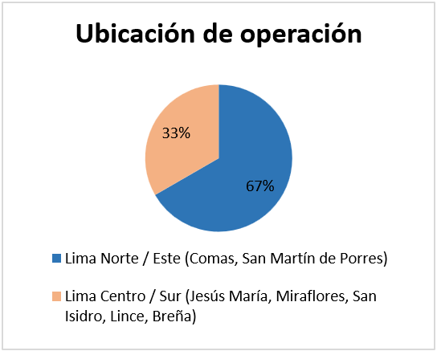 
  Nota. Gráfico que representa la ubicación de operación de los negocios del Segmento 1.

  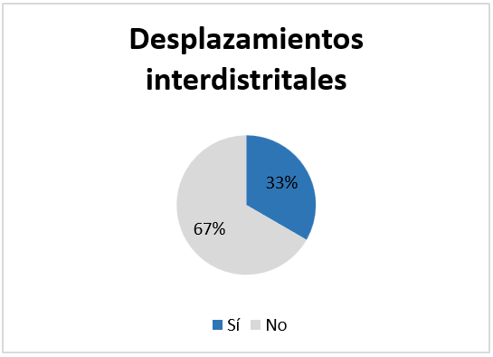 
  Nota. Gráfico que representa la movilidad entre distritos del segmento 1.

**Interpretación:** el segmento se concentra principalmente en Lima Norte / Este, zona donde se reportan con más fuerza las amenazas de extorsión. La movilidad entre distritos es una característica minoritaria.
 
 
#### 2.2.3.1.1.2. Rango de edad y antigüedad
 
El rango de edad oscila entre los **26 y 60 años**. El 66.7 % (2/3) tiene una trayectoria consolidada administrando negocios, con entre 2 y cerca de 30 años de experiencia.
 
| Indicador | Cantidad | Porcentaje |
|---|---|---|
| Trayectoria consolidada (2 a ~30 años) | 2 de 3 | 66.7 % |
 

  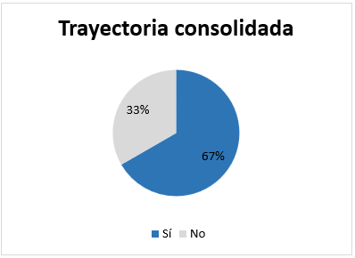 
  Nota. Gráfico que representa la trayectoria de los entrevistados como administradores de negocios

 
**Interpretación:** predominan personas con experiencia, lo que les da criterio para evaluar riesgos y soluciones de seguridad.
 
#### 2.2.3.1.1.3. Riesgos y amenazas identificadas
 
El 100 % (3/3) identifica el **horario nocturno** y los momentos de soledad en las calles como los de mayor vulnerabilidad para su patrimonio o personal. El 66.7 % (2/3) ha sido víctima o enfrenta amenaza directa de **delincuencia organizada y extorsiones** (cobro de cupos o "gota a gota"). Asimismo, el 66.7 % (2/3) teme el **robo de activos de alto valor** (equipos tecnológicos o dinero en caja).
 
| Indicador | Cantidad | Porcentaje |
|---|---|---|
| Horario nocturno / soledad en calles como mayor riesgo | 3 de 3 | 100 % |
| Amenaza de delincuencia organizada y extorsiones | 2 de 3 | 66.7 % |
| Temor al robo de activos de alto valor | 2 de 3 | 66.7 % |
 

  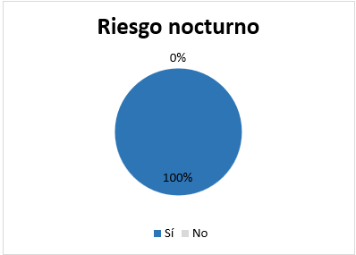 
  Nota. Gráfico que representa la percepción del riesgo nocturno. 

  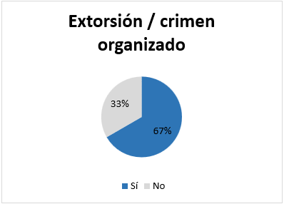 
  Nota. Gráfico que representa la exposición a la delincuencia organizada. 

   
  Nota. Gráfico que representa el temor al robo de activos de alto valor.

 
**Interpretación:** el riesgo nocturno es transversal a todo el segmento; la extorsión y el robo de activos afectan a la mayoría.
 
 
#### 2.2.3.1.1.4. Uso de tecnología y canales actuales
 
El 66.7 % (2/3) cuenta o ha interactuado con **cámaras de videovigilancia** como medio de registro y evidencia. El 66.7 % (2/3) utiliza **WhatsApp o llamadas** para comunicarse con vecinos o con la comisaría, pero el 100 % (3/3) reporta que estos canales son **lentos, ineficientes o se saturan** al reportar una amenaza en tiempo real.
 
| Indicador | Cantidad | Porcentaje |
|---|---|---|
| Usa o ha usado cámaras de videovigilancia | 2 de 3 | 66.7 % |
| Usa WhatsApp / llamadas para comunicarse | 2 de 3 | 66.7 % |
| Considera los canales actuales lentos, ineficientes o saturados | 3 de 3 | 100 % |
 

  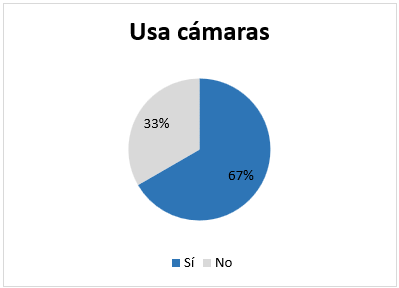 
  Nota. Gráfico que representa el uso de tecnología de seguridad.

  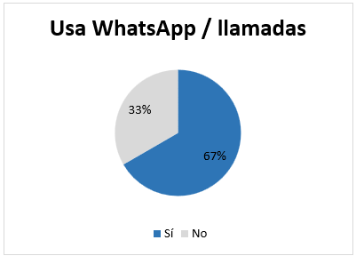 
  Nota. Gráfico que representa los canales actuales de comunicación ante amenazas. 

  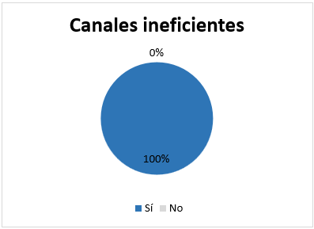 
  Nota. Gráfico que representa la valoración de los canales actuales. 

 
**Interpretación:** existe una brecha clara: usan canales informales, pero todos coinciden en que no sirven para alertas en tiempo real. Esta es una oportunidad directa para la solución propuesta.
 
#### 2.2.3.1.2. Características subjetivas (psicografía, miedos y necesidades)
 
#### 2.2.3.1.2.1. Perfil de personalidad
 
El 100 % (3/3) proyecta una personalidad **precavida, pragmática, protectora** de sus colaboradores y activos, y con **disposición a la colaboración comunitaria**.
 
| Indicador | Cantidad | Porcentaje |
|---|---|---|
| Personalidad precavida, pragmática y colaborativa | 3 de 3 | 100 % |
 

  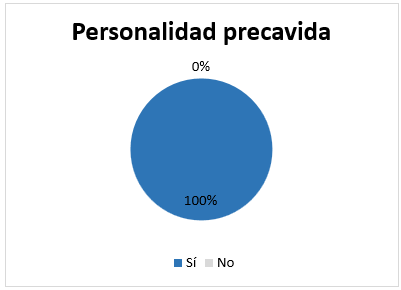 
  Nota. Gráfico que representa el perfil de personalidad del segmento.

 

 
#### 2.2.3.1.2.2. Desconfianza institucional
 
El 66.7 % (2/3) manifiesta alta desconfianza o frustración hacia la respuesta de la **Policía Nacional y el Serenazgo**, por la demora, la falta de recursos (combustible, patrullas) o fallas en el sistema judicial.
 
| Indicador | Cantidad | Porcentaje |
|---|---|---|
| Desconfianza hacia Policía y Serenazgo | 2 de 3 | 66.7 % |
 

  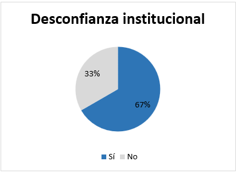 
  Nota. Gráfico que representa la confianza en las autoridades. 

**Interpretación:** la mayoría no espera que la autoridad resuelva a tiempo, por lo que valora la autogestión y la coordinación entre vecinos y comercios.
  
#### 2.2.3.1.2.3. Requerimientos de solución y usabilidad
 
- **Mapas de riesgo:** el 100 % (3/3) considera de alta utilidad contar con mapas de calor o riesgo en tiempo real para tomar medidas preventivas, coordinar con vecinos y planificar rutas u horarios de cierre.
- **Información detallada:** el 100 % (3/3) exige que los reportes detallen el tipo de delito, la hora y la ubicación exacta. Además, el 33.3 % (1/3) solicita fotografías o la modalidad de los delincuentes para identificación preventiva.
- **Criterios de adopción digital:** el 66.7 % (2/3) demanda una plataforma intuitiva, rápida, sin registros complicados ni permisos excesivos, y con alta adopción por parte de otros comercios del entorno.

| Indicador | Cantidad | Porcentaje |
|---|---|---|
| Mapas de calor / riesgo en tiempo real | 3 de 3 | 100 % |
| Reporte con tipo de delito, hora y ubicación exacta | 3 de 3 | 100 % |
| Plataforma intuitiva, rápida y de alta adopción | 2 de 3 | 66.7 % |
| Fotografías / modalidad de delincuentes | 1 de 3 | 33.3 % |
 

  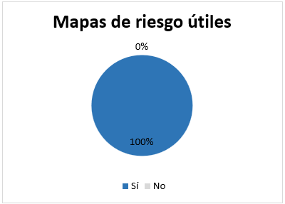 
  Nota. Gráfico que representa la utilidad percibida de los mapas de riesgo. 

  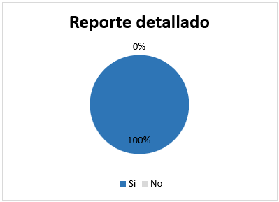 
  Nota. Gráfico que representa la información que el segmento exige en los reportes. 

  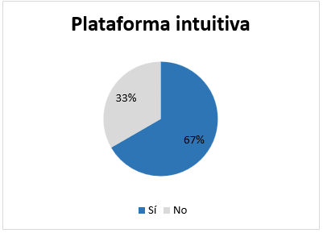 
  Nota. Gráfico que representa el criterio de adopción digital. 

  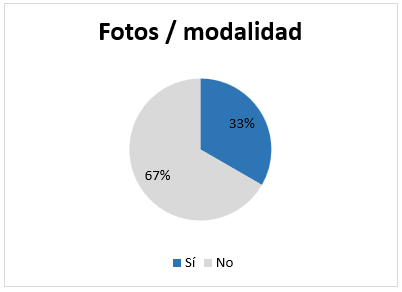 
  Nota. Gráfico que representa la solicitud de fotografías o de la modalidad de los delincuentes. 

  
#### 2.2.3.1.3. Síntesis del Segmento 1 

**Perfil general.** El Segmento 1 está conformado por administradores, gerentes, dueños y socios de locales comerciales, con edades entre los 26 y 60 años. El 66.7 % (2/3) cuenta con una trayectoria consolidada de entre 2 y cerca de 30 años administrando negocios, lo que les da criterio para evaluar riesgos y soluciones de seguridad. Su actividad se concentra principalmente en Lima Norte / Este (66.7 %, 2/3), con operaciones en Comas y San Martín de Porres, mientras que el 33.3 % (1/3) opera en Lima Centro / Sur. Además, el 33.3 % (1/3) se desplaza constantemente entre distritos para trasladar equipos de trabajo.
 
**Contexto de riesgo.** La amenaza más transversal es la noche: el 100 % (3/3) identifica el horario nocturno y los momentos de soledad en las calles como los de mayor vulnerabilidad para su patrimonio o su personal. A esto se suma la presión de la delincuencia organizada, ya que el 66.7 % (2/3) ha sido víctima o enfrenta amenaza directa de extorsión (cobro de cupos o "gota a gota"), y el 66.7 % (2/3) teme el robo de activos de alto valor, como equipos tecnológicos o dinero en caja. El riesgo no se limita a perder bienes, también afecta la seguridad de las personas que dependen del negocio.
 
**Relación con la tecnología y los canales actuales.** El segmento ya usa herramientas básicas de seguridad, pero ninguna resuelve la alerta inmediata. El 66.7 % (2/3) cuenta o ha interactuado con cámaras de videovigilancia, que sirven como registro y evidencia, es decir, actúan después del hecho. El 66.7 % (2/3) usa WhatsApp o llamadas para coordinar con vecinos o con la comisaría, y el 100 % (3/3) reporta que estos canales son lentos, ineficientes o se saturan cuando se necesita reportar una amenaza en tiempo real. Existe, por tanto, una brecha clara entre lo que usan hoy y lo que necesitan.
 
**Psicografía y confianza institucional.** El 100 % (3/3) proyecta una personalidad precavida, pragmática, protectora de sus colaboradores y activos, y con disposición a la colaboración comunitaria. Su actitud es proactiva: prefieren prevenir y coordinar con su entorno. Al mismo tiempo, el 66.7 % (2/3) manifiesta desconfianza o frustración hacia la Policía Nacional y el Serenazgo, por la demora, la falta de recursos (combustible y patrullas) o las fallas del sistema judicial. Esta desconfianza refuerza su valoración de la autogestión y de las redes entre vecinos y comercios.
 
**Necesidades y requerimientos de solución.** Lo que el segmento busca es información para prevenir y coordinar. El 100 % (3/3) considera de alta utilidad contar con mapas de calor o riesgo en tiempo real para tomar medidas preventivas, coordinar con vecinos y planificar rutas u horarios de cierre. El 100 % (3/3) exige que los reportes indiquen el tipo de delito, la hora y la ubicación exacta, y el 33.3 % (1/3) agrega la solicitud de fotografías o de la modalidad de los delincuentes para identificación preventiva. En cuanto a la adopción, el 66.7 % (2/3) pide una plataforma intuitiva y rápida, sin registros complicados ni permisos excesivos, y con alta adopción por parte de otros comercios del entorno, lo que indica que el valor de la solución depende del efecto de red.
 
 

#### 2.2.3.2. Segmento 2: Trabajadores, vendedores y personal de atención en tienda
---
 
**Muestra evaluada:** 3 entrevistados (Natalia Tarrillo, Alberto Ponce y Carol Montenegro).
 
#### 2.2.3.2.1. Características objetivas y demográficas
 
#### 2.2.3.2.1.1. Edad y perfil laboral
 
El 100 % (3/3) pertenece a un segmento **joven (19 a 26 años)** que trabaja como personal operativo multifuncional: atención al público, caja, reposición de mercadería o soporte técnico rotativo.
 
| Indicador | Cantidad | Porcentaje |
|---|---|---|
| Joven (19-26 años), personal operativo multifuncional | 3 de 3 | 100 % |
 

  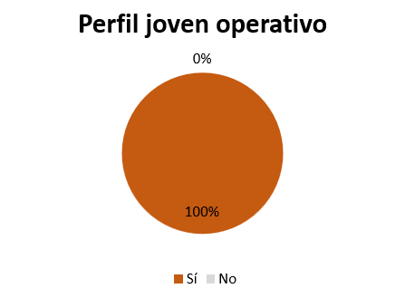 
  Nota. Gráfico que representa el perfil del Segmento 2.

  
#### 2.2.3.2.1.2. Jornada laboral y exposición al riesgo
 
El 100 % (3/3) cumple jornadas extensas (**9 a 11 horas diarias**) y realiza horas extras o **cierres solos** en la tienda. El 100 % (3/3) señala el **cierre nocturno**, la soledad del local y los paraderos o pasillos oscuros como los puntos de mayor riesgo.
 
| Indicador | Cantidad | Porcentaje |
|---|---|---|
| Jornada de 9 a 11 h, horas extras o cierres solos | 3 de 3 | 100 % |
| Cierre nocturno / soledad / paraderos oscuros como mayor riesgo | 3 de 3 | 100 % |
 

  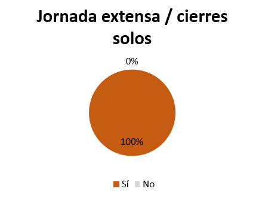 
  Nota. Gráfico que representa la exposición por jornada.

  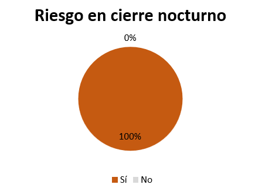 
  Nota. Gráfico que representa la percepción del punto crítico de riesgo.

 
**Interpretación:** el momento de mayor exposición es el cierre, cuando el trabajador está solo y sin apoyo inmediato.
 
#### 2.2.3.2.1.3. Modalidad de delitos experimentados
 
El 100 % (3/3) ha presenciado o conoce en su entorno inmediato **robos por distracción (hurtos hormiga)**, **merodeo de sospechosos frente a caja** y **llamadas o visitas de extorsión o cobro de cupos**.
 
| Indicador | Cantidad | Porcentaje |
|---|---|---|
| Hurtos hormiga / robos por distracción | 3 de 3 | 100 % |
| Merodeo de sospechosos frente a caja | 3 de 3 | 100 % |
| Llamadas / visitas de extorsión o cobro de cupos | 3 de 3 | 100 % |
 

  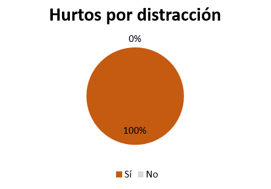 
  Nota. Gráfico que representa la exposición a robos en tienda.

  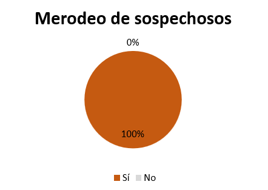 
  Nota. Gráfico que representa el merodeo de personas sospechosas.

  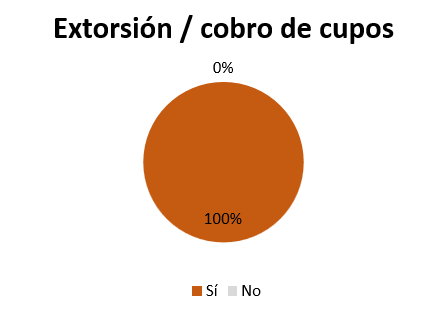 
  Nota. Gráfico que representa la presencia de extorsión en el entorno.

 
 
#### 2.2.3.2.1.4. Dispositivos y conectividad
 
El 100 % (3/3) usa como dispositivo principal un **smartphone Android de gama media**, que mantiene siempre a la mano. El 100 % (3/3) enfrenta limitaciones de conectividad: datos móviles prepago, Wi-Fi inestable o señal débil en zonas como el almacén.
 
| Indicador | Cantidad | Porcentaje |
|---|---|---|
| Smartphone Android de gama media | 3 de 3 | 100 % |
| Limitaciones de conectividad | 3 de 3 | 100 % |
 

  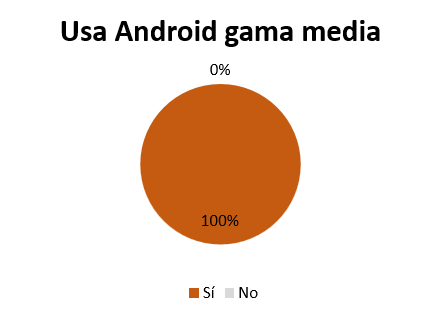 
  Nota. Gráfico que representa el dispositivo principal utilizado.

  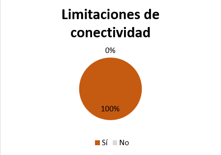 
  Nota. Gráfico que representa las restricciones de internet.

 
**Interpretación:** la solución debe ser liviana, funcionar en Android de gama media y tolerar conexiones inestables.
 
 
#### 2.2.3.2.2. Características subjetivas (psicografía, miedos y necesidades)
 
#### 2.2.3.2.2.1. Personalidad y sentimiento de vulnerabilidad
 
El 100 % (3/3) muestra una personalidad **cautelosa y alerta**, con un constante sentimiento de **vulnerabilidad física**. Temen represalias o una escalada de violencia si piden ayuda abiertamente frente a un agresor.
 
| Indicador | Cantidad | Porcentaje |
|---|---|---|
| Personalidad cautelosa con sentimiento de vulnerabilidad | 3 de 3 | 100 % |
 

  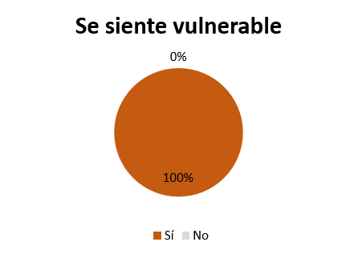 
  Nota. Gráfico que representa el estado emocional durante un riesgo.

 
#### 2.2.3.2.2.2. Frustración con los canales actuales (WhatsApp y llamadas)
 
El 100 % (3/3) coincide en que **WhatsApp es ineficaz para emergencias**, porque los avisos se pierden entre cadenas, stickers y cientos de mensajes. También el 100 % (3/3) afirma que sacar el celular, desbloquearlo, escribir o llamar mientras atiende a un cliente o sospechoso es **notorio, peligroso y difícil de ejecutar**.
 
| Indicador | Cantidad | Porcentaje |
|---|---|---|
| WhatsApp ineficaz para emergencias | 3 de 3 | 100 % |
| Sacar el celular / llamar es notorio y peligroso | 3 de 3 | 100 % |
 

  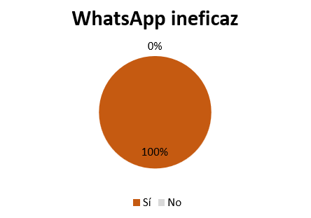 
  Nota. Gráfico que representa la evaluación de WhatsApp en emergencias.

  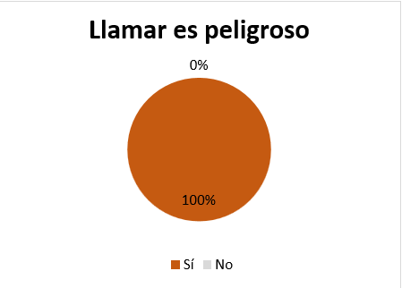 
  Nota. Gráfico que representa el riesgo operativo de comunicación.

 
 
#### 2.2.3.2.2.3. Requerimientos de solución y usabilidad (móvil / web)
 
- **Alerta discreta y silenciosa:** el 100 % (3/3) exige activarla con un solo toque (botón o gesto silencioso), sin sonidos ni luces que delaten la acción.
- **Simplicidad absoluta:** el 100 % (3/3) rechaza formularios largos, contraseñas complejas y aplicaciones pesadas que consuman espacio y batería. Prefiere accesos directos desde el navegador o interfaces livianas de pocos clics y botones grandes.
- **Notificaciones diferenciadas con datos clave:** el 100 % (3/3) requiere alertas breves, con sonido o vibración distinto al de WhatsApp, que indiquen la distancia exacta del hecho, el tipo de amenaza (robo, extorsión, sospechoso) y la hora, para decidir si cierran la reja o se ponen a salvo.
- **Anonimato:** el 66.7 % (2/3) resalta la importancia de proteger su identidad.

| Indicador | Cantidad | Porcentaje |
|---|---|---|
| Alerta discreta y silenciosa (un solo toque) | 3 de 3 | 100 % |
| Simplicidad absoluta (sin formularios ni apps pesadas) | 3 de 3 | 100 % |
| Notificaciones diferenciadas con distancia, tipo y hora | 3 de 3 | 100 % |
| Protección de identidad / anonimato | 2 de 3 | 66.7 % |
 

  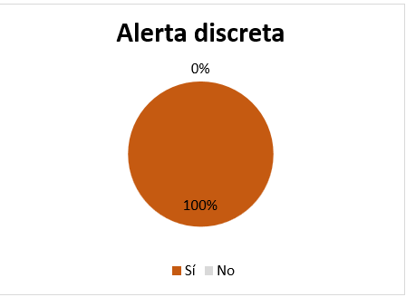 
  Nota. Gráfico que representa la exigencia de un mecanismo discreto.

  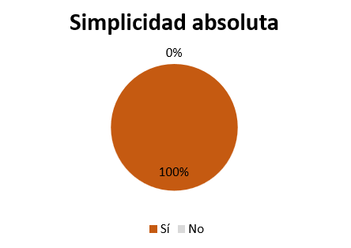 
  Nota. Gráfico que representa las preferencias de usabilidad.

  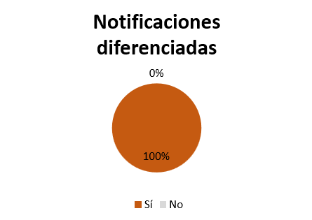 
  Nota. Gráfico que representa el formato de alerta deseado.

  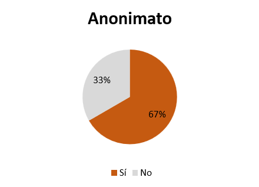 
  Nota. Gráfico que representa la necesidad de protección de datos.

 
 
#### 2.2.3.2.3. Síntesis del Segmento 2 

**Perfil general.** El Segmento 2 está conformado por trabajadores, vendedores y personal de atención en tienda. El 100 % (3/3) es joven (19 a 26 años) y se desempeña como personal operativo multifuncional: atención al público, caja, reposición de mercadería o soporte técnico rotativo. Es un perfil que está en primera línea frente a clientes, y también frente a posibles agresores.
 
**Exposición al riesgo.** El 100 % (3/3) cumple jornadas extensas de 9 a 11 horas diarias y realiza horas extras o cierres solos. El 100 % (3/3) señala el cierre nocturno, la soledad del local y los paraderos o pasillos oscuros como los puntos de mayor riesgo. Además, el 100 % (3/3) ha presenciado o conoce en su entorno inmediato robos por distracción (hurtos hormiga), merodeo de sospechosos frente a caja y llamadas o visitas de extorsión o cobro de cupos. El momento crítico es el cierre, cuando el trabajador está solo y sin apoyo inmediato.
 
**Dispositivos y conectividad.** El 100 % (3/3) usa como dispositivo principal un smartphone Android de gama media, que mantiene constantemente a la mano. Al mismo tiempo, el 100 % (3/3) enfrenta limitaciones de conectividad: datos móviles prepago, Wi-Fi inestable o señal débil en zonas como el almacén. Esto condiciona el diseño: la solución debe ser liviana, funcionar en Android de gama media y tolerar conexiones inestables.
 
**Psicografía y miedos.** El 100 % (3/3) tiene una personalidad cautelosa y alerta, y vive con un sentimiento constante de vulnerabilidad física. Temen represalias o que la violencia escale si piden ayuda abiertamente frente a un agresor. Por eso no basta con ofrecer un canal de ayuda: debe poder usarse sin que nadie lo note.
 
**Frustración con los canales actuales.** El 100 % (3/3) coincide en que WhatsApp es ineficaz para emergencias, porque los avisos se pierden entre cadenas, stickers y cientos de mensajes. También el 100 % (3/3) afirma que sacar el celular, desbloquearlo, escribir o llamar mientras atiende a un cliente o a un sospechoso es notorio, peligroso y difícil de ejecutar. Los canales actuales no solo son lentos, también pueden aumentar el riesgo.
 
**Necesidades y requerimientos de solución.** El segmento pide una herramienta de auxilio rápido y discreto, con cuatro condiciones:
 
- **Alerta discreta y silenciosa:** el 100 % (3/3) exige activarla con un solo toque (botón o gesto silencioso), sin sonidos ni luces que delaten la acción.
- **Simplicidad absoluta:** el 100 % (3/3) rechaza formularios largos, contraseñas complejas y aplicaciones pesadas que consuman espacio y batería, y prefiere accesos directos desde el navegador o interfaces livianas de pocos clics y botones grandes.
- **Notificaciones diferenciadas con datos clave:** el 100 % (3/3) requiere alertas breves, con sonido o vibración distinto al de WhatsApp, que indiquen la distancia exacta del hecho, el tipo de amenaza (robo, extorsión, sospechoso) y la hora, para decidir si cierran la reja o se ponen a salvo.
- **Anonimato:** el 66.7 % (2/3) resalta la importancia de proteger su identidad.

## 2.3. Needfinding

### 2.3.1. User Personas

En esta sección se presentan las fichas de User Persona, construidas a partir de los patrones de comportamiento y necesidades identificados en el análisis de entrevistas, así como de las oportunidades de mejora detectadas en el análisis de la competencia. Estos arquetipos sintetizan la información demográfica, las motivaciones, las frustraciones y las dinámicas operativas de nuestros dos nuevos segmentos objetivos B2B. La definición precisa de estos perfiles garantiza que el diseño de las funcionalidades de InstAlert —como la red de alertas, el botón de pánico y los mapas de riesgo— responda directamente a las urgencias reales de quienes administran y operan establecimientos comerciales en zonas de riesgo medio-alto.

**User Persona 1: Carlos Mendoza - Administrador y dueño de local comercial**

Para representar a los administradores y dueños de comercios, se elaboró la persona de usuario Carlos Mendoza, propietario de una tienda de electrodomésticos de 42 años, con ocho años de experiencia en una galería comercial de Los Olivos. Su perfil refleja las responsabilidades de quien busca proteger su negocio y a su personal mientras atiende las ventas y la gestión del local. También considera sus preocupaciones ante los intentos de robo, los rumores de extorsión y la falta de información oportuna sobre los riesgos cercanos. Sus principales necesidades son anticiparse a incidentes en la zona y coordinarse con otros comerciantes. Su uso habitual del teléfono inteligente y de aplicaciones de mensajería también se tomó en cuenta para definir cómo accedería a InstAlert.

  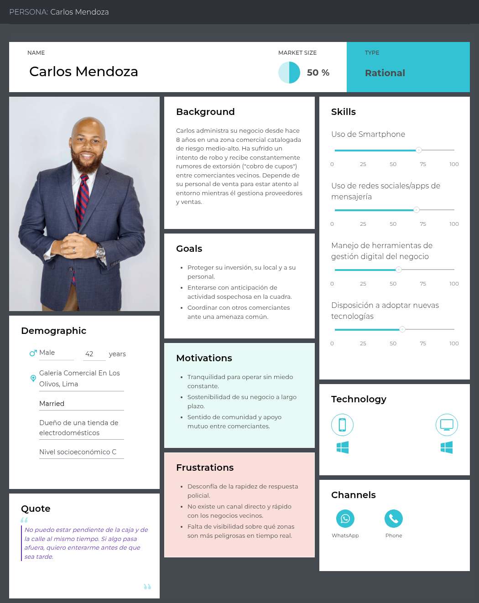

**User Persona 2: Lucía Ramírez - Personal operativo y vendedora**

Para representar al personal operativo y vendedor, se elaboró la persona de usuario Lucía Ramírez, una vendedora de 24 años que trabaja en un local comercial del centro de Lima. Su perfil refleja la exposición de quienes atienden directamente al público y pueden encontrarse con una situación de riesgo durante la jornada. Sus principales necesidades son sentirse segura, pedir ayuda con rapidez y discreción, e identificar datos clave de una alerta cercana, como el tipo de incidente y su distancia. También se consideraron su uso frecuente del teléfono inteligente y de aplicaciones de mensajería, así como la importancia de que las acciones de la plataforma sean sencillas durante momentos de tensión.

  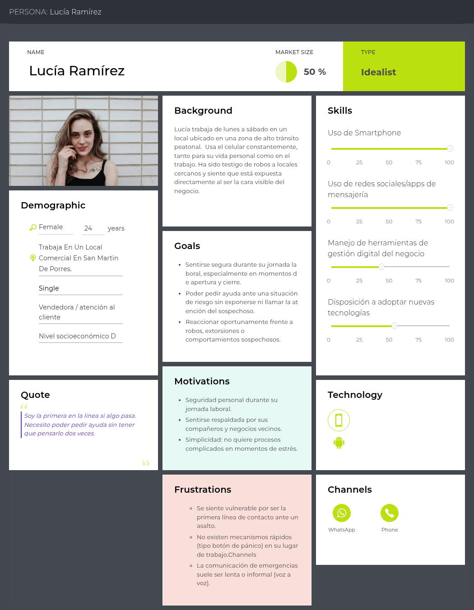

### 2.3.2. User Task Matrix

En esta sección se presenta el User Task Matrix, una herramienta que concentra y evalúa las tareas cotidianas que realizan nuestros dos segmentos objetivo (Administradores/dueños de locales comerciales y Personal operativo/vendedores) para cumplir sus objetivos de seguridad y operatividad. Es fundamental destacar que estas tareas representan acciones del mundo real, independientes de cualquier solución de software, orientadas a la prevención de riesgos, la gestión del negocio y la reacción ante emergencias.

A continuación, se detalla la matriz unificada, evaluando la frecuencia (Alta, Media, Baja) y la importancia (Alta, Media, Baja) de cada tarea para ambos arquetipos.

| Tareas del Usuario (Independientes del software) | Administrador (Carlos) - Frecuencia | Administrador (Carlos) - Importancia | Personal Operativo (Lucía) - Frecuencia | Personal Operativo (Lucía) - Importancia |
| :--- | :---: | :---: | :---: | :---: |
| Monitorear el entorno y los accesos del establecimiento | High | High | High | High |
| Alertar a compañeros o dueños sobre personas sospechosas | Medium | High | High | High |
| Gestionar el cierre del local y el cuadre de caja diario | High | High | High | High |
| Coordinar acciones preventivas con comerciantes vecinos | High | High | Low | Low |
| Solicitar auxilio inmediato ante una emergencia (robo, asalto) | Low | High | Low | High |
| Indagar sobre incidentes delictivos recientes en la zona | High | High | Medium | Medium |
| Establecer y revisar protocolos internos de seguridad | Medium | High | Low | Medium |
| Reportar un acto delictivo a las autoridades (Policía/Serenazgo) | Low | High | Low | High |

**Análisis de la Matriz de Tareas:**

Al analizar el cuadro, se identifican importantes coincidencias y diferencias en el comportamiento de ambos segmentos frente a la seguridad del negocio. 

Entre las **coincidencias principales**, destaca que ambos arquetipos otorgan una importancia crítica (High) a las tareas de reacción ante emergencias, como solicitar auxilio inmediato y reportar actos delictivos, aunque su frecuencia sea baja (Low) al tratarse de eventos críticos y excepcionales. Asimismo, el monitoreo del entorno y la gestión del cierre del local son tareas de alta frecuencia e importancia para ambos, ya que representan los momentos de mayor vulnerabilidad operativa.

En cuanto a las **diferencias**, el Administrador (Carlos) asume un rol mucho más preventivo y estratégico. Tareas como coordinar acciones con comerciantes vecinos, establecer protocolos internos e indagar sobre incidentes en la zona tienen una alta frecuencia e importancia para él, ya que busca proteger su inversión a largo plazo. Por su parte, el Personal Operativo (Lucía) tiene una participación baja en la coordinación comunitaria y el diseño de protocolos, enfocando su frecuencia diaria (High) en tareas tácticas como alertar inmediatamente sobre personas sospechosas y ejecutar de forma segura el cuadre de caja al finalizar el turno.

### 2.3.3. User Journey Mapping

En esta sección se presentan los User Journey Maps en su estado actual (*As-Is*), los cuales ilustran el recorrido y la experiencia cotidiana de nuestros User Personas frente a la gestión de la seguridad comercial, previo a la existencia de la solución InstAlert. El *end-to-end journey* documentado abarca desde el inicio de la jornada laboral y la apertura del establecimiento, pasando por la gestión de situaciones sospechosas durante el día de ventas, hasta el momento más crítico: el cierre del local y el cuadre de caja.

A través de estos mapas, se detallan las acciones, puntos de contacto, curvas emocionales y principales puntos de fricción (*pain points*) que enfrentan los usuarios al depender de herramientas preventivas informales (como llamadas telefónicas o grupos de WhatsApp saturados) y al lidiar con la respuesta tardía de las fuerzas del orden.

**Segmento 1: Administradores y dueños de locales comerciales**

El recorrido actual de Carlos (Administrador) refleja la tensión constante por proteger su inversión y a su personal. Su mapa ilustra la frustración operativa al intentar coordinar alertas preventivas con negocios vecinos mediante canales de comunicación ineficientes, así como la profunda incertidumbre y estrés al momento de gestionar la recaudación del día sin contar con un sistema de inteligencia comunitaria que le advierta sobre riesgos cercanos.

  

*Nota.* User Journey Map (As-Is) correspondiente a Carlos Mendoza, detallando las deficiencias actuales en la comunicación comunitaria y la prevención de riesgos patrimoniales. 

Para una mejor visualización de los detalles y lectura: [Ver User Journey Map 1](https://upcedupe-my.sharepoint.com/:i:/g/personal/u20241g022_upc_edu_pe/IQAi5yEOjEfcSrTiz1lkXRmxAf36hc46eDHQ8h4yuP-KBLU?e=mU7gbU)  

**Segmento 2: Personal operativo y vendedores de establecimientos comerciales**

El recorrido de Lucía (Vendedora) evidencia la vulnerabilidad de estar en la "primera línea" de atención. Su mapa destaca los picos negativos de estrés al detectar comportamientos hostiles o sospechosos en el establecimiento y su impotencia al no contar con un mecanismo de auxilio discreto e inmediato, dependiendo exclusivamente de llamadas tradicionales que alertarían al delincuente.

  

*Nota.* User Journey Map (As-Is) correspondiente a Lucía Ramírez, ilustrando la alta exposición al peligro físico y la ausencia de herramientas eficaces para emitir alertas tempranas de emergencia.

Para una mejor visualización de los detalles y lectura: [Ver User Journey Map 2](https://upcedupe-my.sharepoint.com/:i:/g/personal/u20241g022_upc_edu_pe/IQArn7UEL-1DS5nQpb6rwbepAe2pD0AMZ6bodVM1IOl4JQ4?e=tVh6ar)

### 2.3.4. Empathy Mapping

En esta sección, el equipo resume el proceso de elaboración y presenta los Empathy Maps construidos para cada uno de los User Personas de InstAlert. Para su desarrollo, seguimos una metodología estructurada que inició con la fase de preparación, ubicando al User Persona correspondiente en el centro del análisis. 

A partir de los hallazgos de las entrevistas, los miembros del equipo organizaron sus observaciones en los diferentes cuadrantes de la herramienta de diseño, respondiendo a las siguientes preguntas clave para generar empatía real: ¿Con quién estamos empatizando?, ¿Qué necesita hacer?, ¿Qué está diciendo?, ¿Qué está viendo?, ¿Qué está haciendo?, ¿Qué está escuchando? y ¿Cómo se siente y qué piensa? 

Finalmente, se sintetizaron los "Pains" (frustraciones) y "Gains" (ganancias), respondiendo puntualmente a: ¿Qué le preocupa?, ¿Qué puede ayudar a resolver sus problemas? y ¿Qué puede convencerlo de que InstAlert es la alternativa correcta frente a la inseguridad?

**Segmento 1: Administradores y dueños de locales comerciales**

El mapa de empatía de Carlos se enfoca en su preocupación constante por la extorsión y los asaltos. Refleja lo que escucha en su entorno sobre el aumento de la criminalidad, lo que ve en la ineficacia de las autoridades y cómo siente la necesidad urgente de proteger su inversión y a sus empleados.

  

*Nota.* Empathy Map correspondiente al Segmento 1, detallando sus percepciones del entorno delictivo y sus motivaciones para adoptar una red de seguridad comercial.

Para una mejor visualización de los detalles en los Empathy Maps de InstAlert, puede acceder al siguiente enlace de nuestro espacio de trabajo: [Ver Empathy Map 1](https://upcedupe-my.sharepoint.com/:i:/g/personal/u20241g022_upc_edu_pe/IQD3ELST12cFTr--zEcLz38fAZiaGTca7_Ermms7NRMGXdw?e=4dBE0U) 

**Segmento 2: Personal operativo y vendedores de establecimientos comerciales**

El mapa de empatía de Lucía ilustra la tensión y el estrés de trabajar en la primera línea de atención al cliente en una zona de riesgo. Destaca su miedo a enfrentar situaciones de violencia directa durante el cierre de caja, su frustración al no tener a quién recurrir de inmediato, y su necesidad de contar con una herramienta discreta de auxilio.

  

*Nota.* Empathy Map correspondiente al Segmento 2, reflejando su exposición al peligro y la necesidad de mecanismos de reacción inmediata como el botón de pánico.

Para una mejor visualización de los detalles en los Empathy Maps de InstAlert, puede acceder al siguiente enlace de nuestro espacio de trabajo: [Ver Empathy Map 2](https://upcedupe-my.sharepoint.com/:i:/g/personal/u20241g022_upc_edu_pe/IQBWuhKmJ_CMQ7bAMoxt3xEYAXMtY3bwDXpgiUX4rZLLE0A?e=OCTcQA) 

## 2.4. Big Picture EventStorming

El equipo llevó a cabo una sesión colaborativa de Big Picture Event Storming con el objetivo de comprender integralmente el nuevo dominio de negocio de InstAlert bajo el modelo SaaS B2B. Esta técnica permitió mapear el flujo completo de la solución, desde la adquisición de planes de suscripción hasta la gestión diaria y la resolución de incidentes en los establecimientos comerciales. A través de este proceso, logramos una aproximación visual de alto nivel que alineó la visión técnica con las necesidades operativas y de seguridad de nuestros dos segmentos clave: Administradores/dueños y Personal operativo. Además, permitió identificar procesos críticos, dependencias y potenciales oportunidades de mejora en la red de seguridad comercial.

### 2.4.1. Etapas del Big Picture Event Storming

#### 2.4.1.1. Generación de Eventos de Dominio (Domain Events)

En esta fase inicial, el equipo se enfocó en identificar todos los hechos significativos que ocurren dentro del ecosistema del problema (asaltos y robos a negocios). Siguiendo la convención de la metodología, estos eventos se plasmaron en notas adhesivas de color naranja y se redactaron en tiempo pasado, reflejando acciones ya concretadas.
Para nuestro contexto de InstAlert, se identificaron eventos clave como *Robo o asalto ocurrido*, *Alerta rápida de incidente emitida*, y *Mensaje leído tarde por vecinos*. Esta etapa permitió visibilizar las acciones manuales actuales frente a los eventos que el aplicativo resolverá, sin restricciones de orden cronológico.

  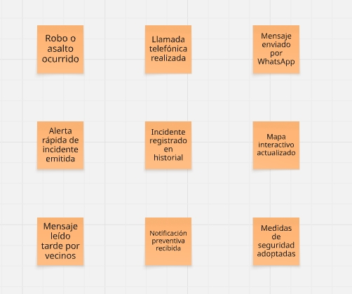 
  *Nota.* Generación de eventos de dominio del Event Storming de Panorama General de InstAlert centrado en flujos de prevención y reacción.

#### 2.4.1.2. Ordenamiento Cronológico y Flujo de Trabajo

Una vez generados los eventos de dominio, se procedió a organizarlos en una línea de tiempo (de izquierda a derecha). Este ordenamiento permitió estructurar la realidad del problema a través de dos flujos completamente independientes: el **Flujo Reactivo**, que ilustra la manera ineficiente y tradicional con la que los comerciantes responden hoy en día ante un asalto (llamadas o mensajes de WhatsApp), y el **Flujo de Prevención**, que evidencia el valor que aporta InstAlert mediante la notificación preventiva entre negocios vecinos y la actualización inmediata en un mapa interactivo.

  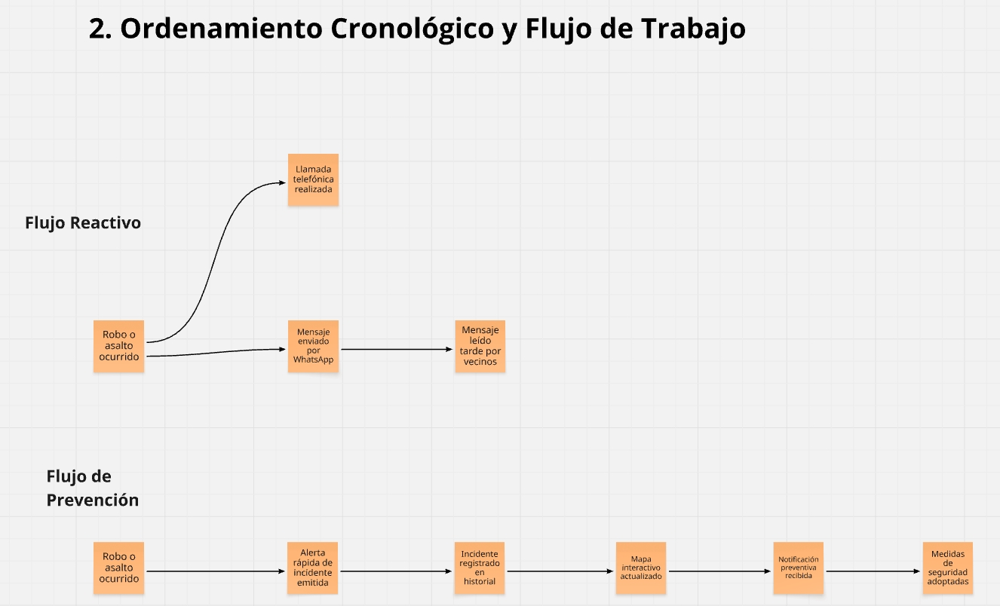 
  *Nota.* Ordenamiento cronológico separando el flujo tradicional (reactivo) del flujo propuesto con InstAlert (prevención).

#### 2.4.1.3. Identificación de Actores y Sistemas Externos

Para otorgar el contexto necesario a la secuencia de eventos, se añadieron capas de información identificando quién ejecuta las acciones y qué sistemas o herramientas intervienen en ambos procesos.
* **Flujo Reactivo:** Se identificó a los actores tradicionales como el *Vendedor*, el *Dueño / Administrador* y el *Comercio Vecino*, quienes dependen exclusivamente del *WhatsApp* y el *Teléfono Celular*.
* **Flujo de Prevención:** Se introdujo a *InstAlert App* y la API de *Mapbox* como los nuevos sistemas que reemplazan las ineficiencias del flujo anterior, logrando que el *Vendedor* informe de manera estructurada al *Comercio Vecino*.

  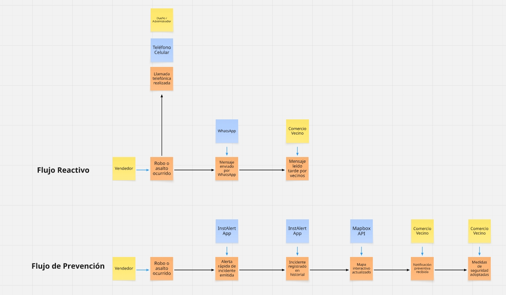 
  *Nota.* Identificación de los actores y los sistemas (manuales frente a los automatizados de InstAlert) involucrados en ambos flujos.

#### 2.4.1.4. Storytelling y Validación (Reverse Storytelling)

Finalmente, el equipo realizó una lectura crítica del mapa completo de derecha a izquierda (Reverse Storytelling) para validar la coherencia lógica de los procesos trazados. Durante esta etapa se utilizaron notas adhesivas de color rosado (Hotspots) para marcar los "Puntos de Dolor" o problemas críticos de la situación actual.
Estos hotspots (*Administrador no contesta a tiempo*, *Mensajes se pierden entre el spam* y *Falta de ubicación exacta del incidente*) fueron asignados exclusivamente al **Flujo Reactivo**, evidenciando las serias limitaciones del modelo basado en WhatsApp y llamadas, validando así la pertinencia y el diseño del **Flujo de Prevención** propuesto.

  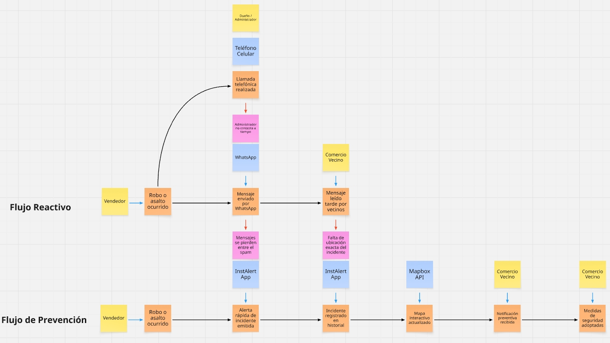 
  *Nota.* Proceso de Reverse Storytelling que evidencia los puntos de dolor (Hotspots) presentes en el método reactivo actual.

## 2.5. Ubiquitous Language

Los siguientes términos describen la situación actual de los comercios ante un incidente de seguridad y los medios que utilizan para comunicarse. Se emplearán de manera consistente en el análisis del problema.

| Term | Definition |
| :--- | :--- |
| **Business (Comercio)** | Establecimiento donde se desarrolla la actividad comercial y en el que puede ocurrir un incidente de seguridad. En el documento se utilizará *Business* como término común, en lugar de alternar entre *local*, *negocio* y *tienda*. |
| **Business Owner or Administrator (Dueño o administrador del comercio)** | Persona que es dueña del comercio o está a cargo de administrarlo. En la situación actual, es una de las personas a las que se intenta contactar después de un incidente. |
| **Operational Staff (Personal operativo)** | Trabajadores que realizan sus labores en el comercio y pueden presenciar un incidente. Incluye a vendedores y a otros empleados que atienden o trabajan en el establecimiento. |
| **Neighboring Business (Comercio vecino)** | Establecimiento cercano al comercio afectado que podría recibir información sobre un incidente. |
| **Security Incident (Incidente de seguridad)** | Hecho que afecta o pone en riesgo al comercio, como un robo o un asalto. |
| **Incident Notice (Aviso del incidente)** | Comunicación que informa a otra persona o comercio sobre un incidente ocurrido. En la situación actual, se realiza mediante una llamada o un mensaje. |
| **Communication Channel (Canal de comunicación)** | Medio utilizado para transmitir el aviso del incidente. Actualmente incluye la llamada telefónica y WhatsApp. |
| **Communication Delay (Demora en la comunicación)** | Retraso entre la ocurrencia del incidente y el momento en que el administrador o los comercios vecinos reciben o leen el aviso. |
| **Incident Location (Ubicación del incidente)** | Lugar donde ocurrió el incidente. En la situación actual, comunicarlo con precisión puede ser difícil. |
