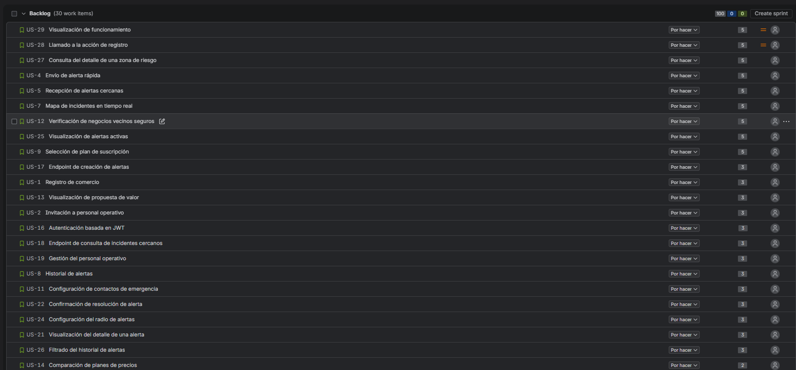
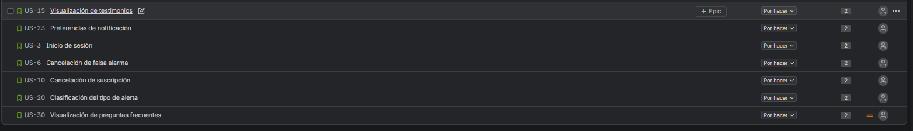

# Capítulo III: Requirements Specification

## 3.1. User Stories

En esta sección se definen los requisitos funcionales del proyecto InstAlert utilizando Epics y User Stories. Los criterios de aceptación están redactados siguiendo la estructura Gherkin (Given-When-Then) en inglés, redactados en tiempo presente, tercera persona y sin referenciar elementos específicos de la interfaz gráfica, tal como establece rigurosamente la rúbrica.

Se han definido los siguientes Epics:
- **EP01:** Gestión de Identidad y Cuentas de Comercios.
- **EP02:** Gestión de Alertas Comunitarias y Emergencias.
- **EP03:** Visualización y Mapa de Zonas de Riesgo.
- **EP04:** Gestión de Suscripciones y Pagos (SaaS).
- **EP05:** Red de Apoyo y Contactos de Confianza.
- **EP06:** Gestión del Landing Page.
- **EP07:** Technical Features & RESTful API.
- **EP08:** Configuración de Notificaciones y Preferencias.

| Epic / Story ID | Título | Descripción | Criterios de Aceptación | Relacionado con (Epic ID) |
|---|---|---|---|---|
| **EP01** | **Gestión de Identidad y Cuentas de Comercios** | Agrupa funcionalidades de registro, autenticación y gestión del personal para los dueños de locales. | - | - |
| US01 | Registro de comercio | Como administrador de local, deseo registrar los datos de mi negocio, para crear la cuenta del comercio y habilitarla mediante una suscripción activa. | **Scenario 1: Registro exitoso con activación pendiente** _Given_ que el visitante solicita crear una nueva cuenta de negocio _When_ provee datos de registro y credenciales válidas _Then_ el sistema crea la cuenta del comercio con activación pendiente _And_ no concede acceso a la aplicación hasta que se apruebe el pago de una suscripción.  **Scenario 2: Error por correo ya registrado** _Given_ que el visitante solicita crear una cuenta _When_ provee un correo electrónico que ya existe en la base de datos _Then_ el sistema rechaza el registro _And_ muestra un mensaje indicando que el correo ya está en uso. | EP01 |
| US02 | Invitación a personal operativo | Como administrador de local, deseo invitar a mi personal operativo, para que puedan reportar incidentes desde sus propias cuentas vinculadas a mi tienda. | **Scenario 1: Invitación exitosa** _Given_ que el administrador autenticado desea agregar un nuevo empleado _When_ provee un correo electrónico válido del empleado _Then_ el sistema registra una invitación pendiente para el negocio _And_ envía un correo de invitación al destinatario.  **Scenario 2: Error por correo inválido** _Given_ que el administrador intenta enviar una invitación _When_ provee un correo electrónico con formato incorrecto _Then_ el sistema rechaza la acción _And_ solicita que ingrese un correo válido. | EP01 |
| US03 | Inicio de sesión | Como usuario con una cuenta activa y acceso habilitado, deseo iniciar sesión con mis credenciales, para acceder de forma segura a mi entorno de alertas y gestión. | **Scenario 1: Inicio de sesión exitoso** _Given_ que el usuario posee una cuenta activa y una membresía habilitada en un negocio con suscripción activa _When_ provee credenciales correctas _Then_ el sistema valida las credenciales _And_ otorga acceso al panel principal.  **Scenario 2: Cuenta sin suscripción activa** _Given_ que el usuario posee una cuenta o membresía, pero el negocio no tiene una suscripción activa _When_ provee credenciales correctas _Then_ el sistema no concede acceso a la aplicación _And_ informa que debe activarse una suscripción para habilitar el acceso.  **Scenario 3: Error por credenciales inválidas** _Given_ que el usuario solicita autenticarse _When_ provee una contraseña o correo incorrectos _Then_ el sistema rechaza la autenticación _And_ muestra un mensaje de error.  **Scenario 4: Error por campos incompletos** _Given_ que el usuario solicita autenticarse _When_ deja el campo de correo o contraseña en blanco _Then_ el sistema previene el envío de la solicitud _And_ requiere que complete todos los campos obligatorios. | EP01 |
| US19 | Aceptación de invitación de personal operativo | Como personal operativo invitado, deseo aceptar una invitación válida, para crear mi cuenta y acceder a la aplicación cuando el comercio tenga una suscripción activa. | **Scenario 1: Aceptación de invitación válida** _Given_ que existe una invitación pendiente y vigente _When_ el invitado proporciona datos válidos y acepta la invitación _Then_ el sistema crea o vincula la cuenta del usuario _And_ registra una membresía activa en el negocio _And_ actualiza el estado de la invitación a Accepted _And_ habilita el acceso a la aplicación solo si el negocio tiene una suscripción activa.  **Scenario 2: Invitación inválida o expirada** _Given_ que la invitación no es válida o se encuentra expirada _When_ el invitado intenta aceptarla _Then_ el sistema rechaza la operación _And_ no concede acceso ni crea una membresía activa. | EP01 |
| **EP02** | **Gestión de Alertas Comunitarias y Emergencias** | Agrupa funcionalidades de emisión, recepción y resolución de alertas de seguridad. | - | - |
| US04 | Activación de alerta de pánico con cuenta regresiva | Como personal operativo, deseo iniciar una alerta de pánico con una cuenta regresiva de confirmación, para evitar activaciones accidentales durante una situación de riesgo. | **Scenario 1: Activación confirmada de alerta de pánico** _Given_ que el usuario autenticado enfrenta una amenaza de seguridad _When_ inicia la acción de emergencia y la cuenta regresiva finaliza sin cancelación _Then_ el sistema registra una alerta activa con la marca de tiempo y geolocalización actual _And_ inicia la notificación de emergencia a los usuarios elegibles dentro de la aplicación.  **Scenario 2: Cancelación durante la cuenta regresiva** _Given_ que el usuario ha iniciado la cuenta regresiva de emergencia _When_ cancela la acción antes de que finalice la cuenta regresiva _Then_ el sistema no crea una alerta de emergencia activa. | EP02 |
| US05 | Recepción de alertas cercanas | Como usuario con acceso activo a la aplicación, deseo recibir y visualizar alertas de emergencia cercanas a través de la aplicación, para poder tomar medidas preventivas como cerrar mi local. | **Scenario 1: Recepción de alerta por un usuario autorizado** _Given_ que se genera una nueva alerta de emergencia y el usuario tiene una membresía activa asociada a un negocio con suscripción activa _When_ la aplicación consulta las alertas dentro del radio configurado _Then_ la aplicación muestra únicamente las alertas cercanas correspondientes _And_ presenta los detalles clave del incidente.  **Scenario 2: Usuario sin acceso habilitado** _Given_ que se genera una nueva alerta de emergencia _When_ el usuario no tiene una membresía activa asociada a un negocio con suscripción activa _Then_ el sistema no le permite recibir ni visualizar la alerta mediante la aplicación. | EP02 |
| US06 | Resolución de falsa alarma | Como usuario emisor, deseo registrar que una alerta fue una falsa alarma, para evitar pánico innecesario en la red vecinal. | **Scenario 1: Registrar una falsa alarma** _Given_ que el usuario emitió previamente una alerta activa _When_ solicita resolverla como falsa alarma _Then_ el sistema actualiza el estado de la alerta a Resolved _And_ registra la razón de resolución como FalseAlarm _And_ refleja la resolución para los usuarios autorizados de la aplicación. | EP02 |
| US20 | Clasificación del tipo de incidente en el reporte | Como personal operativo, deseo clasificar el tipo de incidente en el reporte (Robo, Intento de robo, Asalto u Otro), para documentar el motivo exacto del evento. | **Scenario 1: Clasificar correctamente un incidente** _Given_ que el personal operativo está completando un reporte de incidente _When_ selecciona un tipo de incidente entre Robo, Intento de robo, Asalto u Otro _Then_ el sistema asigna el tipo seleccionado al reporte _And_ muestra dicha clasificación en el detalle de la alerta.  **Scenario 2: Seleccionar la opción "Otro"** _Given_ que el tipo de incidente ocurrido no coincide con las categorías disponibles _When_ el usuario selecciona Otro _Then_ el sistema permite utilizar esa clasificación _And_ conserva la descripción ingresada por el usuario para complementar el reporte. | EP02 |
| US22 | Resolución de alerta por fin del peligro | Como personal operativo con una alerta activa, deseo registrar que el peligro terminó, para resolver la alerta y completar posteriormente el reporte del incidente. | **Scenario 1: Resolver una situación de pánico** _Given_ que el personal operativo tiene una alerta de pánico activa _And_ la situación de peligro ya ha terminado _When_ confirma la finalización de la situación _Then_ el sistema cambia el estado de la alerta a Resolved _And_ registra la razón de resolución como DangerEnded _And_ mantiene o crea el reporte asociado con estado Pending.  **Scenario 2: Intentar resolver una alerta ya resuelta** _Given_ que una alerta ya se encuentra en estado Resolved _When_ el usuario intenta resolver nuevamente la misma situación _Then_ el sistema no genera una segunda resolución _And_ mantiene el estado actual de la alerta. | EP02 |
| US25 | Visualización de alertas activas | Como usuario autorizado, deseo visualizar las alertas de emergencia activas, para estar informado de los peligros que aún no han sido resueltos. | **Scenario 1: Visualizar una alerta activa** _Given_ que existe una alerta de emergencia con estado Active _When_ el usuario autorizado consulta las alertas activas _Then_ el sistema muestra la alerta con estado Active _And_ presenta su hora de activación y ubicación.  **Scenario 2: No existen alertas activas** _Given_ que todas las alertas registradas tienen estado Resolved _When_ el usuario autorizado consulta las alertas activas _Then_ el sistema no muestra registros activos _And_ indica que no existen alertas activas. | EP02 |
| **EP03** | **Visualización y Mapa de Zonas de Riesgo** | Agrupa funcionalidades para explorar los incidentes recientes en un mapa y consultar el historial de seguridad. | - | - |
| US07 | Mapa de incidentes en tiempo real | Como administrador de local, deseo visualizar un mapa con los incidentes recientes en mi zona, para identificar patrones de riesgo y áreas inseguras. | **Scenario 1: Visualización de incidentes en el mapa** _Given_ que el usuario solicita la vista del mapa de riesgos _When_ el sistema recupera los incidentes recientes en la vecindad del usuario _Then_ muestra los incidentes geolocalizados en el mapa _And_ categoriza el nivel de riesgo del área. | EP03 |
| US08 | Historial de alertas | Como administrador de local, deseo consultar un historial detallado de las alertas generadas por mi tienda, para llevar un registro de eventos de seguridad. | **Scenario 1: Acceso al historial de alertas** _Given_ que el administrador solicita el historial de alertas _When_ el sistema recupera las alertas pasadas asociadas al negocio _Then_ presenta una lista cronológica de los incidentes. | EP03 |
| US21 | Visualización del detalle de una alerta | Como usuario autorizado, deseo visualizar la información detallada de una alerta registrada en el historial, para conocer su ubicación, fecha, estado, tipo y descripción. | **Scenario 1: Consultar el detalle de una alerta** _Given_ que el usuario autorizado consulta una alerta registrada _When_ solicita el detalle de la alerta _Then_ el sistema presenta el tipo, fecha, hora, ubicación y estado de la alerta _And_ muestra la descripción del incidente cuando se encuentra disponible.  **Scenario 2: Consultar una alerta con reporte pendiente** _Given_ que existe una alerta con estado Resolved _And_ el reporte asociado tiene estado Pending _When_ el usuario autorizado consulta el detalle de la alerta _Then_ el sistema indica que el reporte se encuentra pendiente _And_ informa que aún falta completar la información del incidente. | EP03 |
| US26 | Filtrado del historial de alertas | Como usuario autorizado, deseo filtrar el historial por fecha, tipo de incidente, estado de alerta o estado de reporte, para encontrar rápidamente eventos específicos. | **Scenario 1: Filtrar alertas por criterios** _Given_ que existen múltiples alertas registradas _When_ el usuario autorizado aplica filtros de fecha, tipo de incidente, estado de alerta o estado de reporte _Then_ el sistema muestra únicamente las alertas y reportes que coinciden con los criterios seleccionados.  **Scenario 2: Filtro sin resultados** _Given_ que existen alertas registradas _When_ el usuario autorizado aplica una combinación de filtros que no coincide con ningún registro _Then_ el sistema devuelve una lista vacía _And_ informa que no se encontraron resultados para los filtros seleccionados. | EP03 |
| US27 | Consulta del detalle de una zona de riesgo | Como usuario, deseo seleccionar una zona de riesgo en el mapa para ver su nivel de peligrosidad e incidentes recientes, para tomar precauciones al transitar o gestionar mi negocio. | **Scenario 1: Consultar una zona de riesgo** _Given_ que el usuario se encuentra visualizando el Mapa de Riesgo _And_ existen zonas de riesgo identificadas en el mapa _When_ selecciona una de las zonas _Then_ el sistema muestra el detalle de la zona _And_ presenta su nivel de riesgo y la información disponible sobre incidentes registrados.  **Scenario 2: Zona sin incidentes recientes** _Given_ que el usuario selecciona una zona del mapa _And_ la zona no registra incidentes recientes _When_ el sistema carga el detalle de la zona _Then_ muestra la información disponible de dicha zona _And_ indica que no existen incidentes recientes registrados. | EP03 |
| **EP04** | **Gestión de Suscripciones y Pagos (SaaS)** | Agrupa funcionalidades de facturación, selección de planes y cancelaciones de suscripción. | - | - |
| US09 | Selección de plan de suscripción | Como administrador de local, deseo seleccionar y suscribirme a un plan de pago, para activar la cuenta y desbloquear las funcionalidades de la plataforma. | **Scenario 1: Suscripción a un plan de pago** _Given_ que el administrador posee una cuenta con activación pendiente y elige un plan de suscripción _When_ procesa un método de pago válido _Then_ el sistema activa la suscripción _And_ habilita el acceso a la aplicación y a las funcionalidades incluidas en el plan.  **Scenario 2: Pago rechazado** _Given_ que el administrador elige un plan de suscripción _When_ el método de pago es rechazado _Then_ el sistema mantiene la cuenta con activación pendiente _And_ no concede acceso a la aplicación. | EP04 |
| US10 | Cancelación de suscripción | Como administrador de local, deseo cancelar mi suscripción activa desde mi panel de configuración, para gestionar mis gastos directamente. | **Scenario 1: Cancelación de una suscripción activa** _Given_ que el administrador posee una suscripción activa _When_ solicita la cancelación de su suscripción _Then_ el sistema programa la cancelación para el final del ciclo de facturación _And_ deshabilita el acceso a la aplicación cuando expire la suscripción, hasta que se active una nueva suscripción. | EP04 |
| **EP05** | **Red de Apoyo y Contactos de Confianza** | Agrupa funcionalidades para registrar y administrar contactos de emergencia asociados al usuario. | - | - |
| US11 | Gestión de contactos de emergencia | Como usuario, deseo registrar contactos de emergencia personales, para mantener disponible la información de personas de confianza asociadas a mi perfil. | **Scenario 1: Registro de contacto de emergencia** _Given_ que el usuario proporciona los datos de un contacto de emergencia _When_ los datos de contacto son válidos _Then_ el sistema guarda el contacto de emergencia _And_ lo asocia con el perfil del usuario. | EP05 |
| US12 | Verificación de negocios vecinos seguros | Como administrador de local, deseo visualizar qué negocios vecinos pertenecen a la red de InstAlert, para fomentar la colaboración vecinal. | **Scenario 1: Visualización de negocios activos cercanos** _Given_ que el administrador revisa la red vecinal _When_ el sistema calcula los negocios registrados cercanos _Then_ muestra una lista de tiendas vecinas verificadas en la red. | EP05 |
| **EP08** | **Configuración de Notificaciones y Preferencias** | Agrupa funcionalidades relacionadas a las configuraciones de alertas y notificaciones personalizadas. | - | - |
| US23 | Preferencias de notificación | Como usuario, deseo activar o desactivar categorías de notificaciones en mi perfil, para recibir únicamente las alertas que considero relevantes para mí. | **Scenario 1: Modificar preferencias de notificación** _Given_ que el usuario se encuentra en la configuración de su perfil _When_ activa o desactiva una categoría de notificaciones _And_ selecciona Guardar cambios _Then_ el sistema almacena las nuevas preferencias _And_ muestra una confirmación de que los cambios fueron guardados.  **Scenario 2: Desactivar alertas preventivas** _Given_ que el usuario recibe notificaciones de alertas preventivas _When_ desactiva la opción Alertas preventivas _Then_ el sistema actualiza su configuración _And_ deja de enviarle notificaciones correspondientes a ese tipo de alerta. | EP08 |
| US24 | Configuración del radio de alertas | Como usuario, deseo configurar el radio de distancia de mis alertas, para recibir notificaciones solo de incidentes que ocurran dentro de mi zona de interés. | **Scenario 1: Configurar un radio válido** _Given_ que el usuario se encuentra en la configuración de su perfil _When_ selecciona un radio permitido para recibir alertas cercanas _And_ guarda los cambios _Then_ el sistema registra el nuevo radio _And_ utiliza esa distancia para determinar qué alertas cercanas debe mostrar o notificar.  **Scenario 2: Cambiar el radio configurado** _Given_ que el usuario ya tiene un radio de alertas configurado _When_ selecciona una distancia diferente _And_ guarda la configuración _Then_ el sistema reemplaza el radio anterior por el nuevo valor _And_ aplica la nueva configuración a futuras alertas. | EP08 |
| **EP06** | **Gestión del Landing Page** | Agrupa historias enfocadas en los visitantes no autenticados que exploran la propuesta de valor comercial. | - | - |
| US13 | Visualización de propuesta de valor | Como visitante, deseo leer de forma clara cómo la aplicación protege a los negocios, para entender los beneficios antes de registrarme. | **Scenario 1: Exploración de la página principal (Landing)** _Given_ que el visitante accede al Landing Page _When_ la página carga exitosamente _Then_ el sistema muestra la propuesta de valor principal _And_ presenta llamadas a la acción claras para el registro. | EP06 |
| US14 | Comparación de planes de precios | Como visitante, deseo visualizar una tabla comparativa de precios y características, para evaluar qué plan se adapta a las necesidades de mi negocio. | **Scenario 1: Comparación de planes de precios** _Given_ que el visitante navega a la sección de precios _When_ revisa los niveles de suscripción disponibles _Then_ el sistema muestra una comparación detallada de características y costos. | EP06 |
| US15 | Visualización de testimonios | Como visitante, deseo leer testimonios de comercios protegidos por la plataforma, para sentir mayor confianza en la efectividad del sistema. | **Scenario 1: Carga de casos de éxito** _Given_ que el visitante explora la página principal _When_ llega a la sección de testimonios _Then_ el sistema muestra las opiniones destacadas de clientes reales. | EP06 |
| US28 | Llamado a la acción de registro | Como visitante, deseo encontrar un botón de acción claro en la sección principal, para iniciar mi proceso de registro de comercio rápidamente. | **Scenario 1: Clic en botón de registro** _Given_ que el visitante está en la sección de inicio (Hero) _When_ hace clic en el botón de registro _Then_ el sistema lo redirige al formulario de creación de cuenta del sistema. | EP06 |
| US29 | Visualización de funcionamiento | Como visitante, deseo ver una sección explicativa de cómo opera la red de alertas, para comprender la dinámica comunitaria de la aplicación. | **Scenario 1: Lectura de cómo funciona** _Given_ que el visitante navega por el contenido _When_ llega a la sección 'Cómo Funciona' _Then_ el sistema muestra los pasos del proceso de alerta de forma visual. | EP06 |
| US30 | Visualización de preguntas frecuentes | Como visitante, deseo visualizar una sección de preguntas frecuentes, para resolver mis dudas de forma rápida sin contactar a soporte. | **Scenario 1: Consulta de preguntas frecuentes** _Given_ que el visitante navega por la página principal _When_ llega a la sección de preguntas frecuentes (FAQ) _Then_ el sistema muestra una lista de dudas comunes con sus respectivas respuestas. | EP06 |
| **EP07** | **Technical Features & RESTful API** | Agrupa las historias técnicas y de backend necesarias para que los desarrolladores integren las plataformas. | - | - |
| US16 | Autenticación basada en JWT | Como Developer, deseo implementar autenticación JWT en los endpoints, para asegurar que solo usuarios autorizados realicen operaciones críticas. | **Scenario 1: Protección de endpoints con JWT** _Given_ que la API recibe una solicitud a un endpoint protegido _When_ la solicitud incluye un JWT válido en el encabezado de Autorización _Then_ el sistema autentica la solicitud exitosamente _And_ procesa la operación solicitada.  **Scenario 2: Rechazo por JWT inválido o expirado** _Given_ que la API recibe una solicitud a un endpoint protegido _When_ la solicitud incluye un JWT inválido, manipulado o expirado _Then_ el sistema rechaza la solicitud _And_ retorna un código HTTP 401 Unauthorized. | EP07 |
| US17 | Endpoint de creación de alertas | Como Developer, deseo implementar un endpoint POST para registrar una alerta, para procesar y almacenar las alertas enviadas por las aplicaciones cliente. | **Scenario 1: Procesamiento del payload de una alerta** _Given_ que la aplicación cliente envía una petición de creación de alerta _When_ el payload contiene coordenadas válidas y un AlertKind válido (Panic, Preventive o Historical) _Then_ el sistema almacena una alerta con estado Active _And_ retorna un código HTTP 201 Created. | EP07 |
| US18 | Endpoint de consulta de incidentes cercanos | Como Developer, deseo implementar un endpoint GET que retorne incidentes cercanos, para alimentar el mapa de riesgos en la aplicación cliente. | **Scenario 1: Recuperación de incidentes cercanos** _Given_ que la aplicación cliente solicita los incidentes dentro de un área geográfica _When_ el sistema consulta la base de datos buscando coincidencias _Then_ retorna una lista JSON de los incidentes encontrados _And_ retorna un código HTTP 200 OK. | EP07 |
## 3.2. Impact Mapping

El Impact Mapping ha sido elaborado de manera colaborativa utilizando la herramienta **UXpressia**, estructurado en los niveles de Business Goals, Personas, Impacts, Deliverables y sus correspondientes User Stories, alineados a los segmentos de administradores de locales y personal operativo de InstAlert.

A continuación, se presenta la vista panorámica del modelo completo:

  
   <em>Figura 1: Vista panorámica del Impact Mapping en UXpressia</em>

## 3.3. Product Backlog

A continuación se presenta el Product Backlog del proyecto InstAlert, priorizado estrictamente en función del valor entregado al negocio. Siguiendo las directrices del marco de trabajo ágil, las User Stories relacionadas al sitio web estático (Landing Page) y la funcionalidad core del producto se han considerado en la prioridad más alta, desplazando a posiciones posteriores las tareas de soporte técnico como el registro y la autenticación.

Para la estimación del esfuerzo se ha utilizado la secuencia de Fibonacci (1, 2, 3, 5, 8). La gestión del Product Backlog se lleva a cabo mediante la herramienta **Jira Software**.

  
    
  
   <em>Figura 2: Captura del Product Backlog priorizado por valor de negocio</em>

| # Orden | User Story Id | Título | Descripción | Story Points (1 / 2 / 3 / 5 / 8) |
|---|---|---|---|---|
| 1 | US27 | Consulta del detalle de una zona de riesgo | Como usuario, deseo seleccionar una zona de riesgo en el mapa para ver su nivel de peligrosidad e incidentes recientes, para tomar precauciones al transitar o gestionar mi negocio. | 5 |
| 2 | US04 | Activación de alerta de pánico con cuenta regresiva | Como personal operativo, deseo iniciar una alerta de pánico con una cuenta regresiva de confirmación, para evitar activaciones accidentales durante una situación de riesgo. | 5 |
| 3 | US05 | Recepción de alertas cercanas | Como usuario con acceso activo a la aplicación, deseo recibir y visualizar alertas de emergencia cercanas a través de la aplicación, para poder tomar medidas preventivas como cerrar mi local. | 5 |
| 4 | US07 | Mapa de incidentes en tiempo real | Como administrador de local, deseo visualizar un mapa con los incidentes recientes en mi zona, para identificar patrones de riesgo y áreas inseguras. | 5 |
| 5 | US12 | Verificación de negocios vecinos seguros | Como administrador de local, deseo visualizar qué negocios vecinos pertenecen a la red de InstAlert, para fomentar la colaboración vecinal. | 5 |
| 6 | US25 | Visualización de alertas activas | Como usuario autorizado, deseo visualizar las alertas de emergencia activas, para estar informado de los peligros que aún no han sido resueltos. | 5 |
| 7 | US09 | Selección de plan de suscripción | Como administrador de local, deseo seleccionar y suscribirme a un plan de pago, para activar la cuenta y desbloquear las funcionalidades de la plataforma. | 5 |
| 8 | US17 | Endpoint de creación de alertas | Como Developer, deseo implementar un endpoint POST para registrar una alerta, para procesar y almacenar las alertas enviadas por las aplicaciones cliente. | 3 |
| 9 | US01 | Registro de comercio | Como administrador de local, deseo registrar los datos de mi negocio, para crear la cuenta del comercio y habilitarla mediante una suscripción activa. | 3 |
| 10 | US13 | Visualización de propuesta de valor | Como visitante, deseo leer de forma clara cómo la aplicación protege a los negocios, para entender los beneficios antes de registrarme. | 3 |
| 11 | US02 | Invitación a personal operativo | Como administrador de local, deseo invitar a mi personal operativo, para que puedan reportar incidentes desde sus propias cuentas vinculadas a mi tienda. | 3 |
| 12 | US16 | Autenticación basada en JWT | Como Developer, deseo implementar autenticación JWT en los endpoints, para asegurar que solo usuarios autorizados realicen operaciones críticas. | 3 |
| 13 | US18 | Endpoint de consulta de incidentes cercanos | Como Developer, deseo implementar un endpoint GET que retorne incidentes cercanos, para alimentar el mapa de riesgos en la aplicación cliente. | 3 |
| 14 | US19 | Aceptación de invitación de personal operativo | Como personal operativo invitado, deseo aceptar una invitación válida, para crear mi cuenta y acceder a la aplicación cuando el comercio tenga una suscripción activa. | 3 |
| 15 | US08 | Historial de alertas | Como administrador de local, deseo consultar un historial detallado de las alertas generadas por mi tienda, para llevar un registro de eventos de seguridad. | 3 |
| 16 | US11 | Gestión de contactos de emergencia | Como usuario, deseo registrar contactos de emergencia personales, para mantener disponible la información de personas de confianza asociadas a mi perfil. | 3 |
| 17 | US22 | Resolución de alerta por fin del peligro | Como personal operativo con una alerta activa, deseo registrar que el peligro terminó, para resolver la alerta y completar posteriormente el reporte del incidente. | 3 |
| 18 | US24 | Configuración del radio de alertas | Como usuario, deseo configurar el radio de distancia de mis alertas, para recibir notificaciones solo de incidentes que ocurran dentro de mi zona de interés. | 3 |
| 19 | US21 | Visualización del detalle de una alerta | Como usuario autorizado, deseo visualizar la información detallada de una alerta registrada en el historial, para conocer su ubicación, fecha, estado, tipo y descripción. | 3 |
| 20 | US26 | Filtrado del historial de alertas | Como usuario autorizado, deseo filtrar el historial por fecha, tipo de incidente, estado de alerta o estado de reporte, para encontrar rápidamente eventos específicos. | 3 |
| 21 | US14 | Comparación de planes de precios | Como visitante, deseo visualizar una tabla comparativa de precios y características, para evaluar qué plan se adapta a las necesidades de mi negocio. | 2 |
| 22 | US15 | Visualización de testimonios | Como visitante, deseo leer testimonios de comercios protegidos por la plataforma, para sentir mayor confianza en la efectividad del sistema. | 2 |
| 23 | US23 | Preferencias de notificación | Como usuario, deseo activar o desactivar categorías de notificaciones en mi perfil, para recibir únicamente las alertas que considero relevantes para mí. | 2 |
| 24 | US03 | Inicio de sesión | Como usuario con una cuenta activa y acceso habilitado, deseo iniciar sesión con mis credenciales, para acceder de forma segura a mi entorno de alertas y gestión. | 2 |
| 25 | US06 | Resolución de falsa alarma | Como usuario emisor, deseo registrar que una alerta fue una falsa alarma, para evitar pánico innecesario en la red vecinal. | 2 |
| 26 | US10 | Cancelación de suscripción | Como administrador de local, deseo cancelar mi suscripción activa desde mi panel de configuración, para gestionar mis gastos directamente. | 2 |
| 27 | US20 | Clasificación del tipo de incidente en el reporte | Como personal operativo, deseo clasificar el tipo de incidente en el reporte (Robo, Intento de robo, Asalto u Otro), para documentar el motivo exacto del evento. | 2 |
| 28 | US28 | Llamado a la acción de registro | Como visitante, deseo encontrar un botón de acción claro en la sección principal, para iniciar mi proceso de registro de comercio rápidamente. | 2 |
| 29 | US29 | Visualización de funcionamiento | Como visitante, deseo ver una sección explicativa de cómo opera la red de alertas, para comprender la dinámica comunitaria de la aplicación. | 2 |
| 30 | US30 | Visualización de preguntas frecuentes | Como visitante, deseo visualizar una sección de preguntas frecuentes, para resolver mis dudas de forma rápida sin contactar a soporte. | 2 |
