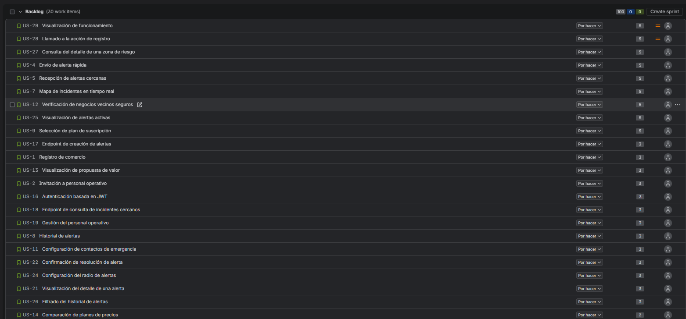
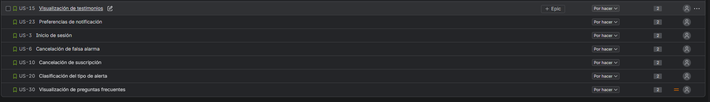

# Capítulo III: Especificación de Requisitos

## 3.1. Historias de Usuario

En esta sección se definen los requisitos funcionales del proyecto InstAlert utilizando Épicas e Historias de Usuario. Los criterios de aceptación están redactados siguiendo la estructura Gherkin (Dado-Cuando-Entonces), redactados en tiempo presente, tercera persona y sin referenciar elementos específicos de la interfaz gráfica, tal como establece rigurosamente la rúbrica.

Se han definido las siguientes Épicas:
- **EP01:** Gestión de Identidad y Cuentas de Comercios.
- **EP02:** Gestión de Alertas Comunitarias y Emergencias.
- **EP03:** Visualización y Mapa de Zonas de Riesgo.
- **EP04:** Gestión de Suscripciones y Pagos (SaaS).
- **EP05:** Red de Apoyo y Contactos de Confianza.
- **EP06:** Gestión de la Página de Aterrizaje.
- **EP07:** Características Técnicas y API RESTful.
- **EP08:** Configuración de Notificaciones y Preferencias.

| ID de Épica / Historia | Título | Descripción | Criterios de Aceptación | Relacionado con (ID de Épica) |
|---|---|---|---|---|
| **EP01** | **Gestión de Identidad y Cuentas de Comercios** | Agrupa funcionalidades de registro, autenticación y gestión del personal para los dueños de locales. | - | - |
| US01 | Registro de comercio | Como administrador de local, deseo registrar los datos de mi negocio, para crear la cuenta del comercio y habilitarla mediante una suscripción activa. | **Escenario 1: Registro exitoso con activación pendiente** _Dado_ que el visitante solicita crear una nueva cuenta de negocio _Cuando_ provee datos de registro y credenciales válidas _Entonces_ el sistema crea la cuenta del comercio con activación pendiente _Y_ no concede acceso a la aplicación hasta que se apruebe el pago de una suscripción.  **Escenario 2: Error por correo ya registrado** _Dado_ que el visitante solicita crear una cuenta _Cuando_ provee un correo electrónico que ya existe en la base de datos _Entonces_ el sistema rechaza el registro _Y_ muestra un mensaje indicando que el correo ya está en uso. | EP01 |
| US02 | Invitación a personal operativo | Como administrador de local, deseo invitar a mi personal operativo, para que puedan reportar incidentes desde sus propias cuentas vinculadas a mi tienda. | **Escenario 1: Invitación exitosa** _Dado_ que el administrador autenticado desea agregar un nuevo empleado _Cuando_ provee un correo electrónico válido del empleado _Entonces_ el sistema registra una invitación pendiente para el negocio _Y_ envía un correo de invitación al destinatario.  **Escenario 2: Error por correo inválido** _Dado_ que el administrador intenta enviar una invitación _Cuando_ provee un correo electrónico con formato incorrecto _Entonces_ el sistema rechaza la acción _Y_ solicita que ingrese un correo válido. | EP01 |
| US03 | Inicio de sesión | Como usuario con una cuenta activa y acceso habilitado, deseo iniciar sesión con mis credenciales, para acceder de forma segura a mi entorno de alertas y gestión. | **Escenario 1: Inicio de sesión exitoso** _Dado_ que el usuario posee una cuenta activa y una membresía habilitada en un negocio con suscripción activa _Cuando_ provee credenciales correctas _Entonces_ el sistema valida las credenciales _Y_ otorga acceso al panel principal.  **Escenario 2: Cuenta sin suscripción activa** _Dado_ que el usuario posee una cuenta o membresía, pero el negocio no tiene una suscripción activa _Cuando_ provee credenciales correctas _Entonces_ el sistema no concede acceso a la aplicación _Y_ informa que debe activarse una suscripción para habilitar el acceso.  **Escenario 3: Error por credenciales inválidas** _Dado_ que el usuario solicita autenticarse _Cuando_ provee una contraseña o correo incorrectos _Entonces_ el sistema rechaza la autenticación _Y_ muestra un mensaje de error.  **Escenario 4: Error por campos incompletos** _Dado_ que el usuario solicita autenticarse _Cuando_ deja el campo de correo o contraseña en blanco _Entonces_ el sistema previene el envío de la solicitud _Y_ requiere que complete todos los campos obligatorios. | EP01 |
| US19 | Aceptación de invitación de personal operativo | Como personal operativo invitado, deseo aceptar una invitación válida, para crear mi cuenta y acceder a la aplicación cuando el comercio tenga una suscripción activa. | **Escenario 1: Aceptación de invitación válida** _Dado_ que existe una invitación pendiente y vigente _Cuando_ el invitado proporciona datos válidos y acepta la invitación _Entonces_ el sistema crea o vincula la cuenta del usuario _Y_ registra una membresía activa en el negocio _Y_ actualiza el estado de la invitación a Accepted _Y_ habilita el acceso a la aplicación solo si el negocio tiene una suscripción activa.  **Escenario 2: Invitación inválida o expirada** _Dado_ que la invitación no es válida o se encuentra expirada _Cuando_ el invitado intenta aceptarla _Entonces_ el sistema rechaza la operación _Y_ no concede acceso ni crea una membresía activa. | EP01 |
| **EP02** | **Gestión de Alertas Comunitarias y Emergencias** | Agrupa funcionalidades de emisión, recepción y resolución de alertas de seguridad. | - | - |
| US04 | Activación de alerta de pánico con cuenta regresiva | Como personal operativo, deseo iniciar una alerta de pánico con una cuenta regresiva de confirmación, para evitar activaciones accidentales durante una situación de riesgo. | **Escenario 1: Activación confirmada de alerta de pánico** _Dado_ que el usuario autenticado enfrenta una amenaza de seguridad _Cuando_ inicia la acción de emergencia y la cuenta regresiva finaliza sin cancelación _Entonces_ el sistema registra una alerta activa con la marca de tiempo y geolocalización actual _Y_ inicia la notificación de emergencia a los usuarios elegibles dentro de la aplicación.  **Escenario 2: Cancelación durante la cuenta regresiva** _Dado_ que el usuario ha iniciado la cuenta regresiva de emergencia _Cuando_ cancela la acción antes de que finalice la cuenta regresiva _Entonces_ el sistema no crea una alerta de emergencia activa. | EP02 |
| US05 | Recepción de alertas cercanas | Como usuario con acceso activo a la aplicación, deseo recibir y visualizar alertas de emergencia cercanas a través de la aplicación, para poder tomar medidas preventivas como cerrar mi local. | **Escenario 1: Recepción de alerta por un usuario autorizado** _Dado_ que se genera una nueva alerta de emergencia y el usuario tiene una membresía activa asociada a un negocio con suscripción activa _Cuando_ la aplicación consulta las alertas dentro del radio configurado _Entonces_ la aplicación muestra únicamente las alertas cercanas correspondientes _Y_ presenta los detalles clave del incidente.  **Escenario 2: Usuario sin acceso habilitado** _Dado_ que se genera una nueva alerta de emergencia _Cuando_ el usuario no tiene una membresía activa asociada a un negocio con suscripción activa _Entonces_ el sistema no le permite recibir ni visualizar la alerta mediante la aplicación. | EP02 |
| US06 | Resolución de falsa alarma | Como usuario emisor, deseo registrar que una alerta fue una falsa alarma, para evitar pánico innecesario en la red vecinal. | **Escenario 1: Registrar una falsa alarma** _Dado_ que el usuario emitió previamente una alerta activa _Cuando_ solicita resolverla como falsa alarma _Entonces_ el sistema actualiza el estado de la alerta a Resolved _Y_ registra la razón de resolución como FalseAlarm _Y_ refleja la resolución para los usuarios autorizados de la aplicación. | EP02 |
| US20 | Clasificación del tipo de incidente en el reporte | Como personal operativo, deseo clasificar el tipo de incidente en el reporte (Robo, Intento de robo, Asalto u Otro), para documentar el motivo exacto del evento. | **Escenario 1: Clasificar correctamente un incidente** _Dado_ que el personal operativo está completando un reporte de incidente _Cuando_ selecciona un tipo de incidente entre Robo, Intento de robo, Asalto u Otro _Entonces_ el sistema asigna el tipo seleccionado al reporte _Y_ muestra dicha clasificación en el detalle de la alerta.  **Escenario 2: Seleccionar la opción "Otro"** _Dado_ que el tipo de incidente ocurrido no coincide con las categorías disponibles _Cuando_ el usuario selecciona Otro _Entonces_ el sistema permite utilizar esa clasificación _Y_ conserva la descripción ingresada por el usuario para complementar el reporte. | EP02 |
| US22 | Resolución de alerta por fin del peligro | Como personal operativo con una alerta activa, deseo registrar que el peligro terminó, para resolver la alerta y completar posteriormente el reporte del incidente. | **Escenario 1: Resolver una situación de pánico** _Dado_ que el personal operativo tiene una alerta de pánico activa _Y_ la situación de peligro ya ha terminado _Cuando_ confirma la finalización de la situación _Entonces_ el sistema cambia el estado de la alerta a Resolved _Y_ registra la razón de resolución como DangerEnded _Y_ mantiene o crea el reporte asociado con estado Pending.  **Escenario 2: Intentar resolver una alerta ya resuelta** _Dado_ que una alerta ya se encuentra en estado Resolved _Cuando_ el usuario intenta resolver nuevamente la misma situación _Entonces_ el sistema no genera una segunda resolución _Y_ mantiene el estado actual de la alerta. | EP02 |
| US25 | Visualización de alertas activas | Como usuario autorizado, deseo visualizar las alertas de emergencia activas, para estar informado de los peligros que aún no han sido resueltos. | **Escenario 1: Visualizar una alerta activa** _Dado_ que existe una alerta de emergencia con estado Active _Cuando_ el usuario autorizado consulta las alertas activas _Entonces_ el sistema muestra la alerta con estado Active _Y_ presenta su hora de activación y ubicación.  **Escenario 2: No existen alertas activas** _Dado_ que todas las alertas registradas tienen estado Resolved _Cuando_ el usuario autorizado consulta las alertas activas _Entonces_ el sistema no muestra registros activos _Y_ indica que no existen alertas activas. | EP02 |
| **EP03** | **Visualización y Mapa de Zonas de Riesgo** | Agrupa funcionalidades para explorar los incidentes recientes en un mapa y consultar el historial de seguridad. | - | - |
| US07 | Mapa de incidentes en tiempo real | Como administrador de local, deseo visualizar un mapa con los incidentes recientes en mi zona, para identificar patrones de riesgo y áreas inseguras. | **Escenario 1: Visualización de incidentes en el mapa** _Dado_ que el usuario solicita la vista del mapa de riesgos _Cuando_ el sistema recupera los incidentes recientes en la vecindad del usuario _Entonces_ muestra los incidentes geolocalizados en el mapa _Y_ categoriza el nivel de riesgo del área. | EP03 |
| US08 | Historial de alertas | Como administrador de local, deseo consultar un historial detallado de las alertas generadas por mi tienda, para llevar un registro de eventos de seguridad. | **Escenario 1: Acceso al historial de alertas** _Dado_ que el administrador solicita el historial de alertas _Cuando_ el sistema recupera las alertas pasadas asociadas al negocio _Entonces_ presenta una lista cronológica de los incidentes. | EP03 |
| US21 | Visualización del detalle de una alerta | Como usuario autorizado, deseo visualizar la información detallada de una alerta registrada en el historial, para conocer su ubicación, fecha, estado, tipo y descripción. | **Escenario 1: Consultar el detalle de una alerta** _Dado_ que el usuario autorizado consulta una alerta registrada _Cuando_ solicita el detalle de la alerta _Entonces_ el sistema presenta el tipo, fecha, hora, ubicación y estado de la alerta _Y_ muestra la descripción del incidente cuando se encuentra disponible.  **Escenario 2: Consultar una alerta con reporte pendiente** _Dado_ que existe una alerta con estado Resolved _Y_ el reporte asociado tiene estado Pending _Cuando_ el usuario autorizado consulta el detalle de la alerta _Entonces_ el sistema indica que el reporte se encuentra pendiente _Y_ informa que aún falta completar la información del incidente. | EP03 |
| US26 | Filtrado del historial de alertas | Como usuario autorizado, deseo filtrar el historial por fecha, tipo de incidente, estado de alerta o estado de reporte, para encontrar rápidamente eventos específicos. | **Escenario 1: Filtrar alertas por criterios** _Dado_ que existen múltiples alertas registradas _Cuando_ el usuario autorizado aplica filtros de fecha, tipo de incidente, estado de alerta o estado de reporte _Entonces_ el sistema muestra únicamente las alertas y reportes que coinciden con los criterios seleccionados.  **Escenario 2: Filtro sin resultados** _Dado_ que existen alertas registradas _Cuando_ el usuario autorizado aplica una combinación de filtros que no coincide con ningún registro _Entonces_ el sistema devuelve una lista vacía _Y_ informa que no se encontraron resultados para los filtros seleccionados. | EP03 |
| US27 | Consulta del detalle de una zona de riesgo | Como usuario, deseo seleccionar una zona de riesgo en el mapa para ver su nivel de peligrosidad e incidentes recientes, para tomar precauciones al transitar o gestionar mi negocio. | **Escenario 1: Consultar una zona de riesgo** _Dado_ que el usuario se encuentra visualizando el Mapa de Riesgo _Y_ existen zonas de riesgo identificadas en el mapa _Cuando_ selecciona una de las zonas _Entonces_ el sistema muestra el detalle de la zona _Y_ presenta su nivel de riesgo y la información disponible sobre incidentes registrados.  **Escenario 2: Zona sin incidentes recientes** _Dado_ que el usuario selecciona una zona del mapa _Y_ la zona no registra incidentes recientes _Cuando_ el sistema carga el detalle de la zona _Entonces_ muestra la información disponible de dicha zona _Y_ indica que no existen incidentes recientes registrados. | EP03 |
| **EP04** | **Gestión de Suscripciones y Pagos (SaaS)** | Agrupa funcionalidades de facturación, selección de planes y cancelaciones de suscripción. | - | - |
| US09 | Selección de plan de suscripción | Como administrador de local, deseo seleccionar y suscribirme a un plan de pago, para activar la cuenta y desbloquear las funcionalidades de la plataforma. | **Escenario 1: Suscripción a un plan de pago** _Dado_ que el administrador posee una cuenta con activación pendiente y elige un plan de suscripción _Cuando_ procesa un método de pago válido _Entonces_ el sistema activa la suscripción _Y_ habilita el acceso a la aplicación y a las funcionalidades incluidas en el plan.  **Escenario 2: Pago rechazado** _Dado_ que el administrador elige un plan de suscripción _Cuando_ el método de pago es rechazado _Entonces_ el sistema mantiene la cuenta con activación pendiente _Y_ no concede acceso a la aplicación. | EP04 |
| US10 | Cancelación de suscripción | Como administrador de local, deseo cancelar mi suscripción activa desde mi panel de configuración, para gestionar mis gastos directamente. | **Escenario 1: Cancelación de una suscripción activa** _Dado_ que el administrador posee una suscripción activa _Cuando_ solicita la cancelación de su suscripción _Entonces_ el sistema programa la cancelación para el final del ciclo de facturación _Y_ deshabilita el acceso a la aplicación cuando expire la suscripción, hasta que se active una nueva suscripción. | EP04 |
| **EP05** | **Red de Apoyo y Contactos de Confianza** | Agrupa funcionalidades para registrar y administrar contactos de emergencia asociados al usuario. | - | - |
| US11 | Gestión de contactos de emergencia | Como usuario, deseo registrar contactos de emergencia personales, para mantener disponible la información de personas de confianza asociadas a mi perfil. | **Escenario 1: Registro de contacto de emergencia** _Dado_ que el usuario proporciona los datos de un contacto de emergencia _Cuando_ los datos de contacto son válidos _Entonces_ el sistema guarda el contacto de emergencia _Y_ lo asocia con el perfil del usuario. | EP05 |
| US12 | Verificación de negocios vecinos seguros | Como administrador de local, deseo visualizar qué negocios vecinos pertenecen a la red de InstAlert, para fomentar la colaboración vecinal. | **Escenario 1: Visualización de negocios activos cercanos** _Dado_ que el administrador revisa la red vecinal _Cuando_ el sistema calcula los negocios registrados cercanos _Entonces_ muestra una lista de tiendas vecinas verificadas en la red. | EP05 |
| **EP08** | **Configuración de Notificaciones y Preferencias** | Agrupa funcionalidades relacionadas a las configuraciones de alertas y notificaciones personalizadas. | - | - |
| US23 | Preferencias de notificación | Como usuario, deseo activar o desactivar categorías de notificaciones en mi perfil, para recibir únicamente las alertas que considero relevantes para mí. | **Escenario 1: Modificar preferencias de notificación** _Dado_ que el usuario se encuentra en la configuración de su perfil _Cuando_ activa o desactiva una categoría de notificaciones _Y_ selecciona Guardar cambios _Entonces_ el sistema almacena las nuevas preferencias _Y_ muestra una confirmación de que los cambios fueron guardados.  **Escenario 2: Desactivar alertas preventivas** _Dado_ que el usuario recibe notificaciones de alertas preventivas _Cuando_ desactiva la opción Alertas preventivas _Entonces_ el sistema actualiza su configuración _Y_ deja de enviarle notificaciones correspondientes a ese tipo de alerta. | EP08 |
| US24 | Configuración del radio de alertas | Como usuario, deseo configurar el radio de distancia de mis alertas, para recibir notificaciones solo de incidentes que ocurran dentro de mi zona de interés. | **Escenario 1: Configurar un radio válido** _Dado_ que el usuario se encuentra en la configuración de su perfil _Cuando_ selecciona un radio permitido para recibir alertas cercanas _Y_ guarda los cambios _Entonces_ el sistema registra el nuevo radio _Y_ utiliza esa distancia para determinar qué alertas cercanas debe mostrar o notificar.  **Escenario 2: Cambiar el radio configurado** _Dado_ que el usuario ya tiene un radio de alertas configurado _Cuando_ selecciona una distancia diferente _Y_ guarda la configuración _Entonces_ el sistema reemplaza el radio anterior por el nuevo valor _Y_ aplica la nueva configuración a futuras alertas. | EP08 |
| **EP06** | **Gestión de la Página de Aterrizaje** | Agrupa historias enfocadas en los visitantes no autenticados que exploran la propuesta de valor comercial. | - | - |
| US13 | Visualización de propuesta de valor | Como visitante, deseo leer de forma clara cómo la aplicación protege a los negocios, para entender los beneficios antes de registrarme. | **Escenario 1: Exploración de la página principal (Landing)** _Dado_ que el visitante accede al Landing Page _Cuando_ la página carga exitosamente _Entonces_ el sistema muestra la propuesta de valor principal _Y_ presenta llamadas a la acción claras para el registro. | EP06 |
| US14 | Comparación de planes de precios | Como visitante, deseo visualizar una tabla comparativa de precios y características, para evaluar qué plan se adapta a las necesidades de mi negocio. | **Escenario 1: Comparación de planes de precios** _Dado_ que el visitante navega a la sección de precios _Cuando_ revisa los niveles de suscripción disponibles _Entonces_ el sistema muestra una comparación detallada de características y costos. | EP06 |
| US15 | Visualización de testimonios | Como visitante, deseo leer testimonios de comercios protegidos por la plataforma, para sentir mayor confianza en la efectividad del sistema. | **Escenario 1: Carga de casos de éxito** _Dado_ que el visitante explora la página principal _Cuando_ llega a la sección de testimonios _Entonces_ el sistema muestra las opiniones destacadas de clientes reales. | EP06 |
| US28 | Llamado a la acción de registro | Como visitante, deseo encontrar un botón de acción claro en la sección principal, para iniciar mi proceso de registro de comercio rápidamente. | **Escenario 1: Clic en botón de registro** _Dado_ que el visitante está en la sección de inicio (Hero) _Cuando_ hace clic en el botón de registro _Entonces_ el sistema lo redirige al formulario de creación de cuenta del sistema. | EP06 |
| US29 | Visualización de funcionamiento | Como visitante, deseo ver una sección explicativa de cómo opera la red de alertas, para comprender la dinámica comunitaria de la aplicación. | **Escenario 1: Lectura de cómo funciona** _Dado_ que el visitante navega por el contenido _Cuando_ llega a la sección 'Cómo Funciona' _Entonces_ el sistema muestra los pasos del proceso de alerta de forma visual. | EP06 |
| US30 | Visualización de preguntas frecuentes | Como visitante, deseo visualizar una sección de preguntas frecuentes, para resolver mis dudas de forma rápida sin contactar a soporte. | **Escenario 1: Consulta de preguntas frecuentes** _Dado_ que el visitante navega por la página principal _Cuando_ llega a la sección de preguntas frecuentes (FAQ) _Entonces_ el sistema muestra una lista de dudas comunes con sus respectivas respuestas. | EP06 |
| **EP07** | **Características Técnicas y API RESTful** | Agrupa las historias técnicas y de backend necesarias para que los desarrolladores integren las plataformas. | - | - |
| US16 | Autenticación basada en JWT | Como Desarrollador, deseo implementar autenticación JWT en los endpoints, para asegurar que solo usuarios autorizados realicen operaciones críticas. | **Escenario 1: Protección de endpoints con JWT** _Dado_ que la API recibe una solicitud a un endpoint protegido _Cuando_ la solicitud incluye un JWT válido en el encabezado de Autorización _Entonces_ el sistema autentica la solicitud exitosamente _Y_ procesa la operación solicitada.  **Escenario 2: Rechazo por JWT inválido o expirado** _Dado_ que la API recibe una solicitud a un endpoint protegido _Cuando_ la solicitud incluye un JWT inválido, manipulado o expirado _Entonces_ el sistema rechaza la solicitud _Y_ retorna un código HTTP 401 Unauthorized. | EP07 |
| US17 | Endpoint de creación de alertas | Como Desarrollador, deseo implementar un endpoint POST para registrar una alerta, para procesar y almacenar las alertas enviadas por las aplicaciones cliente. | **Escenario 1: Procesamiento del payload de una alerta** _Dado_ que la aplicación cliente envía una petición de creación de alerta _Cuando_ el payload contiene coordenadas válidas y un AlertKind válido (Panic, Preventive o Historical) _Entonces_ el sistema almacena una alerta con estado Active _Y_ retorna un código HTTP 201 Created. | EP07 |
| US18 | Endpoint de consulta de incidentes cercanos | Como Desarrollador, deseo implementar un endpoint GET que retorne incidentes cercanos, para alimentar el mapa de riesgos en la aplicación cliente. | **Escenario 1: Recuperación de incidentes cercanos** _Dado_ que la aplicación cliente solicita los incidentes dentro de un área geográfica _Cuando_ el sistema consulta la base de datos buscando coincidencias _Entonces_ retorna una lista JSON de los incidentes encontrados _Y_ retorna un código HTTP 200 OK. | EP07 |
## 3.2. Mapeo de Impacto

El Mapeo de Impacto ha sido elaborado de manera colaborativa utilizando la herramienta **UXpressia**, estructurado en los niveles de Objetivos de Negocio, Arquetipos, Impactos, Entregables y sus correspondientes Historias de Usuario, alineados a los segmentos de administradores de locales y personal operativo de InstAlert.

A continuación, se presenta la vista panorámica del modelo completo:

  
   <em>Figura 1: Vista panorámica del Mapeo de Impacto en UXpressia</em>

## 3.3. Pila de Producto

A continuación se presenta la Pila de Producto del proyecto InstAlert, priorizado estrictamente en función del valor entregado al negocio. Siguiendo las directrices del marco de trabajo ágil, las Historias de Usuario relacionadas al sitio web estático (Página de Aterrizaje) y la funcionalidad principal del producto se han considerado en la prioridad más alta, desplazando a posiciones posteriores las tareas de soporte técnico como el registro y la autenticación.

Para la estimación del esfuerzo se ha utilizado la secuencia de Fibonacci (1, 2, 3, 5, 8). La gestión de la Pila de Producto se lleva a cabo mediante la herramienta **Jira Software**.

  
    
  
   <em>Figura 2: Captura de la Pila de Producto priorizada por valor de negocio</em>

| # Orden | ID de Historia | Título | Descripción | Puntos de Historia (1 / 2 / 3 / 5 / 8) |
|---|---|---|---|---|
| 1 | US27 | Consulta del detalle de una zona de riesgo | Como usuario, deseo seleccionar una zona de riesgo en el mapa para ver su nivel de peligrosidad e incidentes recientes, para tomar precauciones al transitar o gestionar mi negocio. | 5 |
| 2 | US04 | Activación de alerta de pánico con cuenta regresiva | Como personal operativo, deseo iniciar una alerta de pánico con una cuenta regresiva de confirmación, para evitar activaciones accidentales durante una situación de riesgo. | 5 |
| 3 | US05 | Recepción de alertas cercanas | Como usuario con acceso activo a la aplicación, deseo recibir y visualizar alertas de emergencia cercanas a través de la aplicación, para poder tomar medidas preventivas como cerrar mi local. | 5 |
| 4 | US07 | Mapa de incidentes en tiempo real | Como administrador de local, deseo visualizar un mapa con los incidentes recientes en mi zona, para identificar patrones de riesgo y áreas inseguras. | 5 |
| 5 | US12 | Verificación de negocios vecinos seguros | Como administrador de local, deseo visualizar qué negocios vecinos pertenecen a la red de InstAlert, para fomentar la colaboración vecinal. | 5 |
| 6 | US25 | Visualización de alertas activas | Como usuario autorizado, deseo visualizar las alertas de emergencia activas, para estar informado de los peligros que aún no han sido resueltos. | 5 |
| 7 | US09 | Selección de plan de suscripción | Como administrador de local, deseo seleccionar y suscribirme a un plan de pago, para activar la cuenta y desbloquear las funcionalidades de la plataforma. | 5 |
| 8 | US17 | Endpoint de creación de alertas | Como Desarrollador, deseo implementar un endpoint POST para registrar una alerta, para procesar y almacenar las alertas enviadas por las aplicaciones cliente. | 3 |
| 9 | US01 | Registro de comercio | Como administrador de local, deseo registrar los datos de mi negocio, para crear la cuenta del comercio y habilitarla mediante una suscripción activa. | 3 |
| 10 | US13 | Visualización de propuesta de valor | Como visitante, deseo leer de forma clara cómo la aplicación protege a los negocios, para entender los beneficios antes de registrarme. | 3 |
| 11 | US02 | Invitación a personal operativo | Como administrador de local, deseo invitar a mi personal operativo, para que puedan reportar incidentes desde sus propias cuentas vinculadas a mi tienda. | 3 |
| 12 | US16 | Autenticación basada en JWT | Como Desarrollador, deseo implementar autenticación JWT en los endpoints, para asegurar que solo usuarios autorizados realicen operaciones críticas. | 3 |
| 13 | US18 | Endpoint de consulta de incidentes cercanos | Como Desarrollador, deseo implementar un endpoint GET que retorne incidentes cercanos, para alimentar el mapa de riesgos en la aplicación cliente. | 3 |
| 14 | US19 | Aceptación de invitación de personal operativo | Como personal operativo invitado, deseo aceptar una invitación válida, para crear mi cuenta y acceder a la aplicación cuando el comercio tenga una suscripción activa. | 3 |
| 15 | US08 | Historial de alertas | Como administrador de local, deseo consultar un historial detallado de las alertas generadas por mi tienda, para llevar un registro de eventos de seguridad. | 3 |
| 16 | US11 | Gestión de contactos de emergencia | Como usuario, deseo registrar contactos de emergencia personales, para mantener disponible la información de personas de confianza asociadas a mi perfil. | 3 |
| 17 | US22 | Resolución de alerta por fin del peligro | Como personal operativo con una alerta activa, deseo registrar que el peligro terminó, para resolver la alerta y completar posteriormente el reporte del incidente. | 3 |
| 18 | US24 | Configuración del radio de alertas | Como usuario, deseo configurar el radio de distancia de mis alertas, para recibir notificaciones solo de incidentes que ocurran dentro de mi zona de interés. | 3 |
| 19 | US21 | Visualización del detalle de una alerta | Como usuario autorizado, deseo visualizar la información detallada de una alerta registrada en el historial, para conocer su ubicación, fecha, estado, tipo y descripción. | 3 |
| 20 | US26 | Filtrado del historial de alertas | Como usuario autorizado, deseo filtrar el historial por fecha, tipo de incidente, estado de alerta o estado de reporte, para encontrar rápidamente eventos específicos. | 3 |
| 21 | US14 | Comparación de planes de precios | Como visitante, deseo visualizar una tabla comparativa de precios y características, para evaluar qué plan se adapta a las necesidades de mi negocio. | 2 |
| 22 | US15 | Visualización de testimonios | Como visitante, deseo leer testimonios de comercios protegidos por la plataforma, para sentir mayor confianza en la efectividad del sistema. | 2 |
| 23 | US23 | Preferencias de notificación | Como usuario, deseo activar o desactivar categorías de notificaciones en mi perfil, para recibir únicamente las alertas que considero relevantes para mí. | 2 |
| 24 | US03 | Inicio de sesión | Como usuario con una cuenta activa y acceso habilitado, deseo iniciar sesión con mis credenciales, para acceder de forma segura a mi entorno de alertas y gestión. | 2 |
| 25 | US06 | Resolución de falsa alarma | Como usuario emisor, deseo registrar que una alerta fue una falsa alarma, para evitar pánico innecesario en la red vecinal. | 2 |
| 26 | US10 | Cancelación de suscripción | Como administrador de local, deseo cancelar mi suscripción activa desde mi panel de configuración, para gestionar mis gastos directamente. | 2 |
| 27 | US20 | Clasificación del tipo de incidente en el reporte | Como personal operativo, deseo clasificar el tipo de incidente en el reporte (Robo, Intento de robo, Asalto u Otro), para documentar el motivo exacto del evento. | 2 |
| 28 | US28 | Llamado a la acción de registro | Como visitante, deseo encontrar un botón de acción claro en la sección principal, para iniciar mi proceso de registro de comercio rápidamente. | 2 |
| 29 | US29 | Visualización de funcionamiento | Como visitante, deseo ver una sección explicativa de cómo opera la red de alertas, para comprender la dinámica comunitaria de la aplicación. | 2 |
| 30 | US30 | Visualización de preguntas frecuentes | Como visitante, deseo visualizar una sección de preguntas frecuentes, para resolver mis dudas de forma rápida sin contactar a soporte. | 2 |
