# Capítulo IV: Product Design

## 4.1. Style Guidelines

Las Style Guidelines de InstAlert definen los criterios que orientan la construcción visual de la plataforma y permiten mantener una experiencia consistente entre sus diferentes interfaces. Debido a que el sistema está dirigido a propietarios, administradores y trabajadores de establecimientos comerciales que necesitan acceder rápidamente a información relacionada con situaciones de riesgo, las decisiones de diseño se enfocan en facilitar la comprensión y ejecución de acciones en el menor tiempo posible. Por ello, los elementos de la interfaz presentan una jerarquía visual clara que permite diferenciar la información, las acciones y los estados relevantes para el usuario.
La guía establece criterios para los principales elementos gráficos y funcionales empleados en el producto, como la tipografía, los colores, la iconografía, los botones, el espaciado, los componentes y los estados de interacción. Estos lineamientos permiten que las funcionalidades de InstAlert mantengan una misma lógica visual y facilitan el reconocimiento de elementos asociados a alertas, incidentes y acciones preventivas.
Asimismo, las Style Guidelines sirven como referencia para el equipo durante las etapas de diseño y desarrollo, orientando la incorporación de nuevas interfaces y componentes de acuerdo con los criterios visuales establecidos para InstAlert.

### 4.1.1. General Style Guidelines

Los General Style Guidelines establecen las características visuales utilizadas en InstAlert. En este apartado se presentan las definiciones correspondientes a la tipografía, colores y componentes principales de la plataforma.

  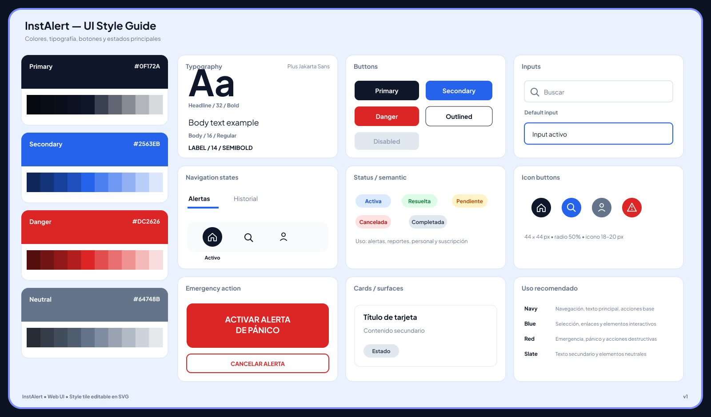 
  Nota: Guía visual utilizada como referencia para la definición de los elementos de la interfaz.

 

**4.1.1.1. Tipografía**

La tipografía de InstAlert ha sido seleccionada considerando la necesidad de presentar información de manera clara y rápida dentro de la plataforma. Debido a que los usuarios pueden consultar alertas, reportes y acciones relacionadas con situaciones de riesgo, se establece una jerarquía tipográfica que facilita la lectura y permite diferenciar los distintos niveles de información presentes en la interfaz.

* Tipografía principal:
Se utiliza Plus Jakarta Sans como familia tipográfica principal de la interfaz. Su aplicación permite mantener una apariencia moderna y ordenada, facilitando la lectura de los contenidos y manteniendo una identidad visual uniforme en los diferentes componentes de la plataforma.

* Headline:
Para los títulos y encabezados principales se establece un tamaño de 32 px con peso Bold. Esta configuración permite generar una jerarquía visual marcada y facilita la identificación de las secciones principales de la interfaz.

* Body:
Para el contenido general se utiliza un tamaño de 16 px con peso Regular. Este estilo está destinado a textos informativos y contenido secundario, proporcionando una lectura cómoda y diferenciándose visualmente de los encabezados.

* Label:
Las etiquetas y textos que requieren mayor énfasis utilizan un tamaño de 14 px con peso Semibold. Este nivel tipográfico permite destacar información breve asociada a botones, estados, categorías y otros componentes de la interfaz.

**4.1.1.2. Colores**

La paleta de colores de InstAlert está compuesta por cuatro colores principales: Primary, Secondary, Danger y Neutral, cada uno definido con una tonalidad base y sus respectivas variaciones. Esta clasificación permite mantener una diferenciación visual entre los distintos elementos de la interfaz.

* Primary (#0F172A): corresponde al color principal de la plataforma y se utiliza en elementos de navegación, textos principales y acciones base.

* Secondary (#2563EB): se emplea en elementos interactivos, selecciones y enlaces, permitiendo destacar acciones dentro de la interfaz.

* Danger (#DC2626): representa situaciones de emergencia, alertas y acciones que requieren especial atención.

* Neutral (#64748B): se utiliza en textos secundarios y elementos neutrales de la interfaz.

La combinación de estas tonalidades permite establecer una jerarquía visual coherente y diferenciar las funciones principales de la plataforma.

**4.1.1.3. Botones**

Los botones de InstAlert presentan diferentes variantes según la función que desempeñan dentro de la plataforma. Se han definido cinco tipos: Primary, Secondary, Danger, Outlined y Disabled, permitiendo diferenciar las acciones principales, secundarias, de riesgo y aquellas que no se encuentran disponibles.

* Primary: utilizado para las acciones principales.

* Secondary: empleado para acciones secundarias o complementarias.

* Danger: destinado a acciones relacionadas con situaciones de riesgo o emergencia.

* Outlined: utilizado para acciones alternativas con menor énfasis visual.

* Disabled: representa acciones que no se encuentran disponibles para el usuario.

La diferenciación entre estas variantes permite identificar con mayor facilidad el tipo de acción asociado a cada botón.

**4.1.1.4. Inputs**

Los inputs permiten al usuario ingresar o consultar información dentro de la plataforma. En el Style Guide se establecen diferentes estados para estos componentes, considerando su apariencia y distribución dentro de la interfaz.

* Default: corresponde al estado inicial del campo.

* Active: indica que el campo se encuentra seleccionado y listo para la interacción.

* Search: permite realizar búsquedas mediante un campo acompañado de un ícono.

La distribución y separación de estos elementos se mantiene organizada para facilitar la identificación y el uso de los campos.

**4.1.1.5. Estados de navegación**

Los estados de navegación permiten diferenciar las opciones disponibles y la sección en la que se encuentra el usuario. En el Style Guide se presentan los estados Active e Inactive para los elementos de navegación, aplicados a opciones como Alertas e Historial.

* Active: identifica la sección actualmente seleccionada.

* Inactive: corresponde a las opciones disponibles que no se encuentran seleccionadas.

La disposición de los elementos mantiene una separación adecuada para facilitar la navegación y reconocer rápidamente la sección activa.

**4.1.1.6. Estados semánticos**

Los estados semánticos permiten representar la situación de los elementos gestionados dentro de InstAlert. La guía establece los estados Activa, Resuelta, Pendiente, Cancelada y Completada, diferenciados mediante los colores definidos para cada situación.

Estos estados permiten reconocer de forma rápida la condición de una alerta, reporte o acción dentro de la plataforma.

**4.1.1.7. Icon Buttons**

Los Icon Buttons corresponden a botones representados mediante iconos para facilitar el acceso a determinadas acciones. En el Style Guide se establece un tamaño de 44 × 44 px, un radio del 50 % y un tamaño de icono de aproximadamente 18–20 px.

Entre los iconos definidos se encuentran Inicio, Búsqueda, Perfil y Alerta. Su tamaño y distribución permiten mantener una interacción clara y ordenada dentro de la interfaz.

**4.1.1.8. Acción de emergencia**

La acción de emergencia corresponde a la funcionalidad destinada a activar o cancelar una alerta de pánico. El Style Guide contempla las acciones “ACTIVAR ALERTA DE PÁNICO” y “CANCELAR ALERTA”.

La diferenciación visual de estas acciones permite reconocerlas rápidamente y mantener una separación adecuada respecto a otros elementos de la interfaz.

**4.1.1.9. Cards / Surfaces**

Las Cards / Surfaces permiten organizar información dentro de contenedores visuales. Su estructura considera elementos como título, contenido secundario y estado, manteniendo una distribución ordenada entre ellos.

La separación de los contenidos dentro de las tarjetas facilita su lectura y permite presentar la información de manera organizada.

### 4.1.2. Web Style Guidelines

Las Web Style Guidelines de InstAlert establecen criterios para la organización y comportamiento de los elementos dentro de la plataforma web. El diseño considera una distribución clara de los componentes y un enfoque responsive, permitiendo adaptar la interfaz a diferentes tamaños de pantalla sin perder funcionalidad ni claridad.

## 4.2. Information Architecture

### 4.2.1. Organization Systems

La arquitectura de información de InstAlert organiza el contenido y las funcionalidades de la plataforma de acuerdo con las necesidades de sus usuarios. Se busca que tanto los administradores como el personal operativo puedan acceder de manera sencilla a las principales funciones, mientras que el landing page presenta la información del producto de forma estructurada para facilitar su comprensión.

   
  Nota: Diagrama de organización de información de las aplicaciones

   
  Nota: Diagrama de organización de información de las aplicaciones

### 4.2.2. Labeling Systems

El sistema de etiquetado de InstAlert utiliza nombres breves, directos y relacionados con la función que representan, facilitando que los usuarios puedan identificar rápidamente cada sección. En la aplicación se emplean etiquetas como “Inicio”, “Mapa de incidentes”, “Alertas”, “Personal”, “Perfil” y “Suscripción”, además de opciones específicas como “Mapa de calor”, “Historial de incidencias”, “Tabla de control” y “Botón de pánico”.

Para el landing page se utilizan etiquetas orientadas a la información y navegación, como “Inicio”, “Funciones”, “Planes” y “Sobre Nosotros”, complementadas con acciones como “Ingresar / Registrar” y “Elegir Plan”. De esta manera, las etiquetas mantienen una relación directa con el contenido o acción que representan y facilitan la navegación dentro de cada experiencia.

   
  Nota. Labeling de las aplicaciones.

   
  Nota. Labeling del landing page.

**Acceso al diagrama de la Arquitectura de Información (Miro):** 
https://miro.com/app/board/uXjVHpZMLZ4=/?share_link_id=378532050437 

### 4.2.3. SEO Tags and Meta Tags

Para el Landing Page de InstAlert se plantea una estructura de etiquetas orientada a facilitar su identificación en motores de búsqueda y comunicar de manera directa la propuesta de la plataforma. El Title y la Meta Description deberán relacionarse con la seguridad de establecimientos comerciales, las alertas y la prevención de incidentes. Asimismo, se considerarán términos asociados a las principales funcionalidades del producto, como alertas, botón de pánico, mapa de riesgo y seguridad de negocios. Esta configuración permitirá presentar el contenido del Landing Page de forma clara y relacionada con los servicios ofrecidos por InstAlert.

### 4.2.4. Searching Systems

El sistema de búsqueda de InstAlert se encuentra relacionado principalmente con la consulta de información sobre incidentes y zonas de riesgo. Para facilitar la localización de información relevante, se consideran criterios asociados al contenido mostrado en el mapa y al historial de incidencias.

| **FILTRO**            | **DESCRIPCIÓN**                                                                |
| :-------------------- | :----------------------------------------------------------------------------- |
| **Tipo de incidente** | Permite identificar los incidentes según su categoría dentro de la plataforma. |
| **Fecha**             | Permite consultar los incidentes registrados en un período determinado.        |
| **Ubicación**         | Permite consultar los incidentes según la zona en la que fueron registrados.   |
| **Intensidad**        | Permite diferenciar el nivel de riesgo representado en el mapa de calor.       |

Nota: La tabla muestra los criterios considerados para la consulta de información relacionada con incidentes y zonas de riesgo.

### 4.2.5. Navigation Systems

4.2.5. Navigation Systems

La arquitectura de navegación de InstAlert se organiza según las principales funcionalidades de la plataforma y el tipo de usuario. En el Landing Page se presentan las secciones destinadas a mostrar información del producto, mientras que en la aplicación se distribuyen las funciones relacionadas con la gestión de seguridad.

Para el Landing Page, se definieron las siguientes secciones:

| **NOMBRE**         | **DESCRIPCIÓN**                                                         |
| :----------------- | :---------------------------------------------------------------------- |
| **Inicio**         | Presenta la información principal del producto y su propuesta de valor. |
| **Funciones**      | Muestra las principales funcionalidades ofrecidas por InstAlert.        |
| **Planes**         | Presenta las opciones de suscripción disponibles.                       |
| **Sobre Nosotros** | Contiene información relacionada con el equipo o proyecto InstAlert.    |

Nota: La tabla muestra los apartados de navegación definidos para el Landing Page de InstAlert.

Para la aplicación web, la navegación se organiza a partir del dashboard y de las funciones disponibles para los usuarios:

| **NOMBRE**         | **DESCRIPCIÓN**                                                       |
| :----------------- | :-------------------------------------------------------------------- |
| **Inicio**         | Permite acceder a la pantalla principal del dashboard.                |
| **Mapa de riesgo** | Permite consultar la información de riesgo mediante el mapa de calor. |
| **Alertas**        | Permite acceder a las alertas y acciones relacionadas con incidentes. |
| **Personal**       | Permite consultar la información del personal del negocio.            |
| **Más**            | Agrupa opciones adicionales como suscripción y perfil de negocio.     |

Nota: La tabla muestra los apartados principales de navegación de la aplicación web de InstAlert.

## 4.3. Landing Page UI Design

### 4.3.1. Landing Page Wireframe

El diseño del wireframe de la Landing Page de InstAlert se estructura de manera jerárquica, priorizando la presentación de la propuesta de valor y el acceso a las principales funcionalidades de la plataforma. La estructura busca facilitar la comprensión del producto y guiar al usuario hacia las acciones principales.

**1. Encabezado (Header)**

Presenta el logotipo de InstAlert, las opciones principales de navegación, el selector de idioma y los botones de acceso y registro. El encabezado se mantiene visible durante el desplazamiento para facilitar el acceso a las diferentes secciones de la página.

  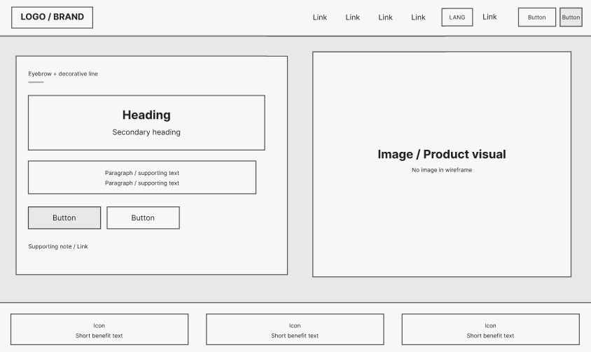 
  Nota: Wireframe del encabezado de la Landing Page de InstAlert.

**2. Hero Section**

Es la primera sección visual de la landing y presenta la propuesta principal de InstAlert mediante un título, una breve descripción y botones de acción. El contenido se acompaña de un espacio destinado al recurso visual principal del producto.

   
  Nota: Wireframe de la sección principal (Hero Section) de InstAlert.

**3. Beneficios y presentación del producto**

Esta sección resume los principales beneficios de la plataforma y posteriormente presenta información sobre InstAlert, acompañada de un recurso multimedia destinado a explicar el funcionamiento o propósito del producto.

  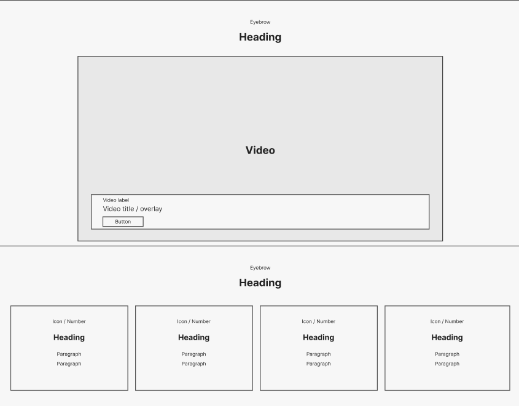 
  Nota: Wireframe de la sección de beneficios y presentación del producto.

**4. Principios y solución de InstAlert**

Se presentan los principales principios de la plataforma y una sección orientada a explicar la solución propuesta. La información se complementa con un espacio visual destinado a representar el funcionamiento del sistema y sus funcionalidades relacionadas con la seguridad.

  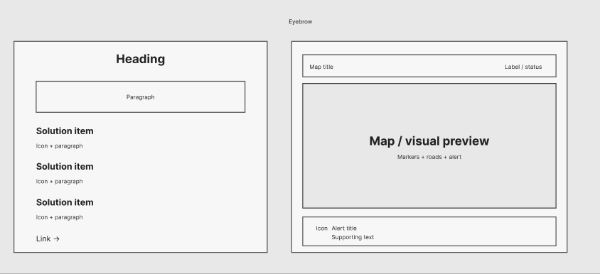 
  Nota: Wireframe de la sección de principios y solución de InstAlert.

**5. Planes y precios**

La sección de planes presenta las diferentes opciones disponibles para el usuario mediante tarjetas comparativas. Cada tarjeta contiene el nombre del plan, descripción, precio, características principales y un botón de acción para seleccionar la opción correspondiente.

  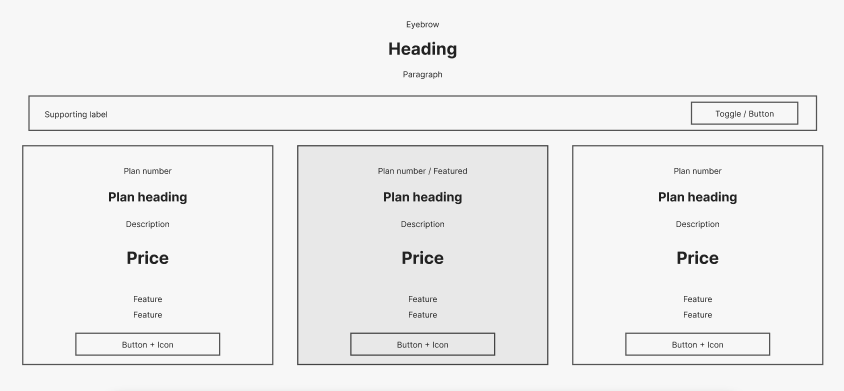 
  Nota: Wireframe de la sección de planes y precios.

**6. Equipo de trabajo**

Se presenta al equipo responsable del desarrollo de InstAlert mediante tarjetas individuales con un espacio reservado para la fotografía de cada integrante, su nombre y rol. La sección también incorpora un espacio para contenido audiovisual relacionado con el equipo.

  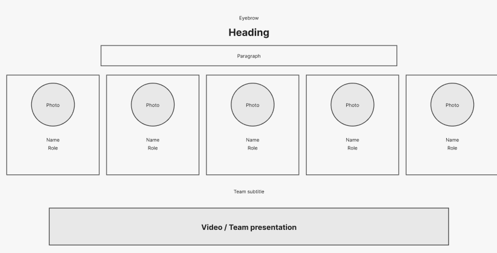 
  Nota: Wireframe de la sección del equipo de InstAlert.

**7. Llamado a la acción y Footer**

Finalmente, la landing incorpora un llamado a la acción que refuerza la propuesta de InstAlert y dirige al usuario hacia la acción principal. El footer contiene la información complementaria y enlaces de navegación del sitio.

  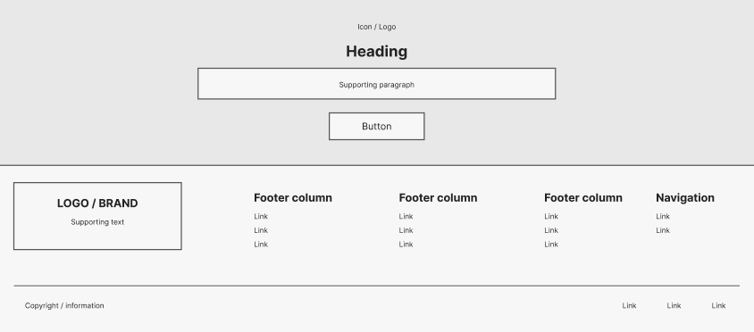 
  Nota: Wireframe del llamado a la acción y pie de página de InstAlert.

### 4.3.2. Landing Page Mock-up

Los mock-ups de la Landing Page de InstAlert representan la propuesta visual final de la plataforma, aplicando los lineamientos definidos en el Style Guidelines. La interfaz mantiene una estructura clara y consistente, priorizando la presentación de la información, las funcionalidades principales y los accesos de interacción.

**1. Encabezado y Hero Section**

Aquí se muestra el encabezado de la Landing Page junto con la sección principal. El encabezado contiene el logotipo, las opciones de navegación, el selector de idioma, el acceso a inicio de sesión y el botón principal de acción. En el Hero Section se presenta la propuesta de valor de InstAlert, acompañada de un espacio visual destinado a representar el producto.

  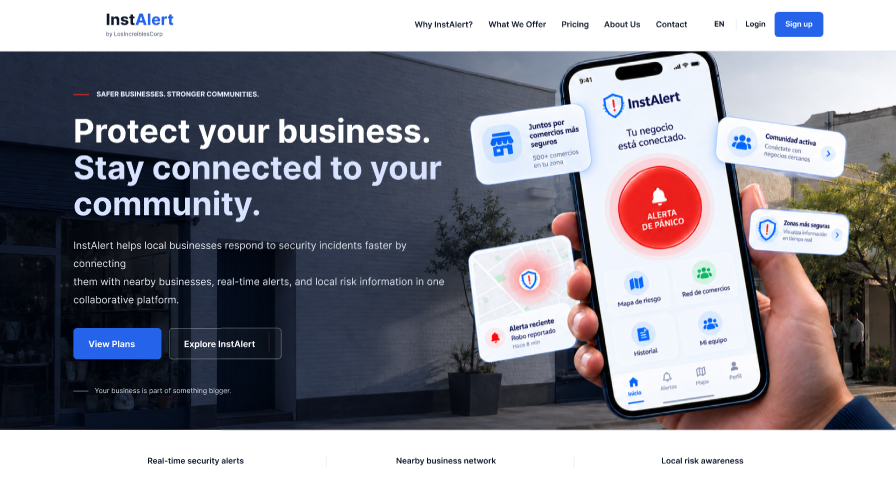 
  Nota: Mock-up del encabezado y Hero Section de la Landing Page de InstAlert

**2. Beneficios principales**

La sección presenta los principales beneficios de InstAlert mediante tres elementos visuales, permitiendo comunicar de manera rápida las características que diferencian la propuesta de la plataforma.

   
  Nota: Mock-up de los beneficios principales de InstAlert

**3. Sobre InstAlert y principios de la plataforma**

Esta sección presenta información relacionada con la propuesta de InstAlert y sus principales principios, utilizando bloques diferenciados para facilitar la lectura y comprensión del contenido.

   
  Nota: Mock-up de la sección informativa y principios de InstAlert

**4. Plataforma y mapa**

La sección muestra una representación de la plataforma mediante un espacio visual destinado al mapa, acompañado de información sobre las soluciones y funcionalidades principales de InstAlert. Esta distribución permite relacionar la información presentada con la visualización de incidentes y zonas de riesgo.

  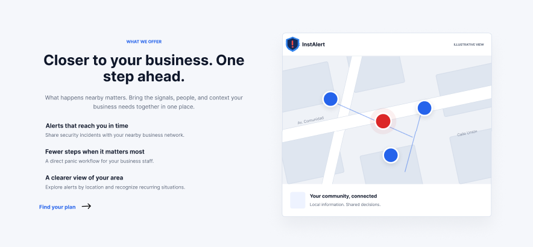 
  Nota: Mock-up de la sección de plataforma y visualización del mapa

**5. Planes**

La sección presenta los diferentes planes disponibles mediante tarjetas comparativas. Cada tarjeta contiene el nombre del plan, su descripción, precio, características principales y un botón de acción, permitiendo al usuario comparar las alternativas disponibles.

  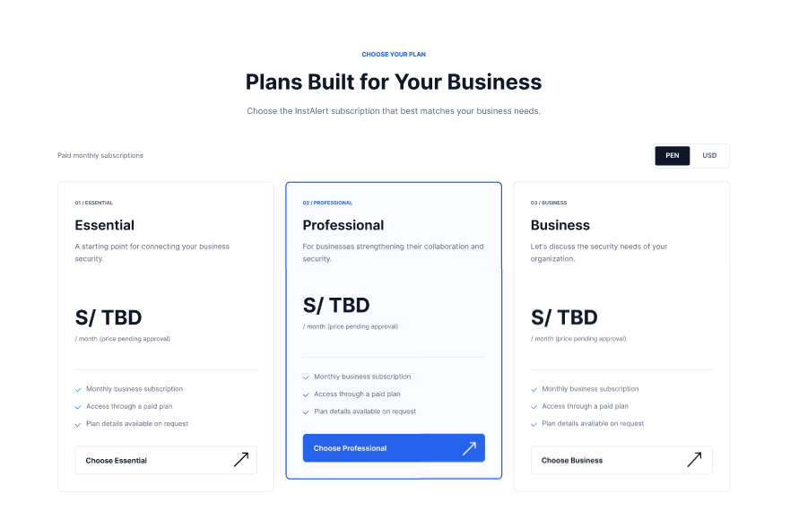 
  Nota: Mock-up de la sección de planes de InstAlert

**6. Equipo**

La sección presenta a los integrantes del equipo mediante tarjetas individuales que incluyen su representación visual, nombre y rol dentro del proyecto. También incorpora un espacio destinado a presentar contenido audiovisual relacionado con el equipo.

   
  Nota: Mock-up de la sección del equipo de InstAlert

**7. Llamado a la acción y Footer**

Finalmente, se presenta un llamado a la acción que dirige al usuario hacia el siguiente paso dentro de la plataforma. El Footer contiene el logotipo, enlaces de navegación, información complementaria y los datos correspondientes al proyecto.

  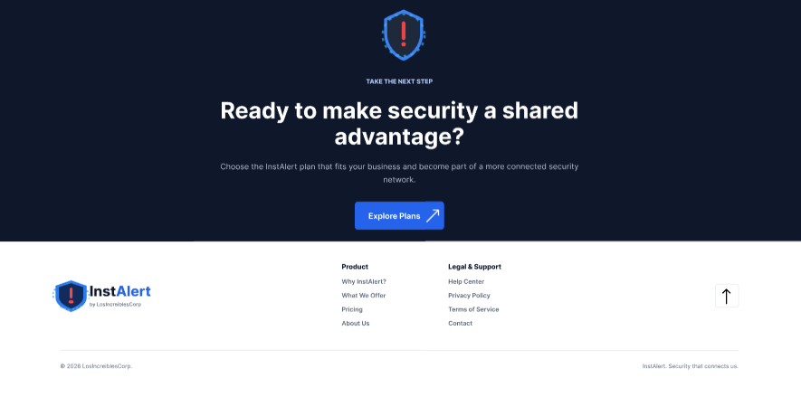 
  Nota: Mock-up del llamado a la acción y pie de página de InstAlert

## 4.4. Web Applications UX/UI Design

En esta sección se presenta la propuesta de diseño UX/UI de la aplicación web de InstAlert, describiendo la estructura visual, los elementos de interfaz y los patrones de interacción que orientan la experiencia del usuario.

El diseño está enfocado en facilitar el acceso a las principales funcionalidades de seguridad, priorizando una interacción clara, rápida y consistente. Asimismo, se mantiene la coherencia con los Style Guidelines y la Information Architecture, garantizando una experiencia intuitiva y organizada en las diferentes interfaces de la plataforma.

### 4.4.1. Web Applications Wireframes

En esta sección se presentan los wireframes de alta fidelidad baja/media para la plataforma web de InstAlert, diseñada específicamente para los roles de Personal Operativo y Administrador de locales comerciales. La propuesta visual y funcional responde directamente a estándares de usabilidad web, estructuración de datos y accesibilidad.

   
  Nota: Wireframe del Login Inicial

   
  Nota: Wireframe del Login — Estados de Error 1

  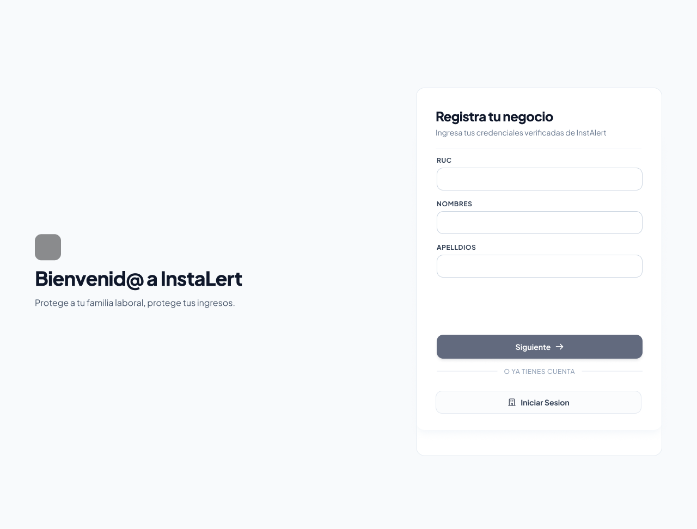 
  Nota: Wireframe del Registro de negocio 1

  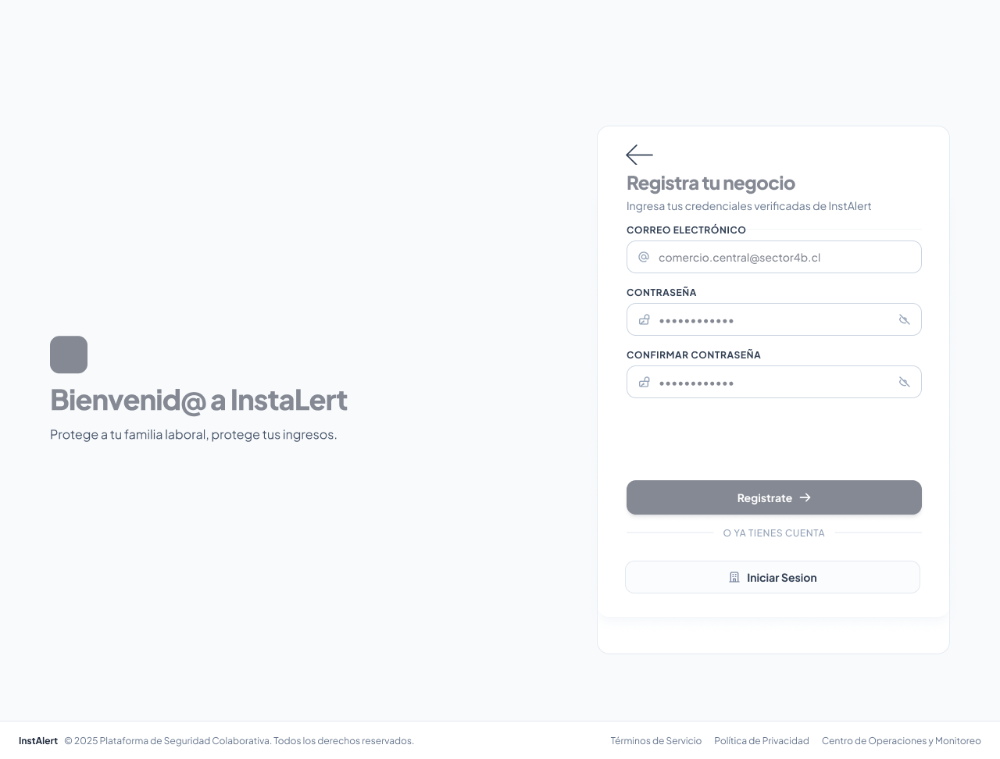 
  Nota: Wireframe del Registro de negocio 2  

  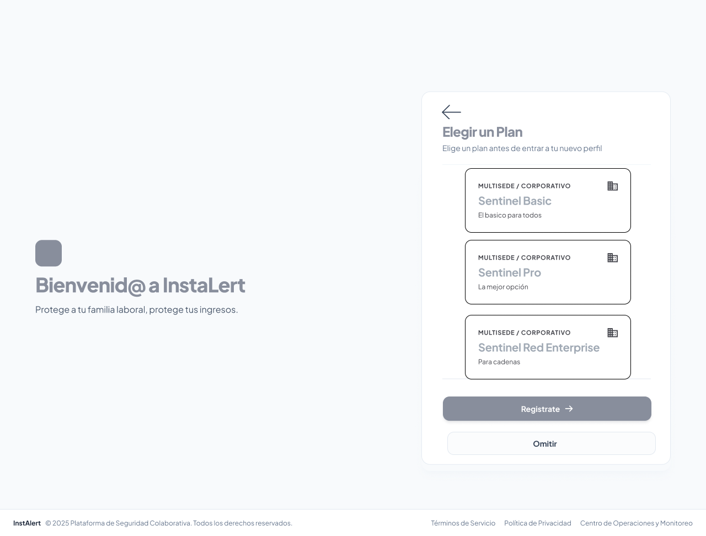 
  Nota: Wireframe de seleccionar un plan de suscripción

   
  Nota: Wireframe del Dashboard Operativo   

   
  Nota: Wireframe del Mapa de Riesgo — Vista Base  

   
  Nota: Wireframe del Mapa de Riesgo — Negocio Seleccionado   

   
  Nota: Wireframe del Mapa de Riesgo — Zona de Riesgo Seleccionada  

   
  Nota: Wireframe de Alertas Operativas  

   
  Nota: Wireframe de Alerta de Pánico — Cuenta Regresiva   

   
  Nota: Wireframe de Alerta de Pánico — Estado Activo   

   
  Nota: Wireframe de Completar Reporte de Emergencia  

   
  Nota: Wireframe de Reportar Actividad Sospechosa   

   
  Nota: Wireframe de Otro Tipo de Alerta   

   
  Nota: Wireframe del Historial Operativo de Alertas   

   
  Nota: Wireframe del Perfil de Usuario Operativo   

   
  Nota: Wireframe del Dashboard del Administrador   

   
  Nota:  Wireframe de Alertas del Comercio (Administración) 

   
  Nota: Wireframe de Gestión de Personal (Administración)   

   
  Nota: Wireframe de Gestión de Suscripción (Administración)   

   
  Nota: Wireframe del Mapa de Riesgo para Administrador — Vista Base  

   
  Nota: Wireframe del Mapa de Riesgo para Administrador — Negocio Seleccionado  

   
  Nota: Wireframe del Mapa de Riesgo para Administrador — Zona de Riesgo Seleccionada  

   
  Nota: Wireframe del Historial de Alertas para Administrador  

### 4.4.2. Web Applications Wireflow Diagrams

**Segmento 1: Administradores de locales comerciales**

* User Goal: Como administrador de local, quiero registrar los datos de mi negocio, para acceder a la plataforma y administrar la seguridad de mi local.

Task Flow:

 
 
  Nota: Diagrama de Task Flow para el registro de un nuevo comercio en la plataforma 

Wireflow:

 
 
  Nota: Diagrama de Wireflow del proceso de registro de comercio, desde el login hasta el acceso al Dashboard 

Descripción del flujo:
El proceso inicia cuando un visitante decide registrar su negocio en InstAlert desde la pantalla de login. Al seleccionar la opción de registro, el sistema solicita los datos formales del comercio (RUC, nombres y apellidos del responsable) y valida que el correo electrónico ingresado no esté previamente asociado a otra cuenta. Si la validación es exitosa, el usuario avanza a la selección de un plan de suscripción entre las opciones disponibles, y al confirmar, el sistema crea la cuenta y otorga acceso inmediato al Dashboard del Administrador, quedando listo para comenzar a gestionar la seguridad de su local.

* User Goal: Como administrador de local, quiero visualizar un mapa con los incidentes recientes en mi zona, para identificar patrones de riesgo y áreas inseguras.

Task Flow:

 
 
  Nota: Diagrama de Task Flow para la consulta del mapa de riesgo del administrador 

Wireflow:

 
 
  Nota: Diagrama de Wireflow de la consulta del mapa de riesgo, desde el Dashboard hasta el detalle de zona 

Descripción del flujo:
Desde el Dashboard principal, el administrador accede al mapa de riesgo mediante la acción operativa directa "Ir al Mapa de Riesgo". El sistema despliega la vista base con los incidentes recientes geolocalizados en su zona. A partir de ahí, el usuario puede profundizar de dos formas: seleccionando un negocio específico para ver su información, o seleccionando una zona marcada con mayor nivel de riesgo para consultar el detalle de los incidentes registrados ahí. Esta información permite al administrador anticiparse a patrones de riesgo y ajustar decisiones operativas, como reforzar la seguridad en horarios o zonas específicas.

* User Goal: Como administrador de local, quiero consultar un historial detallado de las alertas generadas por mi tienda, para llevar un registro de eventos de seguridad.

Task Flow:

 
 
  Nota: Diagrama de Task Flow para la consulta del historial de alertas del administrador 

Wireflow:

 
 
  Nota: Diagrama de Wireflow del historial de alertas para el administrador 

Descripción del flujo:
El administrador accede al historial de alertas desde el Dashboard para llevar un registro de eventos de seguridad de su negocio. El sistema presenta la lista completa de incidentes en orden cronológico, con la posibilidad de aplicar filtros por fecha, tipo de incidente o estado (Activa, Resuelta, Reporte pendiente) para localizar rápidamente eventos específicos. Al seleccionar una alerta puntual, el usuario accede al detalle completo, incluyendo ubicación, hora, estado y evidencias asociadas cuando estén disponibles.

* User Goal: Como administrador de local, quiero seleccionar y suscribirme a un plan de pago, para desbloquear funcionalidades premium de la plataforma.

Task Flow:

 
 
  Nota: Diagrama de Task Flow para la selección y gestión del plan de suscripción 

Wireflow:

 
 
  Nota: Diagrama de Wireflow de la gestión de suscripción del administrador 

Descripción del flujo:
Desde el panel de configuración, el administrador accede a la sección de gestión de suscripción para revisar los planes disponibles (Sentinel Basic, Pro o Red Enterprise). Tras seleccionar el plan que mejor se adapta a las necesidades de su negocio, el sistema solicita un método de pago válido; si el pago se procesa correctamente, la suscripción premium se activa de inmediato, habilitando funcionalidades avanzadas como el monitoreo multi-sede o soporte prioritario, según el nivel contratado.

* User Goal: Como administrador de local, quiero agregar personal operativo a la plataforma usando su correo electrónico, para que puedan utilizar la aplicación y gestionar las alertas del comercio.

Task Flow:

 
 
  Nota: Diagrama de Task Flow para la gestión de personal operativo 

Wireflow:

 
 
  Nota: Diagrama de Wireflow de la gestión de personal operativo del administrador 

Descripción del flujo:
El administrador accede a la sección "Personal" desde su Dashboard para agregar a un nuevo colaborador. Al ingresar el correo electrónico del empleado, el sistema valida que dicho correo no esté ya asociado a otro miembro del mismo comercio; de ser así, rechaza la operación e indica el conflicto. Si la validación es correcta, el sistema registra la invitación y la muestra con el estado "Invitación pendiente" hasta que el empleado acepte y cree su propia cuenta vinculada al negocio.

**Segmento 2: Personal Operativo**

* User Goal: Como personal operativo, quiero activar el botón de pánico web de manera inmediata y gestionar la red de apoyo para solicitar auxilio ante un peligro inminente en mi ubicación, y coordinar la ayuda necesaria.

Task Flow:

 
 
  Nota: Diagrama de Task Flow para la activación del botón de pánico y gestión de la red de apoyo 

Wireflow:

 
 
  Nota: Diagrama de Wireflow del proceso de activación del botón de pánico y seguimiento de la emergencia 

Descripción del flujo:
Para gestionar una situación de emergencia crítica, el usuario accede a la funcionalidad principal de la aplicación web donde encuentra el botón de pánico diseñado para una activación inmediata. Al presionarlo, el sistema despliega una cuenta regresiva breve como mecanismo de confirmación, evitando activaciones accidentales. Una vez confirmada la alerta, el sistema captura automáticamente la ubicación en tiempo real y dispara notificaciones de auxilio de forma simultánea a la red de apoyo previamente configurada, que incluye contactos de confianza, comercios vecinos y autoridades locales. Tras el despliegue de la señal de socorro, la interfaz permite al usuario monitorear el estado de la respuesta y gestionar su círculo de ayuda, manteniendo un canal de comunicación abierto para actualizaciones sobre el incidente.

* User Goal: Como personal operativo, quiero clasificar el tipo de alerta (Robo, Intento de robo, Asalto u Otro) al crear un reporte, para que quede documentado el motivo exacto del incidente.

Task Flow:

 
 
  Nota: Diagrama de Task Flow para la clasificación del tipo de alerta 

Wireflow:

 
 
  Nota: Diagrama de Wireflow de clasificación del tipo de alerta 

Descripción del flujo:
Al completar el reporte de un incidente, el usuario selecciona la categoría que mejor describe lo ocurrido entre las opciones predefinidas: Robo, Intento de robo, Asalto u Otro. Si ninguna categoría se ajusta al incidente, el usuario selecciona "Otro" y el sistema habilita un campo de descripción libre para documentar el motivo exacto. Esta clasificación queda registrada y visible en el detalle de la alerta, permitiendo un análisis posterior más preciso de los patrones delictivos en la zona.

* User Goal: Como usuario, quiero recibir notificaciones en tiempo real cuando se reporte un incidente cerca, para poder tomar medidas preventivas como cerrar mi local.

Task Flow:

 
 
  Nota: Diagrama de Task Flow para la recepción de alertas cercanas 

Wireflow:

 
 
  Nota: Diagrama de Wireflow de recepción de alertas cercanas 

Descripción del flujo:
 Al abrir alertas, el operador de la tienda accede a los detalles clave del incidente: tipo de amenaza, distancia aproximada y hora del suceso, información suficiente para decidir una acción preventiva inmediata, como cerrar temporalmente su local o extremar precauciones.

* User Goal: Como operador, quiero poder cancelar una alerta en caso de falsa alarma, para evitar pánico innecesario en la red vecinal.

Task Flow:

 
 
  Nota: Diagrama de Task Flow para la cancelación de una falsa alarma 

Wireflow:

 
 
  Nota: Diagrama de Wireflow de cancelación de falsa alarma 

Descripción del flujo:
Si el usuario que activó una alerta determina que se trató de una falsa alarma, puede cancelarla directamente desde la pantalla de "Situación de Pánico Activa" sin necesidad de esperar a que se resuelva como un incidente real. Tras confirmar la cancelación, el sistema actualiza el estado de la alerta a "resuelta" y notifica a la red vecinal que la emergencia ha sido descartada, evitando que otros negocios mantengan un estado de alerta innecesario.

### 4.4.3. Web Applications Mock-ups

Esta sección reúne la interfaz gráfica de alta fidelidad para la aplicación web de InstAlert, diseñada para ofrecer una experiencia intuitiva, accesible y de alta respuesta visual tanto para el personal operativo de primera línea como para la administración general.

   
  Nota: Mockup de Iniciar Sesión

   
  Nota: Mockup de Iniciar Sesión — Error de Credenciales

   
  Nota: Mockup de Registro de Negocio — Paso 1

   
  Nota: Mockup de Registro de Negocio — Elección de Plan

   
  Nota: Mockup de Registro de Negocio — Datos de Empresa

   
  Nota: Mockup del Dashboard Operativo

   
  Nota: Mockup del Mapa de Riesgo Táctico — Vista General

   
  Nota: Mockup del Mapa de Riesgo Táctico — Vista Simplificada

   
  Nota: Mockup del Mapa de Riesgo Táctico — Detalle de Incidente

   
  Nota: Mockup del Mapa de Riesgo Táctico — Vista Administrador General

   
  Nota: Mockup del Mapa de Riesgo Táctico — Comercio Seleccionado

   
  Nota: Mockup del Mapa de Riesgo Táctico — Detalle Narrativo

   
  Nota: Mockup de Alertas Operativas

   
  Nota: Mockup de Selección de Alertas para Administrador

   
  Nota: Mockup de Completar Reporte de Emergencia

   
  Nota: Mockup de Cuenta Regresiva de Emergencia

   
  Nota: Mockup del Dashboard Administrador

   
  Nota: Mockup de Gestión de Personal

   
  Nota: Mockup de Gestión de Suscripción y Facturación

   
  Nota: Mockup del Historial de Alertas y Eventos

   
  Nota: Mockup del Historial de Alertas — Vista Administrador

   
  Nota: Mockup de Reporte de Incidencia o Riesgo — Otro Tipo de Alerta

   
  Nota: Mockup del Perfil de Usuario y Ajustes Operativos

   
  Nota: Mockup de Reportar Actividad Sospechosa

   
  Nota: Mockup de Situación de Pánico Activa

### 4.4.4. Web Applications User Flow Diagrams

**Segmento 1: Administradores de locales comerciales**

* User Goal: Como administrador de local, quiero registrar los datos de mi negocio, para acceder a la plataforma y administrar la seguridad de mi local.

Wireflow:

 
 
  Nota: Diagrama de Wireflow del proceso de registro de comercio, desde el login hasta el acceso al Dashboard 

* User Goal: Como administrador de local, quiero visualizar un mapa con los incidentes recientes en mi zona, para identificar patrones de riesgo y áreas inseguras.

Wireflow:

 
 
  Nota: Diagrama de Wireflow de la consulta del mapa de riesgo, desde el Dashboard hasta el detalle de zona 

* User Goal: Como administrador de local, quiero consultar un historial detallado de las alertas generadas por mi tienda, para llevar un registro de eventos de seguridad.

Wireflow:

 
 
  Nota: Diagrama de Wireflow del historial de alertas para el administrador 

* User Goal: Como administrador de local, quiero seleccionar y suscribirme a un plan de pago, para desbloquear funcionalidades premium de la plataforma.

Wireflow:

 
 
  Nota: Diagrama de Wireflow de la gestión de suscripción del administrador 

* User Goal: Como administrador de local, quiero agregar personal operativo a la plataforma usando su correo electrónico, para que puedan utilizar la aplicación y gestionar las alertas del comercio.

Wireflow:

 
 
  Nota: Diagrama de Wireflow de la gestión de personal operativo del administrador 

**Segmento 2: Personal Operativo**

* User Goal: Como personal operativo, quiero activar el botón de pánico web de manera inmediata y gestionar la red de apoyo para solicitar auxilio ante un peligro inminente en mi ubicación, y coordinar la ayuda necesaria.

Wireflow:

 
 
  Nota: Diagrama de Wireflow del proceso de activación del botón de pánico y seguimiento de la emergencia 

* User Goal: Como personal operativo, quiero clasificar el tipo de alerta (Robo, Intento de robo, Asalto u Otro) al crear un reporte, para que quede documentado el motivo exacto del incidente.

Wireflow:

 
 
  Nota: Diagrama de Wireflow de clasificación del tipo de alerta 

* User Goal: Como usuario, quiero recibir notificaciones en tiempo real cuando se reporte un incidente cerca, para poder tomar medidas preventivas como cerrar mi local.

Wireflow:

 
 
  Nota: Diagrama de Wireflow de recepción de alertas cercanas 

* User Goal: Como operador, quiero poder cancelar una alerta en caso de falsa alarma, para evitar pánico innecesario en la red vecinal.

Wireflow:

 
 
  Nota: Diagrama de Wireflow de cancelación de falsa alarma 

## 4.5. Web Applications Prototyping

## 4.6. Domain-Driven Software Architecture

### 4.6.1. Design-Level EventStorming

### 4.6.2. Software Architecture Context Diagram

### 4.6.3. Software Architecture Container Diagrams

### 4.6.4. Software Architecture Components Diagrams

## 4.7. Software Object-Oriented Design

### 4.7.1. Class Diagrams

## 4.8. Database Design

### 4.8.1. Database Diagrams