# Capítulo IV: Product Design

## 4.1. Style Guidelines

Las Style Guidelines de InstAlert definen los criterios que orientan la construcción visual de la plataforma y permiten mantener una experiencia consistente entre sus diferentes interfaces. Debido a que el sistema está dirigido a propietarios, administradores y trabajadores de establecimientos comerciales que necesitan acceder rápidamente a información relacionada con situaciones de riesgo, las decisiones de diseño se enfocan en facilitar la comprensión y ejecución de acciones en el menor tiempo posible. Por ello, los elementos de la interfaz presentan una jerarquía visual clara que permite diferenciar la información, las acciones y los estados relevantes para el usuario.
La guía establece criterios para los principales elementos gráficos y funcionales empleados en el producto, como la tipografía, los colores, la iconografía, los botones, el espaciado, los componentes y los estados de interacción. Estos lineamientos permiten que las funcionalidades de InstAlert mantengan una misma lógica visual y facilitan el reconocimiento de elementos asociados a alertas, incidentes y acciones preventivas.
Asimismo, las Style Guidelines sirven como referencia para el equipo durante las etapas de diseño y desarrollo, orientando la incorporación de nuevas interfaces y componentes de acuerdo con los criterios visuales establecidos para InstAlert.

### 4.1.1. General Style Guidelines

Los General Style Guidelines establecen las características visuales utilizadas en InstAlert. En este apartado se presentan las definiciones correspondientes a la tipografía, colores y componentes principales de la plataforma.

   
  Nota: Guía visual utilizada como referencia para la definición de los elementos de la interfaz.

 

**4.1.1.1. Tipografía**

La tipografía de InstAlert ha sido seleccionada considerando la necesidad de presentar información de manera clara y rápida dentro de la plataforma. Debido a que los usuarios pueden consultar alertas, reportes y acciones relacionadas con situaciones de riesgo, se establece una jerarquía tipográfica que facilita la lectura y permite diferenciar los distintos niveles de información presentes en la interfaz.

* Tipografía principal:
Se utiliza Plus Jakarta Sans como familia tipográfica principal de la interfaz. Su aplicación permite mantener una apariencia moderna y ordenada, facilitando la lectura de los contenidos y manteniendo una identidad visual uniforme en los diferentes componentes de la plataforma.

* Headline:
Para los títulos y encabezados principales se establece un tamaño de 32 px con peso Bold. Esta configuración permite generar una jerarquía visual marcada y facilita la identificación de las secciones principales de la interfaz.

* Body:
Para el contenido general se utiliza un tamaño de 16 px con peso Regular. Este estilo está destinado a textos informativos y contenido secundario, proporcionando una lectura cómoda y diferenciándose visualmente de los encabezados.

* Label:
Las etiquetas y textos que requieren mayor énfasis utilizan un tamaño de 14 px con peso Semibold. Este nivel tipográfico permite destacar información breve asociada a botones, estados, categorías y otros componentes de la interfaz.

**4.1.1.2. Colores**

La paleta de colores de InstAlert está compuesta por cuatro colores principales: Primary, Secondary, Danger y Neutral, cada uno definido con una tonalidad base y sus respectivas variaciones. Esta clasificación permite mantener una diferenciación visual entre los distintos elementos de la interfaz.

* Primary (#0F172A): corresponde al color principal de la plataforma y se utiliza en elementos de navegación, textos principales y acciones base.

* Secondary (#2563EB): se emplea en elementos interactivos, selecciones y enlaces, permitiendo destacar acciones dentro de la interfaz.

* Danger (#DC2626): representa situaciones de emergencia, alertas y acciones que requieren especial atención.

* Neutral (#64748B): se utiliza en textos secundarios y elementos neutrales de la interfaz.

La combinación de estas tonalidades permite establecer una jerarquía visual coherente y diferenciar las funciones principales de la plataforma.

**4.1.1.3. Botones**

Los botones de InstAlert presentan diferentes variantes según la función que desempeñan dentro de la plataforma. Se han definido cinco tipos: Primary, Secondary, Danger, Outlined y Disabled, permitiendo diferenciar las acciones principales, secundarias, de riesgo y aquellas que no se encuentran disponibles.

* Primary: utilizado para las acciones principales.

* Secondary: empleado para acciones secundarias o complementarias.

* Danger: destinado a acciones relacionadas con situaciones de riesgo o emergencia.

* Outlined: utilizado para acciones alternativas con menor énfasis visual.

* Disabled: representa acciones que no se encuentran disponibles para el usuario.

La diferenciación entre estas variantes permite identificar con mayor facilidad el tipo de acción asociado a cada botón.

**4.1.1.4. Inputs**

Los inputs permiten al usuario ingresar o consultar información dentro de la plataforma. En el Style Guide se establecen diferentes estados para estos componentes, considerando su apariencia y distribución dentro de la interfaz.

* Default: corresponde al estado inicial del campo.

* Active: indica que el campo se encuentra seleccionado y listo para la interacción.

* Search: permite realizar búsquedas mediante un campo acompañado de un ícono.

La distribución y separación de estos elementos se mantiene organizada para facilitar la identificación y el uso de los campos.

**4.1.1.5. Estados de navegación**

Los estados de navegación permiten diferenciar las opciones disponibles y la sección en la que se encuentra el usuario. En el Style Guide se presentan los estados Active e Inactive para los elementos de navegación, aplicados a opciones como Alertas e Historial.

* Active: identifica la sección actualmente seleccionada.

* Inactive: corresponde a las opciones disponibles que no se encuentran seleccionadas.

La disposición de los elementos mantiene una separación adecuada para facilitar la navegación y reconocer rápidamente la sección activa.

**4.1.1.6. Estados semánticos**

Los estados semánticos permiten representar la situación de los elementos gestionados dentro de InstAlert. La guía establece los estados Activa, Resuelta, Pendiente, Cancelada y Completada, diferenciados mediante los colores definidos para cada situación.

Estos estados permiten reconocer de forma rápida la condición de una alerta, reporte o acción dentro de la plataforma.

**4.1.1.7. Icon Buttons**

Los Icon Buttons corresponden a botones representados mediante iconos para facilitar el acceso a determinadas acciones. En el Style Guide se establece un tamaño de 44 × 44 px, un radio del 50 % y un tamaño de icono de aproximadamente 18–20 px.

Entre los iconos definidos se encuentran Inicio, Búsqueda, Perfil y Alerta. Su tamaño y distribución permiten mantener una interacción clara y ordenada dentro de la interfaz.

**4.1.1.8. Acción de emergencia**

La acción de emergencia corresponde a la funcionalidad destinada a activar o cancelar una alerta de pánico. El Style Guide contempla las acciones “ACTIVAR ALERTA DE PÁNICO” y “CANCELAR ALERTA”.

La diferenciación visual de estas acciones permite reconocerlas rápidamente y mantener una separación adecuada respecto a otros elementos de la interfaz.

**4.1.1.9. Cards / Surfaces**

Las Cards / Surfaces permiten organizar información dentro de contenedores visuales. Su estructura considera elementos como título, contenido secundario y estado, manteniendo una distribución ordenada entre ellos.

La separación de los contenidos dentro de las tarjetas facilita su lectura y permite presentar la información de manera organizada.

### 4.1.2. Web Style Guidelines

Las Web Style Guidelines de InstAlert establecen criterios para la organización y comportamiento de los elementos dentro de la plataforma web. El diseño considera una distribución clara de los componentes y un enfoque responsive, permitiendo adaptar la interfaz a diferentes tamaños de pantalla sin perder funcionalidad ni claridad.

## 4.2. Information Architecture

### 4.2.1. Organization Systems

La arquitectura de información de InstAlert organiza el contenido y las funcionalidades de la plataforma de acuerdo con las necesidades de sus usuarios. Se busca que tanto los administradores como el personal operativo puedan acceder de manera sencilla a las principales funciones, mientras que el landing page presenta la información del producto de forma estructurada para facilitar su comprensión.

   
  Nota: Diagrama de organización de información de las aplicaciones

   
  Nota: Diagrama de organización de la pagina de aterrizaje

### 4.2.2. Labeling Systems

El sistema de etiquetado de InstAlert utiliza nombres breves, directos y relacionados con la función que representan, facilitando que los usuarios puedan identificar rápidamente cada sección. En la aplicación se emplean etiquetas como “Inicio”, “Mapa de incidentes”, “Alertas”, “Personal”, “Perfil” y “Suscripción”, además de opciones específicas como “Mapa de calor”, “Historial de incidencias”, “Tabla de control” y “Botón de pánico”.

Para el landing page se utilizan etiquetas orientadas a la información y navegación, como “Inicio”, “Funciones”, “Planes” y “Sobre Nosotros”, complementadas con acciones como “Ingresar / Registrar” y “Elegir Plan”. De esta manera, las etiquetas mantienen una relación directa con el contenido o acción que representan y facilitan la navegación dentro de cada experiencia.

   
  Nota. Labeling de las aplicaciones.

   
  Nota. Labeling del landing page.

**Acceso al diagrama de la Arquitectura de Información (Miro):** 
https://miro.com/app/board/uXjVHpZMLZ4=/?share_link_id=378532050437 

### 4.2.3. SEO Tags and Meta Tags

Para el Landing Page de InstAlert se plantea una estructura de etiquetas orientada a facilitar su identificación en motores de búsqueda y comunicar de manera directa la propuesta de la plataforma. El Title y la Meta Description deberán relacionarse con la seguridad de establecimientos comerciales, las alertas y la prevención de incidentes. Asimismo, se considerarán términos asociados a las principales funcionalidades del producto, como alertas, botón de pánico, mapa de riesgo y seguridad de negocios. Esta configuración permitirá presentar el contenido del Landing Page de forma clara y relacionada con los servicios ofrecidos por InstAlert.

### 4.2.4. Searching Systems

El sistema de búsqueda de InstAlert se encuentra relacionado principalmente con la consulta de información sobre incidentes y zonas de riesgo. Para facilitar la localización de información relevante, se consideran criterios asociados al contenido mostrado en el mapa y al historial de incidencias.

| **FILTRO**            | **DESCRIPCIÓN**                                                                |
| :-------------------- | :----------------------------------------------------------------------------- |
| **Tipo de incidente** | Permite identificar los incidentes según su categoría dentro de la plataforma. |
| **Fecha**             | Permite consultar los incidentes registrados en un período determinado.        |
| **Ubicación**         | Permite consultar los incidentes según la zona en la que fueron registrados.   |
| **Intensidad**        | Permite diferenciar el nivel de riesgo representado en el mapa de calor.       |

Nota: La tabla muestra los criterios considerados para la consulta de información relacionada con incidentes y zonas de riesgo.

### 4.2.5. Navigation Systems

La arquitectura de navegación de InstAlert se organiza según las principales funcionalidades de la plataforma y el tipo de usuario. En el Landing Page se presentan las secciones destinadas a mostrar información del producto, mientras que en la aplicación se distribuyen las funciones relacionadas con la gestión de seguridad.

Para el Landing Page, se definieron las siguientes secciones:

| **NOMBRE**         | **DESCRIPCIÓN**                                                         |
| :----------------- | :---------------------------------------------------------------------- |
| **Inicio**         | Presenta la información principal del producto y su propuesta de valor. |
| **Funciones**      | Muestra las principales funcionalidades ofrecidas por InstAlert.        |
| **Planes**         | Presenta las opciones de suscripción disponibles.                       |
| **Sobre Nosotros** | Contiene información relacionada con el equipo o proyecto InstAlert.    |

Nota: La tabla muestra los apartados de navegación definidos para el Landing Page de InstAlert.

Para la aplicación web, la navegación se organiza a partir del dashboard y de las funciones disponibles para los usuarios:

| **NOMBRE**         | **DESCRIPCIÓN**                                                       |
| :----------------- | :-------------------------------------------------------------------- |
| **Inicio**         | Permite acceder a la pantalla principal del dashboard.                |
| **Mapa de riesgo** | Permite consultar la información de riesgo mediante el mapa de calor. |
| **Alertas**        | Permite acceder a las alertas y acciones relacionadas con incidentes. |
| **Personal**       | Permite consultar la información del personal del negocio.            |
| **Más**            | Agrupa opciones adicionales como suscripción y perfil de negocio.     |

Nota: La tabla muestra los apartados principales de navegación de la aplicación web de InstAlert.

## 4.3. Landing Page UI Design

### 4.3.1. Landing Page Wireframe

El diseño del wireframe de la Landing Page de InstAlert se estructura de manera jerárquica, priorizando la presentación de la propuesta de valor y el acceso a las principales funcionalidades de la plataforma. La estructura busca facilitar la comprensión del producto y guiar al usuario hacia las acciones principales.

**1. Encabezado (Header)**

Presenta el logotipo de InstAlert, las opciones principales de navegación, el selector de idioma y los botones de acceso y registro. El encabezado se mantiene visible durante el desplazamiento para facilitar el acceso a las diferentes secciones de la página.

  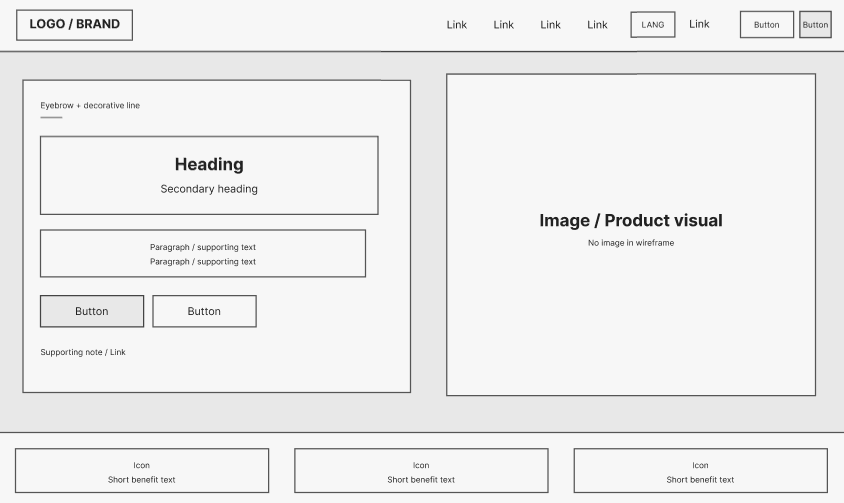 
  Nota: Wireframe del encabezado de la Landing Page de InstAlert.

**2. Hero Section**

Es la primera sección visual de la landing y presenta la propuesta principal de InstAlert mediante un título, una breve descripción y botones de acción. El contenido se acompaña de un espacio destinado al recurso visual principal del producto.

   
  Nota: Wireframe de la sección principal (Hero Section) de InstAlert.

**3. Beneficios y presentación del producto**

Esta sección resume los principales beneficios de la plataforma y posteriormente presenta información sobre InstAlert, acompañada de un recurso multimedia destinado a explicar el funcionamiento o propósito del producto.

  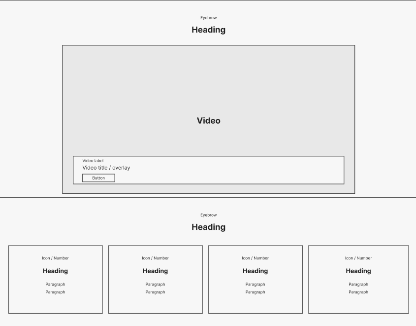 
  Nota: Wireframe de la sección de beneficios y presentación del producto.

**4. Principios y solución de InstAlert**

Se presentan los principales principios de la plataforma y una sección orientada a explicar la solución propuesta. La información se complementa con un espacio visual destinado a representar el funcionamiento del sistema y sus funcionalidades relacionadas con la seguridad.

  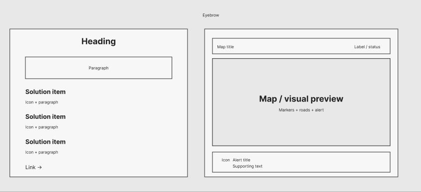 
  Nota: Wireframe de la sección de principios y solución de InstAlert.

**5. Planes y precios**

La sección de planes presenta las diferentes opciones disponibles para el usuario mediante tarjetas comparativas. Cada tarjeta contiene el nombre del plan, descripción, precio, características principales y un botón de acción para seleccionar la opción correspondiente.

  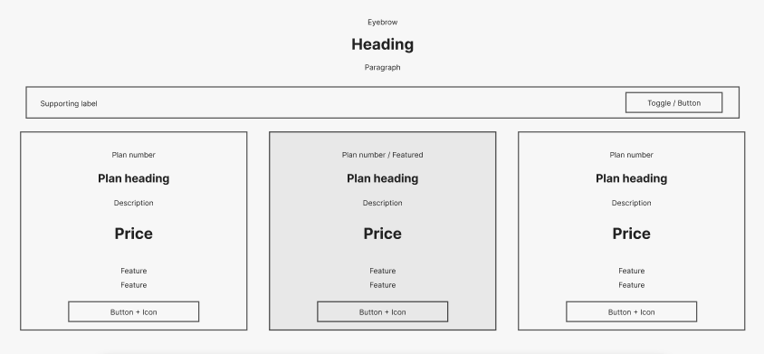 
  Nota: Wireframe de la sección de planes y precios.

**6. Equipo de trabajo**

Se presenta al equipo responsable del desarrollo de InstAlert mediante tarjetas individuales con un espacio reservado para la fotografía de cada integrante, su nombre y rol. La sección también incorpora un espacio para contenido audiovisual relacionado con el equipo.

  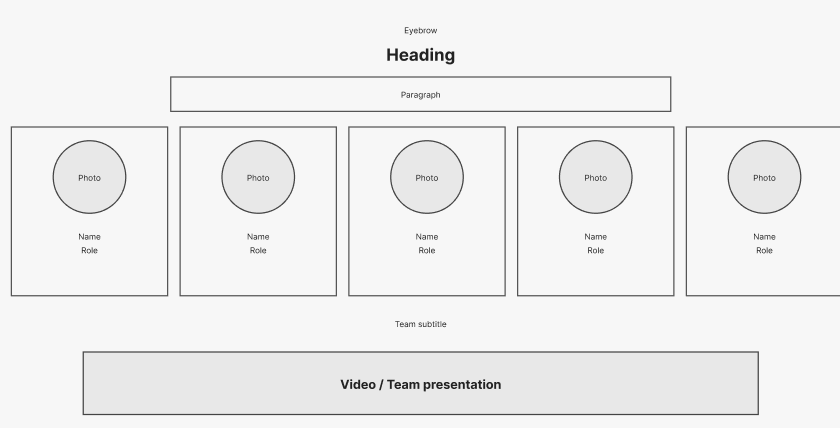 
  Nota: Wireframe de la sección del equipo de InstAlert.

**7. Llamado a la acción y Footer**

Finalmente, la landing incorpora un llamado a la acción que refuerza la propuesta de InstAlert y dirige al usuario hacia la acción principal. El footer contiene la información complementaria y enlaces de navegación del sitio.

  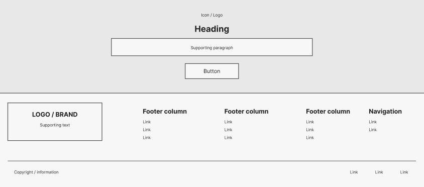 
  Nota: Wireframe del llamado a la acción y pie de página de InstAlert.

### 4.3.2. Landing Page Mock-up

Los mock-ups de la Landing Page de InstAlert representan la propuesta visual final de la plataforma, aplicando los lineamientos definidos en el Style Guidelines. La interfaz mantiene una estructura clara y consistente, priorizando la presentación de la información, las funcionalidades principales y los accesos de interacción.

**1. Encabezado y Hero Section**

Aquí se muestra el encabezado de la Landing Page junto con la sección principal. El encabezado contiene el logotipo, las opciones de navegación, el selector de idioma, el acceso a inicio de sesión y el botón principal de acción. En el Hero Section se presenta la propuesta de valor de InstAlert, acompañada de un espacio visual destinado a representar el producto.

  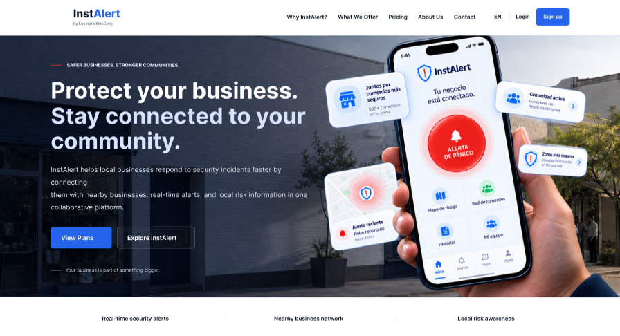 
  Nota: Mock-up del encabezado y Hero Section de la Landing Page de InstAlert

**2. Beneficios principales**

La sección presenta los principales beneficios de InstAlert mediante tres elementos visuales, permitiendo comunicar de manera rápida las características que diferencian la propuesta de la plataforma.

   
  Nota: Mock-up de los beneficios principales de InstAlert

**3. Sobre InstAlert y principios de la plataforma**

Esta sección presenta información relacionada con la propuesta de InstAlert y sus principales principios, utilizando bloques diferenciados para facilitar la lectura y comprensión del contenido.

  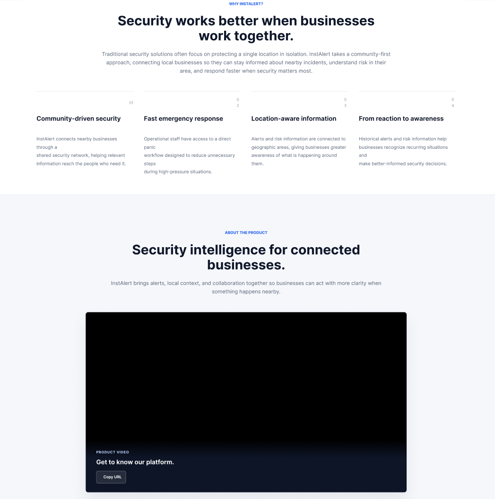 
  Nota: Mock-up de la sección informativa y principios de InstAlert

**4. Plataforma y mapa**

La sección muestra una representación de la plataforma mediante un espacio visual destinado al mapa, acompañado de información sobre las soluciones y funcionalidades principales de InstAlert. Esta distribución permite relacionar la información presentada con la visualización de incidentes y zonas de riesgo.

  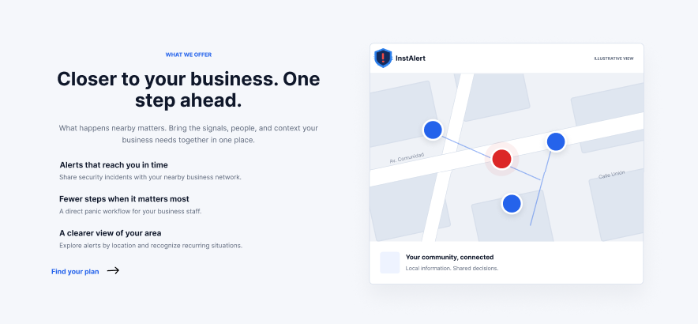 
  Nota: Mock-up de la sección de plataforma y visualización del mapa

**5. Planes**

La sección presenta los diferentes planes disponibles mediante tarjetas comparativas. Cada tarjeta contiene el nombre del plan, su descripción, precio, características principales y un botón de acción, permitiendo al usuario comparar las alternativas disponibles.

  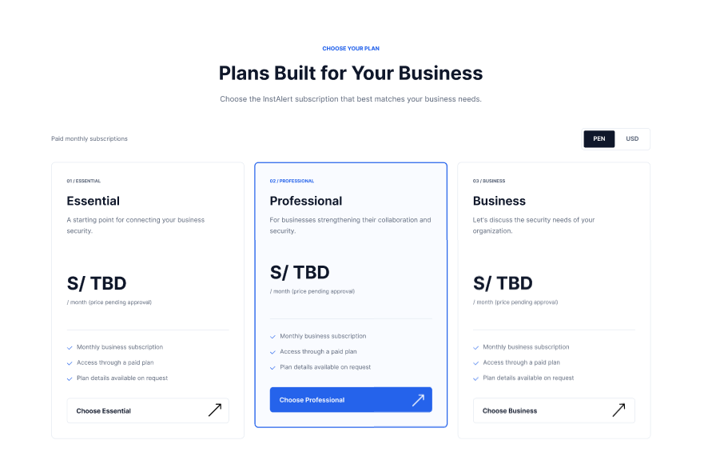 
  Nota: Mock-up de la sección de planes de InstAlert

**6. Equipo**

La sección presenta a los integrantes del equipo mediante tarjetas individuales que incluyen su representación visual, nombre y rol dentro del proyecto. También incorpora un espacio destinado a presentar contenido audiovisual relacionado con el equipo.

  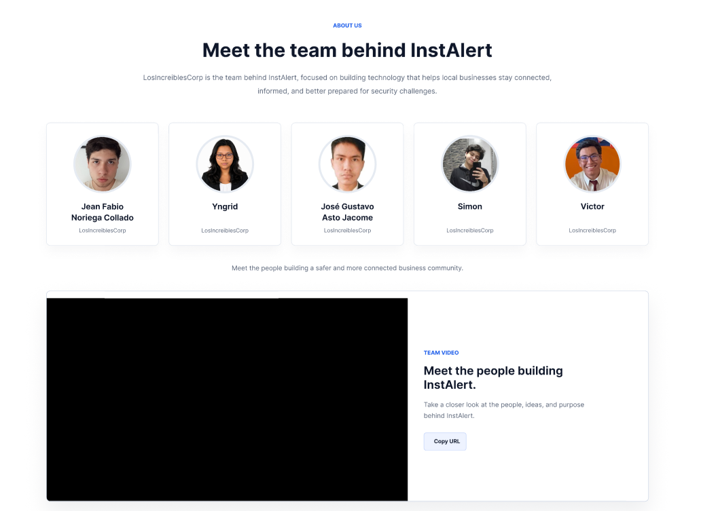 
  Nota: Mock-up de la sección del equipo de InstAlert

**7. Llamado a la acción y Footer**

Finalmente, se presenta un llamado a la acción que dirige al usuario hacia el siguiente paso dentro de la plataforma. El Footer contiene el logotipo, enlaces de navegación, información complementaria y los datos correspondientes al proyecto.

  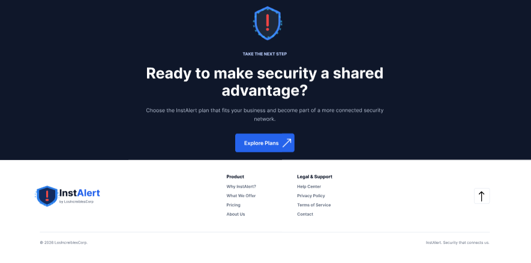 
  Nota: Mock-up del llamado a la acción y pie de página de InstAlert

## 4.4. Web Applications UX/UI Design

En esta sección se presenta la propuesta de diseño UX/UI de la aplicación web de InstAlert, describiendo la estructura visual, los elementos de interfaz y los patrones de interacción que orientan la experiencia del usuario.

El diseño está enfocado en facilitar el acceso a las principales funcionalidades de seguridad, priorizando una interacción clara, rápida y consistente. Asimismo, se mantiene la coherencia con los Style Guidelines y la Information Architecture, garantizando una experiencia intuitiva y organizada en las diferentes interfaces de la plataforma.

### 4.4.1. Web Applications Wireframes

En esta sección se presentan los wireframes de alta fidelidad baja/media para la plataforma web de InstAlert, diseñada específicamente para los roles de Personal Operativo y Administrador de locales comerciales. La propuesta visual y funcional responde directamente a estándares de usabilidad web, estructuración de datos y accesibilidad.

   
  Nota: Wireframe del Login Inicial

   
  Nota: Wireframe del Login — Estados de Error 1

  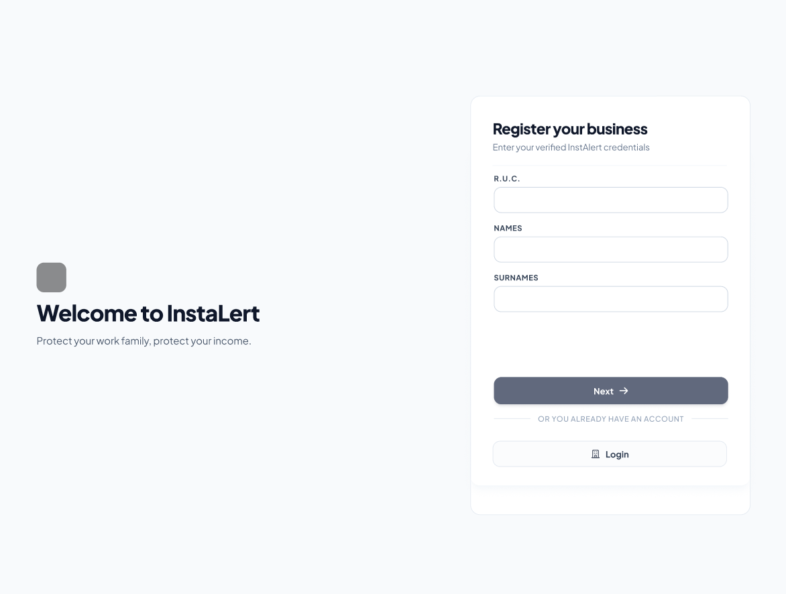 
  Nota: Wireframe del Registro de negocio 1

  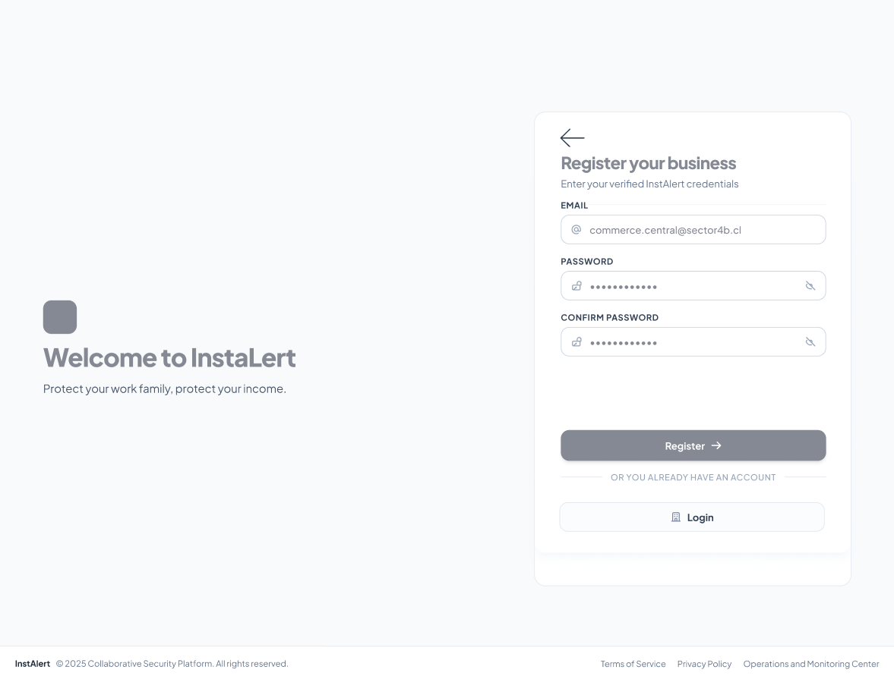 
  Nota: Wireframe del Registro de negocio 2  

  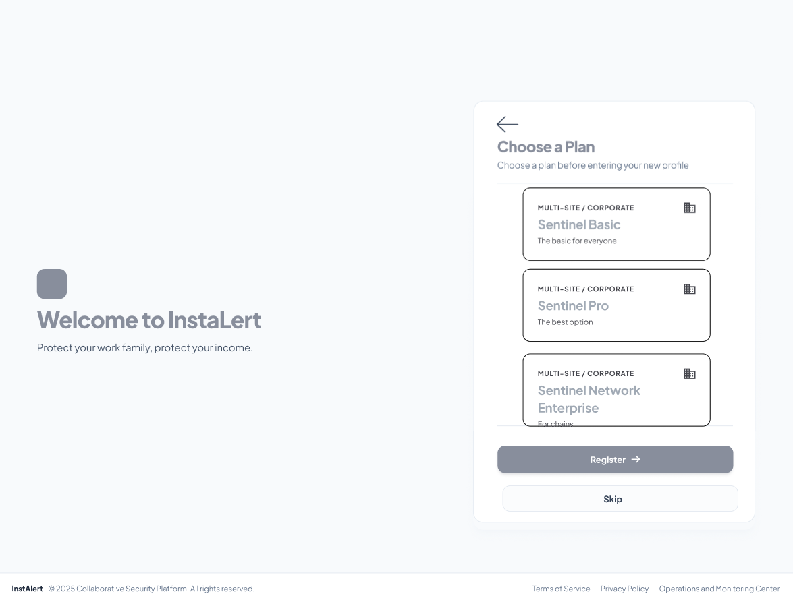 
  Nota: Wireframe de seleccionar un plan de suscripción

   
  Nota: Wireframe del Dashboard Operativo   

   
  Nota: Wireframe del Mapa de Riesgo — Vista Base  

   
  Nota: Wireframe del Mapa de Riesgo — Negocio Seleccionado   

   
  Nota: Wireframe del Mapa de Riesgo — Zona de Riesgo Seleccionada  

   
  Nota: Wireframe de Alertas Operativas  

   
  Nota: Wireframe de Alerta de Pánico — Cuenta Regresiva   

   
  Nota: Wireframe de Alerta de Pánico — Estado Activo   

   
  Nota: Wireframe de Completar Reporte de Emergencia  

   
  Nota: Wireframe de Reportar Actividad Sospechosa   

   
  Nota: Wireframe de Otro Tipo de Alerta   

   
  Nota: Wireframe del Historial Operativo de Alertas   

   
  Nota: Wireframe del Perfil de Usuario Operativo   

   
  Nota: Wireframe del Dashboard del Administrador   

   
  Nota:  Wireframe de Alertas del Comercio (Administración) 

   
  Nota: Wireframe de Gestión de Personal (Administración)   

   
  Nota: Wireframe de Gestión de Suscripción (Administración)   

   
  Nota: Wireframe del Mapa de Riesgo para Administrador — Vista Base  

   
  Nota: Wireframe del Mapa de Riesgo para Administrador — Negocio Seleccionado  

   
  Nota: Wireframe del Mapa de Riesgo para Administrador — Zona de Riesgo Seleccionada  

   
  Nota: Wireframe del Historial de Alertas para Administrador  

  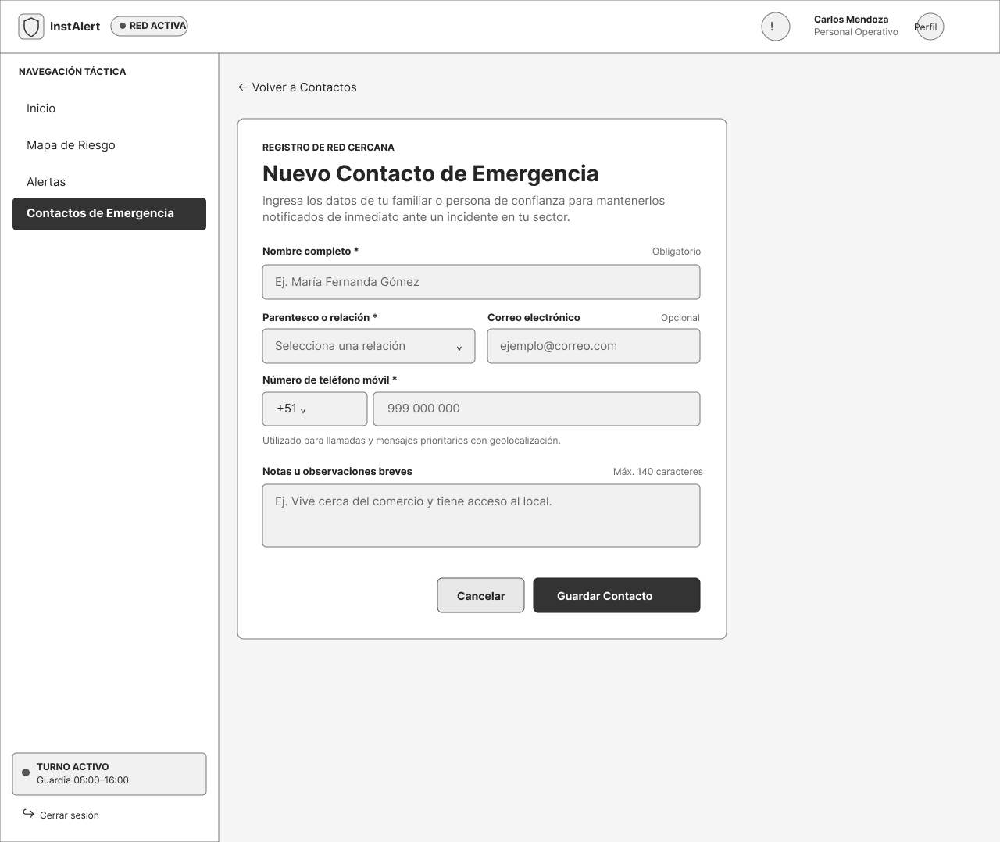 
  Nota: Wireframe de Nuevo contacto de emergencia  

  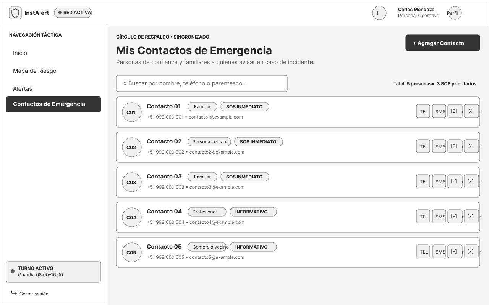 
  Nota: Wireframe de Mis contactos de emergencia 

  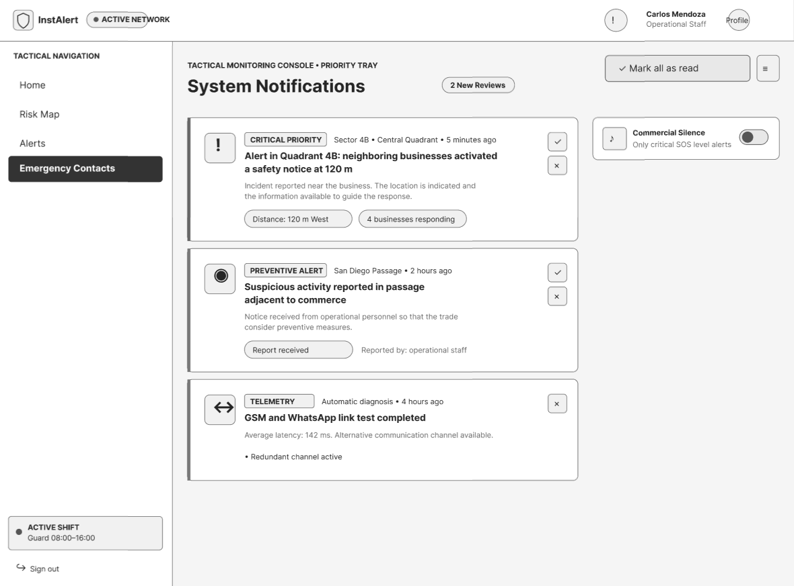 
  Nota: Wireframe de las Notificaciones del sistema

  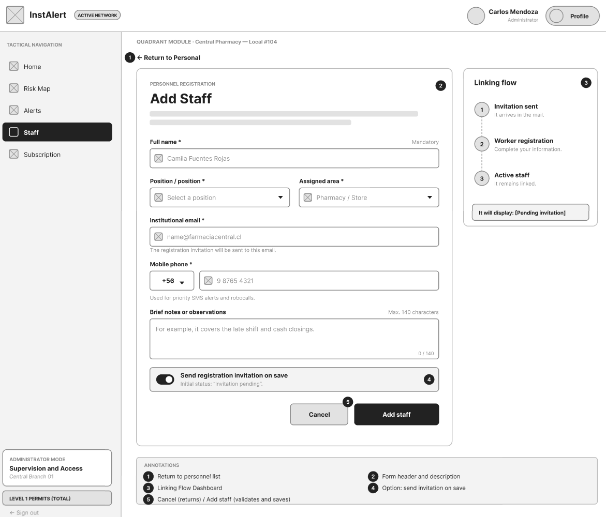 
  Nota: Wireframe de Agregar Personal 

  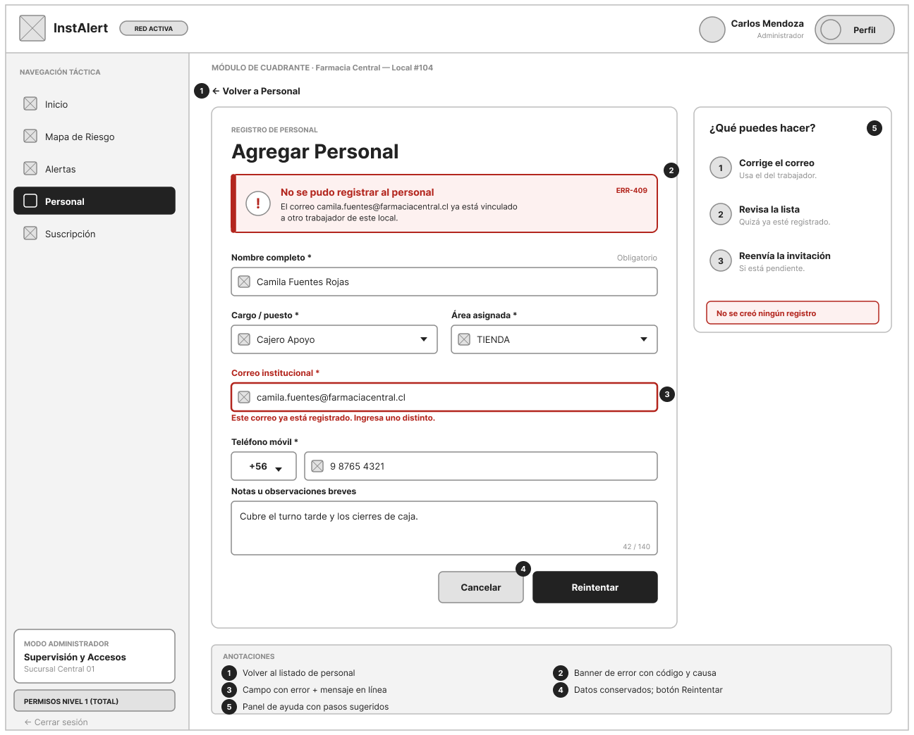 
  Nota: Wireframe del Error al registrar personal

  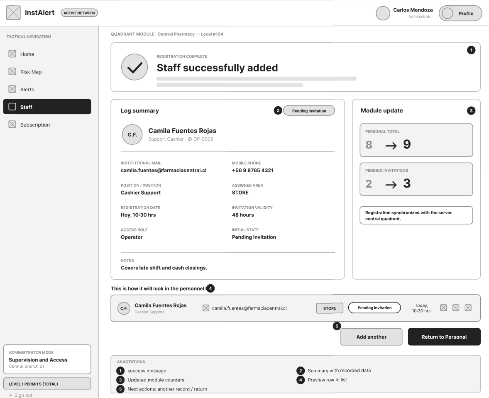 
  Nota: Wireframe de confirmacion de personal agregado  

  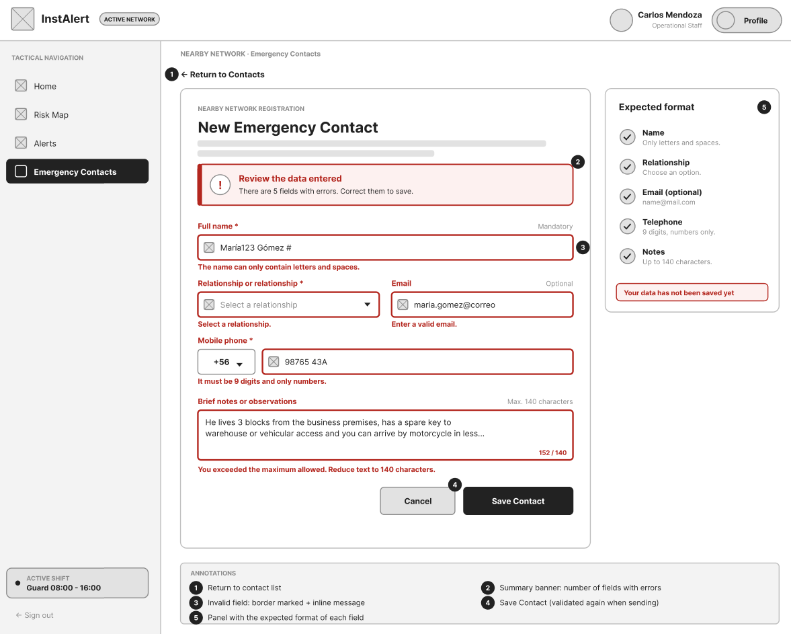 
  Nota: Wireframe de error al crear contacto de emergencia  

  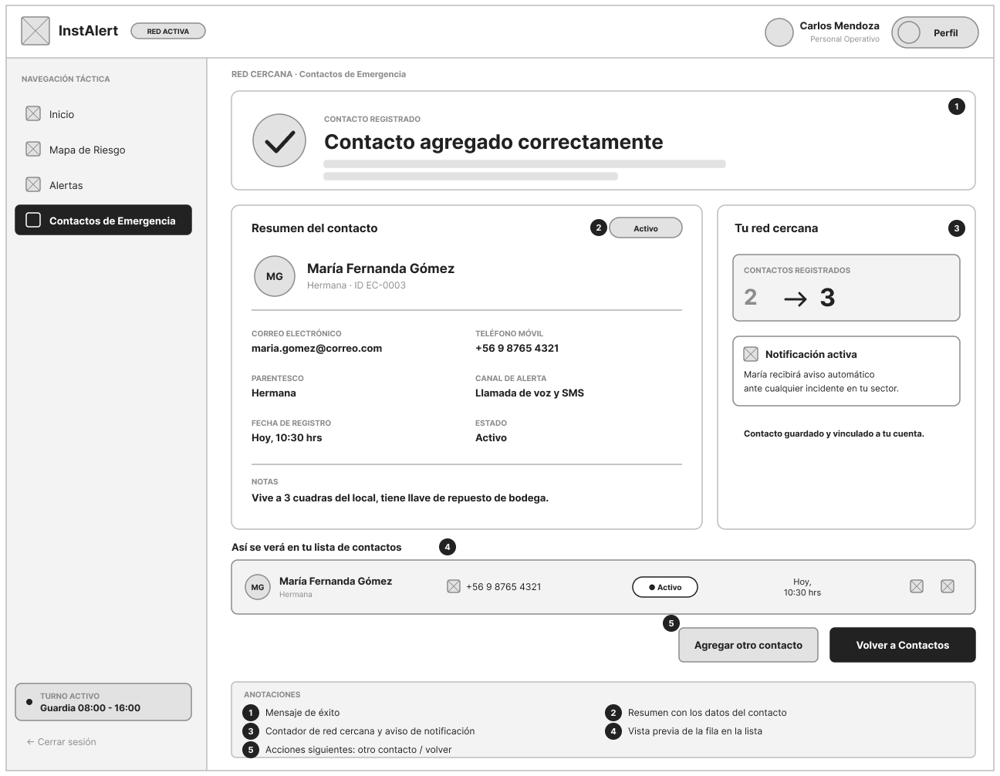 
  Nota: Wireframe de contacto agregado

   
  Nota: Wireframe de registro de tarjeta para el plan de pago

   
  Nota: Wireframe de los terminos y condiciones

### 4.4.2. Web Applications Wireflow Diagrams

**Link de FigJam para los wireflows:**  https://acortar.link/Gt6qhS 

**Segmento 1: Administradores de locales comerciales**

* User Goal: Como administrador de local, quiero registrar los datos de mi negocio, para acceder a la plataforma y administrar la seguridad de mi local.

Task Flow:

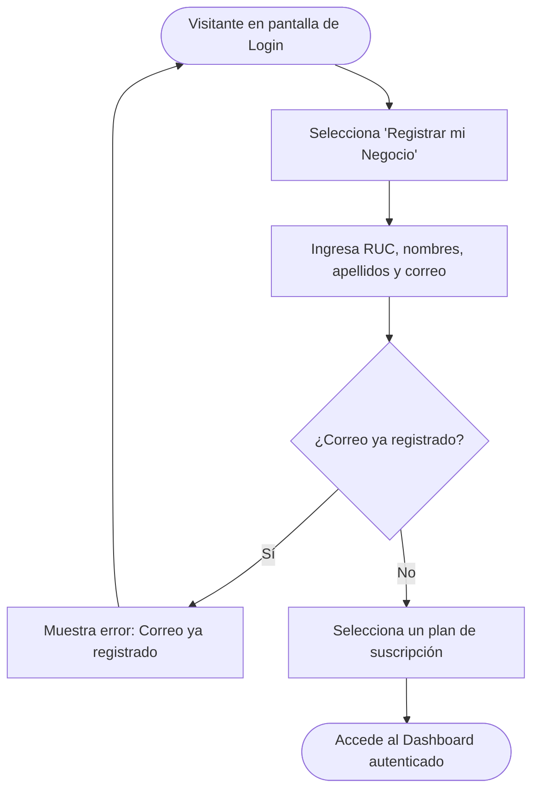
```mermaid
flowchart TD
    A([Visitante en pantalla de Login]) --> B[Selecciona 'Registrar mi Negocio']
    B --> C[Ingresa RUC, nombres, apellidos y correo]
    C --> D{¿Correo ya registrado?}
    D -- Sí --> E[Muestra error: Correo ya registrado]
    E --> A
    D -- No --> F[Selecciona un plan de suscripción]
    F --> G([Accede al Dashboard autenticado])
```

 
 Nota: Diagrama de Task Flow para el registro de un nuevo comercio en la plataforma 

Wireflow:

 

  Nota: Diagrama de Wireflow del proceso de registro de comercio, desde el login hasta el acceso al Dashboard 

Descripción del flujo:
El proceso inicia cuando un visitante decide registrar su negocio en InstAlert desde la pantalla de login. Al seleccionar la opción de registro, el sistema solicita los datos formales del comercio (RUC, nombres y apellidos del responsable) y valida que el correo electrónico ingresado no esté previamente asociado a otra cuenta. Si la validación es exitosa, el usuario avanza a la selección de un plan de suscripción entre las opciones disponibles, y al confirmar, el sistema crea la cuenta y otorga acceso inmediato al Dashboard del Administrador, quedando listo para comenzar a gestionar la seguridad de su local.

* User Goal: Como administrador de local, quiero visualizar un mapa con los incidentes recientes en mi zona, para identificar patrones de riesgo y áreas inseguras.

Task Flow:

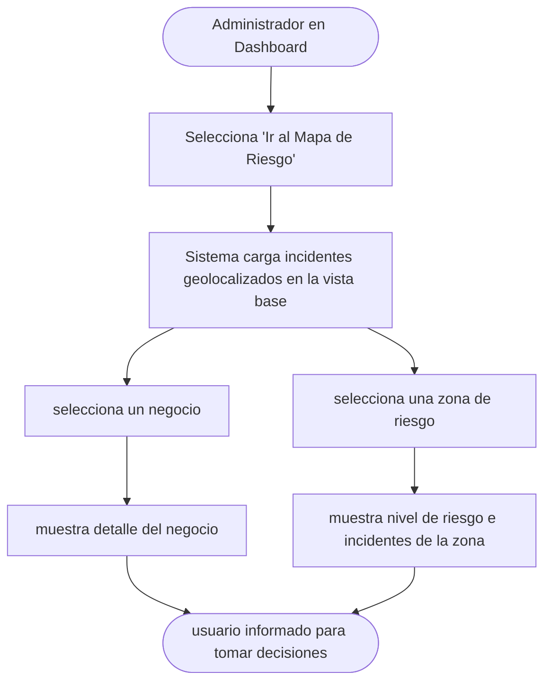
```mermaid
flowchart TD
    A([Administrador en Dashboard]) --> B["Selecciona 'Ir al Mapa de Riesgo'"]
    B --> C["Sistema carga incidentes geolocalizados en la vista base"]
    C --> D["selecciona un negocio"]
    C --> E["selecciona una zona de riesgo"]
    D --> F["muestra detalle del negocio"]
    E --> G["muestra nivel de riesgo e incidentes de la zona"]
    F --> H([usuario informado para tomar decisiones])
    G --> H
```

 
Nota: Diagrama de Task Flow para la consulta del mapa de riesgo del administrador 

Wireflow:

 

  Nota: Diagrama de Wireflow de la consulta del mapa de riesgo, desde el Dashboard hasta el detalle de zona 

Descripción del flujo:
Desde el Dashboard principal, el administrador accede al mapa de riesgo mediante la acción operativa directa "Ir al Mapa de Riesgo". El sistema despliega la vista base con los incidentes recientes geolocalizados en su zona. A partir de ahí, el usuario puede profundizar de dos formas: seleccionando un negocio específico para ver su información, o seleccionando una zona marcada con mayor nivel de riesgo para consultar el detalle de los incidentes registrados ahí. Esta información permite al administrador anticiparse a patrones de riesgo y ajustar decisiones operativas, como reforzar la seguridad en horarios o zonas específicas.

* User Goal: Como administrador de local, quiero consultar un historial detallado de las alertas generadas por mi tienda, para llevar un registro de eventos de seguridad.

Task Flow:

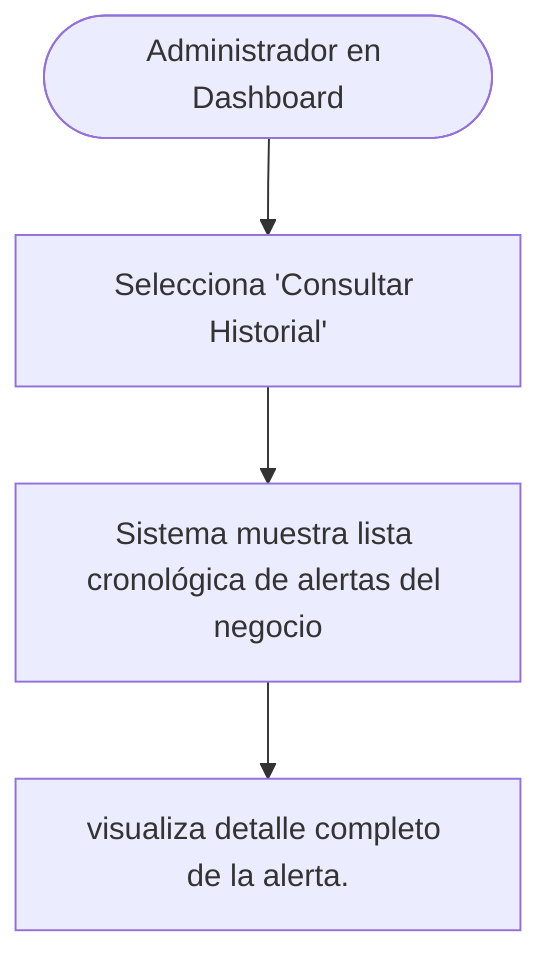
```mermaid
flowchart TD
    A([Administrador en Dashboard]) --> B["Selecciona 'Consultar Historial'"]
    B --> C["Sistema muestra lista cronológica de alertas del negocio"]
    C --> D["visualiza detalle completo de la alerta."]
```

 
Nota: Diagrama de Task Flow para la consulta del historial de alertas del administrador 

Wireflow:

 

  Nota: Diagrama de Wireflow del historial de alertas para el administrador 

Descripción del flujo:
El administrador accede al historial de alertas desde el Dashboard para llevar un registro de eventos de seguridad de su negocio. El sistema presenta la lista completa de incidentes en orden cronológico, con la posibilidad de aplicar filtros por fecha, tipo de incidente o estado (Activa, Resuelta, Reporte pendiente) para localizar rápidamente eventos específicos. Al seleccionar una alerta puntual, el usuario accede al detalle completo, incluyendo ubicación, hora, estado y evidencias asociadas cuando estén disponibles.

* User Goal: Como administrador de local, quiero seleccionar y suscribirme a un plan de pago, para desbloquear funcionalidades premium de la plataforma.

Task Flow:

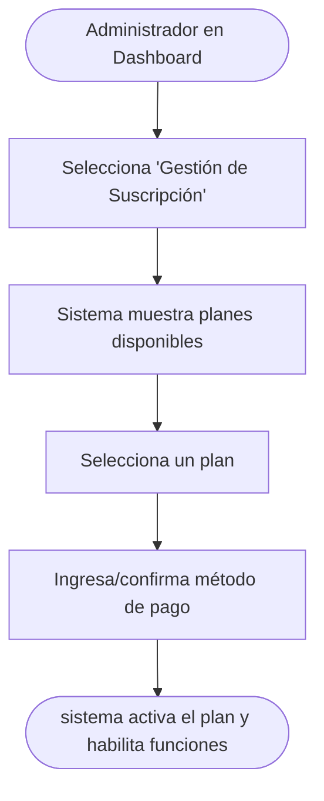
```mermaid
flowchart TD
    A([Administrador en Dashboard]) --> B["Selecciona 'Gestión de Suscripción'"]
    B --> C["Sistema muestra planes disponibles"]
    C --> D["Selecciona un plan"]
    D --> E["Ingresa/confirma método de pago"]
    E --> F([sistema activa el plan y habilita funciones])
```

 
 Nota: Diagrama de Task Flow para la selección y gestión del plan de suscripción 

Wireflow:

 

  Nota: Diagrama de Wireflow de la gestión de suscripción del administrador 

Descripción del flujo:
Desde el panel de configuración, el administrador accede a la sección de gestión de suscripción para revisar los planes disponibles (Sentinel Basic, Pro o Red Enterprise). Tras seleccionar el plan que mejor se adapta a las necesidades de su negocio, el sistema solicita un método de pago válido; si el pago se procesa correctamente, la suscripción premium se activa de inmediato, habilitando funcionalidades avanzadas como el monitoreo multi-sede o soporte prioritario, según el nivel contratado.

* User Goal: Como administrador de local, quiero agregar personal operativo a la plataforma usando su correo electrónico, para que puedan utilizar la aplicación y gestionar las alertas del comercio.

Task Flow:

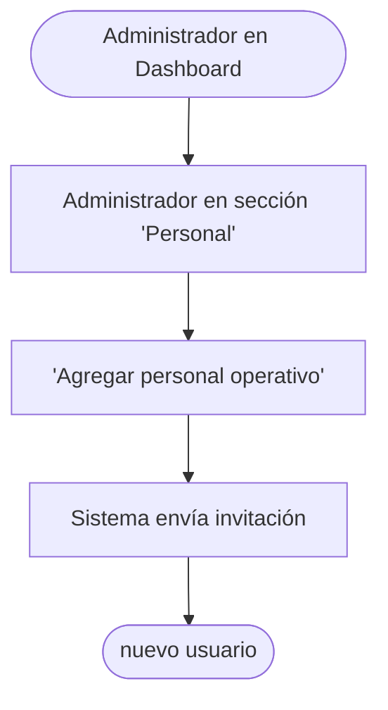
```mermaid
flowchart TD
    A([Administrador en Dashboard]) --> B["Administrador en sección 'Personal'"]
    B --> C["'Agregar personal operativo'"]
    C --> D["Sistema envía invitación"]
    D --> E([nuevo usuario])
```

  
Nota: Diagrama de Task Flow para la gestión de personal operativo 

Wireflow:

 

  Nota: Diagrama de Wireflow de la gestión de personal operativo del administrador 

Descripción del flujo:
El administrador accede a la sección "Personal" desde su Dashboard para agregar a un nuevo colaborador. Al ingresar el correo electrónico del empleado, el sistema valida que dicho correo no esté ya asociado a otro miembro del mismo comercio; de ser así, rechaza la operación e indica el conflicto. Si la validación es correcta, el sistema registra la invitación y la muestra con el estado "Invitación pendiente" hasta que el empleado acepte y cree su propia cuenta vinculada al negocio.

**Segmento 2: Personal Operativo**

* User Goal: Como personal operativo, quiero activar el botón de pánico web de manera inmediata y gestionar la red de apoyo para solicitar auxilio ante un peligro inminente en mi ubicación, y coordinar la ayuda necesaria.

Task Flow:

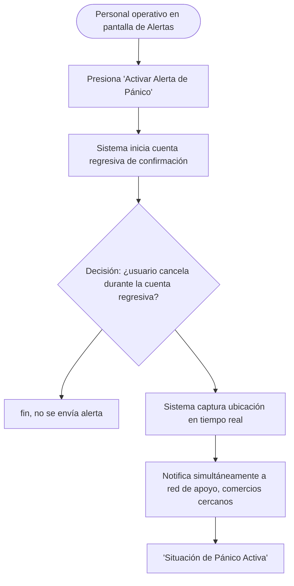
```mermaid
flowchart TD
    A([Personal operativo en pantalla de Alertas]) --> B["Presiona 'Activar Alerta de Pánico'"]
    B --> C["Sistema inicia cuenta regresiva de confirmación"]
    C --> D{"Decisión: ¿usuario cancela durante la cuenta regresiva?"}
    D --> E["fin, no se envía alerta"]
    D --> F["Sistema captura ubicación en tiempo real"]
    F --> G["Notifica simultáneamente a red de apoyo, comercios cercanos"]
    G --> H["'Situación de Pánico Activa'"]
```

 
 Nota: Diagrama de Task Flow para la activación del botón de pánico y gestión de la red de apoyo 

Wireflow:

 

  Nota: Diagrama de Wireflow del proceso de activación del botón de pánico y seguimiento de la emergencia 

Descripción del flujo:
Para gestionar una situación de emergencia crítica, el usuario accede a la funcionalidad principal de la aplicación web donde encuentra el botón de pánico diseñado para una activación inmediata. Al presionarlo, el sistema despliega una cuenta regresiva breve como mecanismo de confirmación, evitando activaciones accidentales. Una vez confirmada la alerta, el sistema captura automáticamente la ubicación en tiempo real y dispara notificaciones de auxilio de forma simultánea a la red de apoyo previamente configurada, que incluye contactos de confianza, comercios vecinos y autoridades locales. Tras el despliegue de la señal de socorro, la interfaz permite al usuario monitorear el estado de la respuesta y gestionar su círculo de ayuda, manteniendo un canal de comunicación abierto para actualizaciones sobre el incidente.

* User Goal: Como personal operativo, quiero clasificar el tipo de alerta (Robo, Intento de robo, Asalto u Otro) al crear un reporte, para que quede documentado el motivo exacto del incidente.

Task Flow:

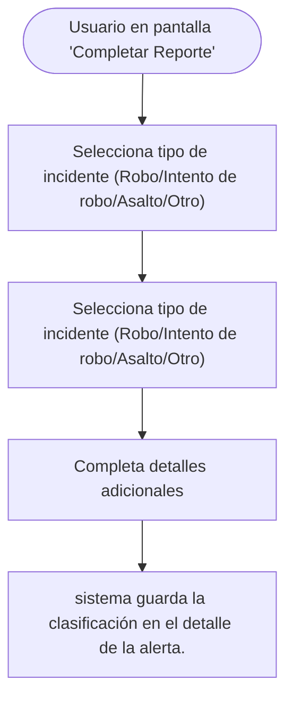
```mermaid
flowchart TD
    A(["Usuario en pantalla 'Completar Reporte'"]) --> B["Selecciona tipo de incidente (Robo/Intento de robo/Asalto/Otro)"]
    B --> C["Selecciona tipo de incidente (Robo/Intento de robo/Asalto/Otro)"]
    C --> D["Completa detalles adicionales"]
    D --> E["sistema guarda la clasificación en el detalle de la alerta."]
```

 
 Nota: Diagrama de Task Flow para la clasificación del tipo de alerta 

Wireflow:

 

  Nota: Diagrama de Wireflow de clasificación del tipo de alerta 

Descripción del flujo:
Al completar el reporte de un incidente, el usuario selecciona la categoría que mejor describe lo ocurrido entre las opciones predefinidas: Robo, Intento de robo, Asalto u Otro. Si ninguna categoría se ajusta al incidente, el usuario selecciona "Otro" y el sistema habilita un campo de descripción libre para documentar el motivo exacto. Esta clasificación queda registrada y visible en el detalle de la alerta, permitiendo un análisis posterior más preciso de los patrones delictivos en la zona.

* User Goal: Como usuario, quiero recibir notificaciones en tiempo real cuando se reporte un incidente cerca, para poder tomar medidas preventivas como cerrar mi local.

Task Flow:

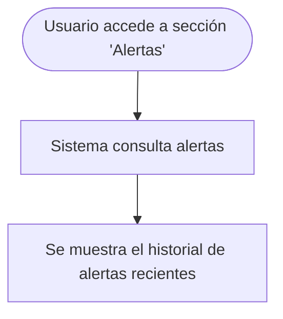
```mermaid
flowchart TD
    A(["Usuario accede a sección 'Alertas'"]) --> B["Sistema consulta alertas"]
    B --> C["Se muestra el historial de alertas recientes"]
```

 
 Nota: Diagrama de Task Flow para la recepción de alertas cercanas 

Wireflow:

 

  Nota: Diagrama de Wireflow de recepción de alertas cercanas 

Descripción del flujo:
 Al abrir alertas, el operador de la tienda accede a los detalles clave del incidente: tipo de amenaza, distancia aproximada y hora del suceso, información suficiente para decidir una acción preventiva inmediata, como cerrar temporalmente su local o extremar precauciones.

* User Goal: Como operador, quiero poder cancelar una alerta en caso de falsa alarma, para evitar pánico innecesario en la red vecinal.

Task Flow:

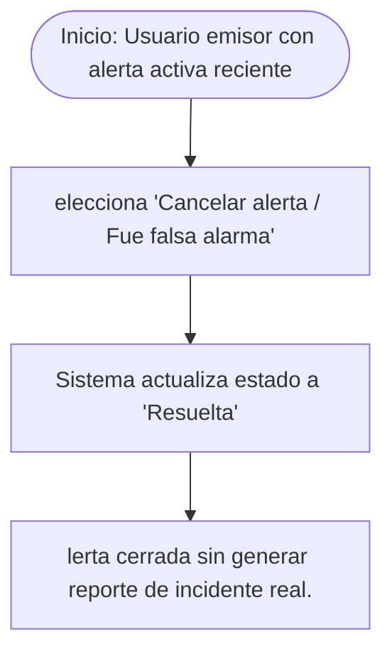
```mermaid
flowchart TD
    A([Inicio: Usuario emisor con alerta activa reciente]) --> B["elecciona 'Cancelar alerta / Fue falsa alarma'"]
    B --> C["Sistema actualiza estado a 'Resuelta'"]
    C --> D["lerta cerrada sin generar reporte de incidente real."]
```

 
Nota: Diagrama de Task Flow para la cancelación de una falsa alarma 

Wireflow:

 

  Nota: Diagrama de Wireflow de cancelación de falsa alarma 

Descripción del flujo:
Si el usuario que activó una alerta determina que se trató de una falsa alarma, puede cancelarla directamente desde la pantalla de "Situación de Pánico Activa" sin necesidad de esperar a que se resuelva como un incidente real. Tras confirmar la cancelación, el sistema actualiza el estado de la alerta a "resuelta" y notifica a la red vecinal que la emergencia ha sido descartada, evitando que otros negocios mantengan un estado de alerta innecesario.

* User Goal: Como operador, quiero gestionar y registrar un nuevo contacto de emergencia en la plataforma, para asegurar que las personas clave reciban las notificaciones automáticas ante cualquier evento o alerta en el comercio.

Task Flow:

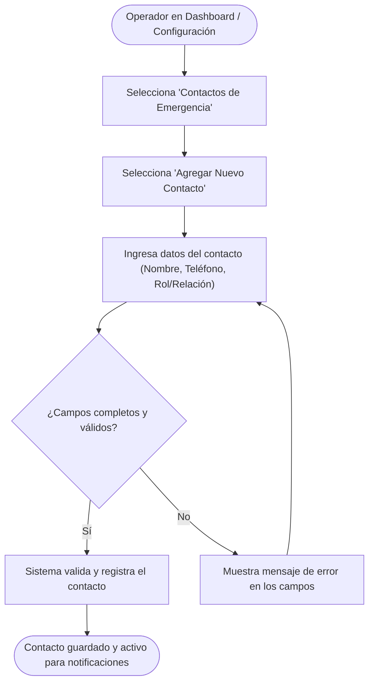
```mermaid
flowchart TD
    A([Operador en Dashboard / Configuración]) --> B["Selecciona 'Contactos de Emergencia'"]
    B --> C["Selecciona 'Agregar Nuevo Contacto'"]
    C --> D["Ingresa datos del contacto (Nombre, Teléfono, Rol/Relación)"]
    D --> E{"¿Campos completos y válidos?"}
    E -- Sí --> F["Sistema valida y registra el contacto"]
    F --> G(["Contacto guardado y activo para notificaciones"])
    E -- No --> H["Muestra mensaje de error en los campos"]
    H --> D
```

 
 Nota: Diagrama de Task Flow para mis contactos de Emergencia 

Wireflow:

 

  Nota: Diagrama de Wireflow para agregar un contacto de emergencia 

Descripción del flujo:
Desde la pantalla de "Mis Contactos de Emergencia", donde se visualiza el listado del círculo de respaldo con sus niveles de prioridad (SOS Inmediato o Informativo), el usuario presiona el botón "+ Agregar Contacto" para abrir el formulario de registro de red cercana. En esta vista, el operador completa la información clave del contacto, asignando su parentesco o relación, correo y número de teléfono móvil. Una vez guardado, el nuevo contacto queda sincronizado en el sistema para recibir notificaciones automáticas e inmediatas ante cualquier activación de alerta en el comercio.

* User Goal: Como operador, quiero acceder y revisar el historial completo de alertas y eventos registrados en el sistema, para auditar los incidentes ocurridos y hacer un seguimiento detallado de la seguridad del negocio.

Task Flow:

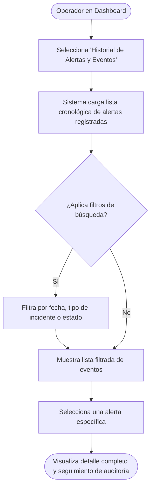
```mermaid
flowchart TD
   A([Operador en Dashboard]) --> B["Selecciona 'Historial de Alertas y Eventos'"]
    B --> C["Sistema carga lista cronológica de alertas registradas"]
    C --> D{"¿Aplica filtros de búsqueda?"}
    D -- Sí --> E["Filtra por fecha, tipo de incidente o estado"]
    E --> F["Muestra lista filtrada de eventos"]
    D -- No --> F
    F --> G["Selecciona una alerta específica"]
    G --> H(["Visualiza detalle completo y seguimiento de auditoría"])
```

 
Nota: Diagrama de Task Flow para acceder y revisar el historial completo de alertas 

Wireflow:

 

  Nota: Diagrama de Wireflow para consultar el historial de alertas del personal operativo 

Descripción del flujo:
Desde el Dashboard, el personal operativo puede seleccionar el acceso rápido "VER HISTORIAL" para abandonar el monitoreo en tiempo real e ingresar a la pantalla de Historial de Alertas. En esta vista, el sistema presenta un registro cronológico de todos los eventos del negocio, permitiendo aplicar filtros por rango de fecha, tipo de incidente y estado. Al seleccionar una alerta específica del listado, la interfaz despliega en la parte inferior el detalle seleccionado junto con los archivos de evidencia asociados, facilitando una auditoría completa y un seguimiento detallado de la trazabilidad de cada incidente registrado.

### 4.4.3. Web Applications Mock-ups

Esta sección reúne la interfaz gráfica de alta fidelidad para la aplicación web de InstAlert, diseñada para ofrecer una experiencia intuitiva, accesible y de alta respuesta visual tanto para el personal operativo de primera línea como para la administración general.

   
  Nota: Mockup de Iniciar Sesión

   
  Nota: Mockup de Iniciar Sesión — Error de Credenciales

   
  Nota: Mockup de Registro de Negocio — Paso 1

   
  Nota: Mockup de Registro de Negocio — Elección de Plan

   
  Nota: Mockup de Registro de Negocio — Datos de Empresa

   
  Nota: Mockup del Dashboard Operativo

   
  Nota: Mockup del Mapa de Riesgo Táctico — Vista General

   
  Nota: Mockup del Mapa de Riesgo Táctico — Vista Simplificada

   
  Nota: Mockup del Mapa de Riesgo Táctico — Detalle de Incidente

   
  Nota: Mockup del Mapa de Riesgo Táctico — Vista Administrador General

   
  Nota: Mockup del Mapa de Riesgo Táctico — Comercio Seleccionado

   
  Nota: Mockup del Mapa de Riesgo Táctico — Detalle Narrativo

   
  Nota: Mockup de Alertas Operativas

   
  Nota: Mockup de Selección de Alertas para Administrador

   
  Nota: Mockup de Completar Reporte de Emergencia

   
  Nota: Mockup de Cuenta Regresiva de Emergencia

   
  Nota: Mockup del Dashboard Administrador

   
  Nota: Mockup de Gestión de Personal

   
  Nota: Mockup de Gestión de Suscripción y Facturación

   
  Nota: Mockup del Historial de Alertas y Eventos

   
  Nota: Mockup del Historial de Alertas — Vista Administrador

   
  Nota: Mockup de Reporte de Incidencia o Riesgo — Otro Tipo de Alerta

   
  Nota: Mockup del Perfil de Usuario y Ajustes Operativos

   
  Nota: Mockup de Reportar Actividad Sospechosa

   
  Nota: Mockup de Situación de Pánico Activa

   
  Nota: Mockup de Nuevo contacto de emergencia 

   
  Nota: Mockup de Mis contactos de emergencia 

   
  Nota: Mockup de Notificaciones del sistema

   
  Nota: Mockup de Agregar Personal

   
  Nota: Mockup de Error en Agregar personal

   
  Nota: Mockup de Personal Agregado correctamente

   
  Nota: Mockup de Error de Nuevo contacto de emergencia

   
  Nota: Mockup de Contacto de emergencia agregado correctamente

   
  Nota: Mockup de tarjeta para el plan de pago

   
  Nota: Mockup de los terminos y condiciones

### 4.4.4. Web Applications User Flow Diagrams

**Link de los User flows:** https://acortar.link/LAxmIF

**Segmento 1: Administradores de locales comerciales**

* User Goal: Como administrador de local, quiero registrar los datos de mi negocio, para acceder a la plataforma y administrar la seguridad de mi local.

**Happy Path:**

 

  Nota: Diagrama de UserFlow del proceso de registro de comercio, desde el login hasta el acceso al Dashboard 

En esta ruta ideal, un representante o dueño de negocio inicia el proceso desde la pantalla de inicio de sesión de InstAlert (Desktop) haciendo clic en "Registrar mi Negocio". A continuación, ingresa sus datos personales (RUC, nombres y apellidos) y presiona "Siguiente" para completar las credenciales de la cuenta (correo corporativo y contraseña). Tras presionar "Registrar", accede a la selección de planes (como Sentinel Basic, Sentinel Pro o Sentinel Red Enterprise), elige la opción adecuada y hace clic en "Regístrate". Finalmente, completa la información de pago en el formulario de la tarjeta (número de tarjeta, CVC, fecha de vencimiento, titular y dirección de facturación), presiona "Regístrate" y acepta los Términos y Condiciones de la plataforma para activar su cuenta exitosamente.

**Unhappy Paths**

 

  Nota: Diagrama de UserFlow del proceso de registro de comercio mal realizado 

En este escenario alternativo, el usuario inicia el registro desde la pantalla de inicio de sesión de InstAlert haciendo clic en "Registrar mi Negocio" y completa los primeros espacios del formulario (RUC, nombres y apellidos). Luego, avanza al siguiente paso para ingresar sus credenciales (correo electrónico y contraseña). Sin embargo, al intentar presionar "Registrar" con datos o formatos incorrectos (por ejemplo, un correo que ya se encuentra registrado o credenciales erróneas), el sistema valida la información, bloquea el registro y despliega un mensaje de error en pantalla alertando sobre las credenciales incorrectas para impedir que la cuenta sea creada hasta que se corrijan los datos.

* User Goal: Como administrador de local, quiero visualizar un mapa con los incidentes recientes en mi zona, para identificar patrones de riesgo y áreas inseguras.

**Happy Path:**

 

  Nota: Diagrama de UserFlow de la consulta del mapa de riesgo, desde el Dashboard hasta el detalle de zona

En esta ruta ideal, el administrador inicia sesión y accede al Dashboard Administrador de InstAlert. Desde la sección de accesos de navegación o accesos directos, selecciona la opción de "Mapa de Riesgo". El sistema lo redirige a la pantalla del Mapa de Riesgo Táctico, donde se despliega la visualización geográfica de las zonas de cobertura y cuadrantes. A continuación, el administrador ubica e interactúa con el mapa al presionar el local comercial de su interés (por ejemplo, Mini Market Don Pepe). Esto despliega una ventana emergente o panel lateral con el resumen del local; desde allí, el administrador hace clic en "Ver Detalles" para acceder a la información completa de los incidentes registrados, historial y reportes específicos del establecimiento.

* User Goal: Como administrador de local, quiero consultar un historial detallado de las alertas generadas por mi tienda, para llevar un registro de eventos de seguridad.

**Happy Path:**

 

  Nota: Diagrama de UserFlow del historial de alertas para el administrador

En esta ruta ideal, el administrador inicia sesión en la plataforma y accede al Dashboard Administrador de InstAlert. Desde el menú de navegación lateral o mediante la tarjeta de acceso rápido, hace clic en "Alertas" (o "Ver Historial de Alertas"). El sistema lo redirige a la vista de Historial de Alertas y Eventos, donde se muestra el registro detallado de incidencias y situaciones de alerta. Posteriormente, el administrador hace clic en el botón o acceso de "Alertas SOS Pánico". El sistema lo lleva a la pantalla de Alertas Administrador ("Elige el negocio para ver las alertas"), donde puede visualizar los negocios asociados y consultar el listado de alertas emitidas por cada uno para su posterior gestión o seguimiento.

* User Goal: Como administrador de local, quiero seleccionar y suscribirme a un plan de pago, para desbloquear funcionalidades premium de la plataforma.

**Happy Path:**

 

  Nota: Diagrama de UserFlow de la gestión de suscripción del administrador

En esta ruta ideal, el administrador inicia sesión en la plataforma y accede al Dashboard Administrador de InstAlert. Desde la barra de navegación lateral o mediante la tarjeta de acceso rápido "Gestionar Suscripción", hace clic en "Suscripción". El sistema lo redirige a la pantalla de Gestión de Suscripción (Administrador), en la sección de Suscripción Comercial y Facturación. Desde esta vista, el administrador puede revisar el plan activo (Sentinel Pro), consultar la matriz de planes de seguridad disponibles (Sentinel Esencial, Sentinel Pro, Sentinel Red Enterprise), gestionar el método de pago guardado y revisar el historial de facturación electrónica e historial de pagos.

* User Goal: Como administrador de local, quiero agregar personal operativo a la plataforma usando su correo electrónico, para que puedan utilizar la aplicación y gestionar las alertas del comercio.

**Happy Path:**

 

  Nota: Diagrama de UserFlow de la gestión de personal operativo del administrador

En esta ruta ideal, el administrador inicia sesión y accede al Dashboard Administrador de InstAlert. Desde el menú lateral o el acceso directo "Gestionar Personal", hace clic en "Personal" para navegar a la vista de Gestión de Personal del Comercio. Una vez allí, hace clic en el botón "+ Agregar personal". En la pantalla de Agregar Personal, completa correctamente todos los campos del formulario con la información del trabajador (nombre completo, cargo o puesto, área asignada, correo institucional, teléfono móvil y notas adicionales). Luego, hace clic en el botón "Agregar personal". El sistema procesa la solicitud, confirma la acción mostrando la pantalla de "Personal agregado correctamente" con el resumen del registro y actualiza la lista de personal del local.

**Unhappy Paths**

 

  Nota: Diagrama de UserFlow de un mal registro de personal 

En este escenario alternativo, el administrador accede al módulo de Gestión de Personal e inicia el proceso haciendo clic en "+ Agregar personal". Al completar el formulario, ingresa información inválida o duplicada (por ejemplo, un correo institucional que ya pertenece a un trabajador existente en la plataforma). Al hacer clic en "Agregar personal", el sistema realiza la validación, bloquea el registro y muestra la pantalla de Error Agregar personal (Administrador) con un mensaje explícito de alerta ("No se pudo registrar al personal") e indicando en rojo el campo con conflicto para que el usuario pueda corregirlo antes de reintentar.

**Segmento 2: Personal Operativo**

* User Goal: Como personal operativo, quiero activar el botón de pánico web de manera inmediata y gestionar la red de apoyo para solicitar auxilio ante un peligro inminente en mi ubicación, y coordinar la ayuda necesaria.

**Happy Path:**

 

  Nota: Diagrama de UserFlow el proceso de activación del botón de pánico y seguimiento de la emergencia

En esta ruta ideal, el personal operativo inicia sesión en la plataforma y accede al Dashboard Operativo de InstAlert. Desde la barra de navegación lateral o los accesos directos, hace clic en "Alertas". El sistema lo redirige a la pantalla de Alertas Operativas, donde presiona el botón de pánico central para iniciar el protocolo de emergencia. A continuación, el sistema muestra la pantalla de Cuenta Regresiva de Emergencia (Pánico) con un temporizador de 15 segundos. Al dejar transcurrir los 15 segundos sin cancelar, el sistema activa la alerta e ingresa al estado de Situación de Pánico Activa, notificando a los negocios cercanos y a las autoridades. Una vez controlada la situación, el usuario hace clic en "Finalizar Situación de Pánico". Por último, accede a la pantalla de Completar Reporte de Emergencia, donde selecciona el tipo de incidente ocurrido y añade los detalles pertinentes para registrar el evento de forma completa.

* User Goal: Como personal operativo, quiero clasificar el tipo de alerta (Robo, Intento de robo, Asalto u Otro) al crear un reporte, para que quede documentado el motivo exacto del incidente.

**Happy Path:**

 

  Nota: Diagrama de UserFlow el proceso de reportar actividad sospechosa

En esta ruta ideal, el personal operativo inicia sesión en la plataforma y accede al Dashboard Operativo de InstAlert. Desde la barra de navegación lateral o mediante la tarjeta de acceso directo, hace clic en "Alertas". El sistema lo redirige a la pantalla de Alertas Operativas. En la sección de Otros reportes, hace clic en la opción "Vi algo sospechoso". A continuación, el sistema despliega el formulario de Reportar Actividad Sospechosa, donde el usuario selecciona el tipo de actividad observada (personas o vehículos sospechosos, comportamientos inusuales, etc.), confirma la ubicación y temporalidad, añade la descripción táctica y envía el alerta preventivo a la red del sector.

**Happy Path:**

 

  Nota: Diagrama de UserFlow el proceso de reporte de otro tipo de alertas

En esta ruta ideal, el personal operativo inicia sesión en la plataforma y accede al Dashboard Operativo de InstAlert. Desde el menú de navegación, hace clic en "Alertas" para acceder a la pantalla de Alertas Operativas. En la sección de Otros reportes, selecciona el botón "Otro tipo de alerta". El sistema lo lleva a la pantalla InstAlert - Otro tipo de alerta, donde el usuario puede categorizar el incidente específico (fallas de luminaria, intentos de hurto, vandalismo o intrusión), especificar la localización y hora exacta del suceso, adjuntar la descripción con evidencia fotográfica y presionar el botón de envío para notificar a los comercios y administradores vinculados.

* User Goal: Como usuario, quiero recibir notificaciones en tiempo real cuando se reporte un incidente cerca, para poder tomar medidas preventivas como cerrar mi local.

**Happy Path:**

 

  Nota: Diagrama de UserFlow notificaciones sobre incidencias

En esta ruta ideal, el personal operativo inicia sesión en la plataforma y accede al Dashboard Operativo de InstAlert. Desde la barra superior del sistema, hace clic en el icono de Notificación. El sistema lo redirige a la vista de Notificaciones del Sistema dentro del módulo de Alertas Operativas, donde puede consultar en tiempo real las alertas críticas (como pulsadores activados por comercios vecinos), alertas preventivas (marcajes o sospechosos detectados) y notificaciones de pruebas del sistema, pudiendo marcarlas como leídas o gestionar sus respuestas.

* User Goal: Como operador, quiero poder cancelar una alerta en caso de falsa alarma, para evitar pánico innecesario en la red vecinal.

**Happy Path:**

 

  Nota: Diagrama de UserFlow de cancelación de falsa alarma

En esta ruta ideal, el personal operativo inicia sesión en la plataforma y accede al Dashboard Operativo de InstAlert. Desde el menú de navegación lateral o los accesos directos, hace clic en "Alertas" para acceder a la pantalla de Alertas Operativas. Allí presiona el botón de pánico central, lo que activa la pantalla de Cuenta Regresiva de Emergencia (Pánico) con un temporizador de 15 segundos. Si se trata de una falsa alarma o una activación accidental, el usuario mantiene presionado durante 5 segundos el botón "Cancelar Alerta SOS". El sistema interrumpe la cuenta regresiva, evita el envío masivo de la notificación de emergencia a las autoridades y negocios cercanos, y retorna al usuario de forma segura a la pantalla principal de Alertas Operativas.

* User Goal: Como operador, quiero gestionar y registrar un nuevo contacto de emergencia en la plataforma, para asegurar que las personas clave reciban las notificaciones automáticas ante cualquier evento o alerta en el comercio.

**Happy Path:**

 

  Nota: Diagrama de UserFlow de el registro de un nuevo contacto de confianza

En esta ruta ideal, el personal operativo navega desde el Dashboard Operativo hacia el menú lateral y presiona la opción "Contactos de Emergencia" para acceder al listado de su red de respaldo. Una vez allí, hace clic en el botón "+ Agregar Contacto", desplegando el formulario de registro donde procede a completar correctamente todos los datos solicitados, incluyendo el nombre completo, parentesco, correo electrónico, teléfono móvil y observaciones clave. Al finalizar, el usuario presiona "Guardar Contacto", lo que hace que el sistema procese la información de manera exitosa y lo redirija a la pantalla de Confirmación de Contacto Agregado, donde se muestra la ficha completa de la persona registrada y esta queda automáticamente activa en la plataforma para recibir notificaciones ante cualquier evento de emergencia.

**Unhappy Paths**

 

  Nota: Diagrama de UserFlow de el registro de un nuevo contacto de confianza

En este flujo de excepción, el personal operativo ingresa a la sección de "Contactos de Emergencia" desde el Dashboard Operativo y hace clic en "+ Agregar Contacto" para desplegar el formulario de registro. Durante el llenado de los datos, el usuario ingresa información errónea o incompleta en los campos obligatorios, como un número telefónico con formato incorrecto o un correo inválido. Al presionar el botón "Guardar Contacto", el sistema detiene el proceso de registro y redirige a la pantalla de Error al Agregar Contacto de Emergencia, mostrando alertas visuales en color rojo que indican de manera precisa qué campos requieren corrección y cuál es el formato esperado, evitando que se guarde un contacto no válido y permitiendo al usuario corregir la información antes de reintentar.

* User Goal: Como operador, quiero acceder y revisar el historial completo de alertas y eventos registrados en el sistema, para auditar los incidentes ocurridos y hacer un seguimiento detallado de la seguridad del negocio.

**Happy Path:**

 

  Nota: Diagrama de UserFlow de acceso al historial de alertas

En esta ruta ideal, el personal operativo inicia su navegación en la pantalla de Dashboard Operativo de InstAlert. Desde la barra de navegación táctica lateral, hace clic en la opción "Alertas" para acceder al centro operativo de mando en la pantalla de Alertas Operativas. Una vez allí, se desplaza hacia la sección Otros reportes en la parte inferior y presiona la tarjeta "Historial de Alertas y Eventos". El sistema procesa la solicitud de forma inmediata y redirige al usuario a la pantalla de Historial de Alertas, donde puede auditar la lista completa de incidentes registrados, aplicar filtros por estado o fecha y revisar la información detallada junto con la geolocalización y la línea de tiempo de cada evento.

## 4.5. Web Applications Prototyping

Los prototipos de UI presentados a continuación simulan la interacción real de los flujos priorizados como lo son la activación y resolución de una alerta de pánico, la consulta del mapa de riesgo y la gestión operativa del negocio, tanto en Desktop como en Mobile Web Browser. 

- **Landing Page Prototype Link:** https://acortar.link/1M34qU 

- **Admin Prototype Link:** https://acortar.link/xQAmag 

- **Operador Prototype Link:** https://acortar.link/sEtP04

Link del video demostrativo: https://acortar.link/hPiSAo

## 4.6. Domain-Driven Software Architecture

### 4.6.1. Design-Level EventStorming

El *Design-Level EventStorming* es una dinámica colaborativa para pasar de la comprensión general del negocio al diseño de la solución. El equipo representa los hechos relevantes del dominio y cómo se relacionan con las acciones de los usuarios, las reglas del negocio, la información que se consulta y los sistemas externos. A diferencia del *Big Picture EventStorming* del Capítulo II, que permitió entender el problema y el flujo general, esta etapa profundiza en las responsabilidades que debe cubrir InstAlert y en sus límites de diseño.

En nuestro caso, el tablero parte de los procesos de comercios, personal operativo, alertas, incidentes, mapas de riesgo, contactos de emergencia y suscripciones. El trabajo se organizó en los siguientes pasos:

**Paso 1: Exploración no estructurada (*Unstructured Exploration*)**

Primero, se identifican hechos importantes del negocio y se registran como eventos de dominio, expresados como acciones que ya ocurrieron. En InstAlert se incluyeron eventos como *Alerta de emergencia creada*, *Incidente geolocalizado registrado*, *Alerta cercana recibida*, *Alerta resuelta*, *Operario activado*, *Contacto de emergencia agregado*, *Pago aprobado* y *Suscripción activada*. También se contemplaron los flujos de invitaciones, consulta de mapas e historial de alertas.

 
Nota: Paso 1 del Design-Level Event Storming – Exploración no estructurada de eventos de dominio

**Paso 2: Orden cronológico (*Chronology*)**

Luego, los eventos se organizan de izquierda a derecha para representar su secuencia. En el tablero se distinguieron varios flujos: el registro del comercio y la incorporación de personal; la creación, envío, consulta, cancelación o resolución de una alerta; la consulta de incidentes y zonas de riesgo; la gestión de contactos de emergencia; y la selección y activación de una suscripción.

 
Nota: Paso 2 del Design-Level Event Storming – Organización cronológica del flujo de eventos

**Paso 3: Identificación de puntos de dolor (*Pain Points*)**

Se señalan los momentos del flujo donde pueden surgir problemas, demoras o errores. En InstAlert se marcaron puntos relacionados con la atención de alertas, su cancelación y la posibilidad de crear una falsa alerta accidentalmente. Además, se retomaron problemas identificados en el análisis previo, como la demora en recibir avisos, los mensajes que se pierden en canales informales y la dificultad de comunicar la ubicación exacta de un incidente.

 
Nota: Paso 3 del Design-Level Event Storming – Identificación de puntos de dolor y cuellos de botella

**Paso 4: Identificación de puntos pivote (*Pivotal Points*)**

Se destacan los momentos en que una decisión o resultado cambia el curso del proceso. En el tablero se consideraron, por ejemplo, la aceptación o el rechazo de una invitación; la activación o cancelación de una alerta; su posterior resolución; y la aprobación de un pago o la cancelación de una suscripción. Identificar estos puntos ayuda a reconocer los distintos caminos que el sistema debe contemplar.

 
Nota: Paso 4 del Design-Level Event Storming – Definición de puntos pivote y momentos clave del sistema

**Paso 5: Identificación de comandos (*Commands*)**

Se añaden las acciones que los usuarios o sistemas ejecutan para producir un cambio. Para InstAlert se representaron comandos como crear una invitación, registrar un comercio, crear o activar una cuenta operativa, presionar el botón de pánico, consultar alertas cercanas, consultar mapas de riesgo, filtrar el historial y agregar un contacto de emergencia. El comando expresa lo que se solicita; el evento representa el resultado ocurrido.

 
Nota: Paso 5 del Design-Level Event Storming – Identificación de comandos, actores y detonadores

**Paso 6: Definición de políticas (*Policies*)**

Se relacionan los eventos con reglas que desencadenan acciones posteriores. En el tablero se modelaron reglas para los flujos de invitación y activación del personal; para registrar la ubicación y notificar cuando se genera una alerta; para reflejar su cancelación o resolución; y para activar una suscripción después de la aprobación del pago. Estas relaciones ayudan a precisar qué comportamiento debe coordinar el sistema, sin fijar reglas o tiempos que aún no han sido definidos.

 
Nota: Paso 6 del Design-Level Event Storming – Definición de políticas de negocio

**Paso 7: Identificación de modelos de lectura (*Read Models*)**

Se identifican las consultas y vistas que necesitan los usuarios para tomar decisiones o completar sus tareas. En InstAlert se incluyeron la consulta del perfil, las alertas cercanas, el historial de alertas, el mapa y los niveles de riesgo, los contactos de emergencia, los planes de suscripción y el estado de las alertas.

 
Nota: Paso 7 del Design-Level Event Storming – Identificación de modelos de lectura e información requerida

**Paso 8: Identificación de sistemas externos (*External Systems*)**

Se incorporan los sistemas de terceros que participan en los procesos. Para InstAlert se consideraron SendGrid para enviar invitaciones por correo, Firebase Cloud Messaging para las notificaciones push, Mapbox para los servicios de mapas y geolocalización, y PayPal para el procesamiento de pagos de suscripción. Estos servicios son dependencias externas de la arquitectura propuesta.

 
Nota: Paso 8 del Design-Level Event Storming – Integración con sistemas externos y servicios de terceros

**Paso 9: Agrupación en agregados (*Aggregates*)**

Se agrupan los comandos, eventos, políticas y datos que deben mantenerse relacionados dentro de una unidad de consistencia del dominio. En el tablero se organizaron elementos asociados a identidad, comercio, alertas, mapas, contactos, suscripciones y notificaciones. Esta agrupación permite reconocer qué información y cambios pertenecen juntos antes de definir los límites de los contextos.

 
Nota: Paso 9 del Design-Level Event Storming – Identificación y agrupación de agregados de dominio

**Paso 10: Delimitación de contextos acotados (*Bounded Contexts*)**

Finalmente, se establecen límites explícitos para separar responsabilidades de negocio. El tablero resultante distingue los contextos **IAM**, **Business**, **Alert**, **Contacts**, **Notifications**, **Mapping** y **Payments**. En particular, **Contacts** se ocupa de los contactos de emergencia asociados al personal operativo, mientras que **Notifications** gestiona las notificaciones generales y las dirigidas al administrador o a comercios cercanos cuando hay alertas próximas. Estos límites se reflejan después en el diagrama de componentes del backend.

 
Nota: Paso 10 del Design-Level Event Storming – Delimitación de contextos acotados (Bounded Contexts)

En conjunto, el ejercicio permitió pasar de una secuencia de procesos y eventos a una propuesta de organización del dominio, sus integraciones y sus límites. El tablero sirvió como base para elaborar los diagramas de arquitectura y componentes; representa el diseño de la solución y no significa que todas las integraciones externas o servicios ya estén implementados.

**Miro Board Link:** https://miro.com/app/board/uXjVHqyvuL0=/?share_link_id=889295094432

### 4.6.2. Software Architecture Context Diagram

La vista de contexto presenta a InstAlert como un sistema completo, sin detallar su estructura interna. Permite reconocer quiénes interactúan con la plataforma y qué servicios externos forman parte de su entorno.

Los actores representados son:

- **Commerce Administrator:** administra el comercio, el personal operativo y la suscripción; además, consulta información de seguridad y recibe notificaciones relevantes.
- **Operational Staff:** utiliza la plataforma para enviar alertas de seguridad, gestionar sus contactos de emergencia y consultar información de riesgo cercana.

El modelo contempla cuatro sistemas externos:

- **SendGrid:** servicio de correo electrónico para enviar invitaciones al personal operativo.
- **Firebase Cloud Messaging:** servicio para entregar notificaciones push, incluidas las relacionadas con alertas cercanas.
- **Mapbox:** servicio de mapas y visualización geoespacial utilizado por las funciones de ubicación y riesgo.
- **PayPal:** plataforma externa contemplada para procesar pagos de suscripción.

Las relaciones muestran que ambos perfiles acceden a InstAlert y que la plataforma utiliza los servicios externos para correo, notificaciones push, mapas y pagos. Esta vista delimita el sistema y su ecosistema antes de examinar su organización interna.

 
Nota: Vista de contexto de InstAlert, sus actores y los servicios externos contemplados.

### 4.6.3. Software Architecture Container Diagram

La vista de contenedores amplía InstAlert y muestra las aplicaciones y el almacenamiento que conforman la solución, junto con las tecnologías y comunicaciones principales:

- **Landing Page:** sitio web servido como contenido estático que presenta información pública del producto y da acceso a la aplicación web.
- **Single-Page Application (SPA):** aplicación de navegador implementada con Vue.js y Vite. Ofrece las funciones web para administradores de comercio y personal operativo.
- **Backend API:** servicio desarrollado con C# y .NET. Expone las API REST, aplica las reglas de negocio y organiza la lógica mediante módulos basados en Domain-Driven Design.
- **Database:** base de datos MySQL que conserva la información persistente de InstAlert. El diagrama indica que los módulos mantienen la propiedad lógica de sus datos aunque compartan este contenedor de persistencia.

Los usuarios acceden a la Landing Page y a la SPA mediante HTTPS. La SPA intercambia solicitudes y respuestas JSON con el Backend API; este lee y escribe datos en MySQL mediante SQL. El backend también se integra con SendGrid para enviar invitaciones, Firebase Cloud Messaging para entregar notificaciones push, Mapbox para las funciones geoespaciales y PayPal para procesar pagos de suscripción. La base de datos y las aplicaciones forman parte del límite del sistema InstAlert.

 
Nota: Vista de contenedores de InstAlert, las tecnologías utilizadas y las integraciones externas representadas.

### 4.6.4. Software Architecture Component Diagram

La vista de componentes amplía el Backend API y muestra cómo se organizan sus responsabilidades en siete bounded contexts: **IAM**, **Business**, **Alert**, **Contacts**, **Notifications**, **Mapping** y **Payments**. **Shared** también aparece, pero representa capacidades técnicas transversales y no un octavo bounded context de negocio:

- **IAM:** administra identidades, autenticación y credenciales, y contempla la activación de las cuentas de administradores y personal operativo.
- **Business:** gestiona el registro y perfil de los comercios, el personal operativo, las invitaciones y las membresías.
- **Alert:** administra el ciclo de vida de las alertas —creación, cancelación y resolución— y la consulta de alertas activas, cercanas, sus detalles e historial. Proporciona la información del incidente a Notifications para su distribución.
- **Contacts:** administra los datos de los contactos de emergencia asociados al personal operativo. La relación con el miembro de Business se realiza mediante su identificador.
- **Notifications:** gestiona las notificaciones generales de la aplicación y las preferencias de entrega. Para notificar alertas cercanas, utiliza Mapping para identificar comercios próximos y Business para resolver los destinatarios; Firebase Cloud Messaging entrega las notificaciones push.
- **Mapping:** gestiona mapas de riesgo, zonas, información geográfica de incidentes y visualización de niveles de riesgo. También proporciona consultas geoespaciales que permiten identificar comercios cercanos; utiliza Mapbox para los servicios de mapas.
- **Payments:** gestiona los planes, el procesamiento de pagos y la activación o cancelación de suscripciones.
- **Shared:** ofrece abstracciones reutilizables, contratos comunes, manejo de errores, identificadores y otras capacidades técnicas transversales.

La SPA consume las capacidades expuestas por los componentes del backend. Entre las interacciones representadas, Business solicita a IAM la activación de cuentas y envía invitaciones mediante SendGrid; Contacts referencia al miembro de Business por identificador; y Alert proporciona información del incidente a Notifications y datos geolocalizados a Mapping. Notifications consulta Mapping para determinar qué comercios están cerca y Business para resolver los destinatarios, y entrega las notificaciones push mediante Firebase Cloud Messaging. Mapping utiliza Mapbox y Payments procesa los pagos mediante PayPal. Los componentes usan Shared para capacidades transversales y persisten sus propios datos en MySQL.

 
Nota: Vista de componentes del Backend API, organizada en bounded contexts y con sus principales relaciones e integraciones externas.

## 4.7. Software Object-Oriented Design

### 4.7.1. Class Diagrams

El siguiente diagrama presenta el diseño orientado a objetos del **frontend de la Web Application de InstAlert**. Su alcance se limita al cliente: modelos de dominio, casos de uso y stores de aplicación, adaptadores HTTP y elementos de presentación. Las API se representan desde el punto de vista del frontend; los controladores, servicios y la base de datos del backend no forman parte de estos diagramas.

El modelo contempla siete bounded contexts de negocio: `IAM`, `Business`, `Alert`, `Contacts`, `Notifications`, `Mapping` y `Payments`. `Shared` se omite porque corresponde a soporte transversal y no a un contexto del negocio. Los diagramas representan el diseño completo del frontend para estos siete contextos y muestran sus modelos, casos de uso, adaptadores y elementos de presentación.

Cada contexto organiza sus elementos en `Domain`, `Application`, `Infrastructure` y `Presentation`. Las relaciones muestran cómo las vistas y componentes utilizan los stores y casos de uso, cómo estos coordinan modelos del dominio y cómo la infraestructura consulta las API y transforma sus recursos. Las colaboraciones entre contextos se representan mediante identificadores y contratos, sin compartir ni navegar directamente por entidades internas. `Business` conserva la propiedad de membresías e invitaciones y consulta a `Payments` la capacidad del plan; `Alert` conserva las alertas e incidentes, mientras `Mapping` utiliza sus proyecciones geográficas junto con ubicaciones comerciales; `Contacts` administra por separado los contactos de emergencia de cada empleado; e `IAM` mantiene la identidad y las credenciales, mientras `Business` administra la relación del usuario con cada comercio. `Notifications` presenta las notificaciones persistidas para sus destinatarios y mantiene separadas esas notificaciones de sus preferencias.

**Diagrama de clases frontend**

 
Nota: Diagrama completo de clases de la Web Application frontend de InstAlert.

**IAM**

Este contexto gestiona la identidad, las credenciales, el estado de la cuenta y los datos personales del usuario. El diagrama incluye los flujos de registro, inicio de sesión, actualización del perfil y establecimiento de credenciales para completar el registro de un empleado invitado. `IamStore` coordina estos casos de uso con los modelos `User` y `AuthenticationSession`; `IamApiClient` y sus ensambladores transforman los recursos de la API, mientras `SessionStorage`, `IamHttpInterceptor` y `AuthenticationGuard` apoyan el manejo de la sesión y la navegación. La invitación y la activación de la membresía del empleado siguen perteneciendo a `Business`; IAM administra las credenciales y la cuenta personal. Los roles dentro de un comercio no se duplican en este contexto.

 
Nota: Clases frontend del bounded context IAM.

**Business**

Este contexto administra los comercios, las membresías de sus administradores y empleados, y el ciclo de vida de las invitaciones. `BusinessStore` coordina la consulta y modificación de miembros e invitaciones. Cuando necesita mostrar la capacidad disponible, `BusinessApi` obtiene la información del plan y la suscripción expuesta por `Payments`; el comercio conserva la propiedad de sus miembros e invitaciones, y los límites configurados para los planes son de 4, 8 y 15 empleados.

 
Nota: Clases frontend del bounded context Business.

**Alert**

Este contexto gestiona el ciclo de vida de las alertas y los reportes de incidentes, incluidas su creación, consulta, finalización y resolución. `AlertPreferences` contiene preferencias propias del flujo de alertas, como el periodo de cancelación del botón de pánico. Los contactos de emergencia y las preferencias/entregas de avisos generales se modelan en sus contextos independientes. Los estados de la alerta y del reporte representan ciclos de vida distintos.

 
Nota: Clases frontend del bounded context Alert.

**Contacts**

Este contexto mantiene los contactos de emergencia asociados a cada miembro del personal operativo. `ContactsStore` coordina su consulta, creación, edición y eliminación; `ContactsApi` y `EmergencyContactAssembler` conectan los modelos del frontend con los recursos de la API. La separación evita mezclar los datos de contacto personal con el ciclo de vida de las alertas.

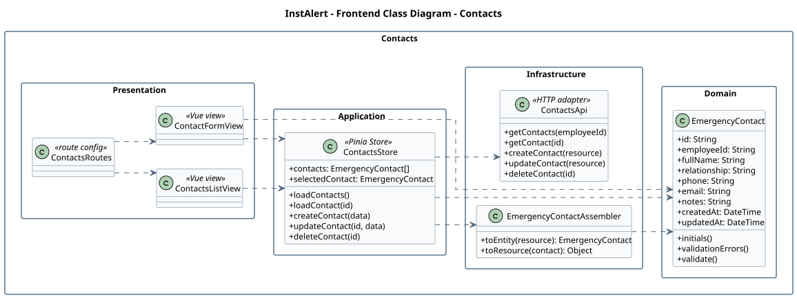 
Nota: Clases frontend del bounded context Contacts.

**Notifications**

Este contexto gestiona las preferencias de recepción y la consulta de notificaciones dirigidas a cada usuario, incluidas las relacionadas con alertas cercanas para administradores y comercios pertinentes. `NotificationsStore` carga las notificaciones persistidas, mantiene el contador de no leídas y coordina el marcado como leído; además, actualiza las preferencias del usuario y presenta avisos recibidos en tiempo real. En la base de datos, la tabla `notifications` conserva cada aviso recibido, mientras `notification_preferences` guarda por separado la configuración de recepción. Una notificación puede referenciar la alerta que la originó mediante su identificador, sin trasladar la propiedad de la alerta desde `Alert`.

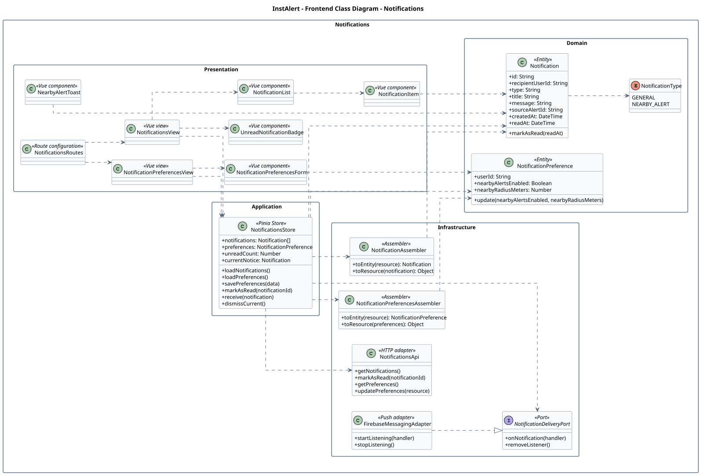 
Nota: Clases frontend del bounded context Notifications.

**Mapping**

Este contexto consulta zonas de riesgo y proyecciones geográficas de incidentes y comercios para mostrarlas en el mapa. `MappingStore` coordina la carga de esos datos y la selección de una zona; el componente `RiskMap` presenta el mapa con Mapbox GL JS. Las alertas y los comercios originales siguen perteneciendo a `Alert` y `Business`, respectivamente.

 
Nota: Clases frontend del bounded context Mapping.

**Payments**

Este contexto proporciona al frontend la información de planes, suscripción y facturación necesaria para las pantallas de pagos. Los planes contemplan límites de 4, 8 y 15 empleados. Una cancelación programada conserva la suscripción activa hasta el final del periodo pagado; el diagrama representa la interacción del cliente con la API y no implica que el pago se procese localmente en el frontend.

 
Nota: Clases frontend del bounded context Payments.

## 4.8. Database Design

### 4.8.1. Database Diagrams

El diseño de base de datos corresponde a un modelo relacional implementable en MySQL. Las tablas están agrupadas visualmente por bounded context y utilizan nombres en inglés con `snake_case`. El esquema aplica las tres primeras formas normales: cada columna contiene un valor atómico, las tablas representan una sola responsabilidad y los atributos no clave dependen de la clave primaria de su tabla.

Las relaciones entre bounded contexts se representan mediante identificadores, sin duplicar la información propietaria de otro contexto. `Shared` no se incluye porque no contiene datos propios del negocio. El esquema contempla siete contextos de negocio.

**Diagrama relacional completo**

 
Nota: Diagrama relacional completo de InstAlert, agrupado por bounded context.

**IAM**

La persistencia de IAM se centra en `users`, que almacena la identidad, las credenciales protegidas, los datos personales y el estado de la cuenta. Los demás contextos referencian al usuario mediante su identificador, sin duplicar sus datos personales.

 
Nota: Tabla del bounded context IAM.

**Business**

Business contiene `businesses`, `business_members` y `staff_invitations`. Las membresías relacionan usuarios con comercios y almacenan el rol que tiene cada usuario dentro de cada comercio. Las invitaciones pendientes reservan un cupo de empleado; el límite disponible depende del plan administrado por Payments.

 
Nota: Tablas del bounded context Business.

**Alert**

Alert contiene `alerts`, `incident_reports` y `alert_preferences`. La alerta conserva su ciclo de vida; el reporte asociado guarda los detalles del incidente y mantiene un estado propio. Los contactos de emergencia y las notificaciones recibidas pertenecen a sus contextos independientes.

 
Nota: Tablas del bounded context Alert.

**Contacts**

Contacts contiene `emergency_contacts`, con los contactos asociados a una membresía del personal operativo. Cada contacto se almacena en su propia fila y referencia a `business_members` mediante un identificador; así, un miembro puede registrar varios contactos sin agruparlos en columnas repetidas.

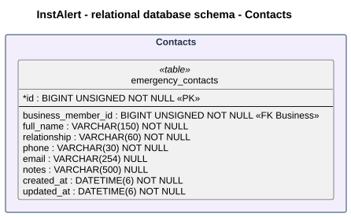 
Nota: Tabla del bounded context Contacts.

**Notifications**

Notifications contiene `notification_preferences` y `notifications`. La primera guarda las preferencias de cada usuario, como la recepción de avisos dentro de la aplicación y el radio de alertas cercanas. La segunda registra cada aviso recibido por su destinatario, incluyendo su tipo, contenido y fecha de creación. `read_at` permanece nulo mientras el aviso no se haya marcado como leído, y `source_alert_id` puede referenciar una alerta relacionada sin trasladar su propiedad desde Alert. De esta forma, las preferencias y la bandeja de notificaciones se mantienen separadas.

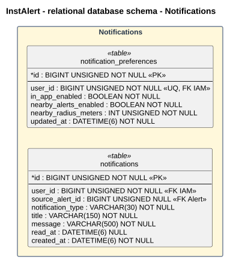 
Nota: Tablas del bounded context Notifications.

**Payments**

Payments contiene los planes, las suscripciones, los medios de pago tokenizados y las transacciones. Las suscripciones se relacionan con un comercio mediante `business_id`; los planes definen límites de 4, 8 y 15 empleados. Las transacciones conservan el importe y la moneda de cada operación. Se almacenan referencias del proveedor y datos enmascarados del medio de pago, no el número completo ni el código de seguridad de una tarjeta.

 
Nota: Tablas del bounded context Payments.

**Mapping**

Mapping contiene las zonas de riesgo, las proyecciones de incidentes y las ubicaciones comerciales utilizadas para consultas geográficas. Las proyecciones referencian los identificadores de origen, pero no reemplazan las tablas autoritativas de Alert o Business.

 
Nota: Tablas del bounded context Mapping.

