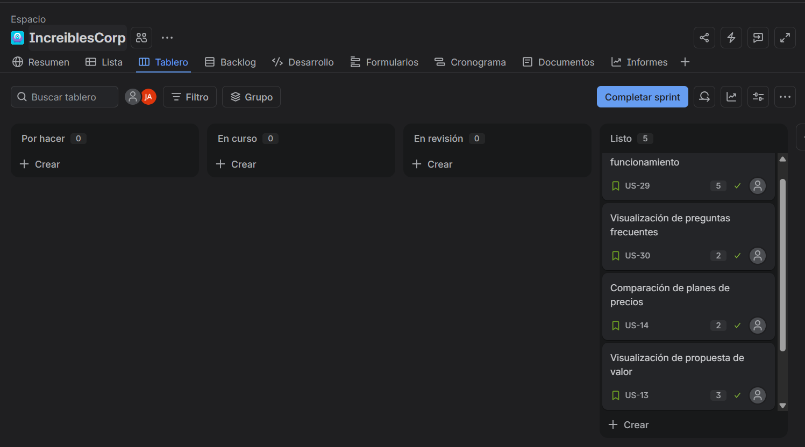

# Capítulo V: Product Implementation, Validation & Deployment

## 5.1. Software Configuration Management
La Gestión de Configuración de Software (SCM) es una disciplina del desarrollo de software que permite identificar, controlar y realizar un seguimiento de los diferentes componentes de un sistema durante todo su ciclo de vida. Su aplicación facilita la organización y administración de los cambios realizados en el código, documentos y demás elementos del proyecto, contribuyendo a un proceso de desarrollo más ordenado y eficiente. De esta manera, busca optimizar el trabajo del equipo y reducir la posibilidad de errores (Martin, 2023).

### 5.1.1. Software Development Environment Configuration
A continuación se listan los productos de software utilizados por el equipo, organizados por tipo de actividad del ciclo de vida. Para cada herramienta se indica su propósito y la ruta de referencia o descarga.

**1. Project Management**

*Descripción:*

La gestión de proyectos es un aspecto esencial en el desarrollo de software, ya que permite organizar y estructurar las actividades necesarias para alcanzar los objetivos de un proyecto. Las herramientas de gestión facilitan la planificación, asignación y seguimiento de tareas, además de favorecer la comunicación y colaboración entre los integrantes del equipo.

Jira (SaaS):

Jira es una plataforma de gestión de proyectos utilizada principalmente en el desarrollo de software y en equipos que trabajan con metodologías ágiles como Scrum y Kanban. La herramienta permite organizar sprints, supervisar el progreso de las tareas y generar informes sobre el rendimiento del equipo, contribuyendo a una mejor planificación y gestión del trabajo.

https://www.atlassian.com/es/software/jira

  

Discord:

Discord es una plataforma de comunicación que permite mantener reuniones y conversaciones en tiempo real mediante canales de texto y voz. En el desarrollo del proyecto, puede utilizarse como medio de comunicación sincrónica para coordinar actividades, realizar reuniones diarias y mantener una comunicación constante entre los integrantes del equipo.

https://discord.com/

 
   

Google Meet:

Google Meet es una herramienta de videoconferencias que permite realizar reuniones virtuales mediante llamadas de audio y video. En el proyecto, se utiliza para llevar a cabo reuniones formales con el equipo, como revisiones de sprint, coordinaciones y otras actividades que requieren comunicación directa.

https://meet.google.com/

 
   

**2. Requirements Management**

UXPressia:

UXPressia es una plataforma utilizada para representar y organizar información relacionada con los usuarios y sus experiencias. En el proyecto se empleará para elaborar User Personas, Empathy Maps, Journey Maps e Impact Maps, facilitando la identificación de necesidades y comportamientos de los usuarios.

https://uxpressia.com/

  

Miro:

Miro es una plataforma colaborativa utilizada para organizar y representar visualmente diferentes elementos del proyecto. En este caso, será utilizada para la elaboración de diagramas de EventStorming y para facilitar el trabajo colaborativo del equipo.

https://miro.com/

  

**3. Product UX/UI Design**

Figma:

Figma es una herramienta de diseño colaborativo en la nube que permite crear interfaces, prototipos y diseños interactivos. Su funcionamiento en línea facilita que los integrantes de un equipo puedan editar, revisar y comentar los diseños en tiempo real, incluso trabajando desde diferentes lugares. Además, resulta especialmente útil en metodologías ágiles, donde las actividades de diseño y desarrollo se realizan de manera paralela.

https://www.figma.com/es-la/

  

Lucidchart:

Lucidchart es una plataforma de diagramación utilizada para elaborar Wireflows y User Flows, además de diagramas UML y Database Design, permitiendo representar visualmente diferentes aspectos del diseño y estructura del sistema.

https://www.lucidchart.com/

  

**4. Software Development**

Visual Studio Code:

Visual Studio Code es un editor de código utilizado como herramienta principal para el desarrollo de la Landing Page y de la Web Application. Permite trabajar con tecnologías como HTML5, CSS3, JavaScript y Vue.js.

https://code.visualstudio.com/

  

Vue.js:

Vue.js es un framework de JavaScript utilizado para el desarrollo del frontend de la Web Application. Permite construir interfaces de usuario dinámicas y componentes reutilizables.

https://vuejs.org/

  

PrimeVue:

PrimeVue es una biblioteca de componentes de interfaz de usuario para Vue.js. Será utilizada para implementar componentes visuales y funcionales en la Web Application.

https://primevue.org/

  

HTML5 / CSS3 / JavaScript:

HTML5, CSS3 y JavaScript serán utilizados como tecnologías principales para el desarrollo de la Landing Page. Asimismo, HTML5 y CSS3 se emplearán en la construcción de templates de la Web Application, mientras que JavaScript será utilizado como lenguaje de programación del frontend.

  

ASP.NET Core:

ASP.NET Core es el framework utilizado para el desarrollo de los Web Services bajo el estilo arquitectónico RESTful API. Permitirá implementar la lógica del backend y los servicios necesarios para la comunicación con el frontend.

https://dotnet.microsoft.com/apps/aspnet

  

Entity Framework Core:

Entity Framework Core es un ORM para .NET utilizado para facilitar la interacción entre los Web Services desarrollados con ASP.NET Core y la base de datos relacional.

https://learn.microsoft.com/ef/core/

  

C#:

C# es el lenguaje de programación utilizado para el desarrollo de los Web Services mediante ASP.NET Core y Entity Framework Core.

https://dotnet.microsoft.com/languages/csharp

  

MySQL Server:

MySQL Server será utilizado como sistema de gestión de bases de datos relacional (RDBMS), permitiendo almacenar y administrar la información utilizada por la aplicación.

https://www.mysql.com/

  

Structurizr:

Structurizr será utilizado para la elaboración de los diagramas de Software Architecture mediante el modelo C4, permitiendo representar la estructura y arquitectura del sistema.

https://structurizr.com/

  

Lucidchart:

Lucidchart será utilizado para la elaboración de diagramas UML y para el Database Design, permitiendo representar la estructura, relaciones y componentes de la solución.

https://www.lucidchart.com/

  

Git:

Git es un sistema de control de versiones distribuido utilizado para gestionar los cambios realizados en el código fuente de manera local. Permite crear ramas, registrar modificaciones y mantener un historial de versiones del proyecto.

https://git-scm.com/

  

GitHub:

GitHub es una plataforma de desarrollo colaborativo basada en Git que permite alojar repositorios, gestionar versiones del código y facilitar el trabajo colaborativo entre los integrantes del equipo mediante ramas, commits y pull requests.

https://github.com/

  

**5. Software Deployment**

GitHub Pages:

GitHub Pages será utilizado como servicio de hosting para realizar el despliegue de la Landing Page estática y de la Web Application (frontend).

https://pages.github.com/

  

Proveedor de hosting en la nube para ASP.NET Core:

Se utilizará un proveedor de hosting en la nube para realizar el despliegue de los Web Services desarrollados con ASP.NET Core. El proveedor definitivo será determinado de acuerdo con las necesidades del proyecto.

  

**6. Software Documentation**

Swagger / OpenAPI:

Swagger será utilizado para documentar los Web Services mediante la especificación OpenAPI, permitiendo visualizar e interactuar con los endpoints disponibles en la RESTful API.

https://swagger.io/

  

Markdown + Visual Studio Code:

Markdown será utilizado para la elaboración y estructuración de la documentación del proyecto dentro del repositorio. Visual Studio Code permitirá editar los archivos Markdown y utilizar extensiones para facilitar su visualización y generación en diferentes formatos.

  

### 5.1.2. Source Code Management

La administración del código fuente es un pilar esencial para el trabajo colaborativo en el desarrollo de InstAlert. En este apartado se define el modelo de organización y control de versiones utilizado por el equipo mediante GitHub y el flujo de trabajo GitFlow. Esta configuración permite mantener el código fuente y la documentación estructurados, trazables y organizados durante el ciclo de vida del proyecto.

Asimismo, se establecen las convenciones utilizadas para la creación de ramas, la escritura de mensajes de commit y la gestión de versiones mediante Semantic Versioning.

**1. Establecimiento de repositorios en GitHub**

Para organizar los distintos componentes de la solución, el proyecto InstAlert se encuentra distribuido en cuatro repositorios públicos dentro de la organización LosIncreiblesCorp. Cada repositorio posee una responsabilidad específica dentro de la solución.

*Landing Page:*  
Repositorio destinado al sitio web promocional e informativo de InstAlert. Contiene la estructura HTML, hojas de estilo CSS, scripts JavaScript y recursos multimedia utilizados para presentar la propuesta de valor, funcionalidades, planes y equipo del producto.

*Frontend Web Application:*  
Repositorio destinado a la aplicación web del lado del cliente. Contiene la estructura, componentes, vistas y lógica de interacción de la Web Application, además del consumo de los servicios proporcionados por la RESTful API.

*Web Services:*  
Repositorio destinado al Backend de InstAlert. Contiene la lógica de negocio, acceso a datos y servicios RESTful desarrollados con ASP.NET Core y Entity Framework Core. Asimismo, incluye los recursos necesarios para las pruebas automatizadas y la documentación de los endpoints mediante OpenAPI/Swagger.

*Project Report:*  
Repositorio destinado a la documentación académica y técnica del proyecto. Contiene el informe desarrollado colaborativamente en Markdown, junto con los recursos gráficos, diagramas y evidencias correspondientes a cada capítulo.

**Enlaces a los repositorios:**

* Repositorio de Landing Page: https://github.com/LosIncreiblesCorp/InstAlert-LandingPage
* Repositorio de Frontend Web Application: https://github.com/LosIncreiblesCorp/Instalert-FrontEnd
* Repositorio de Web Services: https://github.com/LosIncreiblesCorp/Instalert-BackEnd
* Repositorio del Project Report: https://github.com/LosIncreiblesCorp/losIncreibles-project-report

**2. Workflow de control de versiones (GitFlow)**

Para gestionar la integración de nuevas características y coordinar el trabajo colaborativo, el equipo utiliza GitFlow. Este flujo de trabajo permite desarrollar funcionalidades de manera aislada mediante ramas específicas y posteriormente integrarlas de forma controlada a las ramas principales del proyecto.

*Estructura de ramas principales y de soporte:*

| Nombre de la rama | Descripción |
| --- | --- |
| **Main Branch** (`main`) | Representa el estado estable y listo para producción del proyecto. Recibe únicamente cambios previamente integrados, revisados y validados. |
| **Develop Branch** (`develop`) | Funciona como la rama principal de integración. Las nuevas funcionalidades se incorporan aquí antes de preparar una nueva versión del producto. |
| **Feature Branches** (`feature/*`) | Ramas temporales creadas a partir de `develop` para implementar funcionalidades o tareas específicas de manera independiente.   **Convención:** `feature/nombre-de-la-tarea` |
| **Release Branches** (`release/*`) | Ramas utilizadas para preparar una nueva versión del producto. Permiten realizar validaciones finales y correcciones menores antes de integrar los cambios en `main`.   **Convención:** `release/vX.Y.Z` |
| **Hotfix Branches** (`hotfix/*`) | Ramas creadas a partir de `main` para resolver errores críticos detectados en una versión publicada. Posteriormente, los cambios deben incorporarse tanto en `main` como en `develop`.   **Convención:** `hotfix/descripcion-del-parche` |

**3. Versionado Semántico (Semantic Versioning 2.0.0)**

Para identificar y rastrear las versiones publicadas de InstAlert, el equipo utiliza Semantic Versioning (SemVer). Este estándar emplea el formato `MAJOR.MINOR.PATCH`.

* **MAJOR:** Se incrementa cuando se introducen cambios incompatibles con versiones anteriores.
* **MINOR:** Se incrementa cuando se incorporan nuevas funcionalidades compatibles con la versión actual.
* **PATCH:** Se incrementa cuando se realizan correcciones de errores o mejoras menores que no modifican la compatibilidad del producto.

Ejemplos:

* `v1.0.0`: Primera versión estable del producto.
* `v1.1.0`: Incorporación de nuevas funcionalidades manteniendo compatibilidad.
* `v1.1.1`: Corrección de errores de una versión existente.

**4. Convenciones de Mensajes de Commit (Conventional Commits)**

Los mensajes de commit siguen la especificación Conventional Commits con el objetivo de mantener un historial de cambios consistente, comprensible y fácilmente auditable.

La estructura utilizada es:

`type(scope): description`

Los principales tipos utilizados por el equipo son:

* `feat`: Incorporación de una nueva funcionalidad.  
  Ejemplo: `feat(alerts): add panic alert creation`

* `fix`: Corrección de un error o comportamiento inesperado.  
  Ejemplo: `fix(auth): resolve login validation issue`

* `docs`: Cambios realizados exclusivamente en documentación.  
  Ejemplo: `docs(chapter5): update source code management`

* `style`: Cambios de formato o presentación que no modifican la lógica del sistema.  
  Ejemplo: `style(landing): improve responsive team layout`

* `refactor`: Reestructuración de código existente sin modificar su comportamiento externo.  
  Ejemplo: `refactor(alerts): simplify alert processing logic`

* `test`: Incorporación o modificación de pruebas automatizadas.  
  Ejemplo: `test(auth): add authentication unit tests`

* `chore`: Cambios de configuración, mantenimiento o tareas auxiliares que no afectan directamente una funcionalidad del producto.  
  Ejemplo: `chore(repo): update project configuration`

### 5.1.3. Source Code Style Guide & Coding Conventions

En esta sección, el equipo define las normativas y directrices de codificación que se aplicarán a lo largo del desarrollo de la solución. El objetivo principal es estandarizar la escritura del código en HTML, CSS, JavaScript y C#, asegurando que sea legible, mantenible y escalable. 

Como regla transversal, **toda la nomenclatura (variables, métodos, clases, comentarios, etc.) se redactará exclusivamente en inglés**. Para establecer estas bases, nos alinearemos con las siguientes guías de la industria:

* HTML Style Guide and Coding Conventions
* Google HTML/CSS Style Guide
* Google JavaScript Style Guide
* MDN JavaScript Guidelines
* W3C JavaScript Style Guide
* C# Coding Conventions
* Microsoft ASP.NET Core Coding Guidelines

La estructuración e implementación del sistema, desde la Landing Page hasta los Web Services y el Frontend de la aplicación, seguirán reglas estrictas para cada tecnología involucrada.

**Principios Transversales**
* **Idioma:** Todo el nombrado de elementos técnicos y documentación interna debe estar en inglés.
* **DRY (Don't Repeat Yourself):** Evitar la duplicidad de código mediante la creación de componentes y métodos reutilizables.
* **KISS (Keep It Simple, Stupid):** Priorizar la simplicidad y claridad en la lógica de programación.
* **Indentación:** Mantener una indentación estricta y coherente según el lenguaje utilizado.

---

**HTML**

Se utilizará HTML5 para definir la estructura semántica de las interfaces (Landing Page y vistas de la aplicación web).

*Convenciones de Formato y Estructura:*
* **Indentación:** 2 espacios por nivel. No utilizar tabulaciones.
* **Etiquetas y atributos:** Escribir siempre en minúsculas (ej. `<section>`, `<article>`).
* **Comillas:** Usar comillas dobles para los valores de los atributos (ej. `class="container"`).
* **Cierre de etiquetas:** Todas las etiquetas deben cerrarse adecuadamente. Las etiquetas vacías no requieren barra diagonal en HTML5 (ej. usar ` ` en lugar de ` `).
* **Semántica:** Priorizar etiquetas semánticas (`<header>`, `<nav>`, `<main>`, `<footer>`) sobre el uso excesivo de `
`.
* **Accesibilidad:** Incluir siempre el atributo `alt` en las imágenes y usar atributos ARIA cuando sea necesario para tecnologías de asistencia.
* **Documento base:** Declarar siempre `<!DOCTYPE html>` en la primera línea y especificar el idioma principal `<html lang="en">`.

  

---

**CSS**

Se utilizará para controlar la presentación visual, priorizando un diseño modular y responsivo (Mobile-First).

*Convenciones de Formato y Arquitectura:*
* **Indentación:** 2 espacios por nivel.
* **Sintaxis:** Dejar un espacio antes de la llave de apertura `{` y colocar la llave de cierre `}` en una nueva línea. Escribir cada declaración en su propia línea, terminando con punto y coma `;`.
* **Nomenclatura:** Adoptar la metodología BEM (Block, Element, Modifier) para las clases, utilizando guiones bajos dobles para elementos y guiones medios dobles para modificadores (ej. `.card`, `.card__title`, `.card--highlighted`).
* **Orden de propiedades:** Agrupar propiedades lógicamente: Posicionamiento, Modelo de caja (Box model), Tipografía, Aspecto visual (Colores, fondos) y Animaciones.
* **Especificidad y Anidamiento:** Evitar anidar selectores más de 3 niveles de profundidad. Restringir estrictamente el uso de `!important`.
* **Variables:** Utilizar Custom Properties (variables CSS) en la raíz (`:root`) para colores de la marca, tipografías y espaciados estandarizados.

  

---

**JavaScript**

Se aplicará para la interactividad del lado del cliente y el consumo de APIs, priorizando los estándares modernos de ECMAScript (ES6+).

*Convenciones de Formato y Nomenclatura:*
* **Indentación:** 2 espacios.
* **Sintaxis:** Requerir el uso de punto y coma `;` al final de cada instrucción para evitar problemas de ASI (Automatic Semicolon Insertion). Usar comillas simples para strings (`'texto'`).
* **Nomenclatura:** 
  * Variables y funciones: `camelCase` (ej. `fetchUserData`).
  * Clases y Componentes: `PascalCase` (ej. `UserProfile`).
  * Constantes globales: `UPPER_SNAKE_CASE` (ej. `API_BASE_URL`).
* **Declaración de variables:** Usar `const` por defecto. Utilizar `let` únicamente cuando la variable vaya a ser reasignada. Prohibir el uso de `var`.

*Buenas Prácticas Añadidas:*
* **Igualdad Estricta:** Utilizar siempre `===` y `!==` en lugar de `==` y `!=`.
* **Asincronismo:** Preferir `async/await` sobre cadenas extensas de `.then()` para el manejo de promesas, y siempre envolver el bloque lógico en `try/catch` para el manejo de errores.
* **Funciones:** Utilizar arrow functions `() => {}` para callbacks y métodos anónimos para preservar el contexto de `this`.
* **Documentación:** Usar JSDoc para documentar funciones complejas, describiendo parámetros y valores de retorno.

  

---

**C# (.NET Core)**

Se aplicará en el desarrollo de los Web Services y la lógica del lado del servidor, siguiendo las convenciones oficiales de Microsoft.

*Convenciones de Formato y Nomenclatura:*
* **Indentación:** 4 espacios (configuración por defecto en Visual Studio).
* **Llaves:** Utilizar el estilo Allman (cada llave `{` y `}` va en su propia línea).
* **Nomenclatura:**
  * Clases, Métodos y Propiedades Públicas: `PascalCase` (ej. `UserController`, `GetActiveUsers`, `FirstName`).
  * Interfaces: Prefijo `I` seguido de `PascalCase` (ej. `IUserRepository`).
  * Parámetros y variables locales: `camelCase` (ej. `userId`).
  * Campos privados de clase: Prefijo guion bajo seguido de `camelCase` (ej. `_dbContext`).
* **Longitud de línea:** Evitar exceder los 120 caracteres para mejorar la legibilidad en pantallas estándar.

*Buenas Prácticas Añadidas:*
* **Tipado implícito:** Usar la palabra clave `var` cuando el tipo de dato sea evidente en el lado derecho de la asignación (ej. `var users = new List<User>();`).
* **Inyección de Dependencias:** Todos los servicios y repositorios deben ser inyectados a través del constructor, evitando instanciaciones directas (uso de `new`) de clases de lógica de negocio.
* **Controladores ligeros:** Mantener los controladores (Controllers) lo más delgados posible, delegando toda la lógica de negocio a la capa de Servicios (Services).
* **Asincronismo:** Los métodos que realicen operaciones de base de datos o I/O deben ser asíncronos, llevando el sufijo `Async` (ej. `GetUserByIdAsync`) y utilizando `async` y `await`.
* **LINQ:** Aprovechar los métodos de extensión de LINQ para manipular colecciones de forma declarativa y legible.

  

### 5.1.4. Software Deployment Configuration

En esta sección se describe la estrategia de despliegue definida para los productos que conforman la solución InstAlert. Debido a que el alcance del Sprint 1 contempla principalmente el desarrollo y publicación de la Landing Page, actualmente este es el único componente desplegado en un entorno de producción. El despliegue de la Frontend Web Application y los Web Services se realizará en iteraciones posteriores, de acuerdo con el avance del proyecto.

**1. Landing Page**

* **Plataforma de Hosting:** GitHub Pages

* **Proceso de Despliegue:**
  * **Integración:** Las nuevas características se desarrollan en ramas `feature/*` creadas a partir de `develop` y posteriormente se integran mediante Pull Requests.
  * **Preparación de versión:** Una vez que las funcionalidades han sido integradas y validadas, se prepara la versión correspondiente siguiendo el flujo GitFlow.
  * **Pase a producción:** La versión estable se integra en la rama `main`.
  * **Publicación:** GitHub Pages publica automáticamente el contenido estático del repositorio desde la configuración establecida para producción.

* **Estado actual:** Desplegado.
* **URL de Producción:** https://losincreiblescorp.github.io/InstAlert-LandingPage/

**2. Frontend Web Application**

* **Plataforma de Hosting planificada:** Vercel

La Frontend Web Application será desplegada en Vercel en una iteración posterior del proyecto. El proceso previsto considera la integración de las funcionalidades mediante ramas `feature/*`, Pull Requests hacia `develop` y la preparación de una versión estable antes de su incorporación a `main`.

Una vez implementado el frontend, el proceso de construcción utilizará las herramientas correspondientes al proyecto Vue.js, incluyendo la instalación de dependencias y la generación del build de producción. Asimismo, se configurarán las variables de entorno necesarias, como la URL base de los Web Services.

* **Estado actual:** Pendiente de implementación y despliegue.
* **URL de Producción:** No disponible en el Sprint 1.

**3. Web Services**

* **Tecnología:** ASP.NET Core
* **Plataforma de Hosting planificada:** Railway

Los Web Services serán desplegados en Railway en una iteración posterior del proyecto. Previamente, el backend será desarrollado y validado mediante las pruebas correspondientes.

El proceso de despliegue previsto contempla la compilación del proyecto en modo Release mediante el SDK de .NET, la configuración segura de variables de entorno y secretos, como la cadena de conexión de la base de datos y las claves utilizadas para autenticación mediante JWT.

Una vez que los Web Services se encuentren desplegados, sus endpoints serán documentados utilizando OpenAPI/Swagger, permitiendo visualizar y probar las operaciones disponibles de la RESTful API.

* **Estado actual:** Pendiente de implementación y despliegue.
* **URL de Producción (API):** No disponible en el Sprint 1.
## 5.2. Landing Page, Services & Applications Implementation

### 5.2.1. Sprint 1

En este primer sprint se desarrolló la landing page y la documentación inicial del proyecto InstAlert.

#### 5.2.1.1. Sprint Planning 1

| Sprint # | Sprint 1 |
| :--- | :--- |
| **Sprint Planning Background** | |
| Date | 02/09/2026 |
| Time | 11:00 PM |
| Location | Google Meet |
| Prepared By | Sebastian Victor Andre Diaz Mendoza |
| Attendees (to planning meeting) | Jose Gustavo Asto Jacome Sebastian Victor Andre Diaz Mendoza Jean Fabio Noriega Collado Yngrid Nahir Ruiz Villegas Ismael Sebastian Simon Calderon |
| **Sprint 1 Review Summary** | Durante este primer ciclo, los esfuerzos del equipo se centraron en definir la base estratégica e identitaria de InstAlert. Logramos concluir satisfactoriamente los artefactos fundamentales de UX (User Personas, Customer Journey Maps y Arquitectura de la Información), los cuales sirvieron de guía directa para la concepción del producto. Con este respaldo, logramos diseñar, desarrollar y desplegar la versión inicial de nuestra Landing Page, en la cual se expone de forma clara la propuesta de valor del SaaS y los detalles de los planes de suscripción. |
| **Sprint 1 Retrospective Summary** | El equipo concluyó que la dinámica de trabajo fue altamente productiva, impulsada por una clara y equitativa distribución de responsabilidades. Se destacó positivamente la transición y alineación entre el prototipado realizado en Figma y la configuración inicial de los repositorios en GitHub. Como área de mejora para el próximo sprint, acordamos optimizar nuestras estimaciones de tiempo (puntos de historia), especialmente de cara al inicio del desarrollo e integración del lado de la presentacion del producto (frontend). |
| **Sprint Goal & User Stories** | |
| **Sprint 1 Goal** | Nuestro objetivo principal consistió en presentar una primera iteración completamente funcional y desplegada de la Landing Page, a la par de la redacción formal de los primeros capítulos del informe técnico. Consideramos que estos avances nos permiten proyectar una propuesta de valor sólida para captar a nuestro público objetivo, hito que se validará con el tráfico web inicial y la aprobación de la documentación entregada. |
| **Sprint 1 Velocity** | 14 |
| **Sum of Story Points** | 14 |

**Nota:** Cuadro resumen que detalla la planificación estratégica, las metas establecidas, los resultados obtenidos y las métricas de esfuerzo correspondientes al Sprint 1 de InstAlert.

#### 5.2.1.2. Aspect Leaders and Collaborators

| Team Member | GitHub Username | Landing Page | Diseño UI/UX | Documentación |
| :--- | :--- | :--- | :--- | :--- |
| Jose Gustavo Asto Jacome | DhudsQ | Lider | Colaborador | Colaborador |
| Sebastian Victor Andre Diaz Mendoza | DiazDeveloper | Colaborador | Colaborador | Colaborador |
| Jean Fabio Noriega Collado | dumbaskidd | Colaborador | Colaborador | Lider |
| Yngrid Nahir Ruiz Villegas | nahiryn8 | Colaborador | Líder | Colaborador |
| Ismael Sebastian Simon Calderon | Mayel-dev | Colaborador | Colaborador | Colaborador |

**Nota:** Distribución de responsabilidades de los integrantes del equipo durante el Sprint 1, indicando el liderazgo y la colaboración en las principales áreas de trabajo.

#### 5.2.1.3. Sprint Backlog 1

| User Story Id | User Story Title | Story Points | Status |
| :--- | :--- | :---: | :--- |
| US-13 | Visualización de propuesta de valor | 3 | Done |
| US-14 | Comparación de planes de precios | 2 | Done |
| US-15 | Visualización de testimonios | 2 | Done |
| US-29 | Visualización de funcionamiento | 5 | Done |
| US-30 | Visualización de preguntas frecuentes | 2 | Done |
| **Total** |  | **14** |  |

  

#### 5.2.1.4. Development Evidence for Sprint Review

Esta sección expone la evidencia técnica del progreso alcanzado durante el presente sprint con relación a los productos de la solución definidos en el alcance. Se resumen los principales avances en la implementación a través de un registro detallado de las modificaciones en el código fuente. A continuación, se presenta una tabla que incluye los repositorios y sus respectivos commits, documentando el desarrollo estructural, la integración de contenido y la configuración para la Landing Page de InstAlert.

| Repository | Branch | Commit Id | Commit Message | Commit Message Body | Commited on (Date) |
| :--- | :--- | :--- | :--- | :--- | :--- |
| DhudsQ/InstAlert-LandingPage | feature/inicio | 8c9035e | feat(inicio):add site-config file for default Language | Configured the initial site settings and established the default language parameters for the i18n implementation across the main layout. | 10/09/2026 |
| dumbaskidd/InstAlert-LandingPage | feature/planes | 8a6b851 | feat(planes): add base and responsive css styles for pricing section | Implemented the core stylesheet for the subscription plans, ensuring mobile responsiveness and proper alignment of the pricing cards and currency toggle. | 11/09/2026 |
| Mayel-dev/InstAlert-LandingPage | feature/equipo | 4bbfccf | feat(team): add team presentation section | Developed the 'About Us' structure, integrating team member portraits, roles, and the placeholder layout for the promotional video. | 11/09/2026 |
| DiazDeveloper/InstAlert-LandingPage | feature/producto | a8ca125 | feat: agrego estilos, html y js de la seccion producto | Built the interactive 'What We Offer' section, linking the descriptive HTML with its specific CSS styles and interactive JavaScript components. | 12/09/2026 |
| nahiryn8/InstAlert-LandingPage | feature/cierre | e6cc66e | docs(cierre): add help center and legal documentation pdfs | Uploaded the necessary legal assets (Privacy Policy, Terms of Service) and Help Center documentation, linking them directly in the site footer. | 13/09/2026 |
| DhudsQ/InstAlert-LandingPage | main | b54c82e | chore: merge sprint 1 features and trigger deployment |

#### 5.2.1.5. Execution Evidence for Sprint Review

Durante el transcurso del Sprint 1, el esfuerzo de desarrollo se centró en la construcción y despliegue de la Landing Page oficial de InstAlert. Se completaron las historias US-13, US-14, US-15, US-29 y US-30, correspondientes a la propuesta de valor, los planes de precios, los testimonios, el funcionamiento y las preguntas frecuentes.

El alcance completado incluye la estructura base, navegación global, la sección principal de impacto (Hero), los beneficios de la plataforma, la presentación del producto y soluciones, los planes de suscripción, la presentación del equipo, el llamado a la acción final (CTA) y el pie de página con documentación legal. El trabajo fue distribuido equitativamente entre todos los miembros del equipo, logrando un entregable final que comunica eficazmente la propuesta de valor del modelo SaaS B2B.

**Evidencia visual:**

A continuación, se presentan las capturas de pantalla que evidencian las principales vistas y componentes implementados durante este ciclo, indicando el responsable principal de cada apartado según la nueva distribución del repositorio.

**1. Estructura base, Navegación, Hero y Beneficios**

*Desarrollado por: Jose Gustavo Asto Jacome*

  

**2. Presentación del Producto y Soluciones (Qué ofrecemos)**

*Desarrollado por: Sebastián Víctor André Díaz Mendoza*

  

**3. Planes de Suscripción y Selector de Moneda (Pricing)**

*Desarrollado por: Jean Fabio Noriega Collado*

  

**4. Sobre Nosotros y Nuestro Equipo (About Us & Team)**

*Desarrollado por: Ismael Sebastian Simon Calderon*

  

**5. Llamado a la Acción (CTA), Footer y Enlaces Legales**

*Desarrollado por: Yngrid Nahir Ruiz Villegas*

  

**Video del Sprint Review:** [Ver video del Sprint Review del Sprint 1](https://upcedupe-my.sharepoint.com/:v:/g/personal/u20241c630_upc_edu_pe/IQDDu4coMfEFS5u3PVPylCcgAWrLM56l0VTYYK_eO1OWuSk?nav=eyJyZWZlcnJhbEluZm8iOnsicmVmZXJyYWxBcHAiOiJTdHJlYW1XZWJBcHAiLCJyZWZlcnJhbFZpZXciOiJTaGFyZURpYWxvZy1MaW5rIiwicmVmZXJyYWxBcHBQbGF0Zm9ybSI6IldlYiIsInJlZmVycmFsTW9kZSI6InZpZXcifX0%3D&e=ChGf3N)

#### 5.2.1.6. Services Documentation Evidence for Sprint Review

Durante el presente Sprint, los objetivos del equipo se centraron exclusivamente en la ideación, diseño y desarrollo de la Landing Page de InstAlert. 

Dado que el alcance de esta primera iteración no contempló el desarrollo de la lógica del lado del servidor ni la creación de una API RESTful, actualmente no existen servicios web implementados. Por consiguiente, no se han generado endpoints que requieran ser documentados mediante el estándar OpenAPI. Tienes razón en tu observación: el enlace actual de la Landing Page no corresponde a este apartado, ya que aquí solo debe ir la URL del repositorio del backend.

La construcción y documentación de los servicios web está planificada para los siguientes ciclos de desarrollo. Una vez que se inicie la implementación del backend, se empleará Swagger (OpenAPI) para generar la documentación técnica e interactiva. 

En futuras entregas, esta sección se actualizará para incluir estrictamente lo solicitado por las instrucciones del proyecto:

* Una tabla exhaustiva con la relación de los Endpoints implementados.
* Especificación de las acciones soportadas indicando el verbo HTTP correspondiente (GET, POST, PUT, PATCH, DELETE) y la sintaxis de las llamadas.
* Detalle de los parámetros requeridos y la explicación estructurada de las respuestas (Responses).
* Capturas de pantalla que evidencien la interacción funcional con la API a través de la interfaz de Swagger UI, empleando datos de muestra.
* El enlace directo al repositorio de Web Services, junto con el registro de los IDs de los commits asociados exclusivamente a la elaboración de la documentación.

#### 5.2.1.7. Software Deployment Evidence for Sprint Review

Durante el Sprint 1, los esfuerzos del equipo se centraron en configurar y ejecutar el despliegue inicial de la Landing Page de InstAlert. Este proceso garantizó que la propuesta de valor del producto esté accesible públicamente, sentando además las bases para la integración continua. 

Dado que el alcance de esta iteración se limitó a la presentación web estática, aún no se han creado cuentas ni configurado entornos de despliegue para las Web Applications ni para los Web Services. Estas actividades, que involucrarán el uso de plataformas y proveedores de nube específicos (Cloud Providers) para el backend y frontend dinámico, están planificadas para los próximos sprints.

**Actividades de Despliegue Realizadas:**

**1. Configuración del Repositorio de Código Fuente**
* Se estableció un repositorio público dedicado exclusivamente a la Landing Page dentro de la organización del equipo.
* El control de versiones se estructuró para facilitar la automatización de los despliegues.
* Enlace del repositorio: https://github.com/losincreiblescorp/InstAlert-LandingPage

**2. Habilitación y Configuración de GitHub Pages**
* Se activó el servicio de alojamiento estático desde el apartado de configuración (Settings > Pages) del repositorio.
* Se definió la rama main y el directorio raíz (/root) como el entorno de origen para la lectura de los archivos a publicar.
* Mediante esta configuración, el sitio web quedó expuesto de forma segura y pública en la siguiente URL de producción: https://losincreiblescorp.github.io/InstAlert-LandingPage/

  

**3. Automatización del Proceso de Despliegue (CI/CD)**
* Se aprovechó la integración nativa de GitHub Actions para el despliegue automático. 
* El flujo de trabajo garantiza que cada vez que se aprueba un Pull Request y se realiza un merge hacia la rama main, la plataforma detecta los cambios y actualiza el contenido en tiempo real sin requerir intervención manual del equipo de desarrollo.

  

**4. Verificación y Validación en Producción**
* Se validó la correcta carga de todos los recursos (imágenes, estilos, scripts), la estabilidad del diseño responsivo en múltiples resoluciones y el correcto funcionamiento del cambio de idioma (i18n) directamente en la URL pública.

  

#### 5.2.1.8. Team Collaboration Insights during Sprint

Durante este primer Sprint, el equipo se dedicó integralmente a la concepción, diseño e implementación de la Landing Page de InstAlert. Para cumplir con los objetivos trazados, las responsabilidades se dividieron de forma equitativa, asegurando que todos los miembros del equipo tuvieran participación activa y directa en el desarrollo del código fuente, la maquetación y la lógica de la interfaz.

**Actividades de implementación desarrolladas:**

* **Planificación Visual:** Se estructuró el diseño base (wireframes y mockups) de la web para definir claramente la jerarquía de la información, las secciones clave y la paleta de colores.
* **Desarrollo Modular:** La maquetación se dividió en componentes específicos (Hero, Pricing, Testimonials, About Us, Contact, Layout), permitiendo que cada desarrollador trabajara en una rama de característica (`feature/*`) independiente.
* **Integración de Funcionalidades:** Se aplicaron estilos responsivos con CSS y se integró lógica en JavaScript para dotar de interactividad a la página, incluyendo el sistema de internacionalización (i18n) para soportar múltiples idiomas.
* **Gestión de Versiones y Despliegue:** Se empleó GitHub como plataforma central, aplicando flujos de Pull Requests y revisiones de código antes de integrar los cambios a la rama `main` para su posterior publicación en GitHub Pages.

**Analíticas de colaboración en GitHub:**

Para evidenciar el compromiso y la participación equitativa de todos los integrantes, a continuación se presentan los gráficos y registros extraídos directamente de las estadísticas del repositorio del proyecto.

**1. Historial de commits por miembro**

*Desarrollado por: Jean Fabio Noriega Collado (dumbaskidd)*

  

*Desarrollado por: Ismael Sebastian Simon Calderon (Mayel-dev)*

  

*Desarrollado por: Yngrid Nahir Ruiz Villegas (nahiryn8)*

  

*Desarrollado por: Jose Gustavo Asto Jacome (DhudsQ)*

  

*Desarrollado por: Sebastián Víctor André Díaz Mendoza (DiazDeveloper)*

  

**2. Colaboradores activos en el repositorio**

*Esta gráfica demuestra la actividad conjunta del equipo y la distribución de los aportes (adiciones y eliminaciones de código) a lo largo del Sprint.*

  

**3. Histograma de contribuciones en el tiempo**

*Muestra la frecuencia de las confirmaciones (commits) realizadas en los días previos a la revisión del Sprint, evidenciando un esfuerzo constante y coordinado para la integración final.*

  

# Conclusiones

## AV1

A partir del análisis del perfil de la startup InstAlert y su nueva propuesta comercial, se concluye que existe una necesidad crítica y un mercado altamente receptivo para una plataforma integral de seguridad, justificada por el incremento sostenido de delitos y una percepción de inseguridad superior al 80% en el país. El enfoque Lean UX implementado por el equipo demuestra una base sólida al alinear las capacidades técnicas con las exigencias del nuevo segmento objetivo B2B bajo un modelo SaaS (Software as a Service), orientado a organizaciones, administraciones residenciales y entidades que requieran planes de suscripción para gestionar su seguridad. La estrategia del producto es acertada al centralizar la prevención y la reacción inmediata mediante herramientas tecnológicas, mitigando la fragmentación de las soluciones actuales y promoviendo redes colaborativas eficientes.

Se concluye que InstAlert posee una ventaja competitiva clara frente a alternativas institucionales y comerciales tradicionales, al ofrecer una plataforma escalable y adaptable mediante niveles de suscripción. El proceso de investigación y validación permitió redefinir las problemáticas recurrentes, enfocándose no solo en la inseguridad ciudadana, sino en la necesidad de las organizaciones de contar con mecanismos de monitoreo y prevención. Como resultado, se definieron funcionalidades alineadas con los requerimientos operativos de estos nuevos clientes, estableciendo las bases funcionales y comerciales para el desarrollo del sistema.

Con respecto al diseño y la experiencia de usuario, la identidad visual, la arquitectura de información y los flujos de interacción diseñados para InstAlert mantienen una estricta coherencia con los valores de confianza, rapidez y facilidad de uso. La organización jerárquica de los contenidos y la definición de mecanismos de navegación intuitivos contribuyen a reducir la carga cognitiva, facilitando el proceso de adopción de la plataforma por parte de los clientes y sus usuarios finales.

Finalmente, tras la ejecución del primer sprint de desarrollo, se concluye que el diseño y despliegue de la Landing Page constituye un hito fundamental para la validación comercial del proyecto. La implementación de una página web estática y multilingüe (i18n), que expone claramente la propuesta de valor, los planes de suscripción (Pricing), el equipo detrás del desarrollo y casos de éxito (Testimonios), provee a InstAlert de un canal oficial y profesional. Esto no solo fortalece la presencia digital de la marca, sino que establece el principal motor para la captación de leads y futuros clientes interesados en el servicio SaaS.

# Bibliografía

# Anexos

* About the Team: Disponible en futuras entregas

* About the Product Video: Disponible en futuras entregas

## Exposiciones del Proyecto

* Enlace de Exposición AV1: (anexar link)

* Enlace de Exposición TB1: Disponible en futuras entregas

* Enlace de Exposición AV2: Disponible en futuras entregas

* Enlace de Exposición TB2: Disponible en futuras entregas

## Needfinding Interviews

* Interview 1: (Anexar Link)

* Interview 2: (Anexar Link)

* Interview 3: (Anexar Link)

* Interview 4: (Anexar Link)

* Interview 5: (Anexar Link)

* Interview 6: (Anexar Link)

## Validation Interviews

* Interview 1: Disponible en futuras entregas

* Interview 2: Disponible en futuras entregas

* Interview 3: Disponible en futuras entregas

* Interview 4: Disponible en futuras entregas

* Interview 5: Disponible en futuras entregas

* Interview 6: Disponible en futuras entregas

## Execution Evidence

* Sprint 1: <https://upcedupe-my.sharepoint.com/:v:/g/personal/u20241c630_upc_edu_pe/IQDDu4coMfEFS5u3PVPylCcgAWrLM56l0VTYYK_eO1OWuSk?nav=eyJyZWZlcnJhbEluZm8iOnsicmVmZXJyYWxBcHAiOiJTdHJlYW1XZWJBcHAiLCJyZWZlcnJhbFZpZXciOiJTaGFyZURpYWxvZy1MaW5rIiwicmVmZXJyYWxBcHBQbGF0Zm9ybSI6IldlYiIsInJlZmVycmFsTW9kZSI6InZpZXcifX0%3D&e=ChGf3N>
  
* Sprint 2: Disponible en futuras entregas

* Sprint 3: Disponible en futuras entregas

* Sprint 4: Disponible en futuras entregas

### Landing page Desplegada

<https://losincreiblescorp.github.io/InstAlert-LandingPage/>

## Plataforma Desplegada

### InstAlert Web Application

Disponible en futuras entregas

## Repositorios

* Frontend Repository

<https://github.com/instalert-startup/Instalert-FrontEnd>

* Backend Repository

<https://github.com/LosIncreiblesCorp/Instalert-BackEnd>

* Repositorio del Report:

<https://github.com/LosIncreiblesCorp/losIncreibles-project-report>

* Landingpage Repository:

<https://github.com/LosIncreiblesCorp/InstAlert-LandingPage>

## API Documentation

* Swagger / OpenAPI Documentation: Disponible en futuras entregas
