# Capítulo V: Product Implementation, Validation & Deployment

## 5.1. Software Configuration Management.
La Gestión de Configuración de Software (SCM) es una disciplina del desarrollo de software que permite identificar, controlar y realizar un seguimiento de los diferentes componentes de un sistema durante todo su ciclo de vida. Su aplicación facilita la organización y administración de los cambios realizados en el código, documentos y demás elementos del proyecto, contribuyendo a un proceso de desarrollo más ordenado y eficiente. De esta manera, busca optimizar el trabajo del equipo y reducir la posibilidad de errores (Martin, 2023).

### 5.1.1. Software Development Environment Configuration.
A continuación se listan los productos de software utilizados por el equipo, organizados por tipo de actividad del ciclo de vida. Para cada herramienta se indica su propósito y la ruta de referencia o descarga.

**1. Gestión de Proyectos**

*Descripción:*

La gestión de proyectos es un aspecto esencial en el desarrollo de software, ya que permite organizar y estructurar las actividades necesarias para alcanzar los objetivos de un proyecto. Las herramientas de gestión facilitan la planificación, asignación y seguimiento de tareas, además de favorecer la comunicación y colaboración entre los integrantes del equipo.

Jira (SaaS):

Jira es una plataforma de gestión de proyectos utilizada principalmente en el desarrollo de software y en equipos que trabajan con metodologías ágiles como Scrum y Kanban. La herramienta permite organizar Sprints, supervisar el progreso de las tareas y generar informes sobre el rendimiento del equipo, contribuyendo a una mejor planificación y gestión del trabajo.

https://www.atlassian.com/es/software/jira

  

Discord:

Discord es una plataforma de comunicación que permite mantener reuniones y conversaciones en tiempo real mediante canales de texto y voz. En el desarrollo del proyecto, puede utilizarse como medio de comunicación sincrónica para coordinar actividades, realizar reuniones diarias y mantener una comunicación constante entre los integrantes del equipo.

https://discord.com/

 
  

Google Meet:

Google Meet es una herramienta de videoconferencias que permite realizar reuniones virtuales mediante llamadas de audio y video. En el proyecto, se utiliza para llevar a cabo reuniones formales con el equipo, como revisiones de Sprint, coordinaciones y otras actividades que requieren comunicación directa.

https://meet.google.com/

 
  

**2. Gestión de Requisitos**

UXPressia:

UXPressia es una plataforma utilizada para representar y organizar información relacionada con los usuarios y sus experiencias. En el proyecto se empleará para elaborar Personas Usuarias, Mapas de Empatía, Mapas de Viaje del Cliente y Mapas de Impacto, facilitando la identificación de necesidades y comportamientos de los usuarios.

https://uxpressia.com/

  

Miro:

Miro es una plataforma colaborativa utilizada para organizar y representar visualmente diferentes elementos del proyecto. En este caso, será utilizada para la elaboración de diagramas de Event Storming y para facilitar el trabajo colaborativo del equipo.

https://miro.com/

  

**3. Diseño UX/UI del Producto**

Figma:

Figma es una herramienta de diseño colaborativo en la nube que permite crear interfaces, prototipos y diseños interactivos. Su funcionamiento en línea facilita que los integrantes de un equipo puedan editar, revisar y comentar los diseños en tiempo real, incluso trabajando desde diferentes lugares. Además, resulta especialmente útil en metodologías ágiles, donde las actividades de diseño y desarrollo se realizan de manera paralela.

https://www.figma.com/es-la/

  

Lucidchart:

Lucidchart es una plataforma de diagramación utilizada para elaborar Flujos Visuales y Flujos de Usuario, además de diagramas UML y Diseño de Base de Datos, permitiendo representar visualmente diferentes aspectos del diseño y estructura del sistema.

https://www.lucidchart.com/

  

**4. Desarrollo de Software**

Visual Studio Code:

Visual Studio Code es un editor de código utilizado como herramienta principal para el desarrollo de la Página de Aterrizaje y de la Aplicación Web. Permite trabajar con tecnologías como HTML5, CSS3, JavaScript y Vue.js.

https://code.visualstudio.com/

  

Vue.js:

Vue.js es un framework de JavaScript utilizado para el desarrollo del frontend de la Aplicación Web. Permite construir interfaces de usuario dinámicas y componentes reutilizables.

https://vuejs.org/

  

PrimeVue:

PrimeVue es una biblioteca de componentes de interfaz de usuario para Vue.js. Será utilizada para implementar componentes visuales y funcionales en la Aplicación Web.

https://primevue.org/

  

HTML5 / CSS3 / JavaScript:

HTML5, CSS3 y JavaScript serán utilizados como tecnologías principales para el desarrollo de la Página de Aterrizaje. Asimismo, HTML5 y CSS3 se emplearán en la construcción de plantillas de la Aplicación Web, mientras que JavaScript será utilizado como lenguaje de programación del frontend.

  

ASP.NET Core:

ASP.NET Core es el framework utilizado para el desarrollo de los Servicios Web bajo el estilo arquitectónico RESTful API. Permitirá implementar la lógica del backend y los servicios necesarios para la comunicación con el frontend.

https://dotnet.microsoft.com/apps/aspnet

  

Entity Framework Core:

Entity Framework Core es un ORM para .NET utilizado para facilitar la interacción entre los Servicios Web desarrollados con ASP.NET Core y la base de datos relacional.

https://learn.microsoft.com/ef/core/

  

C#:

C# es el lenguaje de programación utilizado para el desarrollo de los Servicios Web mediante ASP.NET Core y Entity Framework Core.

https://dotnet.microsoft.com/languages/csharp

  

MySQL Server:

MySQL Server será utilizado como sistema de gestión de bases de datos relacional (RDBMS), permitiendo almacenar y administrar la información utilizada por la aplicación.

https://www.mysql.com/

  

Structurizr:

Structurizr será utilizado para la elaboración de los diagramas de Arquitectura de Software mediante el modelo C4, permitiendo representar la estructura y arquitectura del sistema.

https://structurizr.com/

  

Lucidchart:

Lucidchart será utilizado para la elaboración de diagramas UML y para el Diseño de Base de Datos, permitiendo representar la estructura, relaciones y componentes de la solución.

https://www.lucidchart.com/

  

Git:

Git es un sistema de control de versiones distribuido utilizado para gestionar los cambios realizados en el código fuente de manera local. Permite crear ramas, registrar modificaciones y mantener un historial de versiones del proyecto.

https://git-scm.com/

  

GitHub:

GitHub es una plataforma de desarrollo colaborativo basada en Git que permite alojar repositorios, gestionar versiones del código y facilitar el trabajo colaborativo entre los integrantes del equipo mediante ramas, confirmaciones y solicitudes de extracción.

https://github.com/

  

**5. Despliegue de Software**

GitHub Pages:

GitHub Pages será utilizado como servicio de hosting para realizar el despliegue de la Página de Aterrizaje estática y de la Aplicación Web (frontend).

https://pages.github.com/

  

Proveedor de hosting en la nube para ASP.NET Core:

Se utilizará un proveedor de hosting en la nube para realizar el despliegue de los Servicios Web desarrollados con ASP.NET Core. El proveedor definitivo será determinado de acuerdo con las necesidades del proyecto.

  

**6. Documentación de Software**

Swagger / OpenAPI:

Swagger será utilizado para documentar los Servicios Web mediante la especificación OpenAPI, permitiendo visualizar e interactuar con los puntos de enlace disponibles en la RESTful API.

https://swagger.io/

  

Markdown + Visual Studio Code:

Markdown será utilizado para la elaboración y estructuración de la documentación del proyecto dentro del repositorio. Visual Studio Code permitirá editar los archivos Markdown y utilizar extensiones para facilitar su visualización y generación en diferentes formatos.

  

### 5.1.2. Source Code Management.

La administración del código fuente es un pilar esencial para el trabajo colaborativo en el desarrollo de InstAlert. En este apartado se define el modelo de organización y control de versiones utilizado por el equipo mediante GitHub y el flujo de trabajo GitFlow. Esta configuración permite mantener el código fuente y la documentación estructurados, trazables y organizados durante el ciclo de vida del proyecto.

Asimismo, se establecen las convenciones utilizadas para la creación de ramas, la escritura de mensajes de confirmación y la gestión de versiones mediante Semantic Versioning.

**1. Establecimiento de repositorios en GitHub**

Para organizar los distintos componentes de la solución, el proyecto InstAlert se encuentra distribuido en cuatro repositorios públicos dentro de la organización LosIncreiblesCorp. Cada repositorio posee una responsabilidad específica dentro de la solución.

*Página de Aterrizaje:*  
Repositorio destinado al sitio web promocional e informativo de InstAlert. Contiene la estructura HTML, hojas de estilo CSS, scripts JavaScript y recursos multimedia utilizados para presentar la propuesta de valor, funcionalidades, planes y equipo del producto.

*Frontend Aplicación Web:*  
Repositorio destinado a la aplicación web del lado del cliente. Contiene la estructura, componentes, vistas y lógica de interacción de la Aplicación Web, además del consumo de los servicios proporcionados por la RESTful API.

*Servicios Web:*  
Repositorio destinado al Backend de InstAlert. Contiene la lógica de negocio, acceso a datos y servicios RESTful desarrollados con ASP.NET Core y Entity Framework Core. Asimismo, incluye los recursos necesarios para las pruebas automatizadas y la documentación de los puntos de enlace mediante OpenAPI/Swagger.

*Informe del Proyecto:*  
Repositorio destinado a la documentación académica y técnica del proyecto. Contiene el informe desarrollado colaborativamente en Markdown, junto con los recursos gráficos, diagramas y evidencias correspondientes a cada capítulo.

**Enlaces a los repositorios:**

* Repositorio de Página de Aterrizaje: https://github.com/LosIncreiblesCorp/InstAlert-LandingPage
* Repositorio de Frontend Aplicación Web: https://github.com/LosIncreiblesCorp/Instalert-FrontEnd
* Repositorio de Servicios Web: https://github.com/LosIncreiblesCorp/Instalert-BackEnd
* Repositorio del Informe del Proyecto: https://github.com/LosIncreiblesCorp/losIncreibles-project-report

**2. Flujo de trabajo de control de versiones (GitFlow)**

Para gestionar la integración de nuevas características y coordinar el trabajo colaborativo, el equipo utiliza GitFlow. Este flujo de trabajo permite desarrollar funcionalidades de manera aislada mediante ramas específicas y posteriormente integrarlas de forma controlada a las ramas principales del proyecto.

*Estructura de ramas principales y de soporte:*

| Nombre de la rama | Descripción |
| --- | --- |
| **Rama Principal** (`main`) | Representa el estado estable y listo para producción del proyecto. Recibe únicamente cambios previamente integrados, revisados y validados. |
| **Rama de Desarrollo** (`develop`) | Funciona como la rama principal de integración. Las nuevas funcionalidades se incorporan aquí antes de preparar una nueva versión del producto. |
| **Ramas de Características** (`feature/*`) | Ramas temporales creadas a partir de `develop` para implementar funcionalidades o tareas específicas de manera independiente.   **Convención:** `feature/nombre-de-la-tarea` |
| **Ramas de Lanzamiento** (`release/*`) | Ramas utilizadas para preparar una nueva versión del producto. Permiten realizar validaciones finales y correcciones menores antes de integrar los cambios en `main`.   **Convención:** `release/vX.Y.Z` |
| **Ramas de Corrección Rápida** (`hotfix/*`) | Ramas creadas a partir de `main` para resolver errores críticos detectados en una versión publicada. Posteriormente, los cambios deben incorporarse tanto en `main` como en `develop`.   **Convención:** `hotfix/descripcion-del-parche` |

**3. Versionado Semántico (Semantic Versioning 2.0.0)**

Para identificar y rastrear las versiones publicadas de InstAlert, el equipo utiliza Semantic Versioning (SemVer). Este estándar emplea el formato `MAJOR.MINOR.PATCH`.

* **MAJOR:** Se incrementa cuando se introducen cambios incompatibles con versiones anteriores.
* **MINOR:** Se incrementa cuando se incorporan nuevas funcionalidades compatibles con la versión actual.
* **PATCH:** Se incrementa cuando se realizan correcciones de errores o mejoras menores que no modifican la compatibilidad del producto.

Ejemplos:

* `v1.0.0`: Primera versión estable del producto.
* `v1.1.0`: Incorporación de nuevas funcionalidades manteniendo compatibilidad.
* `v1.1.1`: Corrección de errores de una versión existente.

**4. Convenciones de Mensajes de Confirmación (Conventional Commits)**

Los mensajes de confirmación siguen la especificación Conventional Commits con el objetivo de mantener un historial de cambios consistente, comprensible y fácilmente auditable.

La estructura utilizada es:

`type(scope): description`

Los principales tipos utilizados por el equipo son:

* `feat`: Incorporación de una nueva funcionalidad.  
  Ejemplo: `feat(alerts): add panic alert creation`

* `fix`: Corrección de un error o comportamiento inesperado.  
  Ejemplo: `fix(auth): resolve login validation issue`

* `docs`: Cambios realizados exclusivamente en documentación.  
  Ejemplo: `docs(chapter5): update source code management`

* `style`: Cambios de formato o presentación que no modifican la lógica del sistema.  
  Ejemplo: `style(landing): improve responsive team layout`

* `refactor`: Reestructuración de código existente sin modificar su comportamiento externo.  
  Ejemplo: `refactor(alerts): simplify alert processing logic`

* `test`: Incorporación o modificación de pruebas automatizadas.  
  Ejemplo: `test(auth): add authentication unit tests`

* `chore`: Cambios de configuración, mantenimiento o tareas auxiliares que no afectan directamente una funcionalidad del producto.  
  Ejemplo: `chore(repo): update project configuration`

### 5.1.3. Source Code Style Guide & Conventions.

En esta sección, el equipo define las normativas y directrices de codificación que se aplicarán a lo largo del desarrollo de la solución. El objetivo principal es estandarizar la escritura del código en HTML, CSS, JavaScript y C#, asegurando que sea legible, mantenible y escalable. 

Como regla transversal, **toda la nomenclatura (variables, métodos, clases, comentarios, etc.) se redactará exclusivamente en inglés**. Para establecer estas bases, nos alinearemos con las siguientes guías de la industria:

* Guía de Estilo y Convenciones de Codificación de HTML
* Guía de Estilo HTML/CSS de Google
* Guía de Estilo de JavaScript de Google
* Directrices de JavaScript de MDN
* Guía de Estilo de JavaScript de W3C
* Convenciones de Codificación de C#
* Directrices de Codificación de ASP.NET Core de Microsoft

La estructuración e implementación del sistema, desde la Página de Aterrizaje hasta los Servicios Web y el Frontend de la aplicación, seguirán reglas estrictas para cada tecnología involucrada.

**Principios Transversales**
* **Idioma:** Todo el nombrado de elementos técnicos y documentación interna debe estar en inglés.
* **DRY (Don't Repeat Yourself):** Evitar la duplicidad de código mediante la creación de componentes y métodos reutilizables.
* **KISS (Keep It Simple, Stupid):** Priorizar la simplicidad y claridad en la lógica de programación.
* **Indentación:** Mantener una indentación estricta y coherente según el lenguaje utilizado.

---

**HTML**

Se utilizará HTML5 para definir la estructura semántica de las interfaces (Página de Aterrizaje y vistas de la aplicación web).

*Convenciones de Formato y Estructura:*
* **Indentación:** 2 espacios por nivel. No utilizar tabulaciones.
* **Etiquetas y atributos:** Escribir siempre en minúsculas (ej. `<section>`, `<article>`).
* **Comillas:** Usar comillas dobles para los valores de los atributos (ej. `class="container"`).
* **Cierre de etiquetas:** Todas las etiquetas deben cerrarse adecuadamente. Las etiquetas vacías no requieren barra diagonal en HTML5 (ej. usar ` ` en lugar de ` `).
* **Semántica:** Priorizar etiquetas semánticas (`<header>`, `<nav>`, `<main>`, `<footer>`) sobre el uso excesivo de `
`.
* **Accesibilidad:** Incluir siempre el atributo `alt` en las imágenes y usar atributos ARIA cuando sea necesario para tecnologías de asistencia.
* **Documento base:** Declarar siempre `<!DOCTYPE html>` en la primera línea y especificar el idioma principal `<html lang="en">`.

  

---

**CSS**

Se utilizará para controlar la presentación visual, priorizando un diseño modular y responsivo (Mobile-First).

*Convenciones de Formato y Arquitectura:*
* **Indentación:** 2 espacios por nivel.
* **Sintaxis:** Dejar un espacio antes de la llave de apertura `{` y colocar la llave de cierre `}` en una nueva línea. Escribir cada declaración en su propia línea, terminando con punto y coma `;`.
* **Nomenclatura:** Adoptar la metodología BEM (Block, Element, Modifier) para las clases, utilizando guiones bajos dobles para elementos y guiones medios dobles para modificadores (ej. `.card`, `.card__title`, `.card--highlighted`).
* **Orden de propiedades:** Agrupar propiedades lógicamente: Posicionamiento, Modelo de caja (Box model), Tipografía, Aspecto visual (Colores, fondos) y Animaciones.
* **Especificidad y Anidamiento:** Evitar anidar selectores más de 3 niveles de profundidad. Restringir estrictamente el uso de `!important`.
* **Variables:** Utilizar Custom Properties (variables CSS) en la raíz (`:root`) para colores de la marca, tipografías y espaciados estandarizados.

  

---

**JavaScript**

Se aplicará para la interactividad del lado del cliente y el consumo de APIs, priorizando los estándares modernos de ECMAScript (ES6+).

*Convenciones de Formato y Nomenclatura:*
* **Indentación:** 2 espacios.
* **Sintaxis:** Requerir el uso de punto y coma `;` al final de cada instrucción para evitar problemas de ASI (Automatic Semicolon Insertion). Usar comillas simples para strings (`'texto'`).
* **Nomenclatura:** 
  * Variables y funciones: `camelCase` (ej. `fetchUserData`).
  * Clases y Componentes: `PascalCase` (ej. `UserProfile`).
  * Constantes globales: `UPPER_SNAKE_CASE` (ej. `API_BASE_URL`).
* **Declaración de variables:** Usar `const` por defecto. Utilizar `let` únicamente cuando la variable vaya a ser reasignada. Prohibir el uso de `var`.

*Buenas Prácticas Añadidas:*
* **Igualdad Estricta:** Utilizar siempre `===` y `!==` en lugar de `==` y `!=`.
* **Asincronismo:** Preferir `async/await` sobre cadenas extensas de `.then()` para el manejo de promesas, y siempre envolver el bloque lógico en `try/catch` para el manejo de errores.
* **Funciones:** Utilizar arrow functions `() => {}` para callbacks y métodos anónimos para preservar el contexto de `this`.
* **Documentación:** Usar JSDoc para documentar funciones complejas, describiendo parámetros y valores de retorno.

  

---

**C# (.NET Core)**

Se aplicará en el desarrollo de los Servicios Web y la lógica del lado del servidor, siguiendo las convenciones oficiales de Microsoft.

*Convenciones de Formato y Nomenclatura:*
* **Indentación:** 4 espacios (configuración por defecto en Visual Studio).
* **Llaves:** Utilizar el estilo Allman (cada llave `{` y `}` va en su propia línea).
* **Nomenclatura:**
  * Clases, Métodos y Propiedades Públicas: `PascalCase` (ej. `UserController`, `GetActiveUsers`, `FirstName`).
  * Interfaces: Prefijo `I` seguido de `PascalCase` (ej. `IUserRepository`).
  * Parámetros y variables locales: `camelCase` (ej. `userId`).
  * Campos privados de clase: Prefijo guion bajo seguido de `camelCase` (ej. `_dbContext`).
* **Longitud de línea:** Evitar exceder los 120 caracteres para mejorar la legibilidad en pantallas estándar.

*Buenas Prácticas Añadidas:*
* **Tipado implícito:** Usar la palabra clave `var` cuando el tipo de dato sea evidente en el lado derecho de la asignación (ej. `var users = new List<User>();`).
* **Inyección de Dependencias:** Todos los servicios y repositorios deben ser inyectados a través del constructor, evitando instanciaciones directas (uso de `new`) de clases de lógica de negocio.
* **Controladores ligeros:** Mantener los controladores (Controllers) lo más delgados posible, delegando toda la lógica de negocio a la capa de Servicios (Services).
* **Asincronismo:** Los métodos que realicen operaciones de base de datos o I/O deben ser asíncronos, llevando el sufijo `Async` (ej. `GetUserByIdAsync`) y utilizando `async` y `await`.
* **LINQ:** Aprovechar los métodos de extensión de LINQ para manipular colecciones de forma declarativa y legible.

  

### 5.1.4. Software Deployment Configuration.

En esta sección se describe la estrategia de despliegue definida para los productos que conforman la solución InstAlert. Debido a que el alcance del Sprint 1 contempla principalmente el desarrollo y la publicación de la Página de Aterrizaje, actualmente este es el único componente desplegado en un entorno de producción. El despliegue de la Frontend Aplicación Web y los Servicios Web se realizará en Sprints posteriores, de acuerdo con el avance del proyecto.

**1. Página de Aterrizaje**

* **Plataforma de Hosting:** GitHub Pages

* **Proceso de Despliegue:**
  * **Integración:** Las nuevas características se desarrollan en ramas `feature/*` creadas a partir de `develop` y posteriormente se integran mediante Solicitudes de extracción.
  * **Preparación de versión:** Una vez que las funcionalidades han sido integradas y validadas, se prepara la versión correspondiente siguiendo el flujo GitFlow.
  * **Pase a producción:** La versión estable se integra en la rama `main`.
  * **Publicación:** GitHub Pages publica automáticamente el contenido estático del repositorio desde la configuración establecida para producción.

* **Estado actual:** Desplegado.
* **URL de Producción:** https://losincreiblescorp.github.io/InstAlert-LandingPage/

**2. Frontend Aplicación Web**

* **Plataforma de Hosting planificada:** Vercel

La Frontend Aplicación Web será desplegada en Vercel en un Sprint posterior. El proceso previsto considera la integración de las funcionalidades mediante ramas `feature/*`, Solicitudes de extracción hacia `develop` y la preparación de una versión estable antes de su incorporación a `main`.

Una vez implementado el frontend, el proceso de construcción utilizará las herramientas correspondientes al proyecto Vue.js, incluyendo la instalación de dependencias y la generación del build de producción. Asimismo, se configurarán las variables de entorno necesarias, como la URL base de los Servicios Web.

* **Estado actual:** Pendiente de implementación y despliegue.
* **URL de Producción:** No disponible durante el Sprint 1.

**3. Servicios Web**

* **Tecnología:** ASP.NET Core
* **Plataforma de Hosting planificada:** Railway

Los Servicios Web serán desplegados en Railway en un Sprint posterior. Previamente, el backend será desarrollado y validado mediante las pruebas correspondientes.

El proceso de despliegue previsto contempla la compilación del proyecto en modo Release mediante el SDK de .NET, la configuración segura de variables de entorno y secretos, como la cadena de conexión de la base de datos y las claves utilizadas para autenticación mediante JWT.

Una vez que los Servicios Web se encuentren desplegados, sus puntos de enlace serán documentados utilizando OpenAPI/Swagger, permitiendo visualizar y probar las operaciones disponibles de la RESTful API.

* **Estado actual:** Pendiente de implementación y despliegue.
* **URL de Producción (API):** No disponible durante el Sprint 1.
## 5.2. Landing Page, Services & Applications Implementation.

### 5.2.1. Sprint 1

Durante el Sprint 1 se desarrollaron la Página de Aterrizaje y la documentación inicial del proyecto InstAlert.

#### 5.2.1.1. Sprint Planning 1.

| Sprint # | Sprint 1 |
| :--- | :--- |
| **Sprint Planning Background** | |
| Date | 02/09/2026 |
| Time | 11:00 PM |
| Location | Google Meet |
| Prepared By | Sebastian Victor Andre Diaz Mendoza |
| Attendees (to planning meeting) | Jose Gustavo Asto Jacome Sebastian Victor Andre Diaz Mendoza Jean Fabio Noriega Collado Yngrid Nahir Ruiz Villegas Ismael Sebastian Simon Calderon |
| **Sprint Goal & User Stories** | |
| **Sprint 1 Goal** | **Nuestro enfoque está en** que los potenciales clientes comprendan la propuesta de valor y las funcionalidades de InstAlert, comparen sus planes y consulten información complementaria en el idioma de su preferencia. **Creemos que esto aportará** mayor claridad y confianza para evaluar si la plataforma responde a las necesidades de su comercio. **Esto se confirmará cuando** la revisión del sitio publicado permita comprobar el acceso a la propuesta de valor, las funcionalidades, los planes en PEN y USD, los testimonios, la explicación de funcionamiento, el equipo, las preguntas frecuentes y la documentación de ayuda y legal. |
| **Sprint 1 Velocity** | 11 |
| **Sum of Puntos de Historia** | 13 |

**Nota:** Cuadro resumen de la planificación, los objetivos, los resultados y las métricas de esfuerzo del Sprint 1 de InstAlert.

#### 5.2.1.2. Aspect Leaders and Collaborators.

Para el Sprint 1, la matriz **Leadership-and-Collaboration Matrix (LACX)** distribuye las responsabilidades entre tres aspectos del alcance:

- **Desarrollo de la Página de Aterrizaje:** construcción e integración de sus secciones, estilos adaptables e interacciones.
- **Diseño UI/UX:** definición de la jerarquía visual y de la presentación de las secciones en distintos tamaños de pantalla.
- **Documentación:** actualización de los artefactos del proyecto y registro de los avances y evidencias del sprint.

Cada aspecto cuenta con un líder y colaboradores para coordinar el trabajo incluido en el sprint.

| **Team Member (Last Name, First Name)** | **GitHub Username** | **Aspect: Landing Page** | **Aspect: UI/UX Design** | **Aspect: Documentation** |
| --------------------------------------- | ------------------- | ----------------------- | ------------------------- | ------------------------- |
| Asto Jácome, José Gustavo                | DhudsQ              | L                       | C                         | C                         |
| Díaz Mendoza, Sebastián Víctor André     | DiazDeveloper       | C                       | C                         | C                         |
| Noriega Collado, Jean Fabio              | dumbaskidd          | C                       | C                         | L                         |
| Ruiz Villegas, Yngrid Nahir              | nahiryn8            | C                       | L                         | C                         |
| Simón Calderón, Ismael Sebastián         | Mayel-dev           | C                       | C                         | C                         |

- **L** = Líder del aspecto
- **C** = Colaborador en el aspecto

**Nota:** La distribución corresponde a los tres aspectos definidos para el alcance del Sprint 1.

#### 5.2.1.3. Sprint Backlog 1.

**Sprint #**: Sprint 1

El Sprint 1 se enfocó en construir y publicar la Landing Page de InstAlert. El objetivo fue presentar la propuesta de valor, los planes, las funcionalidades y la información complementaria del producto. También se inició el trabajo de localización de la página; la configuración del idioma predeterminado se continuó en el Sprint 2.

  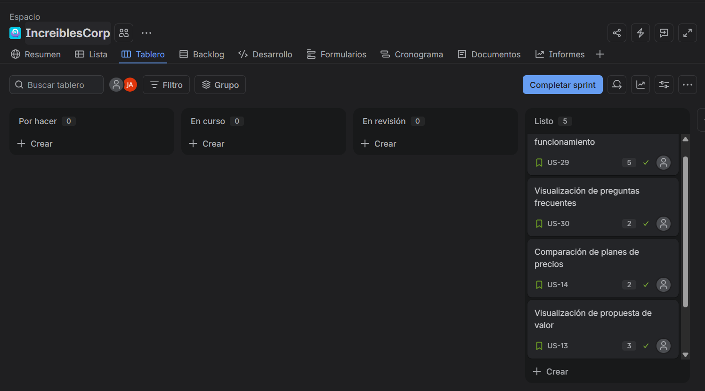

**Enlace de invitación a Jira:** [Acceder al sitio de Jira](https://joseasto24-1785015581364.atlassian.net/?continue=https%3A%2F%2Fjoseasto24-1785015581364.atlassian.net%2Fwelcome%2Fsoftware%3FprojectId%3D10033&atlOrigin=eyJpIjoiM2UwMTY0NzJlODE3NGI3MzgzZDZmMWY2NGY5ZmEwY2MiLCJwIjoiamlyYS1zb2Z0d2FyZSJ9). Se requiere iniciar sesión y contar con acceso al proyecto.

Las horas corresponden a estimaciones del desglose de trabajo. Las asignaciones propuestas siguen los aspectos y líderes definidos en la matriz LACX. Los estados de las tareas se derivan del estado de las historias registradas para el Sprint.

<table border="1" cellpadding="4" cellspacing="0">
  <thead>
    <tr><th>Sprint #</th><th colspan="7">Sprint 1</th></tr>
    <tr><th colspan="2">User Story</th><th colspan="6">Work-Item / Task</th></tr>
    <tr>
      <th>Story Id</th><th>Story Title</th><th>Task Id</th><th>Task Title</th>
      <th>Task Description</th><th>Estimation (Hours)</th><th>Assigned To</th>
      <th>Status (To-do / InProcess / ToReview / Done)</th>
    </tr>
  </thead>
  <tbody>
    <tr><td>US33</td><td>Consultar la propuesta de valor</td><td>S1-T01</td><td>Implementar la sección principal</td><td>Presentar el propósito y el valor de InstAlert en la página.</td><td>4</td><td>José Gustavo Asto Jácome (DhudsQ)</td><td>Done</td></tr>
    <tr><td>US33</td><td>Consultar la propuesta de valor</td><td>S1-T02</td><td>Adaptar la sección a móvil</td><td>Ajustar la presentación de la propuesta de valor a pantallas pequeñas.</td><td>2</td><td>Yngrid Nahir Ruiz Villegas (nahiryn8)</td><td>Done</td></tr>
    <tr><td>US34</td><td>Comparar planes y precios</td><td>S1-T03</td><td>Crear tarjetas de planes</td><td>Mostrar los precios y capacidades de los planes disponibles.</td><td>3</td><td>José Gustavo Asto Jácome (DhudsQ)</td><td>Done</td></tr>
    <tr><td>US34</td><td>Comparar planes y precios</td><td>S1-T04</td><td>Añadir selector de moneda</td><td>Permitir visualizar los precios en PEN y USD.</td><td>3</td><td>José Gustavo Asto Jácome (DhudsQ)</td><td>Done</td></tr>
    <tr><td>US35</td><td>Visualizar testimonios</td><td>S1-T05</td><td>Implementar sección de testimonios</td><td>Presentar las tarjetas de testimonios incluidas en la página.</td><td>3</td><td>Yngrid Nahir Ruiz Villegas (nahiryn8)</td><td>Done</td></tr>
    <tr><td>US37</td><td>Consultar cómo funciona InstAlert</td><td>S1-T06</td><td>Crear sección de funcionamiento</td><td>Explicar visualmente los pasos principales de InstAlert.</td><td>3</td><td>José Gustavo Asto Jácome (DhudsQ)</td><td>Done</td></tr>
    <tr><td>US38</td><td>Consultar preguntas frecuentes</td><td>S1-T07</td><td>Implementar preguntas desplegables</td><td>Mostrar y ocultar las respuestas al seleccionar una pregunta.</td><td>3</td><td>José Gustavo Asto Jácome (DhudsQ)</td><td>Done</td></tr>
    <tr><td>US38</td><td>Consultar preguntas frecuentes</td><td>S1-T08</td><td>Revisar interacción y presentación</td><td>Verificar la lectura y el uso de la sección en distintos tamaños de pantalla.</td><td>2</td><td>Yngrid Nahir Ruiz Villegas (nahiryn8)</td><td>Done</td></tr>
    <tr><td>US46</td><td>Cambiar el idioma de la página</td><td>S1-T09</td><td>Implementar selector y preferencia</td><td>Permitir seleccionar el idioma y conservar la preferencia del visitante.</td><td>2</td><td>José Gustavo Asto Jácome (DhudsQ)</td><td>Done</td></tr>
    <tr><td>US46</td><td>Cambiar el idioma de la página</td><td>S1-T10</td><td>Completar localización predeterminada</td><td>Ajustar el idioma inicial y verificar la traducción de los textos de la página.</td><td>3</td><td>José Gustavo Asto Jácome (DhudsQ)</td><td>InProcess</td></tr>
    <tr><td>US47</td><td>Consultar las funcionalidades principales</td><td>S1-T11</td><td>Crear sección de funcionalidades</td><td>Presentar las capacidades principales de InstAlert.</td><td>3</td><td>José Gustavo Asto Jácome (DhudsQ)</td><td>Done</td></tr>
    <tr><td>US48</td><td>Conocer al equipo detrás de InstAlert</td><td>S1-T12</td><td>Crear sección del equipo</td><td>Mostrar la información del equipo en la Landing Page.</td><td>2</td><td>Yngrid Nahir Ruiz Villegas (nahiryn8)</td><td>Done</td></tr>
    <tr><td>US49</td><td>Consultar el centro de ayuda</td><td>S1-T13</td><td>Enlazar el centro de ayuda</td><td>Añadir el acceso al documento del centro de ayuda desde la página.</td><td>2</td><td>Jean Fabio Noriega Collado (dumbaskidd)</td><td>Done</td></tr>
    <tr><td>US50</td><td>Revisar la privacidad y los términos del servicio</td><td>S1-T14</td><td>Enlazar documentos legales</td><td>Añadir los accesos a la política de privacidad y a los términos del servicio.</td><td>2</td><td>Jean Fabio Noriega Collado (dumbaskidd)</td><td>Done</td></tr>
    <tr><td>—</td><td>Tarea transversal del Sprint</td><td>S1-T15</td><td>Publicar la Landing Page</td><td>Configurar el despliegue y verificar que la página publicada cargue correctamente.</td><td>3</td><td>José Gustavo Asto Jácome (DhudsQ)</td><td>Done</td></tr>
  </tbody>
</table>

#### 5.2.1.4. Development Evidence for Sprint Review.

Esta sección presenta la evidencia técnica del progreso alcanzado durante el Sprint 1 con respecto a los productos incluidos en su alcance. La tabla resume los repositorios, las ramas y las confirmaciones relacionadas con el desarrollo estructural, la integración de contenido y la configuración de la Página de Aterrizaje de InstAlert.

| Repositorio | Rama | ID de Confirmación | Mensaje de Confirmación | Cuerpo del Mensaje de Confirmación | Confirmado en (Fecha) |
| :--- | :--- | :--- | :--- | :--- | :--- |
| DhudsQ/InstAlert-LandingPage | feature/inicio | 8c9035e | feat(inicio):add site-config file for default Language | Configured the initial site settings and established the default language parameters for the i18n implementation across the main layout. | 10/09/2026 |
| dumbaskidd/InstAlert-LandingPage | feature/planes | 8a6b851 | feat(planes): add base and responsive css styles for pricing section | Implemented the core stylesheet for the subscription plans, ensuring mobile responsiveness and proper alignment of the pricing cards and currency toggle. | 11/09/2026 |
| Mayel-dev/InstAlert-LandingPage | feature/equipo | 4bbfccf | feat(team): add team presentation section | Developed the 'About Us' structure, integrating team member portraits, roles, and the placeholder layout for the promotional video. | 11/09/2026 |
| DiazDeveloper/InstAlert-LandingPage | feature/producto | a8ca125 | feat: agrego estilos, html y js de la seccion producto | Built the interactive 'What We Offer' section, linking the descriptive HTML with its specific CSS styles and interactive JavaScript components. | 12/09/2026 |
| nahiryn8/InstAlert-LandingPage | feature/cierre | e6cc66e | docs(cierre): add help center and legal documentation pdfs | Uploaded the necessary legal assets (Privacy Policy, Terms of Service) and Help Center documentation, linking them directly in the site footer. | 13/09/2026 |
| DhudsQ/InstAlert-LandingPage | main | b54c82e | chore: integración iteración 1 features and trigger deployment |

#### 5.2.1.5. Execution Evidence for Sprint Review.

Durante el Sprint 1, el esfuerzo de desarrollo se centró en la construcción y el despliegue de la Página de Aterrizaje oficial de InstAlert. Se completaron las historias US33, US34, US35, US37, US38 y US47–US50, correspondientes a la propuesta de valor, la comparación de planes y precios en PEN y USD, los testimonios, la explicación de funcionamiento, las preguntas frecuentes, las funcionalidades principales, la presentación del equipo y la consulta de documentación de ayuda y legal. La historia US46, relacionada con el cambio de idioma, quedó en progreso: el selector y la persistencia de la preferencia están implementados, pero la página inicia en español y debe ajustarse para cumplir el idioma predeterminado establecido para el proyecto.

El alcance desarrollado incluye la estructura base, navegación global, la sección principal de impacto (Hero), los beneficios de la plataforma, la presentación del producto y sus funcionalidades, los planes de suscripción, la presentación del equipo, las preguntas frecuentes, el llamado a la acción final (CTA) y el pie de página con documentación de ayuda y legal. La historia US36, que contempla la redirección a la aplicación, no forma parte de las historias completadas en este Sprint: los botones de ingreso y registro permanecen desactivados mientras no se configure una URL de destino.

**Evidencia visual:**

A continuación, se presentan capturas de las principales vistas y componentes implementados durante el Sprint 1, junto con el responsable principal de cada apartado según la distribución del repositorio.

**1. Estructura base, Navegación, Hero y Beneficios**

*Desarrollado por: Jose Gustavo Asto Jacome*

  

**2. Presentación del Producto y Soluciones (Qué ofrecemos)**

*Desarrollado por: Sebastián Víctor André Díaz Mendoza*

  

**3. Planes de Suscripción y Selector de Moneda (Precios)**

*Desarrollado por: Jean Fabio Noriega Collado*

  

**4. Sobre Nosotros y Nuestro Equipo (About Us & Team)**

*Desarrollado por: Ismael Sebastian Simon Calderon*

  

**5. Llamado a la Acción (CTA), Footer y Enlaces Legales**

*Desarrollado por: Yngrid Nahir Ruiz Villegas*

  

**Video de la revisión del Sprint:** [Ver video de la revisión del Sprint 1](https://upcedupe-my.sharepoint.com/:v:/g/personal/u20241c630_upc_edu_pe/IQDDu4coMfEFS5u3PVPylCcgAWrLM56l0VTYYK_eO1OWuSk?nav=eyJyZWZlcnJhbEluZm8iOnsicmVmZXJyYWxBcHAiOiJTdHJlYW1XZWJBcHAiLCJyZWZlcnJhbFZpZXciOiJTaGFyZURpYWxvZy1MaW5rIiwicmVmZXJyYWxBcHBQbGF0Zm9ybSI6IldlYiIsInJlZmVycmFsTW9kZSI6InZpZXcifX0%3D&e=ChGf3N)

#### 5.2.1.6. Services Documentation Evidence for Sprint Review.

Durante el Sprint 1, el equipo se centró en la ideación, el diseño, el desarrollo y el despliegue de la Página de Aterrizaje de InstAlert. El alcance no incluyó la implementación de los Servicios Web ni de una API REST, por lo que todavía no hay endpoints disponibles para documentar con OpenAPI. El repositorio destinado a los Servicios Web del proyecto es [InstAlert-BackEnd](https://github.com/LosIncreiblesCorp/Instalert-BackEnd). La documentación de la API se elaborará cuando sus endpoints estén implementados.

| **End Point** | **Funciones** |
| ------------- | ------------- |
| N/A | No hay Web Services ni endpoints documentados con OpenAPI en el Sprint 1, cuyo alcance fue una Página de Aterrizaje estática. |

No hubo commits de documentación OpenAPI asociados a este Sprint.

#### 5.2.1.7. Software Deployment Evidence for Sprint Review.

Durante el Sprint 1, los esfuerzos del equipo se centraron en configurar y ejecutar el despliegue inicial de la Página de Aterrizaje de InstAlert. Este proceso permitió publicar la propuesta de valor del producto y establecer las bases para la integración continua.

Dado que el alcance de este Sprint se limitó a la presentación web estática, aún no se habían creado cuentas ni configurado entornos de despliegue para la Aplicación Web ni para los Servicios Web. Estas actividades están previstas para Sprints posteriores.

**Actividades de Despliegue Realizadas:**

**1. Configuración del Repositorio de Código Fuente**
* Se estableció un repositorio público dedicado exclusivamente a la Página de Aterrizaje dentro de la organización del equipo.
* El control de versiones se estructuró para facilitar la automatización de los despliegues.
* Enlace del repositorio: https://github.com/losincreiblescorp/InstAlert-LandingPage

**2. Habilitación y Configuración de GitHub Pages**
* Se activó el servicio de alojamiento estático desde el apartado de configuración (Configuración > Páginas) del repositorio.
* Se definió la rama main y el directorio raíz (/root) como el entorno de origen para la lectura de los archivos a publicar.
* Mediante esta configuración, el sitio web quedó expuesto de forma segura y pública en la siguiente URL de producción: https://losincreiblescorp.github.io/InstAlert-LandingPage/

  

**3. Automatización del Proceso de Despliegue (CI/CD)**
* Se aprovechó la integración nativa de GitHub Actions para el despliegue automático. 
* El flujo de trabajo garantiza que cada vez que se aprueba un Solicitud de extracción y se realiza un integración hacia la rama main, la plataforma detecta los cambios y actualiza el contenido en tiempo real sin requerir intervención manual del equipo de desarrollo.

  

**4. Verificación y Validación en Producción**
* Se validó la correcta carga de todos los recursos (imágenes, estilos, scripts), la estabilidad del diseño responsivo en múltiples resoluciones y el correcto funcionamiento del cambio de idioma (i18n) directamente en la URL pública.

  

#### 5.2.1.8. Team Collaboration Insights during Sprint.

Durante este primer Sprint, el equipo se dedicó a la concepción, el diseño y la implementación de la Página de Aterrizaje de InstAlert. Las responsabilidades se dividieron entre sus integrantes, quienes participaron en el desarrollo del código fuente, la maquetación y la lógica de la interfaz.

**Actividades de implementación desarrolladas:**

* **Planificación Visual:** Se estructuró el diseño base (esquemas visuales y maquetas) de la web para definir claramente la jerarquía de la información, las secciones clave y la paleta de colores.
* **Desarrollo Modular:** La maquetación se dividió en componentes específicos (Principal, Precios, Testimonios, Sobre Nosotros, Contacto, Estructura), permitiendo que cada desarrollador trabajara en una rama de característica (`feature/*`) independiente.
* **Integración de Funcionalidades:** Se aplicaron estilos responsivos con CSS y se integró lógica en JavaScript para dotar de interactividad a la página, incluyendo el sistema de internacionalización (i18n) para soportar múltiples idiomas.
* **Gestión de Versiones y Despliegue:** Se empleó GitHub como plataforma central, aplicando flujos de Solicitudes de extracción y revisiones de código antes de integrar los cambios a la rama `main` para su posterior publicación en GitHub Pages.

**Analíticas de colaboración en GitHub:**

Para evidenciar el compromiso y la participación equitativa de todos los integrantes, a continuación se presentan los gráficos y registros extraídos directamente de las estadísticas del repositorio del proyecto.

**1. Historial de confirmaciones por miembro**

*Desarrollado por: Jean Fabio Noriega Collado (dumbaskidd)*

  

*Desarrollado por: Ismael Sebastian Simon Calderon (Mayel-dev)*

  

*Desarrollado por: Yngrid Nahir Ruiz Villegas (nahiryn8)*

  

*Desarrollado por: Jose Gustavo Asto Jacome (DhudsQ)*

  

*Desarrollado por: Sebastián Víctor André Díaz Mendoza (DiazDeveloper)*

  

**2. Colaboradores activos en el repositorio**

*Esta gráfica muestra la actividad conjunta del equipo y la distribución de los aportes (adiciones y eliminaciones de código) a lo largo del Sprint.*

  

**3. Histograma de contribuciones en el tiempo**

*Muestra la frecuencia de las confirmaciones realizadas en los días previos a la revisión del Sprint, como evidencia de la actividad de integración del equipo.*

  

### 5.2.2. Sprint 2

#### 5.2.2.1. Sprint Planning 2.

| Sprint # | Sprint 2 |
| :--- | :--- |
| **Sprint Planning Background** | |
| Date | 28/09/2026 |
| Time | 09:00 PM |
| Location | Llamada por Google Meet |
| Prepared By | José Gustavo Asto Jácome |
| Attendees (to planning meeting) | José Gustavo Asto Jácome Sebastián Víctor André Díaz Mendoza Jean Fabio Noriega Collado Yngrid Nahir Ruiz Villegas Ismael Sebastián Simón Calderón |
| Sprint 1 Review Summary | Durante el Sprint 1 se publicó la Landing Page y se completaron historias por 11 de los 13 puntos planificados. La US46 quedó en progreso y la US36 no se abordó porque aún no estaba configurada la URL de destino de la aplicación. |
| Sprint 1 Retrospective Summary | El equipo consideró que la implementación y el despliegue de la Landing Page funcionaron según lo esperado. Los botones destinados a dirigir a los usuarios hacia la aplicación quedaron pendientes porque la página de destino todavía no existía; su configuración se retomaría cuando estuviera disponible. |
| **Sprint Goal & User Stories** | |
| **Sprint 2 Goal** | **Nuestro enfoque está en** entregar una primera versión funcional de la aplicación web para que administradores y personal operativo puedan gestionar información del comercio, reportar y consultar alertas, y revisar incidentes en el mapa; además, completar la redirección desde la Landing Page y el cambio de idioma. **Creemos que esto aportará** una gestión más centralizada y oportuna de la seguridad de los comercios, con un acceso claro a la aplicación. **Esto se confirmará cuando** los flujos priorizados cumplan sus criterios de aceptación durante la revisión del Sprint, usando la API simulada y comprobando los dos recorridos pendientes de la Landing Page. |
| Sprint 2 Velocity | 20 puntos estimados inicialmente al planificar el Sprint |
| Sum of Story Points | 42 puntos de historias de usuario |

#### 5.2.2.2. Aspect Leaders and Collaborators.

Para el Sprint 2 se presenta la matriz **Leadership-and-Collaboration Matrix (LACX)**, que define líderes (**L**) y colaboradores (**C**) para tres aspectos técnicos y funcionales del desarrollo frontend de InstAlert. La aplicación web está construida con **Vite y Vue** y utiliza una API simulada para las operaciones descritas; la Landing Page es estática.

- **Integración Frontend–Backend:** consumo de endpoints de la API simulada, configuración de servicios HTTP y validación de la conexión desde la aplicación desarrollada con Vite y Vue.
- **Gestión de Alertas (UI):** desarrollo de vistas y componentes Vue para reportar y consultar alertas, revisar incidentes y navegar el mapa de riesgos con sus filtros. Incluye los ajustes de navegación de la Landing Page relacionados con el acceso a la aplicación y el idioma.
- **Gestión de Comercios y Personal:** desarrollo de vistas para consultar y administrar empleados, invitaciones y membresías, además de consultar cupos, suscripciones y contactos de emergencia del personal operativo.

| **Team Member (Last Name, First Name)** | **GitHub Username** | **Aspect: API Integration** | **Aspect: Alerts UI** | **Aspect: Commerce and Staff Management** |
| --------------------------------------- | ------------------- | -------------------------- | --------------------- | ---------------------------------------- |
| Asto Jácome, José Gustavo                | DhudsQ              | L                          | C                     | C                                        |
| Díaz Mendoza, Sebastián Víctor André     | DiazDeveloper       | C                          | C                     | C                                        |
| Noriega Collado, Jean Fabio              | dumbaskidd          | C                          | L                     | C                                        |
| Ruiz Villegas, Yngrid Nahir              | nahiryn8            | C                          | C                     | L                                        |
| Simón Calderón, Ismael Sebastián         | Mayel-dev           | C                          | C                     | C                                        |

- **L** = Líder del aspecto
- **C** = Colaborador en el aspecto

La distribución asigna un responsable principal para cada aspecto y mantiene la colaboración entre los cinco integrantes. Los líderes coordinan el seguimiento de sus tareas y las revisiones funcionales correspondientes, mientras que los colaboradores apoyan la implementación y validación del Sprint Backlog.

#### 5.2.2.3. Sprint Backlog 2.

**Sprint #**: Sprint 2

El Sprint 2 se enfocó en entregar una primera versión funcional de la aplicación web frontend. El trabajo incluyó la gestión de personal y contactos de emergencia, el reporte y consulta de alertas, la visualización de incidentes en el mapa y la consulta de la suscripción. También se completaron la redirección desde la Landing Page y la localización iniciada en el Sprint 1.

  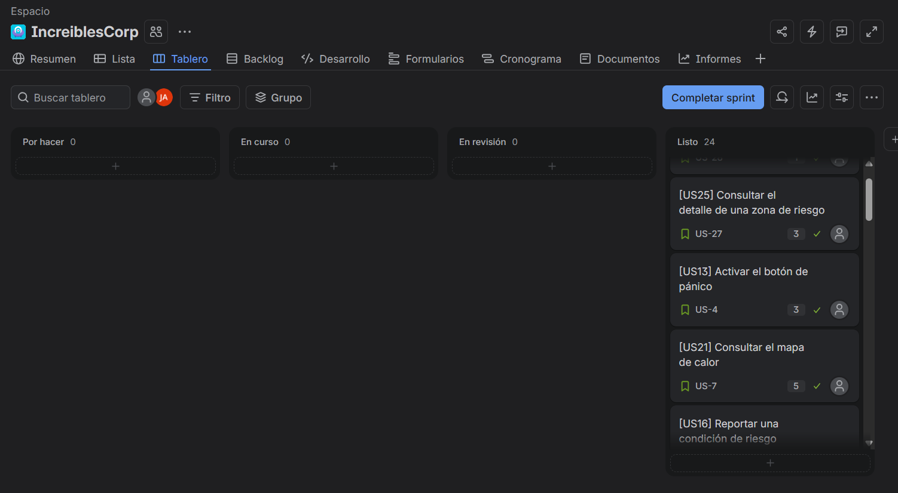

**Enlace de invitación a Jira:** [Acceder al sitio de Jira](https://joseasto24-1785015581364.atlassian.net/?continue=https%3A%2F%2Fjoseasto24-1785015581364.atlassian.net%2Fwelcome%2Fsoftware%3FprojectId%3D10033&atlOrigin=eyJpIjoiM2UwMTY0NzJlODE3NGI3MzgzZDZmMWY2NGY5ZmEwY2MiLCJwIjoiamlyYS1zb2Z0d2FyZSJ9). Se requiere iniciar sesión y contar con acceso al proyecto.

Las horas corresponden a estimaciones del desglose de trabajo. Las asignaciones propuestas siguen los aspectos y líderes definidos en la matriz LACX. Los estados de las tareas se derivan del estado de las historias registradas para el Sprint.

<table border="1" cellpadding="4" cellspacing="0">
  <thead>
    <tr><th>Sprint #</th><th colspan="7">Sprint 2</th></tr>
    <tr><th colspan="2">User Story</th><th colspan="6">Work-Item / Task</th></tr>
    <tr>
      <th>Story Id</th><th>Story Title</th><th>Task Id</th><th>Task Title</th>
      <th>Task Description</th><th>Estimation (Hours)</th><th>Assigned To</th>
      <th>Status (To-do / InProcess / ToReview / Done)</th>
    </tr>
  </thead>
  <tbody>
    <tr><td>US06</td><td>Cancelar una invitación</td><td>S2-T01</td><td>Añadir acción de cancelación</td><td>Permitir cancelar una invitación pendiente y reflejar el cambio en la interfaz.</td><td>3</td><td>Yngrid Nahir Ruiz Villegas (nahiryn8)</td><td>Done</td></tr>
    <tr><td>US07</td><td>Consultar empleados</td><td>S2-T02</td><td>Mostrar lista de empleados</td><td>Presentar los empleados del comercio e indicar el estado de sus membresías.</td><td>4</td><td>Yngrid Nahir Ruiz Villegas (nahiryn8)</td><td>Done</td></tr>
    <tr><td>US08</td><td>Activar o desactivar la membresía de un empleado</td><td>S2-T03</td><td>Cambiar estado de membresía</td><td>Añadir las acciones para activar o desactivar la membresía de un empleado.</td><td>4</td><td>Yngrid Nahir Ruiz Villegas (nahiryn8)</td><td>Done</td></tr>
    <tr><td>US08</td><td>Activar o desactivar la membresía de un empleado</td><td>S2-T04</td><td>Actualizar resumen de cupos</td><td>Reflejar en la interfaz el efecto de la operación sobre los cupos disponibles.</td><td>2</td><td>Yngrid Nahir Ruiz Villegas (nahiryn8)</td><td>Done</td></tr>
    <tr><td>US09</td><td>Editar los datos de un empleado</td><td>S2-T05</td><td>Implementar edición de empleado</td><td>Permitir modificar y guardar los datos editables del empleado.</td><td>3</td><td>Yngrid Nahir Ruiz Villegas (nahiryn8)</td><td>Done</td></tr>
    <tr><td>US11</td><td>Consultar invitaciones</td><td>S2-T06</td><td>Mostrar invitaciones y estados</td><td>Presentar las invitaciones del comercio junto con su estado actual.</td><td>2</td><td>Yngrid Nahir Ruiz Villegas (nahiryn8)</td><td>Done</td></tr>
    <tr><td>US41</td><td>Consultar los cupos del plan</td><td>S2-T07</td><td>Mostrar desglose de cupos</td><td>Presentar el límite del plan y los cupos ocupados, reservados y disponibles.</td><td>3</td><td>Yngrid Nahir Ruiz Villegas (nahiryn8)</td><td>Done</td></tr>
    <tr><td>US13</td><td>Activar el botón de pánico</td><td>S2-T08</td><td>Implementar activación de alerta</td><td>Permitir iniciar una alerta de pánico desde la interfaz.</td><td>5</td><td>Jean Fabio Noriega Collado (dumbaskidd)</td><td>Done</td></tr>
    <tr><td>US13</td><td>Activar el botón de pánico</td><td>S2-T09</td><td>Añadir cuenta regresiva cancelable</td><td>Permitir cancelar la activación antes del envío de la alerta, sin fijar una duración no confirmada.</td><td>3</td><td>Jean Fabio Noriega Collado (dumbaskidd)</td><td>Done</td></tr>
    <tr><td>US14</td><td>Reportar una actividad sospechosa</td><td>S2-T10</td><td>Crear formulario de actividad sospechosa</td><td>Capturar y enviar los datos requeridos para reportar una actividad sospechosa.</td><td>3</td><td>Jean Fabio Noriega Collado (dumbaskidd)</td><td>Done</td></tr>
    <tr><td>US15</td><td>Reportar un evento pasado</td><td>S2-T11</td><td>Crear formulario de evento pasado</td><td>Permitir registrar información de un incidente ocurrido anteriormente.</td><td>3</td><td>Jean Fabio Noriega Collado (dumbaskidd)</td><td>Done</td></tr>
    <tr><td>US16</td><td>Reportar una condición de riesgo</td><td>S2-T12</td><td>Crear formulario de condición de riesgo</td><td>Permitir informar una condición que representa un riesgo de seguridad.</td><td>3</td><td>Jean Fabio Noriega Collado (dumbaskidd)</td><td>Done</td></tr>
    <tr><td>US19</td><td>Consultar el historial de alertas</td><td>S2-T13</td><td>Mostrar historial de alertas</td><td>Presentar los registros disponibles para consultar alertas anteriores.</td><td>3</td><td>Jean Fabio Noriega Collado (dumbaskidd)</td><td>Done</td></tr>
    <tr><td>US44</td><td>Completar un reporte después de resolver una alerta</td><td>S2-T14</td><td>Completar reporte pendiente</td><td>Permitir ingresar los detalles pendientes y conservar la alerta como resuelta.</td><td>3</td><td>Jean Fabio Noriega Collado (dumbaskidd)</td><td>Done</td></tr>
    <tr><td>US21</td><td>Consultar el mapa de calor</td><td>S2-T15</td><td>Mostrar incidentes geolocalizados</td><td>Representar en el mapa las ubicaciones de los incidentes reportados.</td><td>5</td><td>Jean Fabio Noriega Collado (dumbaskidd)</td><td>Done</td></tr>
    <tr><td>US22</td><td>Consultar incidentes por zona</td><td>S2-T16</td><td>Consultar incidentes de una zona</td><td>Mostrar los incidentes asociados a la zona seleccionada en el mapa.</td><td>3</td><td>Jean Fabio Noriega Collado (dumbaskidd)</td><td>Done</td></tr>
    <tr><td>US23</td><td>Consultar el detalle de un incidente</td><td>S2-T17</td><td>Mostrar detalle del incidente</td><td>Presentar la información registrada al seleccionar un incidente.</td><td>2</td><td>Jean Fabio Noriega Collado (dumbaskidd)</td><td>Done</td></tr>
    <tr><td>US24</td><td>Filtrar el mapa</td><td>S2-T18</td><td>Implementar filtros del mapa</td><td>Aplicar y limpiar filtros sobre los incidentes mostrados en el mapa.</td><td>3</td><td>Jean Fabio Noriega Collado (dumbaskidd)</td><td>Done</td></tr>
    <tr><td>US25</td><td>Consultar el detalle de una zona de riesgo</td><td>S2-T19</td><td>Mostrar detalle de zona</td><td>Presentar la información de riesgo disponible para la zona seleccionada.</td><td>3</td><td>Jean Fabio Noriega Collado (dumbaskidd)</td><td>Done</td></tr>
    <tr><td>US42</td><td>Cambiar el plan de suscripción</td><td>S2-T20</td><td>Implementar selección de plan</td><td>Permitir seleccionar otro plan y reflejar el resultado de la operación simulada.</td><td>4</td><td>José Gustavo Asto Jácome (DhudsQ)</td><td>Done</td></tr>
    <tr><td>US45</td><td>Consultar el estado de la suscripción</td><td>S2-T21</td><td>Mostrar estado de suscripción</td><td>Presentar el plan y periodo vigentes, incluida una cancelación programada si corresponde.</td><td>3</td><td>José Gustavo Asto Jácome (DhudsQ)</td><td>Done</td></tr>
    <tr><td>US30</td><td>Añadir un contacto de emergencia</td><td>S2-T22</td><td>Crear formulario de contacto</td><td>Permitir registrar un contacto de emergencia propio.</td><td>3</td><td>Yngrid Nahir Ruiz Villegas (nahiryn8)</td><td>Done</td></tr>
    <tr><td>US31</td><td>Editar un contacto de emergencia</td><td>S2-T23</td><td>Editar contacto registrado</td><td>Permitir actualizar los datos de un contacto existente.</td><td>2</td><td>Yngrid Nahir Ruiz Villegas (nahiryn8)</td><td>Done</td></tr>
    <tr><td>US32</td><td>Eliminar un contacto de emergencia</td><td>S2-T24</td><td>Eliminar contacto</td><td>Solicitar confirmación y retirar el contacto de la lista.</td><td>2</td><td>Yngrid Nahir Ruiz Villegas (nahiryn8)</td><td>Done</td></tr>
    <tr><td>US36</td><td>Redirigirse a la aplicación</td><td>S2-T25</td><td>Configurar botones de acceso</td><td>Dirigir las llamadas a la acción de la Landing Page a la aplicación.</td><td>2</td><td>José Gustavo Asto Jácome (DhudsQ)</td><td>Done</td></tr>
    <tr><td>US46</td><td>Cambiar el idioma de la página</td><td>S2-T26</td><td>Completar localización</td><td>Configurar el idioma predeterminado requerido y verificar el cambio y persistencia del idioma.</td><td>4</td><td>José Gustavo Asto Jácome (DhudsQ)</td><td>Done</td></tr>
  </tbody>
</table>

#### 5.2.2.4. Development Evidence for Sprint Review.

Las siguientes confirmaciones corresponden a cambios representativos implementados en el repositorio frontend durante el Sprint 2. Se incluyen ramas integradas a `develop` y commits asociados a los bounded contexts trabajados.

| Repositorio | Rama | ID de confirmación | Mensaje de confirmación | Descripción del cambio | Confirmado en (fecha) |
| :--- | :--- | :--- | :--- | :--- | :---: |
| [LosIncreiblesCorp/Instalert-FrontEnd](https://github.com/LosIncreiblesCorp/Instalert-FrontEnd) | `feature/alerts` → `develop` | `f067530` | `feat(alerts): implement reporting and history views` | Se implementaron las vistas de reporte de alertas y consulta del historial para el personal operativo. | 03/10/2026 |
| [LosIncreiblesCorp/Instalert-FrontEnd](https://github.com/LosIncreiblesCorp/Instalert-FrontEnd) | `feature/mapping` → `develop` | `4103cec` | `feat(mapping): filter incidents by category and show selection` | Se añadió el filtrado de incidentes por categoría y la visualización de los filtros seleccionados en el mapa de riesgos. | 03/10/2026 |
| [LosIncreiblesCorp/Instalert-FrontEnd](https://github.com/LosIncreiblesCorp/Instalert-FrontEnd) | `feature/business` → `develop` | `ff05cc0` | `feat(business): manage staff and invitations with seat limits` | Se incorporó la gestión de empleados e invitaciones considerando los límites de cupos del plan. | 04/10/2026 |
| [LosIncreiblesCorp/Instalert-FrontEnd](https://github.com/LosIncreiblesCorp/Instalert-FrontEnd) | `feature/payments` → `develop` | `084d292` | `feat(payments): add subscription views and UI components` | Se agregaron la vista de suscripción y los componentes para mostrar planes y el resumen de la suscripción. | 02/10/2026 |
| [LosIncreiblesCorp/Instalert-FrontEnd](https://github.com/LosIncreiblesCorp/Instalert-FrontEnd) | `feature/contacts` → `develop` | `557b75b` | `feat(contacts): add emergency contact creation and editing form` | Se implementó el formulario para crear y editar contactos de emergencia. | 04/10/2026 |

#### 5.2.2.5. Execution Evidence for Sprint Review.

Durante el Sprint 2 se desarrollaron vistas de la aplicación web para las principales tareas del personal operativo y de los administradores de comercios. La evidencia incluye la consulta del mapa de riesgo, la activación y resolución de alertas, el registro de incidentes y la gestión de contactos de emergencia. También se muestran las interfaces administrativas para gestionar al personal, enviar invitaciones y consultar la suscripción y los cupos del plan. Las capturas documentan las pantallas y los flujos de interacción implementados en el frontend.

**Evidencia visual:**

**1. Mapa de riesgo y detalle de zona**

La vista presenta incidentes y comercios sobre el mapa, junto con la simbología de los niveles de riesgo. El panel lateral muestra el detalle de la zona seleccionada y los incidentes asociados.

  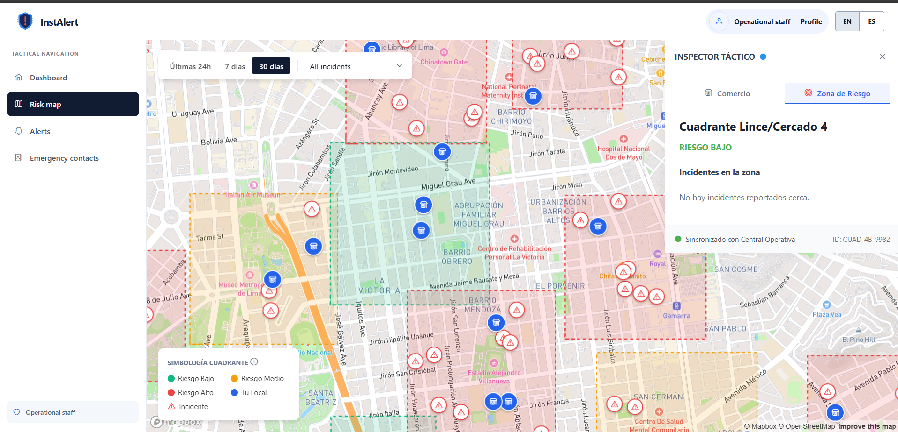

**2. Centro de alertas**

La pantalla reúne el acceso a la alerta de pánico, el historial y las opciones para reportar incidentes, actividades sospechosas u otras condiciones de riesgo. También indica cuando existe un reporte pendiente de completar.

  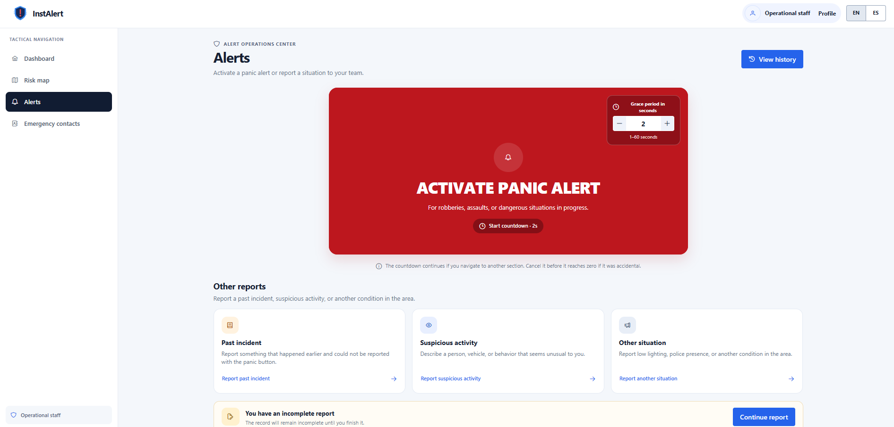

**3. Gestión de contactos de emergencia**

La lista permite consultar los contactos de emergencia registrados y acceder a las acciones para añadir, editar o eliminar un contacto.

  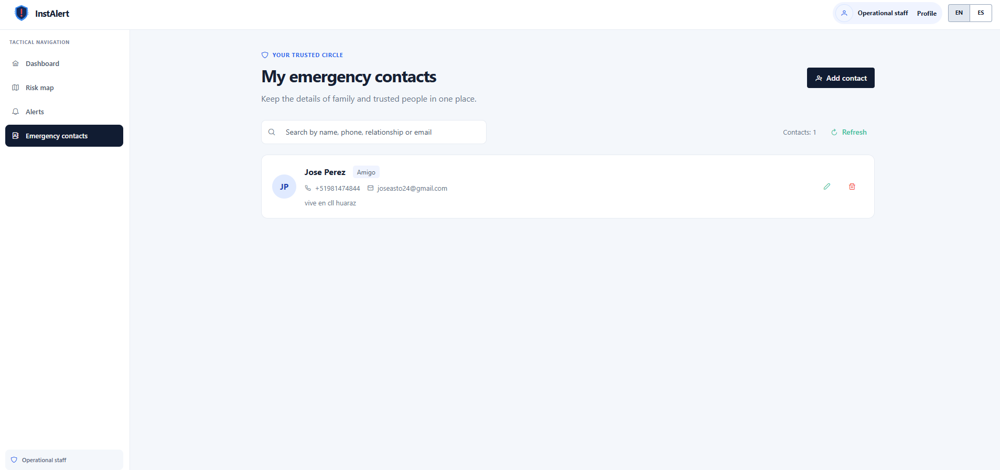

**4. Registro de actividad sospechosa**

El formulario permite seleccionar el tipo de incidente y registrar su ubicación, fecha, hora y descripción para comunicar lo observado.

  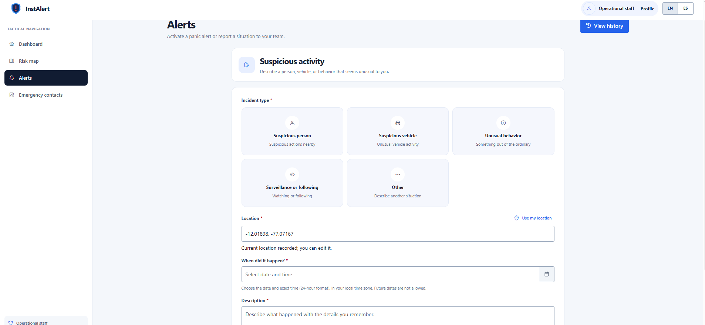

**5. Alerta de pánico activa**

La vista muestra el estado de una alerta activa, el tiempo transcurrido y la ubicación registrada, además de la acción para indicar que la situación peligrosa terminó.

  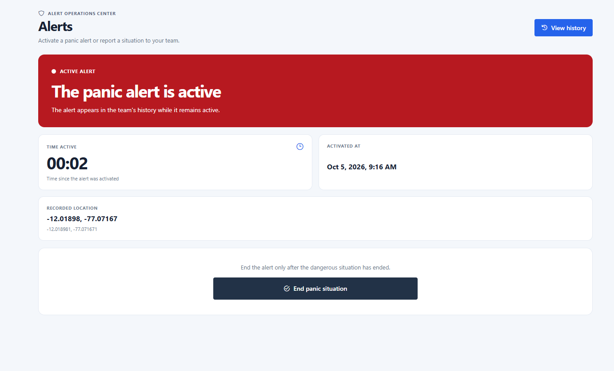

**6. Gestión del personal del comercio**

La pantalla administrativa presenta el límite del plan y el desglose de cupos ocupados, reservados y disponibles. También lista a los empleados y sus estados, con acciones de gestión e ingreso a las invitaciones.

  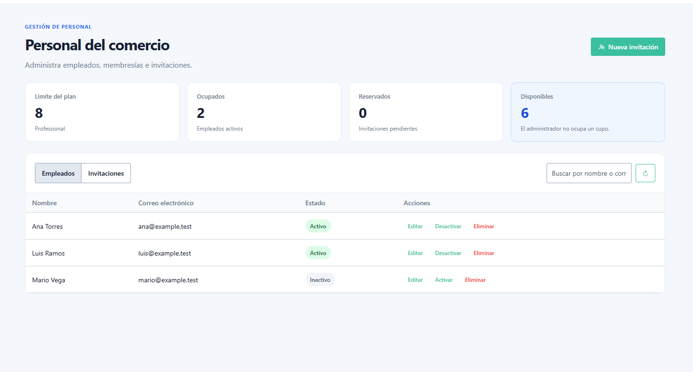

**7. Creación de invitación para un empleado**

El formulario permite ingresar el nombre y el correo electrónico del empleado, e informa los cupos disponibles antes de crear la invitación.

  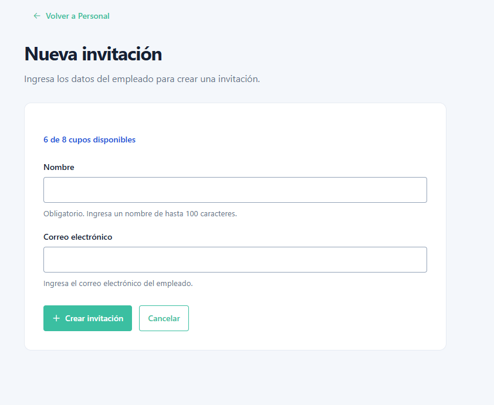

**8. Suscripción y facturación**

La vista permite consultar el plan vigente, el uso de cupos y las alternativas disponibles, incluidos los controles de moneda y periodicidad de pago.

  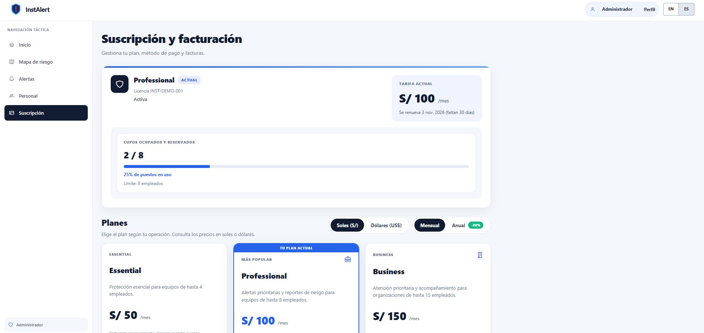

**Video de recorrido del Sprint 2:** [Ver video de la revisión del Sprint 2](https://upcedupe-my.sharepoint.com/:v:/g/personal/u20241c630_upc_edu_pe/IQD_XVhTUYmdR6-AwlPqkF1rAVeVKAK3R8NVx2AJ5A-0M30?nav=eyJyZWZlcnJhbEluZm8iOnsicmVmZXJyYWxBcHAiOiJTdHJlYW1XZWJBcHAiLCJyZWZlcnJhbFZpZXciOiJTaGFyZURpYWxvZy1MaW5rIiwicmVmZXJyYWxBcHBQbGF0Zm9ybSI6IldlYiIsInJlZmVycmFsTW9kZSI6InZpZXcifX0%3D&e=XkCFOg)

#### 5.2.2.6. Services Documentation Evidence for Sprint Review.

Durante el Sprint 2, el equipo desarrolló la aplicación web frontend de InstAlert y utilizó JSON Server como una API simulada desplegada en Render para probar las vistas con datos de muestra. No se elaboraron documentos OpenAPI ni se implementaron los Web Services definitivos con ASP.NET Core; por ello, el enlace al servidor simulado no se presenta como documentación oficial de endpoints.

| **End Point** | **Funciones** |
| ------------- | ------------- |
| N/A (sin documentación OpenAPI) | El frontend consumió recursos REST simulados por JSON Server. URL base del mock desplegado: [https://instalert-frontend-2bmr.onrender.com/](https://instalert-frontend-2bmr.onrender.com/). |

El repositorio destinado a los Servicios Web del proyecto es [InstAlert-BackEnd](https://github.com/LosIncreiblesCorp/Instalert-BackEnd). No hubo commits de documentación OpenAPI asociados a este Sprint. Las capturas de la sección anterior corresponden a la interfaz frontend y no a una documentación OpenAPI.

#### 5.2.2.7. Software Deployment Evidence for Sprint Review.

Durante el Sprint 2 se publicó la Web Application de InstAlert en Firebase Hosting, se desplegó en Render una API simulada con JSON Server y se mantuvo disponible la Landing Page mediante GitHub Pages. Las capturas muestran el estado de publicación de la aplicación y de la Landing Page, así como la ejecución exitosa del flujo de despliegue de esta última. JSON Server se utilizó como mock para el frontend; no corresponde a los Web Services definitivos del proyecto implementados con ASP.NET Core.

**1. Despliegue de la Web Application en Firebase Hosting**

La aplicación web está disponible en [https://instalert-c3f7f.web.app/](https://instalert-c3f7f.web.app/). La consola de Firebase muestra el proyecto InstAlert y el historial de implementación, con una publicación registrada el 4 de octubre de 2026 a las 11:13 p. m. La siguiente captura evidencia el servicio de Hosting y el estado de la implementación.

  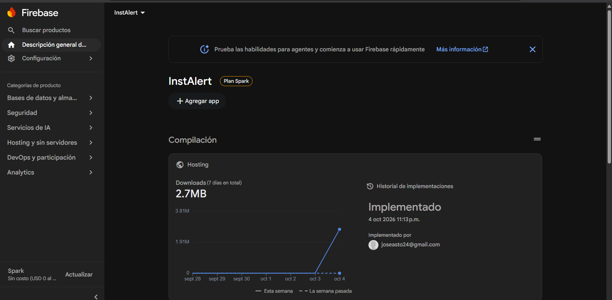

La siguiente captura muestra la pantalla de selección de perfil al ingresar a la Web Application publicada.

  

**2. Despliegue de la API simulada en Render**

Para permitir que la Web Application publicada consuma datos de prueba, se desplegó el servidor JSON Server en Render. La URL base configurada para el mock es [https://instalert-frontend-2bmr.onrender.com/](https://instalert-frontend-2bmr.onrender.com/). Este servicio simula las operaciones de la API durante el desarrollo y no sustituye a los Web Services definitivos en ASP.NET Core.

La consola de Render muestra el servicio en estado **Live** y su historial de despliegues, incluidos despliegues completados correctamente.

  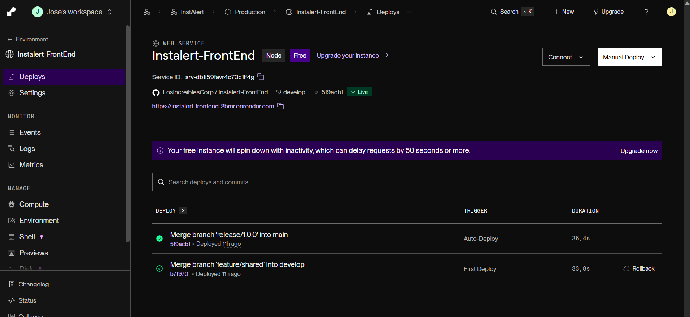

**3. Despliegue de la Landing Page en GitHub Pages**

La Landing Page está disponible en [https://losincreiblescorp.github.io/InstAlert-LandingPage/](https://losincreiblescorp.github.io/InstAlert-LandingPage/). La configuración de GitHub Pages utiliza la rama `main` y la carpeta raíz del repositorio como fuente de publicación.

  

La captura de configuración confirma la URL publicada y la fuente seleccionada. Además, la ejecución mostrada en GitHub Actions presenta como exitosas las verificaciones de compilación, despliegue y reporte del estado.

  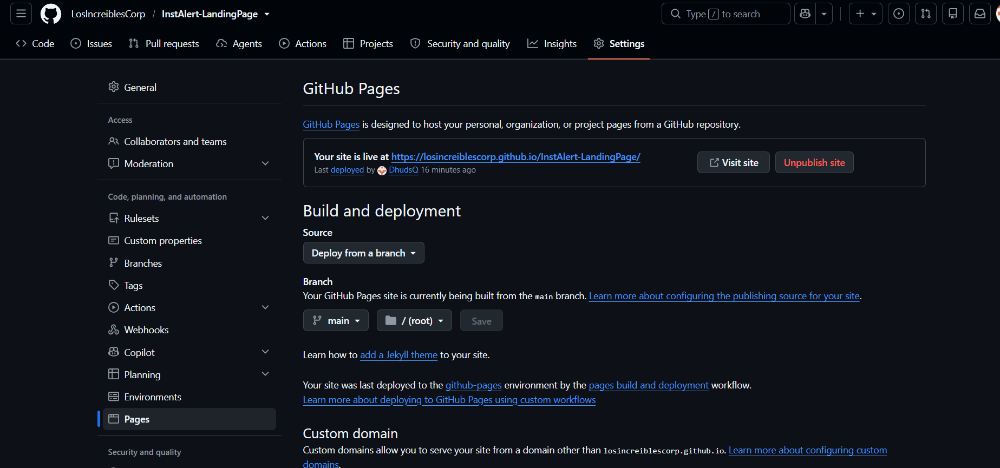

  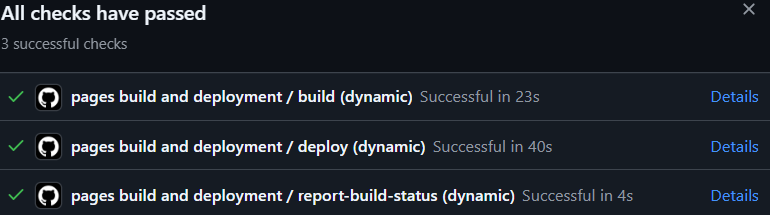

#### 5.2.2.8. Team Collaboration Insights during Sprint.

Durante el Sprint 2, el equipo colaboró en el repositorio frontend de InstAlert mediante contribuciones al código, trabajo en ramas y su integración en las ramas principales del proyecto. Las siguientes capturas corresponden a las analíticas e historial de ese repositorio. Las cifras del panel de contribuidores son acumuladas para el periodo visible en GitHub y no representan exclusivamente los commits del Sprint 2; por ello, se presentan como contexto de la actividad del equipo.

**1. Analíticas de contribución del repositorio frontend**

La vista de contribuidores registra actividad de los cinco integrantes en el repositorio. El resumen mostrado por GitHub presenta los siguientes conteos acumulados al momento de la captura:

| Integrante | GitHub Username | Commits acumulados |
| :--- | :--- | ---: |
| José Gustavo Asto Jácome | DhudsQ | 87 |
| Yngrid Nahir Ruiz Villegas | nahiryn8 | 25 |
| Ismael Sebastián Simón Calderón | Mayel-dev | 17 |
| Jean Fabio Noriega Collado | dumbaskidd | 14 |
| Sebastián Víctor André Díaz Mendoza | DiazDeveloper | 1 |

El gráfico general resume la distribución de commits entre contribuidores. El detalle individual permite observar también la actividad registrada por mes; las barras visibles en octubre muestran actividad reciente de los cinco usuarios, aunque el conteo total de cada perfil abarca más que este Sprint.

  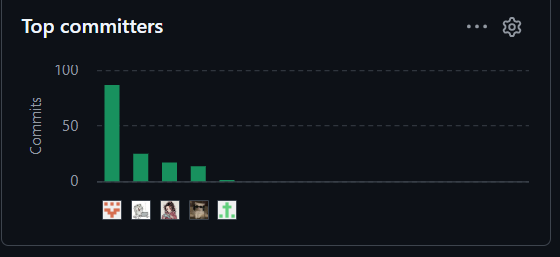

  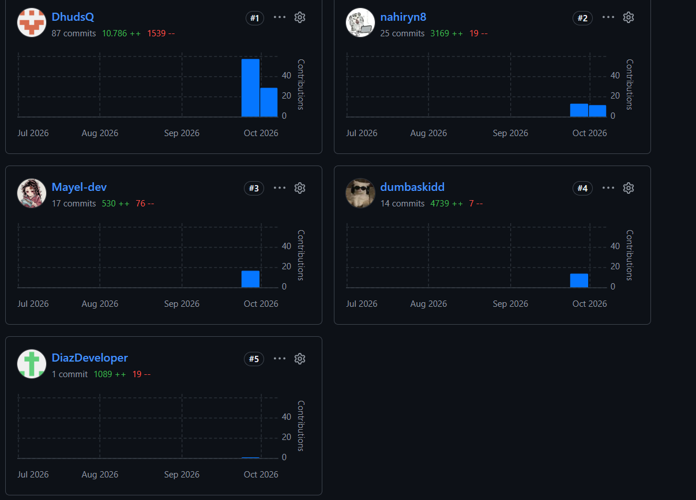

**2. Integración y evolución de ramas**

Las vistas de red del repositorio muestran la evolución de las ramas de trabajo y su relación con `develop` y `main`, incluida la integración de cambios en esas ramas.

  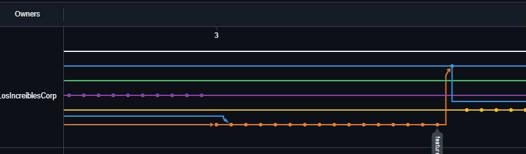

  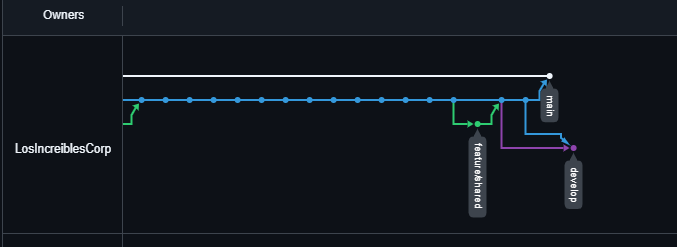

**3. Historial de commits**

El historial de la rama `main` muestra integraciones y cambios registrados el 4 de octubre de 2026. Entre los elementos visibles se encuentran la integración de `release/1.0.0` en `main`, un commit relacionado con el despliegue de Firebase y cambios documentales del frontend. Esta captura complementa las analíticas con registros concretos de autoría y actividad.

  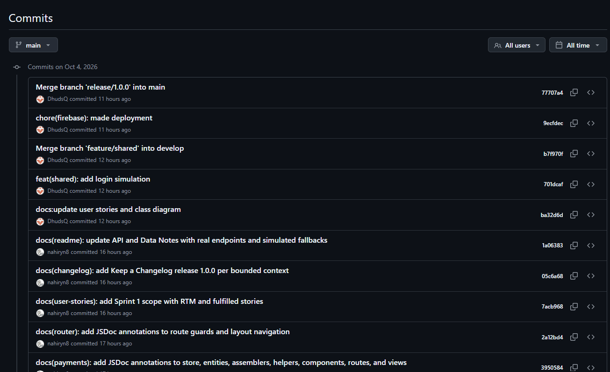

# Conclusiones

## Conclusiones y recomendaciones

Al cierre del trabajo realizado hasta TB1, la investigación, el diseño y la primera versión de la aplicación permiten valorar el avance de InstAlert frente al problema y las hipótesis planteadas. La evidencia respalda la pertinencia de la propuesta y demuestra avances funcionales, aunque todavía no permite afirmar que se hayan alcanzado las metas de adopción o desempeño previstas para un piloto.

**1. Validación del Problem Statement y de los supuestos:**

El análisis de entrevistas documentado en el Capítulo II respalda cualitativamente el problema identificado: administradores y personal operativo enfrentan situaciones de riesgo y dependen de canales dispersos, como llamadas y WhatsApp, para compartir avisos. Estos hallazgos justifican explorar una herramienta que reúna reportes, alertas e información geolocalizada. Sin embargo, la investigación realizada no demuestra por sí sola la aceptación del producto por un mercado amplio, la disposición de pago por una suscripción ni la viabilidad económica del modelo; esos supuestos requieren validación con comercios durante un piloto.

**2. Contrastación de las hipótesis funcionales:**

- **Reportes por tipo de incidente:** se implementaron formularios con categorías para registrar situaciones, lo que demuestra que el flujo previsto puede representarse en la aplicación. Aún falta comprobar con usuarios si al menos el 80 % identifica correctamente el tipo de incidente.
- **Mapa de incidentes geolocalizados:** la aplicación presenta incidentes mediante marcadores y permite consultar información de la zona. Esto materializa la propuesta de visualización, pero todavía no se ha medido si al menos la mitad de los administradores consulta el mapa semanalmente.
- **Notificaciones oportunas:** se avanzó en los flujos de alertas de la interfaz, pero durante TB1 se utilizó JSON Server como API simulada y no se implementaron los Web Services definitivos ni una entrega real de notificaciones. Por ello, no se ha verificado la meta de disponibilidad en menos de un minuto ni la reducción de tiempo planteada frente a los canales actuales.
- **Complementación de reportes:** la interfaz contempla completar información pendiente de un reporte. No se cuenta todavía con datos de uso que permitan determinar si aumenta la proporción de reportes incompletos que los usuarios terminan de completar.

En consecuencia, las funcionalidades implementadas permiten demostrar y continuar evaluando las hipótesis, pero no deben presentarse como resultados cuantitativamente validados. La aplicación desplegada, la API simulada en Render y la Landing Page publicada constituyen una base de demostración; no equivalen a una operación productiva con servicios backend definitivos.

**3. Recomendaciones para la siguiente etapa:**

- Implementar e integrar los Web Services previstos con ASP.NET Core, persistencia relacional y documentación OpenAPI, reemplazando gradualmente la API simulada.

- Evaluar con los comercios la utilidad de la información recibida, la confianza en los reportes y la disposición a mantener una suscripción, antes de concluir que las hipótesis de negocio y adopción se han confirmado.
