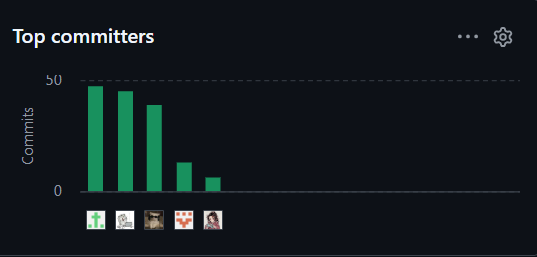
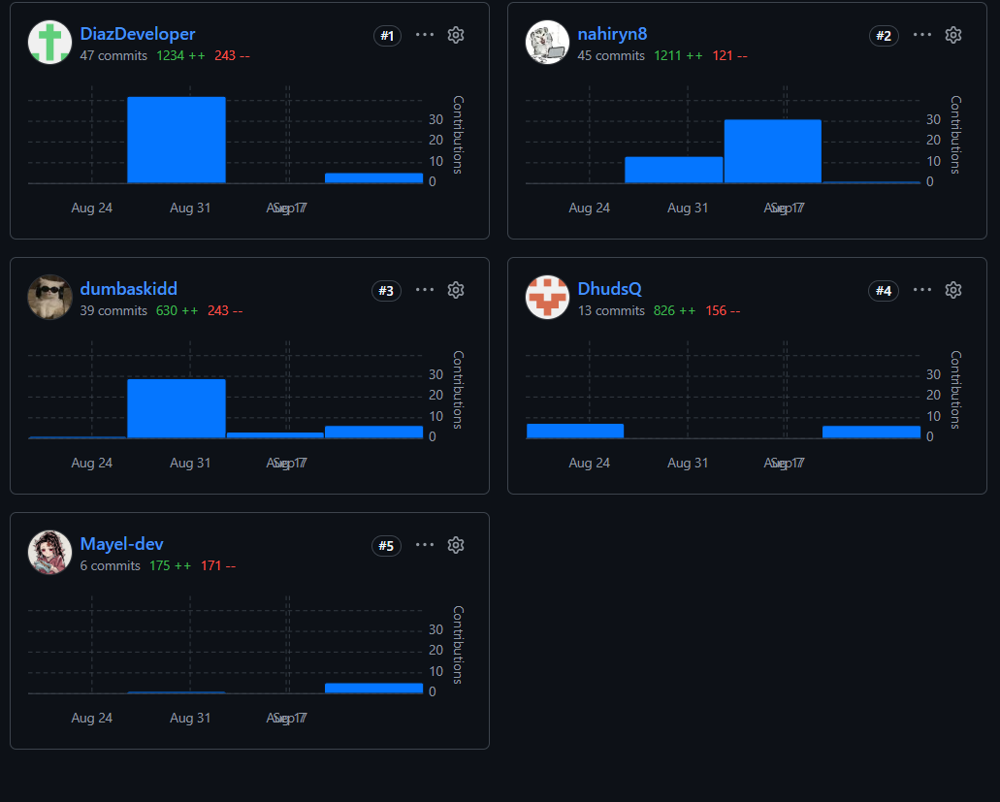
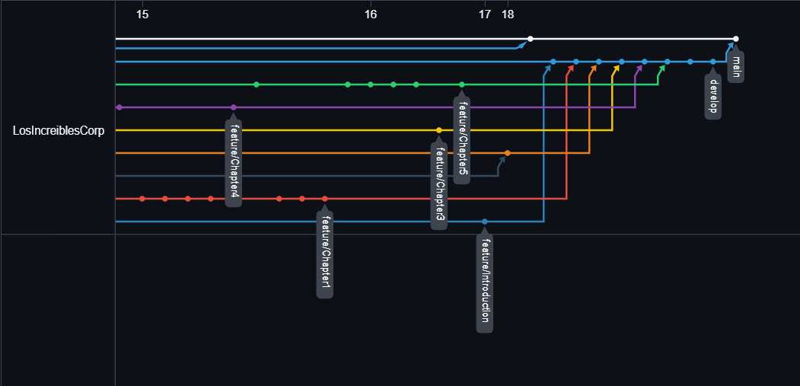
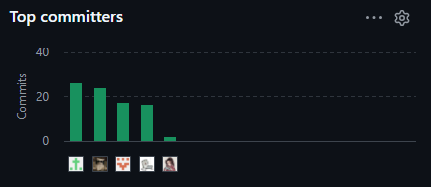

# Registro de versiones del informe

<table border="1" cellspacing="0" cellpadding="5">
<thead>
<tr>
<th>Versión</th>
<th>Fecha</th>
<th>Autor</th>
<th>Descripción</th>
</tr>
</thead>
<tbody>
<tr>
<td align="center">0.0.1</td>
<td align="center">28/08/2026</td>
<td>
Jose Asto
</td>
<td>
Inicialización del repositorio del Project Report y creación del primer commit.
</td>
</tr>
<tr>
<td align="center">0.0.2</td>
<td align="center">28/08/2026</td>
<td>Jose Asto</td>
<td>
Creación de la estructura base para la gestión de archivos y de los esqueletos de la Introducción y de los Capítulos II, III, IV y V.
</td>
</tr>
<tr>
<td align="center">0.0.3</td>
<td align="center">28/08–31/08/2026</td>
<td>Jean Noriega</td>
<td>
Incorporación de información inicial del equipo y desarrollo del perfil de la startup y los antecedentes de la solución.
</td>
</tr>
<tr>
<td align="center">0.0.4</td>
<td align="center">31/08–01/09/2026</td>
<td>Jean Noriega</td>
<td>
Avance del Capítulo I con antecedentes, Lean UX, segmentos objetivo, gráficos y bibliografía inicial.
</td>
</tr>
<tr>
<td align="center">0.0.5</td>
<td align="center">02/09–05/09/2026</td>
<td>Yngrid Ruiz</td>
<td>
Desarrollo documental del Capítulo II mediante el análisis competitivo, entrevistas, User Personas, User Journey Mapping, Empathy Mapping y artefactos de Needfinding.
</td>
</tr>
<tr>
<td align="center">0.0.6</td>
<td align="center">04/09–06/09/2026</td>
<td>Jean Noriega</td>
<td>
Desarrollo del Capítulo III con User Stories, Impact Mapping y Product Backlog, incluyendo priorización, numeración y ajustes de coherencia entre historias.
</td>
</tr>
<tr>
<td align="center">0.0.7</td>
<td align="center">02/09–10/09/2026</td>
<td>Víctor Díaz</td>
<td>
Configuración del entorno de desarrollo y documentación de herramientas, Source Code Management y despliegue del proyecto.
</td>
</tr>
<tr>
<td align="center">0.0.8</td>
<td align="center">10/09–15/09/2026</td>
<td>Yngrid Ruiz</td>
<td>
Desarrollo de artefactos de Product Design, incluidos Style Guidelines, Information Architecture, wireframes, wireflows, mock-ups y prototipos.
</td>
</tr>
<tr>
<td align="center">0.0.9</td>
<td align="center">16/09/2026</td>
<td>Víctor Díaz</td>
<td>
Actualización del Capítulo V con la planificación, el backlog y las evidencias de revisión y colaboración del Sprint 1.
</td>
</tr>
<tr>
<td align="center">0.0.10</td>
<td align="center">17/09/2026</td>
<td>Ismael Simon</td>
<td>
Completado el Student Outcome de AV1 y realizada la revisión final de la Introducción para la consolidación de la entrega.
</td>
</tr>
<tr>
<td align="center">0.0.11</td>
<td align="center">18/09/2026</td>
<td>Jose Asto</td>
<td>
Integración en <code>develop</code> de las ramas <code>feature/Introduction</code> y <code>feature/Chapter1</code> a <code>feature/Chapter5</code>, consolidando los Capítulos I–V y los avances de AV1.
</td>
</tr>
<tr>
<td align="center">1.0.0</td>
<td align="center">18/09/2026</td>
<td>Jose Asto</td>
<td>
Consolidación del Project Report para AV1, integrando los Capítulos I–V y sus evidencias documentales. Versión integrada en <code>main</code>.
</td>
</tr>
<tr>
<td align="center">1.0.1</td>
<td align="center">29/09/2026</td>
<td>Jean Noriega</td>
<td>
Traducción y revisión terminológica al español de los Capítulos I–V, manteniendo los términos técnicos necesarios para el curso.
</td>
</tr>
<tr>
<td align="center">1.0.2</td>
<td align="center">30/09/2026</td>
<td>Jean Noriega</td>
<td>
Alineación de los títulos y la estructura de las secciones del informe con el enunciado y la rúbrica del trabajo final.
</td>
</tr>
<tr>
<td align="center">1.0.3</td>
<td align="center">01/10/2026</td>
<td>Jose Asto</td>
<td>
Revisión de los supuestos e hipótesis Lean UX y ampliación de la información sobre los segmentos objetivo del producto.
</td>
</tr>
<tr>
<td align="center">1.0.4</td>
<td align="center">01/10/2026</td>
<td>Jean Noriega</td>
<td>
Actualización del Lean UX Canvas y de su referencia en el Capítulo I.
</td>
</tr>
<tr>
<td align="center">1.0.5</td>
<td align="center">01/10/2026</td>
<td>Jean Noriega</td>
<td>
Ampliación de los resúmenes de entrevistas con información sobre dispositivos y navegadores, y actualización de los enlaces de evidencia.
</td>
</tr>
<tr>
<td align="center">1.0.6</td>
<td align="center">02/10/2026</td>
<td>Jose Asto</td>
<td>
Adición y revisión de historias de usuario e historias técnicas; actualización y reorganización del Product Backlog.
</td>
</tr>
<tr>
<td align="center">1.0.7</td>
<td align="center">02/10–03/10/2026</td>
<td>Jose Asto</td>
<td>
Actualización de los diagramas C4, de clases y de base de datos documentados en el Capítulo IV.
</td>
</tr>
<tr>
<td align="center">1.0.8</td>
<td align="center">03/10/2026</td>
<td>Yngrid Ruiz</td>
<td>
Incorporación de registros de entrevistas y análisis cualitativo en el Capítulo II.
</td>
</tr>
<tr>
<td align="center">1.0.9</td>
<td align="center">03/10/2026</td>
<td>Jose Asto</td>
<td>
Revisión y traducción del Ubiquitous Language documentado en el Capítulo II.
</td>
</tr>
<tr>
<td align="center">1.0.10</td>
<td align="center">04/10/2026</td>
<td>Yngrid Ruiz</td>
<td>
Actualización de los diagramas de User Flow y Wireflow documentados en el Capítulo IV.
</td>
</tr>
<tr>
<td align="center">1.0.11</td>
<td align="center">05/10/2026</td>
<td>Jose Asto</td>
<td>
Actualización del Capítulo V para el Sprint 2, incluida su planificación, backlog y evidencias de revisión y despliegue.
</td>
</tr>
<tr>
<td align="center">2.0.0</td>
<td align="center">05/10/2026</td>
<td>Jose Asto</td>
<td>
Consolidación e integración en <code>main</code> del Project Report para TB1, con los Capítulos I–V y las evidencias documentales del Sprint 2.
</td>
</tr>
</tbody>
</table>

# Project Report Collaboration Insights

Link de los repositorios de la organización: https://github.com/LosIncreiblesCorp

Link del repositorio-Informe: https://github.com/LosIncreiblesCorp/losIncreibles-project-report

## Reporte de colaboración de la entrega del AV1

Durante la primera fase de elaboración del informe, el equipo LosIncreibles centró sus esfuerzos en la construcción de los fundamentos conceptuales, de investigación, especificación y diseño inicial de InstAlert. Cada integrante asumió un rol activo en la redacción, modelado y documentación de los capítulos del reporte, manteniendo una organización basada en ramas de trabajo y revisiones antes de integrar los cambios.

A partir del historial de commits del repositorio, se observa la participación de los cinco integrantes en las distintas etapas del informe. Las responsabilidades principales de la entrega AV1 fueron las siguientes:

* **Jose Asto:** creó la estructura inicial del Project Report, organizó la gestión de archivos y ramas, participó en la configuración del flujo GitFlow, integró las ramas de los capítulos en `develop` y desarrolló los diagramas de clases y de base de datos.

* **Víctor Díaz:** desarrolló gran parte de la configuración del entorno de desarrollo y del Source Code Management, documentó herramientas y servicios, organizó la planificación y las evidencias del Sprint 1, y realizó revisiones y actualizaciones del Capítulo V.

* **Yngrid Ruiz:** trabajó en Requirements Elicitation y Product Design, incluyendo competidores, entrevistas, Needfinding, User Personas, User Journey Mapping, Empathy Mapping, Style Guidelines, UX/UI, wireframes, prototipos, EventStorming y arquitectura C4.

* **Jean Noriega:** desarrolló el Startup Profile y partes principales del Capítulo I, incluyendo antecedentes, problemática, Lean UX y segmentos objetivo. También elaboró y reorganizó las User Stories, el Impact Mapping y el Product Backlog del Capítulo III.

* **Ismael Simon:** colaboró en el registro y análisis de entrevistas, actualizó la configuración de despliegue y los repositorios del proyecto, participó en la revisión de la documentación y completó el Student Outcome correspondiente a la entrega AV1.

Estas responsabilidades representan la distribución principal observada en el historial de commits; no excluyen las revisiones, apoyos y aportes colaborativos realizados por los demás integrantes durante la consolidación del informe.

Finalmente, estas capturas representan la cantidad de commits realizados por cada miembro en el repositorio del Project Report. En la vista de GitHub se identifican Víctor Díaz (`DiazDeveloper`) con 47 commits, Yngrid Ruiz (`nahiryn8`) con 45, Jean Noriega (`dumbaskidd`) con 39, Jose Asto (`DhudsQ`) con 13 e Ismael Simon (`Mayel-dev`) con 6. Cada barra representa a un integrante del equipo y su altura indica el número de commits registrados durante la elaboración del informe.

### Gráficos de colaboración de AV1

*Figura: Principales colaboradores y cantidad de commits registrados por GitHub durante AV1.*

*Figura: Detalle de commits, adiciones y eliminaciones por integrante durante AV1.*

## Ramificación del proyecto usando GitFlow

Durante la elaboración del informe se trabajó con una rama principal de integración y ramas `feature` asociadas a cada capítulo. Se utilizaron `feature/Introduction`, `feature/Chapter1`, `feature/Chapter2`, `feature/Chapter3`, `feature/Chapter4` y `feature/Chapter5` para desarrollar los contenidos de forma independiente. Posteriormente, estas ramas fueron integradas en `develop`, donde se consolidó la versión correspondiente al avance AV1.

El registro de versiones del informe representa esta evolución desde `0.0.1`, correspondiente a la inicialización del repositorio, hasta `1.0.0`, propuesta como versión consolidada de AV1. La versión `1.0.0` quedará formalmente publicada cuando el contenido final sea enviado a `main`.

Este gráfico muestra la evolución de las ramas, los puntos de integración y la relación entre los avances documentales y las versiones del Project Report. Durante AV1 se trabajó en ramas independientes por capítulo y posteriormente se integraron los cambios en `develop`, antes de consolidar el contenido en `main`.

### Ramificación GitFlow de AV1

*Figura: Ramificación del proyecto usando GitFlow durante la elaboración del Project Report de AV1.*

## Reporte de colaboración de la entrega del TB1

Durante la elaboración del informe para TB1, el equipo actualizó los capítulos y consolidó la documentación de la Web Application y del Sprint 2. De acuerdo con el historial de commits, los principales aportes documentales de esta etapa fueron los siguientes:

- **Jose Asto:** revisó y amplió contenidos de Lean UX, segmentos objetivo, lenguaje ubicuo, User Stories y Product Backlog. También actualizó los diagramas de arquitectura y clases del Capítulo IV, organizó rutas de imágenes y consolidó la planificación y las evidencias del Sprint 2.
- **Víctor Díaz:** incorporó evidencia de ejecución para la revisión del Sprint 2 y optimizó el tamaño de imágenes incluidas en el Capítulo V.
- **Yngrid Ruiz:** actualizó los registros de entrevistas y el análisis cualitativo de segmentos, además de revisar los diagramas de User Flow y Wireflow.
- **Jean Noriega:** alineó la estructura de los capítulos con la rúbrica, revisó la terminología en español y amplió los resúmenes de entrevistas con información sobre dispositivos y sistemas utilizados.
- **Ismael Simon:** actualizó los anexos con los enlaces de despliegue y de repositorios correspondientes a TB1.

Estas tareas resumen los cambios identificables en el historial del repositorio; no excluyen la colaboración y revisión compartida durante la integración del informe. La captura de GitHub Insights muestra la distribución relativa de los commits registrados por los cinco integrantes durante esta entrega.

### Gráfico de colaboración de TB1

*Figura: Principales colaboradores y cantidad relativa de commits registrados por GitHub durante TB1.*

# Contenido

- [CAPÍTULO I: INTRODUCCIÓN](chapter1.md#capítulo-i-introducción)
  - [1.1. Startup Profile](chapter1.md#11-startup-profile)
    - [1.1.1. Descripción de la Startup](chapter1.md#111-descripción-de-la-startup)
    - [1.1.2. Perfiles de integrantes del equipo](chapter1.md#112-perfiles-de-integrantes-del-equipo)
  - [1.2. Solution Profile](chapter1.md#12-solution-profile)
    - [1.2.1. Antecedentes y problemática](chapter1.md#121-antecedentes-y-problemática)
    - [1.2.2. Lean UX Process](chapter1.md#122-lean-ux-process)
      - [1.2.2.1. Lean UX Problem Statements](chapter1.md#1221-lean-ux-problem-statements)
      - [1.2.2.2. Lean UX Assumptions](chapter1.md#1222-lean-ux-assumptions)
      - [1.2.2.3. Lean UX Hypothesis Statements](chapter1.md#1223-lean-ux-hypothesis-statements)
      - [1.2.2.4. Lean UX Canvas](chapter1.md#1224-lean-ux-canvas)
  - [1.3. Segmentos objetivo](chapter1.md#13-segmentos-objetivo)

- [CAPÍTULO II: REQUIREMENTS ELICITATION & ANALYSIS](chapter2.md#capítulo-ii-requirements-elicitation--analysis)
  - [2.1. Competidores](chapter2.md#21-competidores)
    - [2.1.1. Análisis competitivo](chapter2.md#211-análisis-competitivo)
    - [2.1.2. Estrategias y tácticas frente a competidores](chapter2.md#212-estrategias-y-tácticas-frente-a-competidores)
  - [2.2. Entrevistas](chapter2.md#22-entrevistas)
    - [2.2.1. Diseño de entrevistas](chapter2.md#221-diseño-de-entrevistas)
    - [2.2.2. Registro de entrevistas](chapter2.md#222-registro-de-entrevistas)
    - [2.2.3. Análisis de entrevistas](chapter2.md#223-análisis-de-entrevistas)
  - [2.3. Needfinding](chapter2.md#23-needfinding)
    - [2.3.1. User Personas](chapter2.md#231-user-personas)
    - [2.3.2. User Task Matrix](chapter2.md#232-user-task-matrix)
    - [2.3.3. User Journey Mapping](chapter2.md#233-user-journey-mapping)
    - [2.3.4. Empathy Mapping](chapter2.md#234-empathy-mapping)
  - [2.4. Big Picture EventStorming](chapter2.md#24-big-picture-eventstorming)
  - [2.5. Ubiquitous Language](chapter2.md#25-ubiquitous-language)

- [CAPÍTULO III: REQUIREMENTS SPECIFICATION](chapter3.md#capítulo-iii-requirements-specification)
  - [3.1. User Stories](chapter3.md#31-user-stories)
  - [3.2. Impact Mapping](chapter3.md#32-impact-mapping)
  - [3.3. Product Backlog](chapter3.md#33-product-backlog)

- [CAPÍTULO IV: PRODUCT DESIGN](chapter4.md#capítulo-iv-product-design)
  - [4.1. Style Guidelines](chapter4.md#41-style-guidelines)
    - [4.1.1. General Style Guidelines](chapter4.md#411-general-style-guidelines)
    - [4.1.2. Web Style Guidelines](chapter4.md#412-web-style-guidelines)
  - [4.2. Information Architecture](chapter4.md#42-information-architecture)
    - [4.2.1. Organization Systems](chapter4.md#421-organization-systems)
    - [4.2.2. Labeling Systems](chapter4.md#422-labeling-systems)
    - [4.2.3. SEO Tags and Meta Tags](chapter4.md#423-seo-tags-and-meta-tags)
    - [4.2.4. Searching Systems](chapter4.md#424-searching-systems)
    - [4.2.5. Navigation Systems](chapter4.md#425-navigation-systems)
  - [4.3. Landing Page UI Design](chapter4.md#43-landing-page-ui-design)
    - [4.3.1. Landing Page Wireframe](chapter4.md#431-landing-page-wireframe)
    - [4.3.2. Landing Page Mock-up](chapter4.md#432-landing-page-mock-up)
  - [4.4. Web Applications UX/UI Design](chapter4.md#44-web-applications-uxui-design)
    - [4.4.1. Web Applications Wireframes](chapter4.md#441-web-applications-wireframes)
    - [4.4.2. Web Applications Wireflow Diagrams](chapter4.md#442-web-applications-wireflow-diagrams)
    - [4.4.3. Web Applications Mock-ups](chapter4.md#443-web-applications-mock-ups)
    - [4.4.4. Web Applications User Flow Diagrams](chapter4.md#444-web-applications-user-flow-diagrams)
  - [4.5. Web Applications Prototyping](chapter4.md#45-web-applications-prototyping)
  - [4.6. Domain-Driven Software Architecture](chapter4.md#46-domain-driven-software-architecture)
    - [4.6.1. Design-Level EventStorming](chapter4.md#461-design-level-eventstorming)
    - [4.6.2. Software Architecture Context Diagram](chapter4.md#462-software-architecture-context-diagram)
    - [4.6.3. Software Architecture Container Diagram](chapter4.md#463-software-architecture-container-diagram)
    - [4.6.4. Software Architecture Component Diagram](chapter4.md#464-software-architecture-component-diagram)
  - [4.7. Software Object-Oriented Design](chapter4.md#47-software-object-oriented-design)
    - [4.7.1. Class Diagrams](chapter4.md#471-class-diagrams)
  - [4.8. Database Design](chapter4.md#48-database-design)
    - [4.8.1. Database Diagrams](chapter4.md#481-database-diagrams)

- [CAPÍTULO V: PRODUCT IMPLEMENTATION, VALIDATION & DEPLOYMENT](chapter5.md#capítulo-v-product-implementation-validation--deployment)
  - [5.1. Software Configuration Management](chapter5.md#51-software-configuration-management)
    - [5.1.1. Software Development Environment Configuration](chapter5.md#511-software-development-environment-configuration)
    - [5.1.2. Source Code Management](chapter5.md#512-source-code-management)
    - [5.1.3. Source Code Style Guide & Conventions](chapter5.md#513-source-code-style-guide--conventions)
    - [5.1.4. Software Deployment Configuration](chapter5.md#514-software-deployment-configuration)
  - [5.2. Landing Page, Services & Applications Implementation](chapter5.md#52-landing-page-services--applications-implementation)
    - [5.2.1. Sprint 1](chapter5.md#521-sprint-1)
      - [5.2.1.1. Sprint Planning 1](chapter5.md#5211-sprint-planning-1)
      - [5.2.1.2. Aspect Leaders and Collaborators](chapter5.md#5212-aspect-leaders-and-collaborators)
      - [5.2.1.3. Sprint Backlog 1](chapter5.md#5213-sprint-backlog-1)
      - [5.2.1.4. Development Evidence for Sprint Review](chapter5.md#5214-development-evidence-for-sprint-review)
      - [5.2.1.5. Execution Evidence for Sprint Review](chapter5.md#5215-execution-evidence-for-sprint-review)
      - [5.2.1.6. Services Documentation Evidence for Sprint Review](chapter5.md#5216-services-documentation-evidence-for-sprint-review)
      - [5.2.1.7. Software Deployment Evidence for Sprint Review](chapter5.md#5217-software-deployment-evidence-for-sprint-review)
      - [5.2.1.8. Team Collaboration Insights during Sprint](chapter5.md#5218-team-collaboration-insights-during-sprint)
    - [5.2.2. Sprint 2](chapter5.md#522-sprint-2)
      - [5.2.2.1. Sprint Planning 2](chapter5.md#5221-sprint-planning-2)
      - [5.2.2.2. Aspect Leaders and Collaborators](chapter5.md#5222-aspect-leaders-and-collaborators)
      - [5.2.2.3. Sprint Backlog 2](chapter5.md#5223-sprint-backlog-2)
      - [5.2.2.4. Development Evidence for Sprint Review](chapter5.md#5224-development-evidence-for-sprint-review)
      - [5.2.2.5. Execution Evidence for Sprint Review](chapter5.md#5225-execution-evidence-for-sprint-review)
      - [5.2.2.6. Services Documentation Evidence for Sprint Review](chapter5.md#5226-services-documentation-evidence-for-sprint-review)
      - [5.2.2.7. Software Deployment Evidence for Sprint Review](chapter5.md#5227-software-deployment-evidence-for-sprint-review)
      - [5.2.2.8. Team Collaboration Insights during Sprint](chapter5.md#5228-team-collaboration-insights-during-sprint)

- [Conclusiones](chapter5.md#conclusiones)
- [Bibliografía](bibliografia.md#bibliografía)
- [Anexos](anexos.md#anexos)
- [STUDENT OUTCOME](#student-outcome)

# STUDENT OUTCOME

El curso contribuye al cumplimiento del Student Outcome ABET:

**ABET – EAC - Student Outcome 5**

**Criterio:** La capacidad de funcionar efectivamente en un equipo cuyos miembros juntos proporcionan liderazgo, crean un entorno de colaboración e inclusivo, establecen objetivos, planifican tareas y cumplen objetivos.

En el siguiente cuadro se describe las acciones realizadas y enunciados de conclusiones por parte del grupo, que permiten sustentar el haber alcanzado el logro del ABET – EAC - Student Outcome 5.

<table border="1" cellspacing="0" cellpadding="5">
<thead>
<tr>
<th>Criterio específico</th>
<th>Acciones realizadas</th>
<th>Conclusiones</th>
</tr>
</thead>
<tbody>
<tr>
<td valign="top"><strong>Trabaja en equipo para proporcionar liderazgo en forma conjunta</strong></td>
<td valign="top">
<strong>Asto Jacome, Jose Gustavo</strong> 
<strong>AV1:</strong> Asumió responsabilidades de organización e integración técnica del proyecto, participando en la estructuración inicial del Project Report y en la implementación de la sección de inicio de la Landing Page. Desarrolló elementos compartidos como el header, configuración de idioma y estilos base, además de participar en la integración de funcionalidades mediante las ramas develop, release y main.  
<strong>TB1:</strong> Coordinó la integración de los módulos de la aplicación y conectó las funcionalidades de gestión de comercios, personal, contactos, pagos y alertas. También mantuvo los servicios de prueba y apoyó la preparación de la aplicación para su despliegue.  
<strong>Díaz Mendoza, Sebastián Víctor André</strong> 
<strong>AV1:</strong> Asumió la responsabilidad de la sección Producto de la Landing Page, implementando su estructura, estilos y comportamiento mediante HTML, CSS y JavaScript. Asimismo, tuvo una participación importante en la documentación del Sprint 1 dentro del Chapter 5, registrando evidencias de desarrollo, colaboración y avance del equipo.  
<strong>TB1:</strong> Inició el desarrollo del módulo de alertas para el personal operativo, incluyendo la vista y la conexión con la información de la aplicación. Colaboró con el equipo en la integración de los flujos de alertas y documentó evidencias del Sprint 2.  
<strong>Noriega Collado, Jean Fabio</strong> 
<strong>AV1:</strong> Asumió la implementación de la sección Planes de la Landing Page, desarrollando la estructura de los planes, estilos responsive, información de precios y funcionalidad de cambio de moneda. También contribuyó al Requirements Specification mediante la actualización del Impact Mapping, Product Backlog y User Stories.  
<strong>TB1:</strong> Desarrolló el mapa de riesgo con la visualización de zonas e incidentes, además de herramientas para consultar y filtrar la información. También actualizó las historias de usuario, los resúmenes de entrevistas y los artefactos de planificación del producto.  
<strong>Ruiz Villegas, Yngrid Nahir</strong> 
<strong>AV1:</strong> Asumió responsabilidades importantes en Requirements Elicitation & Analysis, desarrollando y actualizando entrevistas, análisis, User Personas, Journey Maps, Empathy Maps y elementos de EventStorming. Asimismo, contribuyó al diseño arquitectónico y desarrolló elementos de cierre y adaptación responsive de la Landing Page.  
<strong>TB1:</strong> Lideró el trabajo de gestión de comercios y personal y desarrolló las vistas de suscripciones y pagos. Colaboró además en los diagramas de flujo de usuario, el análisis de entrevistas y la documentación de los módulos de la aplicación.  
<strong>Simon Calderon, Ismael Sebastian</strong> 
<strong>AV1:</strong> Asumió la implementación de la sección Equipo de la Landing Page, incorporando la presentación de los integrantes, recursos gráficos y estilos correspondientes. También colaboró en el Project Report mediante aportes al registro de entrevistas y revisiones de los capítulos de Product Design y Product Implementation, incluyendo ajustes de Source Code Management y Software Deployment Configuration.
  <strong>TB1:</strong> Implementó la estructura compartida de la aplicación, la navegación según el tipo de usuario y la selección de idioma. También desarrolló las vistas para gestionar personal e invitaciones y colaboró en la documentación y revisión de los entregables.
</td>
<td valign="top">
<strong>AV1:</strong> La distribución de responsabilidades permitió que cada integrante asumiera liderazgo sobre componentes específicos del proyecto sin perder la visión conjunta de InstAlert. La división del trabajo entre investigación, especificación de requisitos, diseño, documentación e implementación de la Landing Page permitió desarrollar actividades en paralelo y posteriormente consolidarlas en un único producto. El uso de ramas independientes y su posterior integración evidenció una dinámica de liderazgo compartido orientada al cumplimiento de los objetivos de la primera entrega.
  <strong>TB1:</strong> En la segunda entrega, el equipo distribuyó el liderazgo entre la integración de los módulos, el desarrollo de alertas y del mapa de riesgo, la gestión de comercios, personal y pagos, y la construcción de una estructura compartida para la aplicación. La coordinación de estos aportes permitió conectar las funcionalidades en un producto común y avanzar en los objetivos del Sprint 2.
</td>
</tr>
<tr>
<td valign="top"><strong>Crea un entorno colaborativo e inclusivo, establece metas, planifica tareas y cumple objetivos.</strong></td>
<td valign="top">
<strong>Asto Jacome, Jose Gustavo</strong> 
<strong>AV1:</strong> Contribuyó a establecer una estructura común para el desarrollo de la Landing Page y participó en la integración progresiva de las funcionalidades desarrolladas por el equipo. Además de completar sus propias tareas, realizó acciones de integración y preparación de la versión publicada, facilitando que los aportes individuales convergieran en el entregable de AV1.  
<strong>TB1:</strong> Organizó la integración de los módulos y coordinó los ajustes para que las funciones de alertas, comercios, contactos y pagos trabajaran dentro de una misma aplicación. Apoyó la planificación del Sprint 2 y la recopilación de evidencias de implementación y despliegue.  
<strong>Díaz Mendoza, Sebastián Víctor André</strong> 
<strong>AV1:</strong> Desarrolló la funcionalidad asignada correspondiente a la presentación del producto y colaboró en mantener actualizada la evidencia del Sprint 1. Su trabajo en Chapter 5 permitió registrar avances, commits y contribuciones del equipo, favoreciendo la trazabilidad y coordinación entre la implementación y la documentación del proyecto.  
<strong>TB1:</strong> Inició el desarrollo del módulo de alertas y compartió su trabajo con el equipo para completar e integrar sus funciones. También registró evidencias del Sprint 2 y participó en la actualización y revisión de las imágenes del informe.  
<strong>Noriega Collado, Jean Fabio</strong> 
<strong>AV1:</strong> Completó el desarrollo de la sección Planes siguiendo la estructura y lineamientos compartidos de la Landing Page, incorporando comportamiento responsive y funcionalidades de visualización de precios. También colaboró en la actualización de artefactos del Product Backlog e Impact Mapping para mantener alineada la implementación con los requerimientos definidos.  
<strong>TB1:</strong> Desarrolló el mapa de riesgo y sus filtros de acuerdo con los requisitos del equipo. También mantuvo las historias de usuario, la planificación del producto y el análisis de usuarios alineados con las funciones priorizadas para el Sprint 2.  
<strong>Ruiz Villegas, Yngrid Nahir</strong> 
<strong>AV1:</strong> Contribuyó de forma sostenida a la investigación y documentación de los usuarios, manteniendo actualizados los artefactos de Needfinding y EventStorming utilizados por el resto del equipo como base del diseño del producto. Asimismo, completó las tareas asignadas para la sección de cierre del Landing y sus adaptaciones responsive.  
<strong>TB1:</strong> Coordinó el trabajo de gestión de comercios y personal, avanzó en los flujos de pagos y suscripciones y documentó los módulos para facilitar su revisión por el equipo. También incorporó ajustes derivados de la revisión de diagramas y entrevistas.  
<strong>Simon Calderon, Ismael Sebastian</strong> 
<strong>AV1:</strong> Desarrolló su sección de la Landing Page en una rama feature independiente, siguiendo el flujo de trabajo acordado y manteniendo separados sus cambios hasta su integración con el trabajo del equipo. Además, colaboró en la revisión y corrección de distintos capítulos del reporte para mantener la documentación alineada con el estado real de los repositorios, despliegue y producto.
  <strong>TB1:</strong> Desarrolló la estructura compartida de la aplicación y las vistas iniciales de personal e invitaciones. Su trabajo en navegación e idioma ayudó al equipo a integrar sus módulos y ofrecer una experiencia uniforme.
</td>
<td valign="top">
<strong>AV1:</strong> Durante la primera entrega, el equipo organizó el trabajo mediante responsabilidades diferenciadas, ramas de desarrollo y contribuciones distribuidas tanto en el Project Report como en la Landing Page. La utilización de GitHub, GitFlow y commits trazables permitió desarrollar tareas en paralelo, revisar los aportes realizados y consolidarlos posteriormente en versiones integradas. Esta dinámica permitió cumplir el objetivo de AV1 al contar con la documentación correspondiente al Sprint 1 y una primera versión funcional y desplegada de la Landing Page de InstAlert.
  <strong>TB1:</strong> Para el Sprint 2, el equipo trabajó sobre metas compartidas y coordinó la implementación de los módulos de alertas, mapa de riesgo, comercios, personal, contactos, pagos y suscripciones. La actualización de requisitos, flujos de usuario y documentación, junto con la integración y revisión de las funcionalidades, permitió dar seguimiento a las tareas y reunir evidencias del avance y despliegue de la aplicación.
</td>
</tr>
</tbody>
</table>

